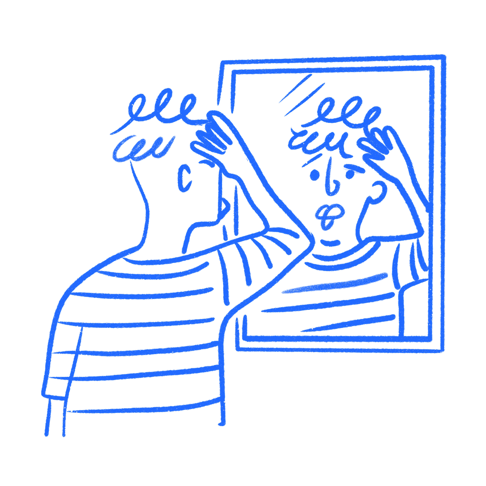

## 제1장 · 아무도 당신처럼 생각하지 않는다

*거짓 합의가 어떻게 자기 자신을 위한 디자인을 만들어내는가*

어쩌면 당신은 깔끔해 보인다는 이유로 레이아웃을 골랐을 것이다. 명백해 보인다는 이유로 라벨을 골랐을 것이다. 아무도 필요로 하지 않을 것이라 상상이 되지 않아서 기능을 잘라냈을 것이다. 당신은 그것을 직감이라 불렀다. 경험이라고까지 불렀을지도 모른다. 하지만 대부분의 경우 그것은, 당신과 전혀 다른 사람들로 가득한 방에서 홀로 자기 자신을 위해 디자인하고 있었을 뿐이다.

그것은 누구에게나 있는 정상적인 맹점이다. 경험이 쌓인다고 저절로 고쳐지지 않는다. 연구자들은 수십 년 동안 이것에 대해 글을 써 왔다. 디자인 작업에서 이 실수가 계속 목격되는 이유는, 그것이 저지르는 사람 안에서는 합리적으로 느껴지기 때문이다.

나는 지금도 화면이 너무 빨리 명백하다고 느껴질 때 자신이 이 짓을 하고 있는 것을 발견하곤 한다.

### 거짓 합의가 작동하는 모습

1977년 스탠퍼드의 [리 로스, 데이비드 그린, 패멀라 하우스](https://www.bulidomics.com/w/images/d/d8/4705-Ross-et-al-False-Consensus-Effect.pdf)는 그들이 거짓 합의 효과라고 부른 현상에 대한 일련의 실험을 진행했다. 연구진은 평범하고 특별할 것 없는 상황(과속 딱지, 수업 과제, TV 광고)을 사람들에게 주고, 대부분의 다른 사람들이 무엇을 할지 예측하게 했다. 그다음에는 참가자 자신은 무엇을 할지 물었다. 패턴은 매번 명확했다.

> *사회를 관찰하는 사람들은 자신의 반응이 상대적으로 얼마나 흔한가와 관련하여 '거짓 합의'를 지각하는 경향이 있다.*
> — Ross, Greene & House

쉽게 말해, 당신은 대부분의 사람들이 당신이 하려는 것과 같은 행동을 하리라 가정한다. 그리고 그들이 그렇게 하지 않을 때, 당신은 그들을 예외로 취급하는 경향이 있다.

두 번째 부분은 첫 번째만큼 중요하다. 로스와 동료들이 발견한 것은 사람들이 동의를 과대평가한다는 사실만이 아니었다. 참가자들이 다르게 선택한 사람들을 더 극단적이고 더 많은 것을 드러내는 성격 특성을 가진 사람으로 판단한다는 것도 발견했다. 과속 딱지 벌금을 내는 사람은 대부분이 벌금을 내리라 가정한다. 그리고 법정에서 이의를 제기하는 사람은 분쟁을 즐기거나, 권위에 편집증적이거나, 증명하고 싶은 무언가가 있는 사람이라고 가정한다. 같은 논리는 반대로도 작동한다. 이의를 제기하는 사람은 맞서 싸우지 않는 당신을 물렁하다고 생각한다.

두 집단 모두 같은 짓을 하고 있다. 자신의 선택에서 출발해 그것을 정상으로 취급한 다음, 다른 행동을 하는 사람들을 설명해서 치워버린다.

디자인 리뷰에서는 이렇게 일어난다. 누군가 자신에게 이해되는 내비게이션 패턴을 만든 뒤, 길을 찾지 못하는 사용자를 "우리 타깃 사용자가 아니다" 또는 "기술 활용 능력이 낮다"로 묘사한다. 누군가 명백하다고 느끼는 UI 문구를 쓴 뒤, 그것을 오독하는 사람들은 주의를 기울이지 않았다고 가정한다. 나는 증거가 바로 눈앞에 있는 상황에서 팀이 회의실 안에서 이렇게 하는 것을 봤다. 테스트에서 한 사람이 메뉴 라벨을 놓치면 회의실은 라벨 대신 그 사람을 설명하기 시작한다. 이 편향은 당신을 잘못된 판단으로 밀어붙이고, 애먹는 사람들이 왜 중요하게 세지 않는지에 대한 즉석 변명을 제공한다.

뇌는 다른 사람들이 어떤지 추측해야 할 때 이런 방식으로 작동한다. 당신 자신의 선호, 습관, 반응은 손에 닿는 가장 가까운 데이터다. 직접 살아온 것이므로 단단하게 느껴진다. 그래서 뇌가 무엇이 정상인지 추정하려 할 때, 찾을 수 있는 가장 가까운 예시인 당신을 움켜쥐고 거기서부터 시작한다.

제품 작업에서는 이것이 늘 벌어진다. 당신은 자신의 지식, 인내심, 모호함에 대한 내성을 가지고 자신의 제품을 사용한다. 모든 것이 어디 있는지 알고 있는데, 당신이 거기 놓았기 때문이다. 용어를 이해하는데, 당신이 썼기 때문이다. 흐름이 매끄럽게 느껴지는데, 당신의 사고방식에 들어맞기 때문이다. 그래서 이 실수는 편향이 아니라 자신감처럼 느껴진다.

### 대가

2011년 [Color](https://techcrunch.com/2011/03/23/color-looks-to-reinvent-social-interaction-with-its-mobile-photo-app-and-41-million-in-funding/)는 4,100만 달러와 사진 공유에 대한 기묘한 아이디어를 들고 출시했다. 휴대폰으로 사진을 찍으면 앱이 주변에 있는 다른 사람들의 사진과 그것을 섞어 보여줬다. 같은 파티, 같은 거리, 같은 방이었다. 핵심은 우연히 주변에 있는 사람들로 만들어지는 라이브 스트림을 사람들이 원하리라는 생각이었다.

많은 사람이 앱을 열었고 이해하지 못했다. 거창한 제품 논리 차원이 아니라 기본적인 차원에서였다. 이게 뭘 위한 것인가. 왜 다른 사람들의 사진을 보여주는가. 왜 계속 쓰려고 하겠는가. 회사는 일주일 안에 인터페이스를 바꿨다.

이후 창업자들은 "어떻게 잘 쓰는지 알 수 없는 네트워크"를 출시했다고, 사람들에게 "산 하나를 던졌다"고 말했다. 맞는 표현처럼 들린다. 그들은 사람들에게 완전히 새로운 행동을 한꺼번에 이해하라고 요구했다. 그것을 만드는 사람들은 이미 그것이 무엇이 되어야 하는지 알고 있었기에, 회사 안에서는 더 단순하게 느껴졌을 것이다.

그게 실제로 일어나는 일이다. 제품에 가장 가까운 사람들은 여전히 요점을 볼 수 있다. 나머지 모두는 이것이 대체 무엇인지 파악하려 애쓸 뿐이다.

나는 제품 작업에서 이보다 작은 규모의 같은 일을 몇 번이고 봤다. 라벨이 명백하게 느껴지는 것은 팀이 이미 그 기능을 알고 있기 때문이다. 흐름이 쉽게 느껴지는 것은 리뷰하는 사람들이 이미 다음에 무엇이 오는지 알고 있기 때문이다. 테스트에서 누군가 막히면 회의실은 화면 대신 사용자를 설명하기 시작한다. 대개 문제는 그때 시작된다.

거짓 합의가 가장 까다로운 점은 얼마나 정상적으로 느껴지는가이다. 편향에 대해 아는 것만으로는 자신을 보호하지 못한다. [보스벨트, 코먼, 반 데어 플리흐트](https://pure.uva.nl/ws/files/2968579/143_pligt_1994_selectiveexposure.pdf)는 몇 년 뒤 다른 환경에서 같은 패턴을 발견했다. 뇌는 계속 유사성을 기본값으로 삼으며, 인식은 조금 도움이 되지만 문제를 해결하지는 못한다.

### 당신이 상상하는 사용자

전환은 단순하지만 쉽지 않다. 결정을 내리기 전에, 누구의 선호에 따라 행동하는지 소리 내어 말하라. 정확히 누구인지 말이다. 이 레이아웃 선택은 사용자에게서 관찰한 무언가에 근거한 것인가? 아니면 당신이 이 제품을 쓴다면 원할 법한 것에 근거한 것인가?

머뭇거린다면, 그 망설임이 답이다. 당신 자신의 머릿속에서 끌어오고 있다는 뜻이다.

한 가지 검증은 해볼 만하다. 어떤 디자인 선택을 하고 난 뒤 이렇게 물어보라. 이 제품을 한 번도 본 적 없는 사람이 여기 도착해서 지금 내가 보는 것을 볼 수 있는가? 안내를 받고 난 뒤가 아니라, 두 번째 시도에서가 아니라, 바로 지금 말이다. 증거를 대며 예라고 말할 수 없다면, 당신은 다시 자신의 경험에 기대고 있는 것이다.

애먹는 사용자를 어떻게 말하는지도 살펴보라. 실패한 사용자 테스트에 대한 첫 반응이 참가자를 혼란스럽다, 산만하다, 대표성 없다고 묘사하는 것이라면, 당신은 편향이 실시간으로 일어나는 것을 보고 있는 것이다. 당신이 예상한 방식과 다르게 행동하는 사람이 바로 데이터다. 당신처럼 생각하는 사람에게만 작동하는 제품은 단추가 붙은 거울일 뿐이다.

이것이 직감이 무가치하다는 뜻은 아니다. 실제 관찰로 쌓은 패턴 인식은 중요하다. 그러나 자신의 선호로 쌓고 수년에 걸쳐 전문성으로 포장한 패턴 인식은 여전히 가정이다. 그것들이 위험한 이유는, 전혀 가정처럼 느껴지지 않기 때문이다.

디자인에서 가장 위험한 것은 틀리는 것이 아니다. 자신이 옳다고 확신하는 상태에서 틀리는 것이다.

### 참고 자료

- **Ross, L., Greene, D., & House, P. (1977). The "false consensus effect": An egocentric bias in social perception and attribution processes.** Journal of Experimental Social Psychology, 13(3), 279–301. [https://www.bulidomics.com/w/images/d/d8/4705-Ross-et-al-False-Consensus-Effect.pdf](https://www.bulidomics.com/w/images/d/d8/4705-Ross-et-al-False-Consensus-Effect.pdf)
- **Bosveld, W., Koomen, W., & van der Pligt, J. (1994). Selective exposure and the false consensus effect: The availability of similar and dissimilar others.** British Journal of Social Psychology, 33, 457–466. [https://pure.uva.nl/ws/files/2968579/143_pligt_1994_selectiveexposure.pdf](https://pure.uva.nl/ws/files/2968579/143_pligt_1994_selectiveexposure.pdf)
- **Wikipedia: False consensus effect.** [https://en.wikipedia.org/wiki/False_consensus_effect](https://en.wikipedia.org/wiki/False_consensus_effect)
- **Wikipedia: Color Labs.** [https://en.wikipedia.org/wiki/Color_Labs](https://en.wikipedia.org/wiki/Color_Labs)
- **Budiu, R. (2018). You Are Not the User: The False-Consensus Effect.** Nielsen Norman Group. [https://www.nngroup.com/articles/false-consensus/](https://www.nngroup.com/articles/false-consensus/)
- **Arrington, M. (2011). Color Looks To Reinvent Social Interaction With Its Mobile Photo App, And $41 Million In Funding.** TechCrunch. [https://techcrunch.com/2011/03/23/color-looks-to-reinvent-social-interaction-with-its-mobile-photo-app-and-41-million-in-funding/](https://techcrunch.com/2011/03/23/color-looks-to-reinvent-social-interaction-with-its-mobile-photo-app-and-41-million-in-funding/)
- **McHugh, M. (2011). Where did Color go wrong?** Digital Trends. [https://www.digitaltrends.com/mobile/where-did-color-go-wrong/](https://www.digitaltrends.com/mobile/where-did-color-go-wrong/)
- **The Decision Lab: False Consensus Effect.** [https://thedecisionlab.com/biases/false-consensus-effect](https://thedecisionlab.com/biases/false-consensus-effect)
- **Simply Psychology: False Consensus Effect.** [https://www.simplypsychology.org/false-consensus-effect.html](https://www.simplypsychology.org/false-consensus-effect.html)
