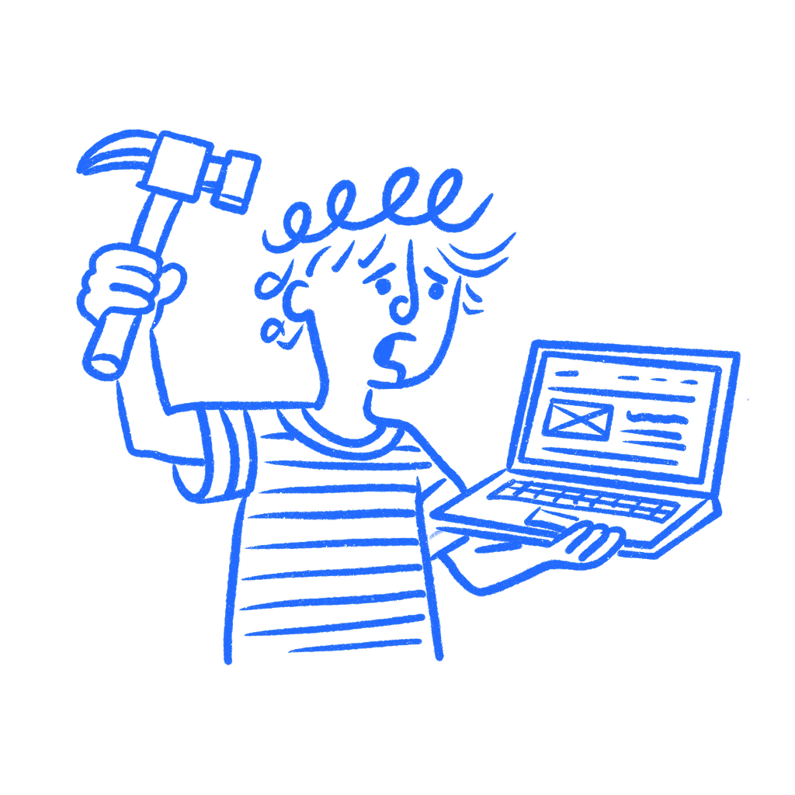

## 제2장 · 당신은 자신의 디자인을 망친다

*가면 증후군이 어떻게 당신을 위험 회피적으로 만드는가*

내가 아는 모든 디자이너는 자기 의심을 겪어 봤다. 때로는 불안으로, 때로는 오만이나 방어태세로 나타난다(3장 참고). 그러나 가장 자주 나타나는 모습은 이렇다. 강한 방향을 잡았다가 의심이 찾아온다. 유용한 종류가 아니라, 대담한 길이 좋아 보이는 이유가 아직 정체가 드러나지 않았기 때문이라고 생각하게 만드는 종류의 의심이다. 나는 리뷰 도중, 회의실이 반응하기도 전에 그런 일이 일어나는 것을 느껴 봤다. 이미 나는 결과물을 더 작고 더 무미건조하게 만들기 시작하고 있었다.

그래서 자르기 시작한다. 더 안전한 판단 하나, 또 하나. 제약 뒤에 숨는다. 단순한 길이 더 현실적이라고 스스로에게 말한다. 팀이 준비되지 않았다고 말한다. 사용자가 이해하지 못할 것이라고 말한다. 때로는 사실이다. 하지만 대부분의 경우 변명이다. 나도 이랬다. 작업은 그 누구도 손대기 전에 줄어들기 시작하고, 피드백이 도착할 무렵이면 쏠 만한 것은 거의 남지 않는다.

### 당신이 먼저 작업을 줄인다

그것은 머릿속의 문제이지 작업의 문제가 아니라는 느낌이 든다. 아니다. 그것은 빠르게 작업 안으로 스며든다. 당신은 볼 수 있는 최선의 판단을 내리는 것을 멈추고, 공격받기 가장 어려운 판단을 내리기 시작한다. 그것은 누군가 반대하기도 전에 일어날 수 있다. 진짜 피해는 기분이 나쁜 것만이 아니다. 들키지 않으려 애쓰는 사람처럼 디자인하기 시작한다는 것이다.

바깥에서 보면 극적으로 보이지 않는다. 책임감 있어 보인다. 안전해 보이니까 익숙한 패턴을 유지한다. 과하게 자신 있어 보일까 봐 더 강한 라벨을 부드럽게 만든다. 덜 말하는 것이 위험해 보이니까 설명을 추가한다. 각 결정은 따로 들으면 그럴듯하다. 전체는 한 번의 결정씩 작아지고 방어적으로 변한다. 모든 단계에 말끔한 변명이 있기에 아무도 무슨 일이 일어났는지 지적하지 못한다. 작업은 사용자에게 닿기도 전에 힘을 잃는다. 최종 버전은 여전히 작동한다. 다만 말할 수 있었던 것을 더는 말하지 않을 뿐이다.

### 연구가 말하는 것

1978년 심리학자 [폴린 클랜스와 수잔 아임스](https://cdn.serc.carleton.edu/files/earth_rendezvous/2020/program/afternoon_workshops/clance_imes_imposter_syndrome_15940560361372241715.pdf)는 그들이 가면 현상(impostor phenomenon)이라 부른 것을 기술했다. 그들이 쓴 대상은 일을 해낼 수 있고 이미 해냈으면서도 자신의 성공을 받아들이지 못하는 높은 성취의 사람들이었다. 그 사람들은 자신의 성공을 운, 타이밍, 혹은 자기에게 유리하게 작용한 실수로 계속 해석했다. 클랜스와 아임스는 그것을 이렇게 불렀다.

> *"지적 사기감의 내적 경험."*
> — Clance & Imes, 1978

이 문장이 지금도 유효한 이유는 추한 부분을 찌르기 때문이다. 사기꾼 감각은 증거가 그래서는 안 된다고 말할 때에도 사라지지 않는다.

디자이너에게 이것이 특히 위험한 이유는 연구자들이 자기 방해(self-handicapping)라 부르는 현상 때문이다. [완트와 클라이트먼](https://doi.org/10.1016/j.paid.2005.10.005)은 가면감과, 장애물을 미리 만들고 주춤하며 결과가 더 낫지 않은 이유에 대한 변명을 남겨두는 성향 사이에 강한 연관을 발견했다. 그것은 단순히 자신감의 문제가 아니다. 디자인의 문제다. 장애물이 늘 마감이나 까다로운 이해관계자인 것은 아니다. 대부분의 경우 그 장애물은, 회의실이 반응할 기회를 얻기도 전에 더 강한 아이디어를 테이블에서 치우는 디자이너 자신이다.

[노스코, 산토스, 왕](https://pmc.ncbi.nlm.nih.gov/articles/PMC8636168/)은 여러 산업 분야의 직장인을 대상으로 이 문제를 다른 각도에서 살폈다. 실패에 대한 두려움이 대부분을 설명한다는 것을 발견했다. 자신의 능력을 고정적으로 보는 사람들은 실패를 더 두려워했고, 그 두려움은 그들을 하나의 특정한 목표로 밀어붙였다. 무능을 드러내지 않는 것이다. 그 목표는 훌륭한 작업을 만드는 것도, 문제를 해결하는 것도 아니었다. 그저 못나 보이지 않는 것뿐이었다. 작업이 줄어들기 시작하는 지점이 바로 거기다. 아이디어가 나빠져서가 아니다. 정체가 드러나는 일이 타협보다 더 위험하다고 느껴지기 시작했기 때문이다.

### 더 나은 버전이 파일 속에 남을 때

나는 [Degreed](https://degreed.com/)에서 이것을 목격했다. 내 팀의 한 디자이너가 복잡한 관리자 기능을 작업하고 있었는데, 움직이는 부품이 많고 깔끔한 답이 없는 종류의 일이었다. 그녀는 옳은 버전을 발표했다. 일관된 패턴, 탄탄한 구조. 다만 보기에 지칠 만큼 복잡하기도 했다.

그런데 파일에 프레임이 더 있는 것이 눈에 들어왔다. 물어보자 그녀는 손사래를 쳤다. 너무 튀어서 아마 우리가 찾는 것이 아닐 거라고. 그래도 우리는 들여다봤다. 탐색안들은 더 나았다. 조금 나은 것이 아니라 훨씬 나았다. 안전한 버전이 해내지 못한 방식으로 실제 문제를 해결했다. 우리는 더 대담한 버전을 만들었다. 그것은 작동했다.

내가 그 프레임들을 알아채지 못했다면 안전한 버전이 출시됐을 것이다. 옳은 판단이어서가 아니다. 그녀가 이미 그것을 밀어붙이는 것은 자기 자리가 아니라고 결정해 버렸기 때문이다.

소심한 버전은 결코 두려움처럼 보이지 않는다. 책임감 있어 보인다. 조직이 어떻게 굴러가는지 아는 사람처럼 들린다. 그래서 아무도 막지 않은 채 회의실을 통과한다. 비평 세션에서도 봤다. 누군가 더 강한 버전을 들고 들어와서, 아무도 반응하기 전에 그것에 대해 사과하기 시작한다. 회의실은 진짜 결과물을 보지도 못한다. 만든 사람이 이미 그것을 거둬들였기 때문이다.

### 그 느낌을 어떻게 할 것인가

가장 훌륭한 작업을 하는 디자이너는 의심 없는 사람들이 아니다. 의심이 결정을 내리게 두는 것을 그만둔 사람들이다. 그것은 전혀 다른 이야기다.

[Superfried의 마크](https://www.superfried.com/10-top-tips-tackling-imposter-syndrome-for-designers/)가 실용적인 요점을 잘 짚는다. 사기꾼 감각이 나타나면 위로가 아니라 사실로 돌아가라. 당신은 채용됐다. 작업을 출시했다. 그것은 작동했다. 그것들은 감정이 아니라 사실이다. 사기꾼 감각은 본디 사실을 무시한다. 사실을 억지로라도 끌어들여야 한다.

그러니 더 강한 방향을 자르기 전에 한 가지 질문을 하라. 증거가 틀렸다고 말하기 때문에 이것을 바꾸는가, 아니면 그것을 밀었던 사람이 되는 것이 두려워서인가?

그리고 하나 더 물어보라. 지금 정확히 무엇으로부터 자신을 보호하려는 것인가. 나쁜 결과인가, 혹독한 리뷰인가, 순진해 보이는 것인가, 지나치게 야심적으로 보이는 것인가. 두려움에 이름을 붙이고 나면 그 두려움에 딸린 디자인 행동이 훨씬 덜 객관적으로 보이기 시작한다. 답이 "그들은 이해하지 못할 것이다" 또는 "팀이 준비되지 않았다"처럼 들린다면, 두려움이 이미 작업을 편집하고 있을 가능성이 크다.

그렇다고 대담한 선택이 늘 옳다는 뜻은 아니다. 두려움도 작업을 형성하는 다른 무엇처럼 의심받아야 한다는 뜻이다. 대부분의 경우 아무도 그것을 의문조차 하지 않는다.

### 두려움을 어떻게 할 것인가

그 감정이 작업을 작게 만들어야 하는 것은 아니다. 회피 쪽으로 밀어붙이는 그 두려움도 방향만 다르게 잡으면 숙달 쪽으로 밀어붙일 수 있다. 이에 관한 연구는 명확하다. 실패에 대한 두려움과 가면감은 함께 다니지만, 그 두려움으로 무엇을 하느냐는 서로 매우 다른 두 길로 갈린다. 한 길은 자신을 보호하는 것에 관한 것이다. 다른 한 길은 보호할 것이 줄어들 만큼 더 나아지는 것에 관한 것이다.

시간이 흐르며 정말 좋은 작업을 하는 것을 내가 본 디자이너들은 두려움 없는 사람들이 아니다. 안전하게 도망다니기에 지쳐서, 대담한 것을 출시하는 불편이 기억나지 않을 것을 출시하는 조용한 창피함보다 낫다고 결정한 사람들이다. 그들은 여전히 의심을 느낀다. 다만 그것이 최종 결정을 내리게 두는 것을 그만뒀을 뿐이다.

사기꾼 감각은 사라지지 않는다. 중요한 것은 그것이 당신을 작게 만드는가 날카롭게 만드는가이다. 사용자는 당신의 개인적 고뇌를 결코 보지 못한다. 그들은 그 고뇌에서 나온 결정을 본다.

### 참고 자료

- **Bravata, D. M., Watts, S. A., Keefer, A. L., Madhusudhan, D. K., Taylor, K. T., Clark, D. M., Nelson, R. S., Cokley, K. O., & Hagg, H. K. (2020). Prevalence, Predictors, and Treatment of Impostor Syndrome: A Systematic Review.** Journal of General Internal Medicine, 35, 1252–1275. [https://pmc.ncbi.nlm.nih.gov/articles/PMC7174434/](https://pmc.ncbi.nlm.nih.gov/articles/PMC7174434/)
- **Clance, P. R., & Imes, S. A. (1978). The Imposter Phenomenon in High Achieving Women: Dynamics and Therapeutic Intervention.** Psychotherapy: Theory, Research and Practice, 15(3), 241–247. [https://cdn.serc.carleton.edu/files/earth_rendezvous/2020/program/afternoon_workshops/clance_imes_imposter_syndrome_15940560361372241715.pdf](https://cdn.serc.carleton.edu/files/earth_rendezvous/2020/program/afternoon_workshops/clance_imes_imposter_syndrome_15940560361372241715.pdf)
- **Fried, J., & Heinemeier Hansson, D. (2010). Rework.** Crown Business. [https://www.penguinrandomhouse.com/books/96822/rework-by-jason-fried-and-david-heinemeier-hansson/](https://www.penguinrandomhouse.com/books/96822/rework-by-jason-fried-and-david-heinemeier-hansson/)
- **Lane, J. A. (2015). The Imposter Phenomenon Among Emerging Adults Transitioning Into Professional Life.** Adultspan Journal, 14(2), 114–128. [https://pdxscholar.library.pdx.edu/cgi/viewcontent.cgi?article=1024&context=coun_fac](https://pdxscholar.library.pdx.edu/cgi/viewcontent.cgi?article=1024&context=coun_fac)
- **Want, J., & Kleitman, S. (2006). Imposter phenomenon and self-handicapping: Links with parenting styles and self-confidence.** Personality and Individual Differences, 40(5), 961–971. [https://www.sciencedirect.com/science/article/abs/pii/S0191886905003612](https://www.sciencedirect.com/science/article/abs/pii/S0191886905003612)
- **Noskeau, R., Santos, A., & Wang, W. (2021). Connecting the Dots Between Mindset and Impostor Phenomenon, via Fear of Failure and Goal Orientation, in Working Adults.** Frontiers in Psychology, 12, 588438. [https://pmc.ncbi.nlm.nih.gov/articles/PMC8636168/](https://pmc.ncbi.nlm.nih.gov/articles/PMC8636168/)
- **Superfried (2024). Top 10 Tips: Designers & Imposter Syndrome.** [https://www.superfried.com/10-top-tips-tackling-imposter-syndrome-for-designers/](https://www.superfried.com/10-top-tips-tackling-imposter-syndrome-for-designers/)
- **Wikipedia: Impostor syndrome.** [https://en.wikipedia.org/wiki/Impostor_syndrome](https://en.wikipedia.org/wiki/Impostor_syndrome)
- **Young, V. (2011). The Secret Thoughts of Successful Women.** Crown Business/Random House. [https://www.penguinrandomhouse.com/books/195268/the-secret-thoughts-of-successful-women-by-valerie-young/](https://www.penguinrandomhouse.com/books/195268/the-secret-thoughts-of-successful-women-by-valerie-young/)
- **Basecamp: Where we came from.** [https://basecamp.com/about/](https://basecamp.com/about/)
