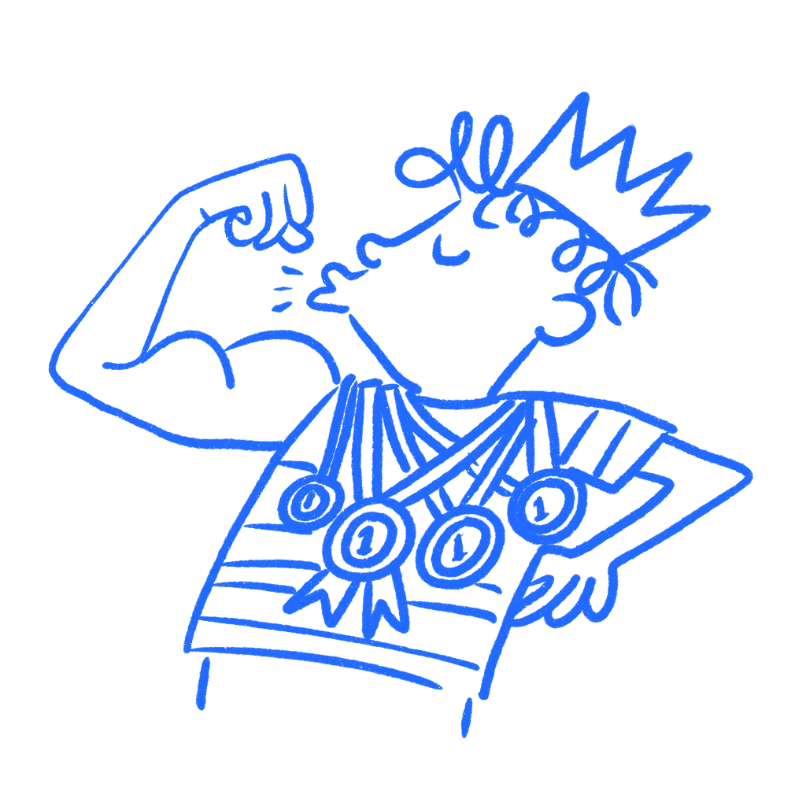

## 제3장 · 에고를 위한 디자인

*인지 부조화가 피드백을 위협으로 바꾸는 방식*

피드백이 들어왔고, 필요한 것보다 더 아프게 박혔다. 화면은 혼란스러웠다. 사람들은 막혔다. 증거는 미묘하지 않았다. 그런데도 당신 안의 어떤 부분은 그것을 옹호하고 싶어 했다. 그 무렵 작업은 더 이상 그저 작업이 아니었기 때문이다. 그것은 당신이 직업에 능한지를 판정하는 증거처럼 느껴지기 시작했던 것이다.

나는 그 수를 안다. 내가 해 봤기 때문이다.

### 작업이 당신과 별개로 느껴지지 않을 때

[레온 페스팅거](https://archive.org/details/FestingerLeonATheoryOfCognitiveDissonance1968StanfordUniversityPress)는 인지 부조화를, 유지하고 싶은 두 가지가 서로 충돌하는 것으로 드러날 때 나타나는 긴장으로 기술했다. 디자인에서 이 충돌은 흔하고 보기 좋지 않다. 당신은 작업이 좋다고 생각한다. 그런데 테스트는 다르게 말한다. 그 시점에서 무언가는 굴복해야 한다.

대부분의 경우 뇌가 가장 먼저 보호하는 것은 증거가 아니라 당신이다. [캐롤 태브리스와 엘리엇 애런슨](https://en.wikipedia.org/wiki/Mistakes_Were_Made_(but_Not_by_Me))은 정체성이 나쁜 선택에 얽히면 사람들이 그 선택을 어떻게 정당화하는지 썼다. 여기서 중요한 부분이 바로 그것이다. 당신의 디자인이 당신의 판단력을 대신하기 시작하면, 혹독한 피드백은 유용한 신호로 느껴지는 것을 멈추고 정체 폭로로 느껴지기 시작한다.

[댄 카한](https://ndg.asc.upenn.edu/wp-content/uploads/2017/08/Ideology-motivated-reasoning.pdf)은 더 나쁜 사실을 덧붙인다. 똑똑한 사람들은 애착을 가진 생각을 지키는 데 종종 더 능하다. 그 생각을 온전히 유지할 더 그럴듯한 이유를 만들어낼 수 있기 때문이다. 경험이 거기서 당신을 구해주지 않는다. 때로는 방어를 더 매끄럽게 만들 뿐이다.

그래서 이것은 자기 안에서 잡아내기 어렵다. 나쁜 방어는 항상 방어적으로 들리지 않는다. 신중하게 들릴 수 있고, 섬세하게 들릴 수 있다. "참가자가 서둘렀다." "질문지가 불명확했다." "한 번만 써 보면 이해할 것이다." 때로는 사실인 경우도 있다. 그러나 일단 작업이 개인적인 것이 되면, 뇌는 디자인이 빗나갔다는 더 단순한 가능성보다 그런 대사에 더 빨리 손을 뻗는다.

### Kin에는 마이크로소프트가 너무 많이 담겨 있었다

2010년 마이크로소프트는 10대를 위해 만든 소셜 폰 [Kin](https://en.wikipedia.org/wiki/Microsoft_Kin)을 출시했다. 2년간 개발 중이었고 제작비는 약 10억 달러로 알려져 있다. 그런데 앱스토어도 없이, 달력도 없이, 하루 종일 소셜 플랫폼에서 사는 사람들을 겨냥한 폰에서 15분마다 갱신되는 소셜 피드와 함께 출시되었다.

마이크로소프트는 48일 뒤 그것을 중단했다.

이 사례가 통하는 이유는 결함이 미묘하거나 찾기 어려웠기 때문이 아니다. 결함은 눈에 보였다. 그러나 그 무렵 제품에는 너무 많은 헌신, 정체성, 내부의 믿음이 감겨 있었다. 그것이 정말 구매자에게 작동하는지 묻는 일은 더 이상 중립적인 제품 질문으로 느껴지지 않았다. 사람들이 이미 수년간 옹호해 온 것을 공격하는 것처럼 느껴졌다.

제품 작업에서도 대개 이렇게 나타난다. 거대한 거짓말이거나 명백한 것을 보려 하지 않는 극적인 거부가 아니다. 어조가 서서히 바뀌는 것에 더 가깝다. 문제가 제기되면 회의실은 그 문제에서 배우는 방법 대신 작업을 문제로부터 보호하는 방법을 이야기하기 시작한다.

### 왜 안에서는 합리적으로 느껴지는가

여기서 중요한 것이 이것이다. 확증 편향은 증거를 걸러내는 방식에 관한 것이다. 이 문제는 더 일찍 시작되고 더 개인적으로 느껴진다. 작업이 자기 정체성과 융합했기 때문에 피드백이 위협으로 변하는 바로 그 순간이다.

[닐슨 노먼 그룹](https://www.nngroup.com/articles/confirmation-bias-ux/)은 두 현상이 겹치는 지점에 들어맞는 문장을 남겼다. "디자인이나 사용자에 대한 가정에 더 몰입할수록 확증 편향은 더 강해진다." 나는 여기서 그 문장의 앞부분을 취하고 싶다. 몰입이다. 그것이 조건이다. 일단 애착이 생기면 깨끗한 사고는 빠르게 어려워진다.

나는 잘못된 작업을 옹호하는 디자이너들을 봤다. 그것을 자르는 일이, 자신이 원하는 만큼 똑똑하지 않다는 사실을 인정하는 일에 너무 가깝게 느껴졌기 때문이다. 나는 리뷰에서 그것을 내 가슴속으로 느껴 봤다. 위협은 방어가 지적으로 들리기 시작하기도 전에 개인적으로 느껴진다.

### 에고가 점령하기 전에 할 일

작업이 출시되기 전에 사전 부검(pre-mortem)을 실행하라. "무엇이 잘못될 수 있을까?"라고 묻지 마라. 이미 실패했다고 말한 다음에 이유를 물어라. 사소한 표현 변경처럼 들리지만, 방어 모드에서 벗어나게 해 주기 때문에 중요하다. 더 이상 살아 있는 아이디어를 보호하려는 것이 아니다. 이미 넘어진 무언가를 돌아보는 것이고, 그래서 약한 지점이 어디였는지 정직해지기 쉬워진다.

더 짧은 버전을 원한다면 한 사람에게 10분 동안 작업을 제대로 공격하게 하라. 완화하지 않게 하고, "전반적으로 강하다" 같은 말도 없게 하라. 금을 찾아서 어디가 부러지는지 말해 달라고만 하면 된다.

그다음에 그들이 말했을 때 머리에 떠오른 첫 방어적 생각을 적어라. 몇 분 뒤에 다듬어 낸 더 깔끔한 버전이 아니라 첫 번째 것이다. 대개 에고는 거기 숨어 있다.

좋은 디자이너도 애착을 갖는다. 누구나 그렇다. 차이는 작업이 자신의 연장인 것을 멈추고 탁자 위의 사물로 돌아갈 수 있는 작은 순간들을 만들어 둔다는 점이다. 그것은 성격 특성이 아니다. 연습해야 하는 것이다. 피드백이 위협처럼 느껴진다면 에고는 이미 회의실 안에 들어와 있다.

### 참고 자료

- **Festinger, L. (1957). A Theory of Cognitive Dissonance.** Stanford University Press. [https://archive.org/details/FestingerLeonATheoryOfCognitiveDissonance1968StanfordUniversityPress](https://archive.org/details/FestingerLeonATheoryOfCognitiveDissonance1968StanfordUniversityPress)
- **Kahan, D. M. (2013). Ideology, motivated reasoning, and cognitive reflection.** Judgment and Decision Making, 8(4), 407–424. [https://ndg.asc.upenn.edu/wp-content/uploads/2017/08/Ideology-motivated-reasoning.pdf](https://ndg.asc.upenn.edu/wp-content/uploads/2017/08/Ideology-motivated-reasoning.pdf)
- **Tavris, C., & Aronson, E. (2007). Mistakes Were Made (But Not by Me).** Harcourt. [https://en.wikipedia.org/wiki/Mistakes_Were_Made_(but_Not_by_Me)](https://en.wikipedia.org/wiki/Mistakes_Were_Made_%28but_Not_by_Me%29)
- **Wikipedia: Cognitive dissonance.** [https://en.wikipedia.org/wiki/Cognitive_dissonance](https://en.wikipedia.org/wiki/Cognitive_dissonance)
- **Nielsen Norman Group: How to Overcome Confirmation Bias in UX Research.** [https://www.nngroup.com/articles/confirmation-bias-ux/](https://www.nngroup.com/articles/confirmation-bias-ux/)
- **Simply Psychology: Cognitive Dissonance.** [https://www.simplypsychology.org/cognitive-dissonance.html](https://www.simplypsychology.org/cognitive-dissonance.html)
- **The Decision Lab: Confirmation Bias.** [https://thedecisionlab.com/biases/confirmation-bias](https://thedecisionlab.com/biases/confirmation-bias)
