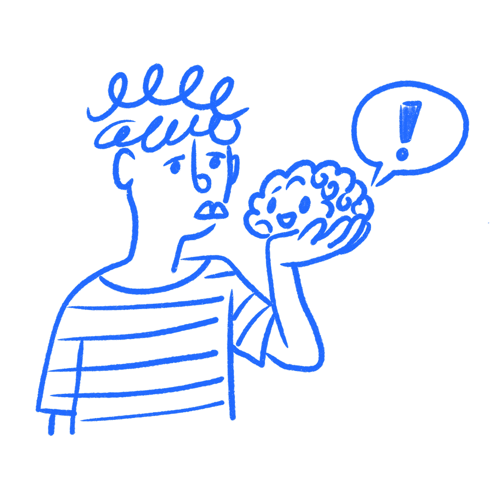

## 제4장 · 당신의 마음은 당신에게 거짓말을 한다

*뇌가 평가하는 척하며 작업을 방어하는 방식*

당신은 디자인 파일 안에 너무 오래 있었다. 모든 것이 어디 있는지 안다. 왜 거기 있는지도 안다. 어느 버전이 세 라운드 전에 밀렸는지, 왜 이 버전이 남았는지도 안다. 그래서 지금 화면을 보면 명확하게 느껴진다. 그 느낌은 위험하다. 증거가 아니기 때문이다. 그것은 노출에서 온 것이다.

나는 지금도 자신이 이렇게 하는 것을 발견한다. 이해하려 애쓸 필요가 없어졌다는 이유만으로 화면이 좋게 느껴지기 시작한다.

### 쉽게 느껴져서 더 좋게 느껴진다

뇌는 처리하기 쉬운 것을 좋아한다. 그것이 이 장의 핵심 문제다. 익숙한 것은 마음을 덜 힘들이고 통과하고, 그 편이함이 품질로 오인된다. [롤프 레버, 노버트 슈바르츠, 피오트르 빈키엘만](https://pages.ucsd.edu/~pwinkiel/reber-schwarz-winkielman-beauty-PSPR-2004.pdf)은 명료하게 말했다. "지각자가 대상을 더 유창하게 처리할수록 미적 반응은 더 긍정적이다." 그것이 처리 유창성이다. 진실이나 명확성이 아니다. 편이함이다.

이것은 사람들이 인정하는 것보다 디자인에서 더 중요하다. 당신은 같은 파일, 같은 화면, 같은 흐름을 계속 연다. 뇌가 이미 경로를 알기 때문에 이해하려고 애쓸 필요가 없어진다. 자신의 의도를 읽는 속도가 빨라졌기 때문에 작업이 더 좋아 보이기 시작한다.

[레오니트 로젠블릿과 프랭크 카일](https://pmc.ncbi.nlm.nih.gov/articles/PMC3062901/)은 다른 형태로 이것과 비슷한 것을 발견했다. 사람들은 평범한 사물을 실제보다 훨씬 잘 이해하고 있다고 생각했고, 한 단계씩 설명해야 하는 순간까지 그렇게 믿었다. 이해했다는 느낌이 짐의 너무 많은 부분을 지고 있었던 것이다. 디자이너들은 자신의 인터페이스로 같은 짓을 한다. 화면은 명백해 보이고, 새로운 사람이 손을 대면 전체가 와해된다.

작은 방식으로도 이것을 볼 수 있다. 라벨은 화면 나머지를 대신 활용하지 않고 그 의미를 말해야 하는 순간까지는 명확해 보인다. 흐름은 기억에 기대지 않고 각 단계에서 다음에 무슨 일이 일어나는지 설명해야 하는 순간까지는 단순해 보인다. 익숙함이 당신 대신 틈을 계속 메워 준다.

### 안에서 본 Google Wave의 모습

2009년 5월 구글은 [Google Wave](https://en.wikipedia.org/wiki/Google_Wave)를 발표했고 청중은 그것을 사랑했다. 그 제품은 이메일, 채팅, 실시간 편집, 소셜 업데이트를 하나로 섞었다. 만든 사람들은 어리석지 않았다. 라스와 예른스 라스무센은 이미 구글 지도를 만든 사람들이었다. 그들은 어려운 제품을 출시하는 법을 아는 사람들이었다.

그런데 2009년 9월 Wave가 10만 명의 사용자에게 열리자 평범한 사람들은 벽에 부딪혔다. 그것이 무엇을 위한 것인지 알 수 없었다. 제품은 새로운 모델을 한꺼번에 배우라고 요구했다. 익숙한 시작점도 없었고, 간단한 손잡이도 없었다. 사람들은 열어 보고, 둘러보고, 떠났다. 구글은 2010년 8월 활발한 개발을 멈췄다.

여기서 중요한 부분이 이것이다. Wave가 실패한 이유가 야심적이어서만은 아니다. 그 안의 사람들은 여전히 그것을 읽어낼 수 있었기 때문에 실패했다. 그들은 그것과 너무 오래 지냈고, 제품은 실제보다 그들에게 더 읽기 쉬워 보였다. 그들은 사용자가 결코 얻지 못한 버전의 제품 안에서 살고 있었다.

그래서 과도한 익숙함은 디자인 작업에서 이토록 위험하다. 그것은 잘못된 것에 대해 자랑하게 만들 수 있다. 또한 의미가 어디서 오는지 추적하지 못하게 만든다. 화면은 당신의 머리가 공급하는 이해 덕분에 평가를 받는다.

### 무엇을 점검할 것인가

디자인에 대한 자신의 판독을 믿기 전에 더 어려운 질문을 하라. 이것은 명확해서 명확해 보이는가, 아니면 이미 알고 있어서 명확해 보이는가?

그 질문은 마법이 아니다. 자신의 편이함을 증거로 취급하는 것을 막아줄 뿐이다. 구체적으로 만들고 싶다면 파일에서 벗어났다가 나중에 한 가지 임무만 가지고 돌아오라. 화면이 아니라 기억으로 의미를 채우기 시작하는 첫 지점을 기록하는 것이다. 대개 문제는 거기서 시작된다.

거기서 필요한 것은 더 많은 자신감이 아니다. 자신의 익숙함이 주는 편안함을 덜 믿는 일이다.

또 다른 좋은 점검은 처음 보는 것처럼 화면을 소리 내어 설명하는 것이다. 이 페이지는 무엇을 위한 것인가. 내가 가장 먼저 할 수 있는 것은 무엇인가. 이것을 클릭하면 무슨 일이 생기는가. 설명이 흐려지는 첫 지점은 대개 말하기의 문제가 아니다. 디자인 문제를 가리킨다. 나는 완벽하게 정돈된 화면이 정직하게 그렇게 시도하는 순간 와해되는 것을 겪어 봤다.

### 바깥의 눈이 필요한 이유

[저스틴 크루거와 데이비드 던닝](https://sites.lsa.umich.edu/sasi/wp-content/uploads/sites/275/2015/11/krugerdunning99.pdf)이 대개 인용되는 것은, 아는 것이 적은 사람이 자신을 심각하게 잘못 판단할 수 있다는 뻔한 요점이다. 여기서 더 중요한 부분은 다른 쪽이다. 실력을 갖춘 사람들도 다른 모든 사람에게 실제로 보이는 것이 무엇인지 놓칠 수 있다. 일단 화면 뒤의 논리와 라벨과 예외 사례와 역사를 알게 되면, 그것을 처음 보는 기분을 기억하기 어려워진다.

이것이 이 장 전체 밑에 깔린 문제다. 익숙함은 화면을 실제보다 낫게 보이게 만든다. 설명 심층의 착각은 그것을 실제보다 명확하게 보이게 만든다. 그리고 일단 그것이 작동한다는 믿음으로 기울면 [레이먼드 니커슨](https://pages.ucsd.edu/~mckenzie/nickersonConfirmationBias.pdf)이 나머지를 설명해 준다. 마음은 그 믿음을 보호하는 방식으로 증거를 읽기 시작한다. 당신은 단지 너무 많이 알고 있기만 한 것이 아니다. 그 추가 지식을 통해 보이는 것을 해석하기 시작한다.

그래서 바깥의 눈이 중요하다. 당신의 판단이 무가치해서가 아니라 더 이상 신선하지 않기 때문이다. 다른 사람들은 당신의 뇌가 계속 매끈하게 덮어 온 지점에 부딪힌다. 당신이 더 이상 틈을 알아차리지 못하는 곳에서 막힌다. 당신이 이미 의미를 알기 때문에만 이해되는 부분에 대해 질문한다.

그 지점에서 당신은 더 이상 실제로 화면을 보고 있는 것이 아니다. 당신은 당신의 뇌가 읽는 법을 배운 버전을 보고 있는 것이다.

### 참고 자료

- **Reber, R., Schwarz, N., & Winkielman, P. (2004). Processing fluency and aesthetic pleasure: Is beauty in the perceiver's processing experience?** Personality and Social Psychology Review, 8(4), 364–382. [https://pages.ucsd.edu/~pwinkiel/reber-schwarz-winkielman-beauty-PSPR-2004.pdf](https://pages.ucsd.edu/~pwinkiel/reber-schwarz-winkielman-beauty-PSPR-2004.pdf)
- **Nickerson, R. S. (1998). Confirmation bias: A ubiquitous phenomenon in many guises.** Review of General Psychology, 2(2), 175–220. [https://pages.ucsd.edu/~mckenzie/nickersonConfirmationBias.pdf](https://pages.ucsd.edu/~mckenzie/nickersonConfirmationBias.pdf)
- **Rozenblit, L., & Keil, F. (2002). The misunderstood limits of folk science: An illusion of explanatory depth.** Cognitive Science, 26(5), 521–562. [https://pmc.ncbi.nlm.nih.gov/articles/PMC3062901/](https://pmc.ncbi.nlm.nih.gov/articles/PMC3062901/)
- **Kruger, J., & Dunning, D. (1999). Unskilled and unaware of it.** Journal of Personality and Social Psychology, 77(6), 1121–1134. [https://sites.lsa.umich.edu/sasi/wp-content/uploads/sites/275/2015/11/krugerdunning99.pdf](https://sites.lsa.umich.edu/sasi/wp-content/uploads/sites/275/2015/11/krugerdunning99.pdf)
- **Wikipedia: Dunning-Kruger effect.** [https://en.wikipedia.org/wiki/Dunning%E2%80%93Kruger_effect](https://en.wikipedia.org/wiki/Dunning%E2%80%93Kruger_effect)
- **Nielsen Norman Group: Confirmation Bias in UX Research.** [https://www.nngroup.com/articles/confirmation-bias-ux/](https://www.nngroup.com/articles/confirmation-bias-ux/)
