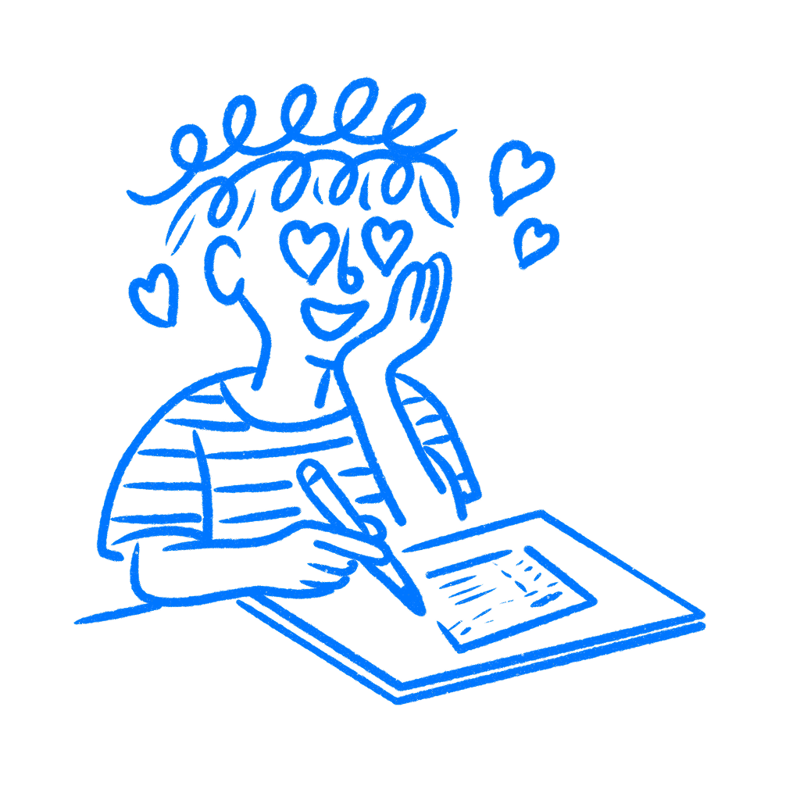

## 제8장 · 첫 스케치에 반하다

*디자인 고착이 첫 아이디어에 당신을 가두는 방식*

탐색하고 있다고 생각한다. 스케치북 절반을 서로 다른 레이아웃과 서로 다른 흐름으로 채웠고, 어쩌면 아무에게도 보여주지 않을 이상한 방향 하나도 섞여 있다. 그런데 아마도 시작한 지 스무 분쯤에 무언가를 그렸고, 그 이후의 모든 초안은 그것과 논쟁해 왔다. 버튼을 옮겼다. 위계를 바꿨다. 내비게이션을 교체했다. 그럼에도 그 초기 초안은 여전히 그 모든 것 밑에 자리 잡고 있다.

나는 이 패턴을 안다. 지금도 나는 그렇게 하는 자신을 발견하기 때문이다. 여전히 열려 있다고 생각하다가, 문득 처음 옳게 느껴진 경로를 지키고 있는 자신을 발견한다. 그래서 스케치 세션은 바빠 보이면서도 좁게 머물 수 있다. 얻는 것은 움직임, 다듬기, 정리, 재배치, 세련이다. 얻지 못하는 것은 거리, 놀람, 의심, 새로운 각도다.

그렇게 워크숍은 궤도가 된다. 낙서, 화살표, 주석, 재배열, 말끔한 소소한 개선, 종이 위의 많은 움직임을 얻는다. 사라지는 것은 어색한 우회이거나 틀을 활짝 깨부수는 초안이다.

### 첫 초안이 주도권을 쥔다

1991년, [데이비드 잔슨과 스티븐 스미스](https://cecas.clemson.edu/cedar/wp-content/uploads/2016/07/9-JanssonAndSmith1991.pdf)는 공학과 학생과 현업 엔지니어를 상대로 일련의 실험을 진행했다. 두 그룹 모두에게 디자인 과제를 주었다. 시각장애인을 위한 계량컵 디자인, 자전거 거치대 디자인. 일부는 먼저 예시 해답을 보았다. 연구진은 그 해답에 결함이 있다고 알리고, 약점을 명확한 말로 짚어주었다. 그다음 모두가 될 수 있는 한 많은 새 해답을 내놓아야 했다.

결함 있는 예시를 본 엔지니어들은 자기 디자인에 그 예시의 특징들을 계속 재현했다. 한 줄 한 줄 베끼는 것은 아니었다. 그러나 비슷한 형태와, 그 물건이 작동해야 하는 방식에 대한 같은 숨은 가정을 계속 재사용했다. 반면 아무것도 보지 못한 엔지니어들은 훨씬 다양한 콘셉트를 만들어냈다. 연구진은 자신들이 발견한 현상을 다음과 같이 정의했다.

> *개념 설계의 산출을 제한하는, 일련의 아이디어에 대한 맹목적 충실.*
> — Jansson & Smith

엔지니어들이 문제를 못 본 것이 아니었다. 그 예시가 나쁘다는 말을 분명히 들었다. 그래도 빠져나오지 못했다. 함정이 있다는 것을 아는 것은 도움이 되지 않았다.

디자인 고착은 누군가 결함 있는 예시를 보여줄 때만 생기는 것이 아니다. 대충의 생각을 한 번 옮겨 적는 순간 시작된다. 그러면 그 참조물은 당신 것이 되고, 그래서 문제는 오히려 깊어진다. 그 기분을 나도 안다. 마음에 든다. 믿음이 간다. 나중에 그린 그림은 새로워 보이지만, 처음 그렸던 초안 쪽으로 계속 기울어져 있다.

[아인슈텔룽 효과](https://en.wikipedia.org/wiki/Einstellung_effect)는 이 현상의 더 넓은 버전을 설명한다. 뇌가 문제를 푸는 한 가지 방법을 익히면, 더 나은 경로가 바로 옆에 있어도 그 익숙한 길을 계속 찾는다. 낡은 패턴은 사고를 형성하는 데 그치지 않는다. 때로는 다른 선택지가 기회를 얻기도 전에 전부 밀어낸다.

### Zune은 아이팟을 쫓았다

2006년, [마이크로소프트는 Zune을 출시했다](https://en.wikipedia.org/wiki/Zune). 아이팟과 경쟁하기 위해서였다. 돈도 있었고, 엔지니어도 있었고, 목표도 명확했고, 애플의 플레이어를 몇 년간 연구해 온 제품 팀도 있었다. 없었던 것은, 쫓고 있던 그 기기로부터의 거리였다.

Zune은 애플 아이팟에 대한 정면 응답으로 나왔다. 스크롤 휠 내비게이션. 음악 우선 인터페이스. 데스크톱 동기화 소프트웨어. 거의 같은 자리에서 거의 같은 역할을 하는 물리 버튼. 하드웨어마저 비슷하게 느껴졌고, 마감 처리만 달랐다. 애플은 내내 그 방 안에 있었다. 마이크로소프트는 계속 하나의 질문만 던졌다. 아이팟이 하는 일을 어떻게 더 잘 할 수 있는가?

그 질문이 그 이후의 모든 것을 좁혔다. 거기서 시작하고 나니 다른 질문을 하기가 어려웠다. 모든 비교가 그들을 같은 틀로 다시 끌어당겼기 때문이다.

사람들은 이미 아이팟을 갖고 있었다. 아이튠스 라이브러리와 습관과 액세서리도 함께. Zune으로 옮기려면 "비슷한 일을 조금 더 잘한다"를 넘어서는 이유가 필요했다. 이미 알고 있던 환경 전체를 떠날 이유가 필요했다. 마이크로소프트는 다른 응답이 무엇일 수 있을지 물을 만큼 충분히 물러나서 보지 않았고, 그래서 그런 이유를 끝내 주지 못했다. Zune의 시장 점유율은 판매 기간 내내 애플보다 아래에 머물렀고, 샌디스크보다도 뒤졌다. 마이크로소프트는 2011년 10월에 하드웨어를 시장에서 거뒀다.

함정은 일찍 세워져 있었다. 제품을 "X에 대한 응답"으로 정의하는 순간, 그 이후의 모든 선택을 X가 만들도록 내버려 둔 것이다. 나는 디자이너들이 경쟁 제품을 향해서, 자기 제품의 이전 버전을 향해서, 심지어 첫 한 시간의 대충 그린 스케치를 향해서 이렇게 하는 것을 봐 왔다.

### 스케치는 이미 선택을 해 두었다

작업 시작 때 하는 모든 스케치는, 내가 선택을 하고 있다는 사실조차 모른 채 선택을 하나씩 해 둔다. 누군가 버튼을 탭해서 진행한다고 그렸을 수 있다. 어쩌면 이것이 모바일에 속한다고 이미 가정했을 수 있다. 특정한 종류의 사용자나 특정한 분위기를 가정하고 있을 수도 있다. 앉아서 그런 것들을 하나하나 선택한 것이 아니다. 가장 먼저 떠오른 버전을 그렸고, 나머지 전부가 그 위에 얹혀 있는 것이다.

초기 콘셉트 가운데 좋은 것도 있다. 그래도 다른 것을 보기 전까지는 어떤 종류의 콘셉트인지 알 수 없다. 고착이 그 판단을 방해한다. 그 첫 수를 진짜 대안들과 시험하고 있는 것이 아니라, 그것 자체의 더 부드러운 변형들과 시험하고 있는 것이다.

백지는 사람들을 겁먹이지만, 초기 스케치 하나를 공전하는 것은 더 나쁘다. 틀을 좁히고, 특이한 선택지를 잘라내고, 더 안전한 변형을 진전처럼 느끼게 만든다. 로그인 버튼이 왼쪽에서 오른쪽으로 자리를 옮기자 디자이너들이 그것을 새로운 방향이라 부르기 시작한다.

진짜 대안은 처음에는 어색해 보이는 경우가 많다. 한쪽으로 치우쳤을 수 있고, 시끄럽거나, 앙상하거나, 느리거나, 과하게 크거나, 비좁거나, 거꾸로 뒤집혔거나, 조금 우스꽝스러울 수 있다. 그래도 그 못난 초안은, 세련된 버전이 계속 숨기고 있던 지름길이나 레이아웃 규칙을 드러낼 수 있다. 나는 정중한 변형들로 가득한 말끔한 화면보다 형편없는 종이 스케치 하나가 더 많은 일을 해내는 것을 봐 왔다.

[크리시쿠와 와이스버그의 2005년 연구](https://psycnet.apa.org/record/2005-11804-019)는, 참가자들에게 이전 예시가 자기 과제와 무관하다고 말했는데도 그 예시가 여전히 산출물을 형성했다는 것을 발견했다. 예시를 무시하라고 말하는 것은 예시를 중화시키지 못한다. 이미지는 이미 머릿속에 들어와 있다.

### 반복하기 전에 이것을 확인하라

반복 작업으로 들어가기 전에, 스케치를 놓고 그 스케치가 당연하다는 듯이 받아들이는 가정 하나의 이름을 붙여라. 딱 하나만. 사람이 동작을 시작한다든가. 이 모든 정보가 한 화면에 담긴다든가. 내비게이션 구조가 애초에 존재한다든가. 이름을 붙여라. 그런 다음 그 가정이 거짓이라고 치고 대충 그린 초안 하나를 만들어라. 변형이 아니라 모순으로. 아무도 아무것도 시작하지 않으면 상호작용은 무엇이 되는가? 화면이 없다면? 내비게이션이 사라진다면?

이것은 자기 패턴을 깨는 하나의 방법이다. 방금 만든 것의 반대를 설계하도록 자신을 몰아세워라. 쓸모없을 수 있다. 그건 괜찮다. 내가 관심을 두는 것은 그것이 초기의 답을 흔들어 놓는가 하는 점뿐이다.

대부분의 디자이너는 이 확인을 절대 하지 않는다. 콘셉트 하나와 그것의 열두 가지 버전을 갖고 있고, 그것을 탐색이라 부른다. 내가 너무 빨리 움직일 때는 나도 여전히 그렇게 한다. 이 연구는 초보자와 현업 전문가 모두에서 비슷한 비율로 고착을 발견했다. 경험은 여기서 당신을 보호해 주지 않는다. 어떤 경우에는 오히려 상황을 악화시킨다. 한 가지 방식으로 해결해 본 문제가 많을수록, 뇌가 그 경로를 다시 더 빨리 잡아채기 때문이다.

가정 깨기는 스케치가 실제로 무엇으로 만들어졌는지 보여준다. 어떤 제약을 의심 없이 받아들이는지, 어떤 선택지를 알아채지도 못한 채 닫아버리는지 보게 된다. 그다음에야 무엇을 남길지 결정할 수 있다. 그 단계가 없다면 선택은 아마도 처음 스무 분 안에 이미 이루어졌고, 나머지는 바빠 보이기만 했던 것이다.

두 번째 답은 대개, 이전 답을 지키려 들기를 멈춘 뒤에야 나타난다.

### 참고 자료

- **Jansson, D. G., & Smith, S. M. (1991). Design fixation.** Design Studies, 12(1), 3–11. [https://cecas.clemson.edu/cedar/wp-content/uploads/2016/07/9-JanssonAndSmith1991.pdf](https://cecas.clemson.edu/cedar/wp-content/uploads/2016/07/9-JanssonAndSmith1991.pdf)
- **Luchins, A. S. (1942). Mechanization in problem solving: The effect of Einstellung.** Psychological Monographs, 54(6), 1–95. [https://en.wikipedia.org/wiki/Einstellung_effect](https://en.wikipedia.org/wiki/Einstellung_effect)
- **Chrysikou, E. G., & Weisberg, R. W. (2005). Following the wrong footsteps: Fixation effects of pictorial examples in a design problem-solving task.** Journal of Experimental Psychology: Learning, Memory, and Cognition, 31(5), 1134–1148. [https://psycnet.apa.org/record/2005-11804-019](https://psycnet.apa.org/record/2005-11804-019)
- **Wikipedia: Functional fixedness.** [https://en.wikipedia.org/wiki/Functional_fixedness](https://en.wikipedia.org/wiki/Functional_fixedness)
- **Fessenden, T. (2018). The Anchoring Principle.** Nielsen Norman Group. [https://www.nngroup.com/articles/anchoring-principle/](https://www.nngroup.com/articles/anchoring-principle/)
- **Wikipedia: Zune.** [https://en.wikipedia.org/wiki/Zune](https://en.wikipedia.org/wiki/Zune)
