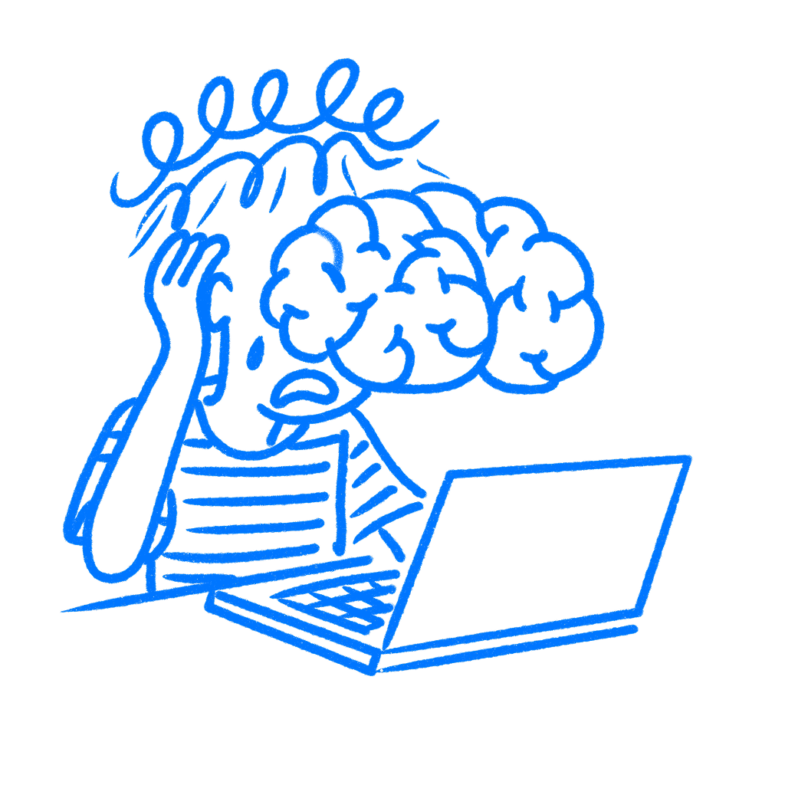

## 제9장 · 당신의 지식이 문제다

*전문가일수록 자기 작업을 가장 잘못 평가하는 이유*

자기 디자인을 검토할 때, 우리는 처음 쓰는 사용자가 보는 것을 보고 있지 않다. 몇 주 동안 들여다본 바로 그 버전은, 그것에 대해 우리가 아는 모든 것 때문에 머릿속에서 덮여 버린다. 내가 만든 그 기능을 수행하는 버튼? 그 버튼이 무엇을 하는지 이미 안다. 시선이 닿는 순간 뜻이 먼저 떠오르고, 제대로 읽지도 않았는데 이해가 끝나 있다. 그 지점부터는 인터페이스를 읽고 있는 것이 아니다. 그것을 만들었던 기억을 읽고 있는 것이다. 초보자는 그런 맥락이 전혀 없는 채로 같은 화면에 도착한다. 버튼을 읽거나, 읽으려고 애쓴다. 클릭할 수 있는 것인지조차 모를 수 있다.

나는 그 일이, 너무나 명확하다고 생각했던 화면들에서 벌어지는 것을 지켜봐 왔다.

### 맥락이 감추는 것

1989년, 경제학자 [콜린 캐머러, 조지 뢰번스타인, 마르틴 베버](https://www.cmu.edu/dietrich/sds/docs/loewenstein/CurseknowledgeEconSet.pdf)가 와튼스쿨에서 일련의 실험을 진행했다. 질문은 단순했다. 무언가를 아는 사람이, 그것을 모르는 사람에게는 어떻게 보일지 예측할 수 있는가? 할 수 없었다. 누군가에게 정보를 주고 나서, 그 정보가 없는 상태를 상상해 보라고 하면 실패한다. 매번 그렇다. 그리고 더 많이 알수록 더 심하게 어긋난다. 캐머러의 팀은 이것을 *지식의 저주*라 불렀다. 그 이해가 일단 머릿속에 들어오면 그저 들고 다니기만 하는 것이 아니다. 보이는 것을 방해하기 시작한다.

문제는 성격이 아니라 기억이다. 익숙한 것을 볼 때 뇌는 멈춰 서서 꼼꼼히 살피지 않는다. 의식 아래에서 그것을 빠르게 다시 만들어낸다. 그래서 내가 디자인한 화면은 더 이상 새것으로 보이지 않는다. 완성된 것으로 보인다. 모호한 레이블은 충분히 명확해 보이고, 숨겨 둔 기능은 숨겨져 있다는 느낌조차 들지 않는다. 사용자에게 결코 없었던 맥락으로 전부 채워 넣고 있는 것이다.

[칼 와이먼](https://www.aps.org/publications/apsnews/200711/backpage.cfm)은 대학 물리학에서 이 현상을 오랫동안 연구했다. 그의 결론은 단호했다. 무언가를 알고 있으면, 그것을 모르는 사람의 관점에서 그것을 생각하는 것이 극도로 어렵다는 것이었다. 와이먼은 자기에게는 자명해 보이는 개념을 학생들이 왜 어려워하는지 이해하지 못하는 교수들을 말하고 있었다. 디자이너가 테스트를 지켜보며 "저걸 어떻게 못 보지?"라고 생각하는 모습을 묘사하는 것이라 해도 틀린 말이 아니었다.

> *무언가를 알고 있으면, 그것을 모르는 사람의 관점에서 생각하는 것이 극도로 어렵다.*
> — Carl Wieman

### 포토샵은 전문가를 위해 만들어졌다

포토샵은 전문적인 이미지 제작 워크플로 속에서 자라났다. 어도비의 공식 연혁에 따르면 존 놀은 이 소프트웨어가 모습을 갖추어 가던 시기에 인더스트리얼 라이트 앤 매직에서 일하고 있었고, 어도비는 포토샵의 주 사용층이 오랫동안 전문 디자이너와 사진가였다고 밝힌다. 그 맥락이 중요하다. 마스킹, 조정 레이어, 블렌드 모드는 초보자용 개념이 아니었다. 기본 어휘였다. 목수가 끌이라는 도구가 무엇에 쓰이는지 설명하려고 멈추지 않는 것과 마찬가지로, 포토샵을 만들던 사람들은 그 인터페이스가 초보자에게 이해를 요구하고 있다는 사실을 실감하지 못했다. ([어도비가 말하는 포토샵의 기원](https://blog.adobe.com/en/publish/2015/02/18/photoshop-turns-25-qa-with-thomas-knoll), [어도비가 말하는 포토샵의 핵심 사용층](https://blog.adobe.com/en/publish/2015/02/25/adobe-explains-it-all-photoshop))

처음 쓰는 사용자는 포토샵과 씨름해야 했다. 어도비 자신의 초보자용 자료조차, 전문가가 당연하게 여기는 개념을, 특히 레이어를, 하던 일을 멈추고 가르쳐야 한다. 지금 어느 레이어 위에서 작업 중인가? 이 편집은 왜 적용되지 않는가? 이 두 브러시의 차이는 무엇인가? 도구를 만들던 사람들에게는 그런 질문들이 더 이상 문제로 느껴지지 않았다. [닐슨 노만 그룹의 인지 워크스루 연구](https://www.nngroup.com/articles/cognitive-walkthroughs/)는 정확히 이것을 기록해 두었다.

> *처음 쓰는 사용자를 시뮬레이션하는 구조화된 평가가 존재하는 이유는, 디자이너가 스스로 그 경험을 만들어낼 수 없기 때문이다. 지식이 그것을 막는다.*

어도비는 결국 라이트룸을 출시했다. 이어서 포토샵 엘리먼츠를 냈는데, 어도비는 지금 이 제품을 "경험이 전혀 필요 없는" "누구나" 쓸 수 있는 "똑똑하고 사용하기 쉬운 사진 편집 소프트웨어"로 설명한다. 포토샵을 만든 사람들은 같은 제품을 다시 반짝이게 다듬는 것만으로는 포토샵이 초보자에게 명확하게 느껴지게 만들 수 없었다. 아예 다른 무언가를 만들어야 했다. ([어도비 포토샵 엘리먼츠](https://www.adobe.com/products/photoshop-elements.html))

### 초보자는 그 방에 없었다

실제 팀에서는 대개 이렇게 흘러간다. 디자이너들은 흐름을 검토하고 자명하다고 판단한다. 개발자는 오류 메시지를 읽고 충분히 명확하다고 느낀다. PM은 온보딩 데모를 끝까지 앉아서 보고, 아무도 의문을 제기하지 않는다. 모두가 고개를 끄덕인다. 그러고 나서 처음 쓰는 사용자가 "계속" 버튼을 누르고는, 그 버튼이 무엇을 하려는지 전혀 모른다.

그다음 사용자들이 나타난다. 모두가 쉽다고 생각했던 단계에서 멈춘다. 만드는 데 몇 주 걸린 기능을 무시하고 지나간다. 경로가 곧아야 할 순간에 옆길로 샌다. 그리고 방 안의 사람들은 이미 맥락을 전부 갖고 있기 때문에, 이 광경을 눈으로 보고도 여전히 놀란 목소리를 낸다.

회고는 늘 같은 지점에 도착한다. 그 집단은, 팀 안에만 존재하던 맥락을 사용자도 갖고 도착할 것이라고 가정했던 것이다. 나는 리뷰에서는 완전히 괜찮아 보였던 출시 뒤에 이 일이 벌어지는 것을 봐 왔다.

이 문제는 알아차린다고 고쳐지지 않는다. [캐머러의 연구](https://www.cmu.edu/dietrich/sds/docs/loewenstein/CurseknowledgeEconSet.pdf)는 지식의 저주에 대해 사람들에게 미리 알려 주어도 판단에 미치는 영향이 거의 줄어들지 않는다는 것을 발견했다. 읽고, 이해하고, 다른 사람에게 설명까지 할 수 있어도 자기 작업의 구멍은 여전히 놓친다. 피곤한 금요일 오후에 나는 여전히 그렇게 하는 자신을 발견한다. 편향이 존재한다는 것을 아는 일과 그 편향 너머를 보는 일은 서로 다른 일이다.

### 새로운 사람을 앞에 앉혀라

가장 잘 통하는 해법은 외부에서 온다. 그 제품을 정말로 한 번도 본 적 없는 사람을 찾아라. 킥오프에 참석했던 동료가 아니라. 지나가는 말로 언급했다는 이야기를 들은 적 있는 다른 팀 디자이너도 아니다. 맥락이 전혀 없는 사람을 데려와라. 제품을 그 사람 앞에 놓아라. 지켜보고, 조용히 있고, 반응하게 두고, 침묵을 그대로 두어라. 어디서 느려지는지, 어디를 잘못 읽는지, 어디서 포기하는지에 주의를 기울여라.

그런 순간들 하나하나가, 당신 자신의 지식이 지금까지 채워 오던 간극을 표시한다. [지식의 저주](https://en.wikipedia.org/wiki/Curse_of_knowledge)는 머리를 쥐어짜서 빠져나올 수 있는 것이 아니다. [칩 히스와 댄 히스는 하버드 비즈니스 리뷰에서](https://hbr.org/2006/12/the-curse-of-knowledge) 이를 한마디로 말했다. 이들은 지식의 저주를 디자이너와 그들이 디자인하는 사람들 사이에 놓인 가장 큰 단일 장애물이라 불렀다. 그 제품을 만드는 데 도움을 준 바로 그 전문성이, 이번에는 길을 막는 것이다. 나는 디자이너들이 같은 화면을 계속 다듬으면서, 처음 보는 사람들은 전혀 읽어내지 못한다는 사실은 놓치는 것을 봐 왔다.

중요한 것은 내가 무엇을 만들었는가가 아니다. 처음 보는 사람이 무엇을 보는가이다.

### 참고 자료

- **Camerer, C., Loewenstein, G., & Weber, M. (1989). The curse of knowledge in economic settings: An experimental analysis.** Journal of Political Economy, 97(5), 1232–1254. [https://www.cmu.edu/dietrich/sds/docs/loewenstein/CurseknowledgeEconSet.pdf](https://www.cmu.edu/dietrich/sds/docs/loewenstein/CurseknowledgeEconSet.pdf)
- **Heath, C., & Heath, D. (2006). The curse of knowledge.** Harvard Business Review, 84(12), 20–23. [https://hbr.org/2006/12/the-curse-of-knowledge](https://hbr.org/2006/12/the-curse-of-knowledge)
- **Wieman, C. E. (2007). The "curse of knowledge," or why intuition about teaching often fails.** APS News, 16(10). [https://www.aps.org/publications/apsnews/200711/backpage.cfm](https://www.aps.org/publications/apsnews/200711/backpage.cfm)
- **Wikipedia: Curse of knowledge.** [https://en.wikipedia.org/wiki/Curse_of_knowledge](https://en.wikipedia.org/wiki/Curse_of_knowledge)
- **The Decision Lab: Curse of Knowledge.** [https://thedecisionlab.com/reference-guide/management/curse-of-knowledge](https://thedecisionlab.com/reference-guide/management/curse-of-knowledge)
- **Nielsen Norman Group: Evaluate Interface Learnability with Cognitive Walkthroughs.** [https://www.nngroup.com/articles/cognitive-walkthroughs/](https://www.nngroup.com/articles/cognitive-walkthroughs/)
- **Adobe Blog (2015). Dreams from the Digital Darkroom: 25 Years of Photoshop.** [https://blog.adobe.com/en/publish/2015/02/18/photoshop-turns-25-qa-with-thomas-knoll](https://blog.adobe.com/en/publish/2015/02/18/photoshop-turns-25-qa-with-thomas-knoll)
- **Adobe Blog (2015). Adobe Explains It All: Photoshop.** [https://blog.adobe.com/en/publish/2015/02/25/adobe-explains-it-all-photoshop](https://blog.adobe.com/en/publish/2015/02/25/adobe-explains-it-all-photoshop)
- **Adobe. Photoshop Elements 2026.** [https://www.adobe.com/products/photoshop-elements.html](https://www.adobe.com/products/photoshop-elements.html)
