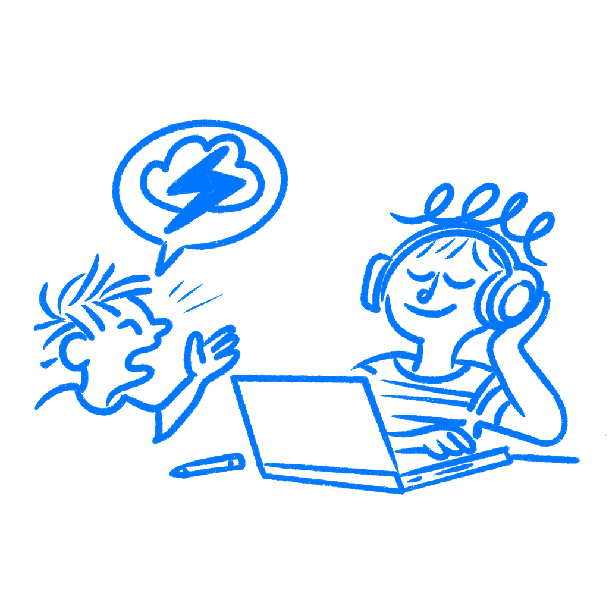

## 제10장 · 당신은 듣고 있지 않다

*확증 편향이 피드백이 도착하기 전에 걸러 내는 방식*

증거가 바로 눈앞에 있는데도, 원하던 답을 안고 자리를 뜰 수 있다. 그것이 확증 편향이다. 머릿속에 이미 이론이 자리 잡고 있었고, 그다음 리서치를 그 이론에 대한 지지를 가져다주어야 할 무언가로 취급했던 것이다.

### 지키고 싶은 이야기만 시험한다

1960년, [피터 와슨](https://psycnet.apa.org/record/1962-01434-001)은 사람들에게 2, 4, 6 수열을 보여주고 규칙을 알아내라고 했다. 대부분은 이미 마음속으로 세워 둔 추측과 맞는 예시만 시도했다. 규칙을 깰 수 있는 예시를 시도한 사람은 매우 적었다. 그들은 아이디어를 시험하고 있지 않았다. 지지를 찾고 있었다.

[레이먼드 니커슨](https://pages.ucsd.edu/~mckenzie/nickersonConfirmationBias.pdf)은 이 주제의 수십 년치 연구를 검토했고, 뼈아픈 부분에 도달했다. "일단 입장을 취하고 나면, 그 사람의 주된 목적은 그 입장을 방어하는 것으로 변한다." 그것이 여기서 작동하는 메커니즘이다. 피드백을 고르게 훑지 않는다. 들어맞는 쪽으로 몸이 기울고, 그렇지 않은 쪽은 얼른 지나친다.

그래서 메모로 가득한 회의에서도 불정직한 결론이 나올 수 있는 것이다. 편향은 무엇을 알아차리는지, 무엇을 믿을 만한 것으로 보는지, 무엇을 각색해서 넘기는지에 자리 잡는다.

또한 무엇을 힘을 실어 기록하는지에도 자리 잡는다. 디자이너들은 확증해 주는 인용문은 전문으로 옮겨 적고, 모순되는 인용문은 두세 단어로 요약해 버리곤 한다. "엣지 케이스." "헷갈린 사용자." "온보딩 필요." 이런 분류는 종합 결과가 슬라이드가 되기도 전에 이미 시작된다.

### 세그웨이는 경고를 계속 잘못 읽었다

[세그웨이](https://en.wikipedia.org/wiki/Segway)가 2001년에 출시되었을 때, 그것을 둘러싼 이야기는 거대했다. 도시의 이동 방식을 바꿔 놓을 존재였다. 사람들이 5,000달러라는 가격과, 보도 이용 규칙과, 대부분의 도시가 애초에 그것을 위해 지어지지 않았다는 사실에 반발했을 때, 돌아오는 대답은 대체로 비슷했다. 사람들이 아직 이해하지 못한다는 것이다.

바로 그래서 이 사례가 유용하다. 부정적인 신호는 계속 도착했고, 계속 잘못된 진단으로 번역되었다. "제품이 세상에 충분히 맞지 않는다"가 아니라, "세상이 아직 따라오지 못했다"에 가까운 진단으로. 출시 후 처음 5년 동안 팔린 것은 총 3만 대였다. 생산은 20년 동안 누적 10만 대 미만을 남긴 채 2020년에 끝났다.

이것이 제품의 형태로 나타난 확증 편향이다. 경고는 사라지지 않는다. 이미 갖고 있던 이야기를 지지할 때까지 다시 읽힐 뿐이다.

이런 행동은 더 작은 제품 작업에서도 늘 나타난다. 실패한 테스트는 메시징 문제가 된다. 낮은 전환율은 교육 문제가 된다. 약한 채택은 발견 용이성 문제가 된다. 때로는 그것이 사실이기도 하다. 때로는 "그 제품 자체가 통하지 않는다"보다 듣기 좋은 이야기일 뿐이다.

동사에 귀를 기울이면 그 차이가 들린다. 배우는 언어는 "거기서 무슨 일이 있었나", "왜 멈췄을까"처럼 들린다. 방어하는 언어는 "저들은 이해하지 못했다", "더 잘 설명해야 한다"처럼 들린다. 한쪽 질문들은 문제를 연다. 다른 한쪽은 제대로 들여다보기도 전에 문제를 닫아버린다.

### 좋은 의도가 이것을 고치지 못하는 이유

[캐럴 드웩](https://www.penguinrandomhouse.com/books/44330/mindset-by-carol-s-dweck-phd/)은 여기서 더 좁은 이유 때문에 유용하다. 테스팅을 "내가 옳았는가"에 대한 합격·불합격 판정으로 취급하면 편향은 더 강해진다. 테스팅을 무엇이 부러지는지 찾는 탐색으로 취급하면, 나쁜 신호를 더 예쁜 것으로 편집해 버리기 전에 볼 가능성이 커진다.

내가 관심을 두는 분기점은 그것이다. 여기서 문제는 정말로 자존심이 아니다. 절차다. 배우기 위해 세션을 운영하는가, 아니면 출시에 대한 안심을 얻기 위해 세션을 운영하는가?

나는 디자이너들이, 과제를 통과한 참가자 한 명을 인용하면서 통과하지 못한 세 명은 각색해서 넘기는 것을 지켜봐 왔다. 극적인 것도 없고 거짓말도 없다. 선택적인 진지함일 뿐이다.

### 테스트 전에 적어 둘 것

리서치가 시작되기 전에, 무엇이 나를 틀렸다고 증명할지 적어라. 그것이 핵심 동작이다. "마음을 열어 두라"가 아니다. 실패 조건을 종이에 옮겨라. 어떤 발견이 있으면 방향을 바꿀 것인가? 어떤 행동이 나오면 현재 접근이 약하다는 신호인가? 그것을 먼저 정의하지 않으면, 세션은 나중에 어떻게든 정렬할 수 있는 인상의 더미로 변해 버린다.

와슨의 문제를 풀었던 사람들은 실패할 수 있는 수열을 시도했다. 여기서도 그것이 올바른 직관이다. 디자인에 대한 지지만 모으지 마라. 디자인이 부러지는 지점을 찾아 나서라.

종합 단계에서도 같은 일을 하라. 현재 방향을 출시하면 안 된다고 주장하는 역할을 한 사람에게 맡겨라. 이미 그렇게 믿어서가 아니다. 모순되는 증거가 힘을 잃지 않고 형태를 유지하도록 애쓰는 사람을 방에 적어도 한 명은 두어야 하기 때문이다.

그리고 노트를 검토할 때는 놀라운 순간부터 먼저 표시하라. 현재 이야기에 가장 잘 들어맞는 인용문이 아니라. 방을 조용해지게 만든 순간들. 아무도 예상하지 못한 지점에서 멈춘 참가자. 피그마에서는 안전해 보였는데 실제 움직임 속에서는 지저분해진 단계. 그런 부분들이 아무도 지켜주지 않으면 가장 먼저 평평하게 눌리기 쉽다. 또한 그런 부분이 대체로 작업이 실제로 어디서 약한지 알려준다.

증거가 자기 생각에 동의할 때만 유효하다고 치면, 그것은 듣고 있는 것이 아니다.

### 참고 자료

- **Nickerson, R. S. (1998). Confirmation bias: A ubiquitous phenomenon in many guises.** Review of General Psychology, 2(2), 175–220. [https://pages.ucsd.edu/~mckenzie/nickersonConfirmationBias.pdf](https://pages.ucsd.edu/~mckenzie/nickersonConfirmationBias.pdf)
- **Wason, P. C. (1960). On the failure to eliminate hypotheses in a conceptual task.** Quarterly Journal of Experimental Psychology, 12(3), 129–140. [https://psycnet.apa.org/record/1962-01434-001](https://psycnet.apa.org/record/1962-01434-001)
- **Dweck, C. S. (2006). Mindset: The New Psychology of Success.** Random House. [https://www.penguinrandomhouse.com/books/44330/mindset-by-carol-s-dweck-phd/](https://www.penguinrandomhouse.com/books/44330/mindset-by-carol-s-dweck-phd/)
- **Wikipedia: Confirmation bias.** [https://en.wikipedia.org/wiki/Confirmation_bias](https://en.wikipedia.org/wiki/Confirmation_bias)
- **Nielsen Norman Group: Confirmation Bias in UX.** [https://www.nngroup.com/articles/confirmation-bias-ux/](https://www.nngroup.com/articles/confirmation-bias-ux/)
- **Simply Psychology: Confirmation Bias in Psychology.** [https://www.simplypsychology.org/confirmation-bias.html](https://www.simplypsychology.org/confirmation-bias.html)
- **Wikipedia: Segway.** [https://en.wikipedia.org/wiki/Segway](https://en.wikipedia.org/wiki/Segway)
