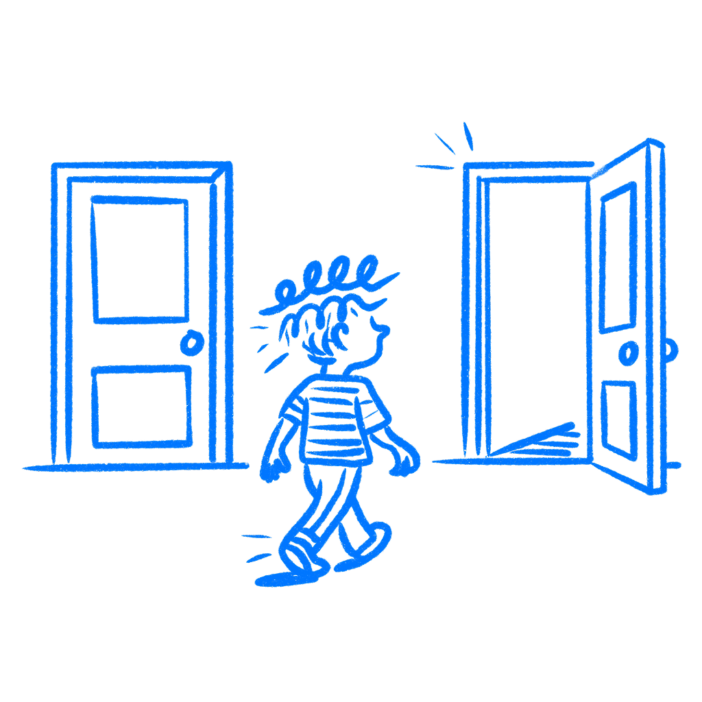

## 제12장 · 당신의 디자인은 조작되어 있다

*기본값과 프레이밍이 행동을 소리 없이 조정하는 방식*

중립적인 선택을 제시하고 있다고 생각할 수 있지만, 그렇지 않다. 어느 옵션이 체크된 상태로 시작할지, 가격표에서 어느 플랜이 강조될지, 어느 버튼이 왼쪽에 자리할지 결정하는 순간, 이미 표를 던진 것이다. 화면은 사람들이 무언가를 하기도 전에 그들을 한쪽으로 기울여 놓는다.

대부분의 디자이너는 이 사실에 이름을 붙이지 않는다. 기본값은 기술적 세부 사항이나 자리 채움 상태, 나중에 정리할 것으로 취급된다. 그러나 사용자는 아무것도 정리하지 않는다. 많은 경우, 이미 선택되어 있는 것을 클릭할 것이다.

### 기본값이 작동하는 이유

기본값은 그것을 받아들이는 사람에게 결정으로 읽히지 않는다. 기본값은 이렇게 말한다. 이것이 보통이고, 대부분의 사람이 이것을 한다. 아무 의도도 없었을 때조차 사용자는 그것을 추천으로 읽는다.

때로는 그저 이전 버전의 설정을 그대로 베껴 옮기고 넘어갔을 뿐이다.

[아모스 트버스키와 대니얼 카너먼](https://sites.stat.columbia.edu/gelman/surveys.course/TverskyKahneman1981.pdf)은 1981년, 지금도 디자이너들을 안절부절 못하게 하는 그 연구에서 이것을 보여주었다. 참가자들에게 동일한 시나리오를 두 가지 방식으로 프레이밍해서 주었다. "200명이 구조될 것이다"와 "400명이 죽을 것이다"는 같은 결과를 서술한다. 사람들은 선택지가 페이지에 놓인 방식에 따라 다르게 골랐다. 틀이 결정을 바꿨다. 사실은 바뀌지 않았다. 기본값 역시 하나의 틀로 작동한다. 정상 상태가 어떻게 보이는지, 기준선이 무엇인지, 다른 것을 선택한다는 것이 무엇을 의미하는지 사람들에게 알려 주는 것이다.

2003년, [에릭 존슨과 대니얼 골드스타인](https://www.dangoldstein.com/papers/DefaultsScience.pdf)은 사이언스에 유럽 여러 나라의 장기 기증률을 비교한 짧은 논문을 실었다. 시민이 기증자가 되려면 스스로 동의해야 하는 나라들의 기증률은 4에서 28퍼센트 사이였다. 기증이 기본값이고 거부하려면 능동적인 등록이 필요한 나라들의 기증률은 86퍼센트에서 거의 100퍼센트까지였다. 인구 구성은 비슷했다. 기증에 대한 일반적인 태도도 비슷했다. 존슨과 골드스타인은 그 설명을 수고에서 찾았다. 결정하는 데는 수고가 들지만, 기본값을 받아들이는 데는 들지 않는다는 것이다. 기본값은 사람들이 무엇을 중시하는지 드러내기보다, 어느 방향이 행동을 요구하는지를 보여주었을 뿐이다.

이 행동 뒤에는 세 가지 힘이 자리 잡고 있다. 사람들은 기본값을 그것을 설정한 사람의 조용한 추천으로 읽는다. 사전 설정을 바꾸는 데는 수고가 들고, 대부분의 사람은 확신이 없는 일에 그 수고를 쓰지 않는다. 손실 회피 때문에, 선택지들이 같더라도 현재 상태가 대안보다 더 안전하게 느껴진다. 그래서 시작 상태는 그 주변에 놓인 문구보다 훨씬 크게 행동을 형성한다.

### 이것은 작은 선택에서도 일어난다

1990년대, [마이크로소프트](https://en.wikipedia.org/wiki/Microsoft)는 전 세계의 모든 윈도우 컴퓨터에 [인터넷 익스플로러](https://en.wikipedia.org/wiki/Internet_Explorer)를 실어 출하했다. 2003년까지 익스플로러는 브라우저 시장 점유율 95퍼센트를 차지했다. 가장 좋은 브라우저여서도 아니고, 사용자들이 선택지를 비교하고 신중하게 골라서도 아니다. 대체로, 거기에 있었기 때문이다.

그것을 바꾼다는 것은 대안이 존재한다는 것을 알고, 그 대안을 찾아내고, 내려받고, 새로운 결정을 내린다는 것을 의미했다. 거의 아무도 그렇게 하지 않았다. [파이어폭스](https://en.wikipedia.org/wiki/Firefox)가 2004년에 출시되고 [크롬](https://en.wikipedia.org/wiki/Google_Chrome)이 2008년에 뒤를 이었을 때, 둘 다 마이크로소프트가 몇 해 전에 설정해 둔 시작 옵션에서 사용자를 끌어내려면 본격적인 캠페인이 필요했다. 브라우저 설정에서 시작한 것이 시장 우위로 변해 있었던 것이다.

이 효과를 얻는 데 윈도우 같은 것은 필요 없다. 체크된 상자와 함께 시작할 때마다 얻는다. 어느 가격 플랜에 "추천" 표시를 붙일 때마다. 한 경로가 다른 경로보다 자연스러워 보이도록 폼 필드를 배열할 때마다.

나는 디자이너들이, 분명 그렇지 않은데도 이것을 무해하다고 대충 넘기는 것을 봐 왔다. 피해는 한 번에 한 탭씩 일어나기 때문에 작아 보이는 경우가 많다.

### 선택은 클릭 전에 이미 형성되어 있었다

디자이너들은 정신적 수고를 화면에 정보가 너무 많은 문제로 생각하는 경향이 있다. 그런데 기본값도 더 조용한 방식으로 같은 문제를 만든다. 사용자가 실제 선택 앞에 설 때마다, 읽고 비교하고 결정하는 수고를 쓴다. 사전 설정은 그 비용을 없앤다. "여기 답이 있다, 동의하지 않을 때만 행동하라"고 말하는 셈이다.

일상적이고 결과가 작은 선택이라면 그것은 튼튼한 디자인이다. 사람들이 신경 쓰지 않는 작은 결정에서 사람들을 구해 준다.

내 이익과 사용자의 이익이 서로 다른 방향으로 당겨지는 선택에서는, 그것이 다른 것이 된다.

체크된 상태로 시작하는 마케팅 수신 동의. 가장 비싼 플랜으로 설정된 구독 등급. 최대 데이터 공유 상태로 열리는 프라이버시 설정. "모두 수락"은 한 번의 탭이면 되고 "환경설정 관리"는 미로를 여는 쿠키 동의 흐름.

이런 것들은 만들 때 큰 디자인 결정으로 읽히지 않는다. 시작 설정처럼 보일 수 있다. 그러나 모든 경우가, 자신이 조정당하고 있다는 것을 알아차리지 못할 실제 사람에게 실제 결과를 남긴다.

[리처드 세일러와 캐스 선스타인](https://yalebooks.yale.edu/book/9780143115267/nudge/)은 2008년 저서 『넛지』에서 이를 분명히 말했다. 모든 선택 환경에는 구조가 있고, 설계자는 그 구조를 짓지 않을 수 없다. 중립적인 배치란 존재하지 않는다. 유일한 질문은 눈을 뜨고 그 구조를 만드는가, 감은 채 만드는가이다.

### 시작 상태를 확인하라

화면을 출시하기 전에, 그 위에서 열리는 모든 기본값의 이름을 붙여라. 체크된 상자, 미리 채워진 필드, 강조된 가격 등급, 기본 버튼, 드롭다운의 항목 순서, 페이지가 열리는 상태. 각각에 대해 물어라. 사용자가 아무것도 만지지 않고 그냥 계속 버튼을 누르면 어디에 도착하는가? 그런 다음 다시 물어라. 그 결과는 사용자에게 이득인가, 아니면 주로 나에게 이득인가?

기본값은 대부분의 사용자가 원하는 것을 반영할 때, 사람들이 다른 곳에서 이미 내린 선택을 대신해 줄 때, 사용자가 원하는 경로의 마찰을 줄여 줄 때 좋은 디자인이다. 폼에 국가를 묻는데 사용자 대부분이 독일에 있다면, 독일로 기본값을 정하는 것은 서비스다. 사람들이 처음부터 원하지 않았던 수고를 덜어줄 때, 나는 기본값이 좋다고 본다.

환경설정 화면이 전체 데이터 공유를 켠 상태로 열리고 조절 장치를 세 화면 깊숙이 묻는다면, 그것은 좋은 디자인이 아니다. 도시 필드를 미리 채워 두는 것과 마케팅 상자를 미리 체크해 두는 것의 차이이다.

모든 사전 설정은 한 표다. 그 화면을 만들 때 표를 던진 것이다. 사용자는 그것을 받아들이거나, 뒤집으려고 수고를 쓴다. 그리고 대부분의 사람은 피곤하거나, 주의가 분산되어 있거나, 서두를 때 받아들인다.

모든 디자인 리뷰에서 올바른 질문은 "이것을 명확하게 만들었는가?"만이 아니다. "아무도 주의를 기울이지 않을 때, 이 기본 시작 상태는 누구에게 이득인가?"를 물어라. 당신의 사용자 상당수는 주의를 기울이고 있지 않을 것이다.

### 참고 자료

- **Tversky, A., & Kahneman, D. (1981). The framing of decisions and the psychology of choice.** Science, 211(4481), 453–458. [https://sites.stat.columbia.edu/gelman/surveys.course/TverskyKahneman1981.pdf](https://sites.stat.columbia.edu/gelman/surveys.course/TverskyKahneman1981.pdf)
- **Johnson, E. J., & Goldstein, D. (2003). Do defaults save lives?** Science, 302(5649), 1338–1339. [https://www.dangoldstein.com/papers/DefaultsScience.pdf](https://www.dangoldstein.com/papers/DefaultsScience.pdf)
- **Thaler, R. H., & Sunstein, C. R. (2008). Nudge: Improving Decisions About Health, Wealth, and Happiness.** Yale University Press. [https://yalebooks.yale.edu/book/9780143115267/nudge/](https://yalebooks.yale.edu/book/9780143115267/nudge/)
- **Wikipedia: Default effect (psychology).** [https://en.wikipedia.org/wiki/Default_effect_(psychology)](https://en.wikipedia.org/wiki/Default_effect_%28psychology%29)
- **Wikipedia: Choice architecture.** [https://en.wikipedia.org/wiki/Choice_architecture](https://en.wikipedia.org/wiki/Choice_architecture)
- **Nielsen Norman Group: Choice Architecture and Defaults.** [https://www.nngroup.com/articles/choice-architecture/](https://www.nngroup.com/articles/choice-architecture/)
- **The Decision Lab: Default Effect.** [https://thedecisionlab.com/biases/default-effect](https://thedecisionlab.com/biases/default-effect)
