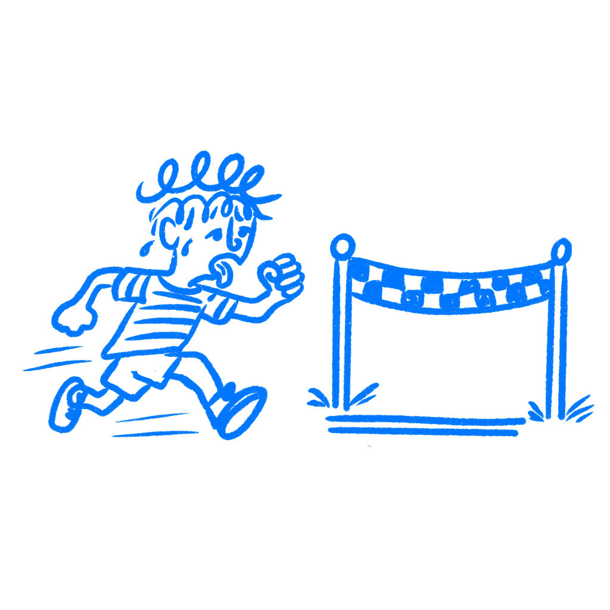

## 제19장 · 가짜 진행도는 진짜 동기다

*진행 상황을 보여주면 사람들이 끝까지 더 밀어붙이는 이유*

대부분의 디자이너는 진행 바를 정보로 취급한다. 느린 로딩 동안 사용자를 차분하게 해 주거나, 회원가입 중간에 이 모든 과정이 결국 끝난다는 사실을 안심시켜 주는 용도다. 사용자가 자신이 어디쯤 있는지 모르겠다고 불평했기 때문에, 있을 때가 없을 때보다 디자인이 더 투명해 보였기 때문에, 아니면 단지 예의 바른 것 같았기 때문에 추가되곤 한다. 하지만 그건 진행 바가 하는 일의 일부일 뿐이다.

사람들은 자신이 목표를 향해 움직이고 있다는 것을 보면 속도를 높이고, 더 세게 밀어붙이며, 멈추려는 마음이 줄어든다. 진행 표시기는 어떤 사람이 어디에 있는지 보여주는 것 이상의 역할을 한다. 사용자가 다음에 무엇을 할지 바꿀 수 있다. 나는 디자이너들이 이것을 분명히 중립적이지 않은데도 중립적인 UI 디테일로 취급하는 모습을 봐왔다. 컴포넌트의 겉모습은 정보지만, 작용은 동기부여다.

### 게이지는 사람의 행동을 바꾼다

1932년에 행동주의자 [클라크 헐](https://doi.org/10.1037/h0072640)은 자신이 목표 구배 가설이라 부른 개념을 제안했다. 동물은 보상에 가까워질수록 더 많은 노력을 쏟는다는 것이다. 그는 일직선 활주로에서 쥐가 걸리는 시간을 재면서 이 가설을 검증했다. 쥐는 먹이에 가까워질수록 더 빨리 달렸다. 헐은 이것을 목표 지향 행동의 기본 특성으로 봤다. 목표에 가까울수록 유기체는 더 가속한다는 것이다.

이 가설은 수십 년 동안 동물 행동 문헌 속에 조용히 있었다. 그러다 2006년에 연구자 [조지프 누네스와 자비에 드레즈](http://msbfile03.usc.edu/digitalmeasures/jnunes/intellcont/Endowed%20Progress%20Effect-1.pdf)가 세차장에서 현장 실험을 진행했다. 그들은 고객 300명에게 적립 카드를 나눠 주었다. 한 버전은 무료 세차를 받으려면 도장 여덟 개가 필요했다. 다른 버전은 열 칸으로 되어 있었지만 두 칸은 이미 찍혀 있었다. 두 집단 모두 여전히 여덟 번의 세차가 필요했다. 유일한 차이는 그 일이 어떻게 느껴지는가였다. 한 집단은 이미 시작한 것처럼 보였고 다른 집단은 그렇지 않았다. 미리 도장이 찍힌 카드의 완주율은 34퍼센트였고 빈 카드는 19퍼센트였다. 미리 도장을 받은 고객들은 보상에 가까워질수록 더 빨리 다시 찾아오기도 했다. 해야 할 일은 같았고 거리도 같았지만 결과는 같지 않았다. 누네스와 드레즈는 이것을 부여된 진행 효과라고 불렀다. 사람에게 가짜라도 출발 우위를 주면 끝내기 위해 더 열심히 노력한다는 것이다.

두 사례 모두에서 같은 패턴이 나타난다. 이미 과제 안에 들어와 있다고 느끼는 순간 끝내는 일이 더 중요해진다. 아직 시작하지 않은 일은 던져버리기 쉽다. 이미 진행 중이라고 느껴지는 일은 포기하기 어렵다. 결승선이 가까워질수록 이 압력은 강해진다. 노력은 목표 구간 전체에서 일정하지 않고 끝에 가까울수록 높아진다. 그래서 반쯤 찬 바 하나가, 사용자가 아직 한 일이 많지 않아도 과제의 분위기를 바꾸는 것이다.

[닐슨 노만 그룹](https://www.nngroup.com/articles/progress-indicators/)은 실제 대기 시간이 같아도 진행 표시기가 있으면 사용자가 더 오래 기다리고 기분도 덜 나쁘다는 사실을 발견했다. 바는 노동 자체를 바꾸지 않는다. 사용자가 그 노동을 어떻게 느끼는지를 바꾼다.

### 링크드인은 과제를 진행 중으로 느끼게 했다

링크드인은 플랫폼이 성장하던 초기에 프로필 완성도 게이지를 만들었다. 회원은 초급에서 중급과 고급을 거쳐 전문가로, 그리고 정점에는 올스타로 나아갔다. 각 단계는 무엇을 갖췄고 무엇이 빠졌는지 보여 주었다. 링크드인은 프로필을 완성한 사용자가 플랫폼을 통해 기회를 받을 가능성이 40배 높다는 사실을 문서로 남겼다.

하지만 완성도 게이지는 단순히 유용한 정보가 아니었다. 사용자가 가입하는 순간부터 낚싯바늘을 걸었다. 아무도 0에서 시작하지 않았다. 게이지는 어느 정도 찬 상태로 나타났고 제안 항목에는 이미 표시가 붙어 있었다. 이미 시작한 상태였다. 프로필은 이미 미완인 상태였다. 나는 이 점이 대부분의 디자이너가 인정하는 것보다 중요하다고 생각한다. 링크드인은 완성된 프로필의 장점을 설명하는 설득력 있는 문구가 필요하지 않았다. 사용자가 도착할 때의 마음 상태 자체를 바꿨다. 게이지가 이미 그들을 과제 안에 들여놓은 것이다. 사용자는 진행 상황을 보기만 한 것이 아니라, 끝내지 않은 채 남아 있는 무언가가 있다는 느낌을 받았다.

### 대부분의 팀은 너무 차갑게 시작한다

진행 표시기를 만드는 대부분의 디자이너는 사용자 불안을 생각한다. 사용자가 길을 잡았다고 느꼈기 때문에, 회의에서 누군가 완주율에 도움이 될 것이라고 말했기 때문에, 아니면 같은 카테고리의 다른 앱에 전부 있기 때문에 이 컴포넌트를 추가한다. 피드백은 생각하지만 동기는 생각하지 않는다. 나는 디자이너들이 시작 상태가 사람들에게 어떤 기분을 주는지 한 번도 묻지 않은 채 색상과 라벨을 30분 동안 논하는 모습을 봤다.

그래서 바는 비어 있는 상태로 시작한다. 0퍼센트. 백지. 사용자는 이미 진행 중인 일이 아니라 앞에 놓인 일을 본다. 그 화면은 위치 감각은 주지만 추진력은 만들지 않는다. 그리고 디자이너들은 흐름 자체가 짧은데도 사람들이 왜 일찍 이탈하는지 의아해한다.

나는 제품 작업에서 저 정확한 행보를 한 번이 아니게 봤다. 디자이너는 사용자에게 명확함을 주었다고 생각한다. 실제로 준 것은 아직 앞에 남아 있는 노력의 양을 깔끔하게 보여주는 그림이었다.

[란 키베츠, 올렉 우르민스키, 위황 정](https://faculty.chicagobooth.edu/oleg.urminsky/research/KivetzUrminskZheng2006.pdf)은 인간 충성 프로그램에 관한 일련의 연구에서 헐과 누네스의 발견을 재현하고 확장했다. 맥락을 바꿔도 중심 발견은 유지된다. 노력은 절대 거리가 아니라 남은 비율 거리의 함수로 가속한다. 실제 남은 작업이 같아도, 가깝다고 느끼는 사용자가 아직 시작점에 있다고 느끼는 사용자보다 더 세게 밀어붙인다.

### 시작 상태를 점검하라

어떤 진행 메커니즘이든 출시하기 전에 점검 하나를 실행하라. 디자인에서 시작 상태를 제거하고 남는 것을 살펴보라. 게이지가 0에서 시작하고 미리 완료된 단계도 없고 사용자가 이미 한 일에 대한 인정도 없다면, 진짜 진행 메커니즘이 있는 것이 아니다. 카운트다운이 있는 것이다. 카운트다운은 불안을 줄일 수 있지만 노력을 늘리는 데는 별 도움이 되지 않는다.

질문은 게이지가 사용자의 현재 위치를 보여주는가에만 있지 않다. 그것은 어떤 게이지든 할 수 있다. 더 유용한 질문은 게이지가 사용자를 끝내고 싶어지는 무언가 안에 들여놓는가다. 나는 디자이너들이 이것을 놓치는 이유가 컴포넌트가 해롭지 않아 보이는 탓이라고 생각한다.

이 둘은 서로 다른 디자인 문제다. 첫 번째는 가시성에 관한 것이고 두 번째는 동기에 관한 것이다. 둘은 동시에 해결할 수 있다. 게이지를 무언가 이미 찬 상태로 시작하라. 이전 행동을 완료된 단계로 인정하라. 링크를 클릭했다, 이메일을 확인했다, 페이지에 도착했다 하는 것들이다. 진입 시점의 상태를 시작 전이 아니라 미완으로 만들어라.

다섯 단계 중 첫 번째 단계에서 양식을 열었는데 화면에 이미 움직임이 보이는 사용자는, 빈 체크리스트를 마주한 사용자와 다른 상태에 있다. 전자는 중간쯤 와 있다고 느끼고 후자는 여전히 시작점에 있다고 느낀다. 나는 이 둘을 같은 디자인 문제로 취급하지 않겠다.

0에서 시작하는 진행 추적기는 대부분 그냥 계수기다. 동기부여 효과는 사용자가 이미 가는 길 위에 있다고 느낄 때 작동하기 시작한다.

### 참고 자료

- **Nunes, J. C., & Drèze, X. (2006). The endowed progress effect: How artificial advancement increases effort.** Journal of Consumer Research, 32(4), 504–512. [http://msbfile03.usc.edu/digitalmeasures/jnunes/intellcont/Endowed%20Progress%20Effect-1.pdf](http://msbfile03.usc.edu/digitalmeasures/jnunes/intellcont/Endowed%20Progress%20Effect-1.pdf)
- **Hull, C. L. (1932). The goal-gradient hypothesis and maze learning.** Psychological Review, 39(1), 25–43. [https://doi.org/10.1037/h0072640](https://doi.org/10.1037/h0072640)
- **Kivetz, R., Urminsky, O., & Zheng, Y. (2006). The goal-gradient hypothesis resurrected: Purchase acceleration, illusionary goal progress, and customer retention.** Journal of Marketing Research, 43(1), 39–58. [https://faculty.chicagobooth.edu/oleg.urminsky/research/KivetzUrminskZheng2006.pdf](https://faculty.chicagobooth.edu/oleg.urminsky/research/KivetzUrminskZheng2006.pdf)
- **Wikipedia: Goal-gradient hypothesis.** [https://en.wikipedia.org/wiki/Goal-gradient_hypothesis](https://en.wikipedia.org/wiki/Goal-gradient_hypothesis)
- **Nielsen Norman Group: Progress Indicators Make a Slow System Less Insufferable.** [https://www.nngroup.com/articles/progress-indicators/](https://www.nngroup.com/articles/progress-indicators/)
- **UX Collective: The Psychology of Progress Bars.** [https://uxdesign.cc/the-psychology-of-progress-bars-f4b2e6c19b10](https://uxdesign.cc/the-psychology-of-progress-bars-f4b2e6c19b10)
