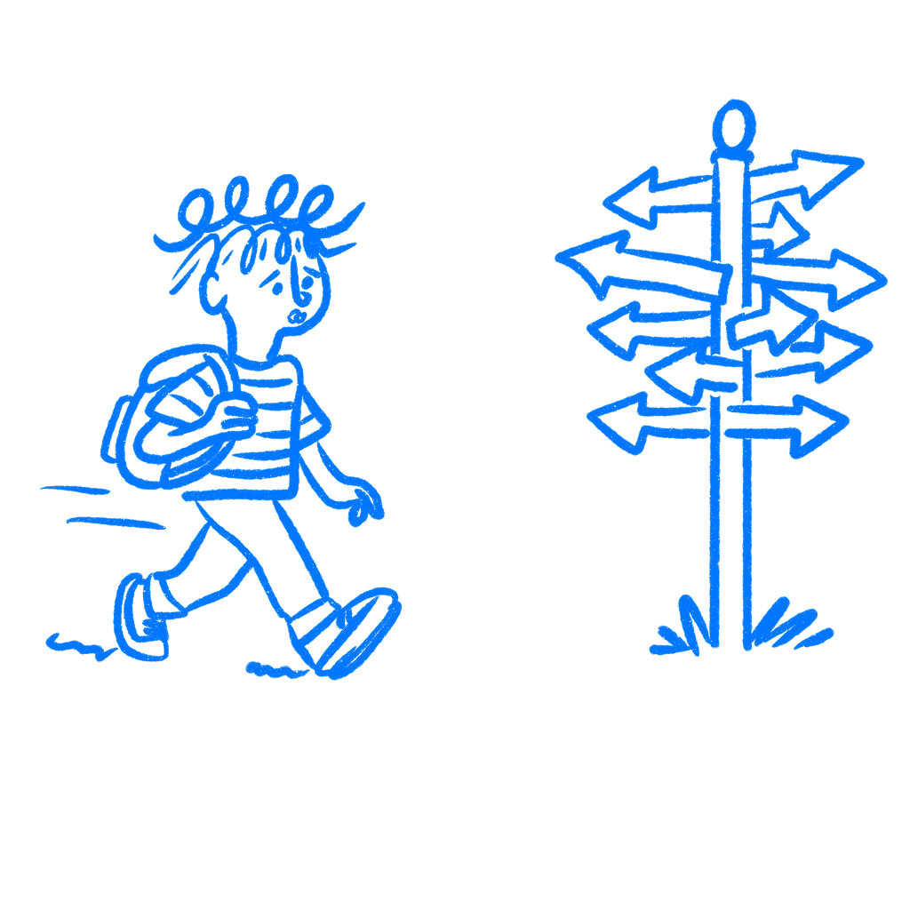

## 제21장 · 사용자는 작업 단위로 생각하지 않는다

*사용자가 작업이 아니라 결과를 생각하는 이유*

당신은 흐름을 설계해 왔다. 작업 흐름, 사용자 흐름, 온보딩 흐름. 모든 단계를 매핑하고, 모든 화면에 라벨을 붙이고, 모든 완주율을 측정했다. 단계와 화면, 이탈 지점을 충분히 오래 들여다보면 단계가 디자인의 진짜 단위라고 생각하기 아주 쉬워진다. 보통은 그렇지 않다.

사용자는 작업 완료가 중요해서 제품을 열지 않는다. 자기 삶에서 뭔가 바뀌어야 하기 때문에 연다. 돈에 대한 불안을 덜고 싶어 하고, 사랑하는 사람들과 연결되어 있고 싶어 하고, 어떤 일을 끝내서 더는 생각하지 않아도 되기를 원한다. 때로는 그냥 송장을 보내고, 요금을 납부하고, 여행을 예약하고, 일상으로 돌아가고 싶을 뿐이다. 당신의 흐름은 그 더 큰 목표의 작은 일부만 돕는다. 작업은 수단일 뿐이다. 사용자가 신경 쓰는 것은 일이 끝났을 때 자기 삶에서 무엇이 바뀌는가다.

### 목표가 작업보다 중요하다

2002년에 [에드윈 로크와 게리 래덤](https://www-2.rotman.utoronto.ca/facbios/file/09%20-%20Locke%20%26%20Latham%202002%20AP.pdf)은 목표가 행동을 어떻게 이끄는지에 관한 35년치 연구를 종합해 발표했다. 결론은 명확했다. 의식적 목표는 대부분의 인간 행동에 대한 즉각적인 동기 원인이다. 사람에게 명확하고 구체적인 목표가 있으면 행동은 그 목표에 닿는 것을 중심으로 조직된다. 목표가 없으면 행동은 표류한다.

[리처드 라이언과 에드워드 데시](https://selfdeterminationtheory.org/SDT/documents/2000_RyanDeci_SDT.pdf)의 자기결정성 이론은 더 깊은 층을 더해 준다. 사람은 단순히 목표 지향적이지 않다. 세 가지 근본적인 심리적 욕구를 중심으로 조직되어 있다. 자율성(내가 내 행동을 통제하고 있다), 유능성(나는 중요한 무언가에서 점점 나아지고 있다), 관계성(나는 다른 사람들과 연결되어 있다)이 그것이다. 이것은 화면 수준의 욕구가 아니다. 드롭다운 메뉴를 완성하는 것 자체를 의미 있는 진전으로 경험하는 사람은 없다. 이 욕구들은 작업 수준 위에 자리한다.

디자인은 기본적으로 작업 수준에 머문다. 작업 분석은 사용자 행동을 분리되고 관찰 가능한 행위로 쪼갠다. 그것은 유용하다. 완료를 더 큰 무언가를 향한 한 단계가 아니라 성공으로 취급하기 시작할 때 함정이 된다.

### 밀크셰이크 연구가 이것을 보여주었다

1990년대에 [클레이턴 크리스텐슨의 연구팀](https://en.wikipedia.org/wiki/Jobs_to_be_done_theory)은 패스트푸드 체인이 밀크셰이크를 더 많이 팔도록 돕는 의뢰를 받았다. 표준적인 접근이었다면 고객에게 밀크셰이크에 무엇을 원하는지 물었을 것이다. 맛, 농도, 가격 말이다. 팀은 다른 일을 했다. 하루 동안 식당에 앉아 밀크셰이크가 언제, 누구에게 팔리는지 관찰했다.

그들이 발견한 것은 밀크셰이크 자체를 넘어섰다. 팔린 밀크셰이크의 거의 절반이 오전 9시 전에 건물을 나갔고, 혼자 운전하는 사람들이 산 것이었다. 연구자들은 후속 조사를 진행했다. 이 사람들은 밀크셰이크를 어떤 일을 시키려고 고용한 것일까? 답은 통근이었다. 긴 드라이브, 한쪽에 남는 손, 점심까지 버틸 만큼 배를 채워 주면서 시간을 채워 줄 무언가였다. 밀크셰이크는 천천히 줄었고, 컵홀더에 얹혀 있었으며, 주의를 거의 요구하지 않았다. 사람들은 음료를 사는 것이 아니었다. 아침의 문제를 해결하고 있었다.

팀은 음료에 관해 묻고 있었다. 사용자는 통근 문제를 풀려 하고 있었다.

### 완주는 가치와 같지 않다

사용자가 모든 단계를 완료하고도 떠나는 제품을 만들 수 있다. 메커니즘은 작동하지만 목표는 충족되지 않는다. 사용자가 떠나는 것은 온보딩이 망가져서가 아니라, 그들이 원하던 삶의 변화가 도착하지 않았기 때문이다.

이 간극은 운동 기록은 매끄러운데 사람들이 운동을 그만두는 피트니스 앱에서 나타난다. 거래 분류는 빠른데 사용자가 여전히 재정을 통제하지 못한다고 느끼는 예산 관리 도구에서도 나타난다. 모든 티켓에 담당자를 지정하고 모든 마감일을 설정할 수 있는데 사람들이 여전히 정리되지 않았다고 느끼는 프로젝트 관리 소프트웨어에서도 보인다. 제품은 작업 수준에서 작동한다. 사람들이 찾아온 결과는 여전히 나타나지 않는다.

[닐슨 노만 그룹](https://www.nngroup.com/articles/task-analysis/)의 작업 분석 프레임워크는 이 구별을 명시한다. 작업은 시작점과 끝점이 있는 관찰 가능한 활동이며, 목표와 다르다. 양식을 채우는 것은 작업이다. 대출 승인을 받는 것은 목표다. 목표가 사용자가 제품에게 맡긴 일이다. 양식은 수단일 뿐이다.

### 목표에서 시작하라

흐름 매핑을 멈추지는 마라. 흐름은 유용하다. 다만 첫 번째 상자를 그리기 전에 목표의 이름을 먼저 붙여라.

사용자의 작업 목표가 아니다. '결제 완료'나 '계정 생성'도 아니다. 그들의 삶의 목표다. 당신의 제품이 작동하면 그들의 삶은 무엇이 달라지는가? 그들이 바꾸거나, 피하거나, 이루려 하는 구체적인 것은 무엇인가? 한 문장으로 적고 구체적으로 만들어라. 그리고 당신의 흐름을 보며 직설적인 질문 하나를 던져라. 모든 단계가 사용자를 그 문장에 가까워지게 하는가, 아니면 대부분 제품의 필요에 복무하는가?

중요한 디자인 결정을 내릴 때마다 이 점검을 실행하라. 각 기능이 흐름이 아니라 목표에 복무하는지 물어라. 그다음, 90퍼센트의 완주율이 사용자가 정말로 원했던 것을 받았다는 뜻인지 물어라. 이 질문은 해야 할 만큼 자주 던져지지 않는다.

작업 수준에 머무는 디자이너는 작동하는데도 실패하는 제품을 만들 수 있다. 기능은 다 있다. 흐름은 완성된다. 그래도 사용자는 떠나고, 모든 지표가 멀쩡해 보였기 때문에 회고 자리에서 아무도 이유를 설명하지 못한다.

당신이 지금까지 설계한 모든 흐름은 당신이 이해했거나 추측했던 목표 위에 세워졌다. 일이 실패했을 때는 그 추측이 약점이었을 가능성이 크다. 특별한 일이 아니다. 흔한 일이다.

### 참고 자료

- **Locke, E. A., & Latham, G. P. (2002). Building a practically useful theory of goal setting and task motivation: A 35-year odyssey.** American Psychologist, 57(9), 705–717. [https://www-2.rotman.utoronto.ca/facbios/file/09%20-%20Locke%20%26%20Latham%202002%20AP.pdf](https://www-2.rotman.utoronto.ca/facbios/file/09%20-%20Locke%20%26%20Latham%202002%20AP.pdf)
- **Ryan, R. M., & Deci, E. L. (2000). Self-determination theory and the facilitation of intrinsic motivation, social development, and well-being.** American Psychologist, 55(1), 68–78. [https://selfdeterminationtheory.org/SDT/documents/2000_RyanDeci_SDT.pdf](https://selfdeterminationtheory.org/SDT/documents/2000_RyanDeci_SDT.pdf)
- **Christensen, C. M., Hall, T., Dillon, K., & Duncan, D. S. (2016). Competing Against Luck: The Story of Innovation and Customer Choice.** HarperBusiness. [https://www.harpercollins.com/products/competing-against-luck-clayton-m-christensendavid-s-duncankareen-dillontaddy-hall](https://www.harpercollins.com/products/competing-against-luck-clayton-m-christensendavid-s-duncankareen-dillontaddy-hall)
- **Wikipedia: Goal theory.** [https://en.wikipedia.org/wiki/Goal_theory](https://en.wikipedia.org/wiki/Goal_theory)
- **Wikipedia: Jobs to be done theory.** [https://en.wikipedia.org/wiki/Jobs_to_be_done_theory](https://en.wikipedia.org/wiki/Jobs_to_be_done_theory)
- **Nielsen Norman Group: Task Analysis.** [https://www.nngroup.com/articles/task-analysis/](https://www.nngroup.com/articles/task-analysis/)
- **Interaction Design Foundation: Jobs-to-be-Done Framework.** [https://www.interaction-design.org/literature/topics/jobs-to-be-done](https://www.interaction-design.org/literature/topics/jobs-to-be-done)
