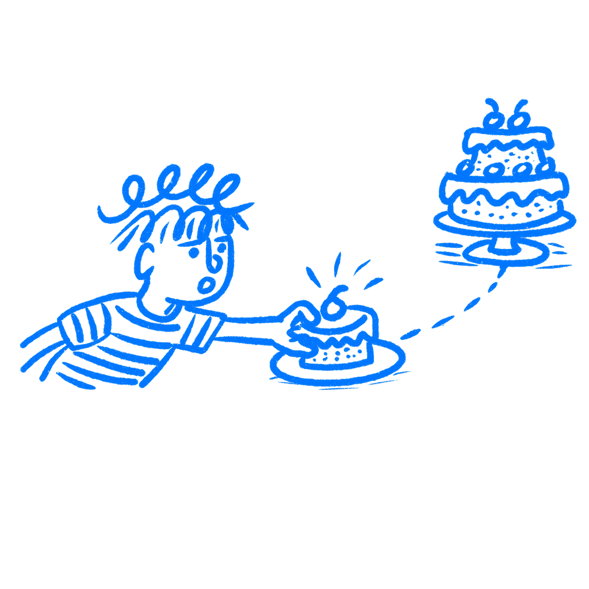

## 제22장 · 사용자는 나중이 아니라 지금을 원한다

*사용자가 보상을 늘 지금 원하고 나중에 원하지 않는 이유*

또 보상을 끝에 배치했다. 설정 뒤에, 투어 뒤에, '마지막으로 한 가지만요' 화면 뒤에 자리한다. 디자이너들은 가치가 올 것이니 사용자가 끝까지 갈 것이라고 스스로에게 말한다. 그러고는 그러지 않는다. 상당히 자주 문제는 타이밍이다. 당신은 아직 느껴 보지 못한 보상을 위해 지금 비용을 치르라고 사람들에게 요구하고 있는 것이다.

### 현재에 더 무게가 실린다

1997년에 [데이비드 레이브슨](https://thedecisionlab.com/biases/hyperbolic-discounting)은 쌍곡할인을 충분히 평이한 말로 기술했다. 보상은 현재에서 멀어질수록 힘을 잃고, 사람들이 생각하는 것보다 지금 가까운 곳에서 더 빨리 힘을 잃는다. [테드 오도노그](https://eml.berkeley.edu/~rabin/doitnow.pdf)와 [매튜 래빈](https://eml.berkeley.edu/~rabin/doitnow.pdf)은 나중에 이것을 현재 편향 선호라고 불렀다. 이름보다 패턴이 중요하다. 사람은 미리에는 진심으로 그렇다고 마음먹었는데도, 노력이 눈앞에 놓이면 다른 선택을 한다.

그것이 디자이너가 계속 틀리는 부분이다. 가입하고 설정을 마무리하겠다고 계획한 그 사용자는 위선을 부린 것이 아니었다. 양식과 대기와 결정이 실제가 되는 순간 계산이 바뀐 것이다. [카너먼과 트버스키](https://web.mit.edu/curhan/www/docs/Articles/15341_Readings/Behavioral_Decision_Theory/Kahneman_Tversky_1979_Prospect_theory.pdf)도 여기서 유용한 관점을 더해 준다. 눈앞의 마찰은 아직 느껴 보지 못한 이득보다 무겁게 느껴진다. 성가신 일은 지금 일어나고 있고 가치는 아직 이론적인 상태다.

그래서 많은 온보딩 흐름이 기획 덱에서는 괜찮아 보이다가 실사용에서 죽는다. 덱에서 비용은 작은 상자들로 쪼개져 있다. 이름, 비밀번호, 환경설정, 권한, 결제 정보다. 폰에서는 제품이 아직 아무것도 얻지 못한 시점에 하나의 긴 요구로 다가온다. 디자이너는 단계 수를 세고, 사용자는 질질 끌리는 느낌을 받는다.

이것이 사람이 절대 가치를 기다리지 않는다는 뜻은 아니다. 사람은 온갖 것을 기다린다. 하지만 보상이 여전히 추상적이고 마찰이 이미 현실이라면, 상당수는 손을 뗀다.

### 스포티파이는 그 느낌을 앞으로 옮겼다

[스포티파이](https://en.wikipedia.org/wiki/Spotify)가 2008년에 무료 플랜과 함께 출시했을 때 핵심 움직임은 가격만이 아니었다. 순서였다. 사람들이 먼저 써볼 수 있었다. 회사가 더 어려운 결정을 요구하기 전에, 통근 중에, 직장에서, 집에서 제품을 느껴볼 수 있었다.

2014년까지 [다니엘 에크](https://en.wikipedia.org/wiki/Daniel_Ek)는 "구독자의 80퍼센트 이상이 무료 사용자로 시작했다"고 말했다. 2023년 1분기까지 스포티파이는 월간 활성 사용자 5억 1500만 명 중 2억 1000만 명의 유료 구독자를 두었고, 연례 보고서는 무료 플랜을 '유료 구독으로 가는 깔때기'라고 불렀다. 순서가 중요했다. 제품은 비용을 치르라고 요구하기 전에 사람들이 이득을 느끼게 했다.

[애플 뮤직](https://en.wikipedia.org/wiki/Apple_Music)은 반대 방향으로 갔다. 무료 체험은 있었지만 신용카드를 먼저 등록해야 했다. 같은 음악 문제에 다른 약속 순서였다. 무료가 늘 이기는 것은 아니지만, 지금 느끼는 가치와 나중에 요구하는 약속은 지금 약속하고 나중에 가치를 주는 것과 전혀 다른 명제다.

이 순서는 결정의 분위기 전체를 바꾼다. 한쪽은 써보고 판단하라고 말한다. 다른 쪽은 약속하고 우리를 믿으라고 말한다. 같은 요구가 아니다. 제품은 같은 카탈로그, 같은 약속, 심지어 같은 최종 가격을 갖고도, 증거를 주기 전에 믿음을 먼저 요구했다는 이유로 훨씬 무겁게 느껴질 수 있다.

### 가치는 실제로 어디서 시작되는가

어려운 질문 하나를 던져라. 새 사용자가 처음으로 쓸모 있는 무언가를 느끼는 정확한 순간은 언제인가? 단계를 끝내는 순간이 아니다. 설정을 완료하는 순간도 아니다. 제품이 자신을 위해 무언가 해주는 것을 느끼는 순간이다. 중요한 것은 그 순간이다. 그다음 그 앞에 놓인 모든 것을 보라. 신용카드 입력란, 권한 요청, 투어, 환영 이메일, 연달아 나오는 다섯 개의 설정 화면 말이다. 나는 피그마에서는 해롭지 않아 보이던 화면 하나가 실사용에서 전체를 죽이는 흐름을 작업해 본 적이 있다.

첫 완료 단계 대신 첫 실제 보상을 찾기 시작하자, 많은 온보딩 작업이 내 눈에 가짜로 보이기 시작했다.

그것은 무엇이 진전인지를 세는 기준도 바꿨다. 완성된 프로필은 가치가 아니다. 설정을 마친 대시보드도 가치가 아니다. 그런 것들은 나중에 가치를 뒷받침할 수는 있지만 여전히 준비 작업이다. 사용자가 제품이 자신을 도운 순간을 짚어 보일 수 없다면, 제품은 아직 시작조차 하지 않은 것이다. 그 순간 전의 모든 것은 여전히 세금이다.

### 무엇을 옮길 것인가

가치를 정직하게 옮길 수 있는 한 앞으로 옮겨라. 그것이 여기서 할 일이다. 많은 사용자는 나중에 유용해 들리는 것보다 지금 구체적으로 느껴지는 것을 고른다. 제품이 실제 무언가를 느끼게 하기까지 너무 오래 기다리게 하면, 상당수는 내려놓고 다른 일을 할 것이다.

때로는 설정을 줄이는 것을 뜻한다. 때로는 계정을 만들기 전에 둘러보게 하는 것을 뜻한다. 때로는 더 많은 정보를 요구하기 전에 진짜 결과 하나를 먼저 주는 것을 뜻한다. 움직임은 늘 같지 않지만 질문은 같다. 지금 무엇을 느끼면 다음 요구를 더 견디기 쉬워지는가? 나는 조심스럽게 만든 온보딩 화면 세 개보다 유용한 미리보기 하나가 더 많은 일을 해내는 모습을 봤다.

당신의 제품은 늘 즉각적으로 느껴지는 것들과 경쟁하고 있다.

### 참고 자료

- **Laibson, D. (1997). Golden eggs and hyperbolic discounting.** Quarterly Journal of Economics, 112(2), 443–477. [https://econweb.ucsd.edu/~jandreon/Econ264/papers/Laibson%20QJE%201997.pdf](https://econweb.ucsd.edu/~jandreon/Econ264/papers/Laibson%20QJE%201997.pdf)
- **O'Donoghue, T., & Rabin, M. (1999). Doing it now or later.** American Economic Review, 89(1), 103–124. [https://eml.berkeley.edu/~rabin/doitnow.pdf](https://eml.berkeley.edu/~rabin/doitnow.pdf)
- **Kahneman, D., & Tversky, A. (1979). Prospect theory: An analysis of decision under risk.** Econometrica, 47(2), 263–291. [https://web.mit.edu/curhan/www/docs/Articles/15341_Readings/Behavioral_Decision_Theory/Kahneman_Tversky_1979_Prospect_theory.pdf](https://web.mit.edu/curhan/www/docs/Articles/15341_Readings/Behavioral_Decision_Theory/Kahneman_Tversky_1979_Prospect_theory.pdf)
- **Wikipedia: Hyperbolic discounting.** [https://en.wikipedia.org/wiki/Hyperbolic_discounting](https://en.wikipedia.org/wiki/Hyperbolic_discounting)
- **Wikipedia: Present bias.** [https://en.wikipedia.org/wiki/Present_bias](https://en.wikipedia.org/wiki/Present_bias)
- **The Decision Lab: Hyperbolic Discounting.** [https://thedecisionlab.com/biases/hyperbolic-discounting](https://thedecisionlab.com/biases/hyperbolic-discounting)
- **Dredge, S. (2014). Spotify CEO speaks out on Taylor Swift albums removal: 'I'm really frustrated'.** The Guardian. [https://www.theguardian.com/technology/2014/nov/11/spotify-ceo-taylor-swift-albums-removal-daniel-ek](https://www.theguardian.com/technology/2014/nov/11/spotify-ceo-taylor-swift-albums-removal-daniel-ek)
