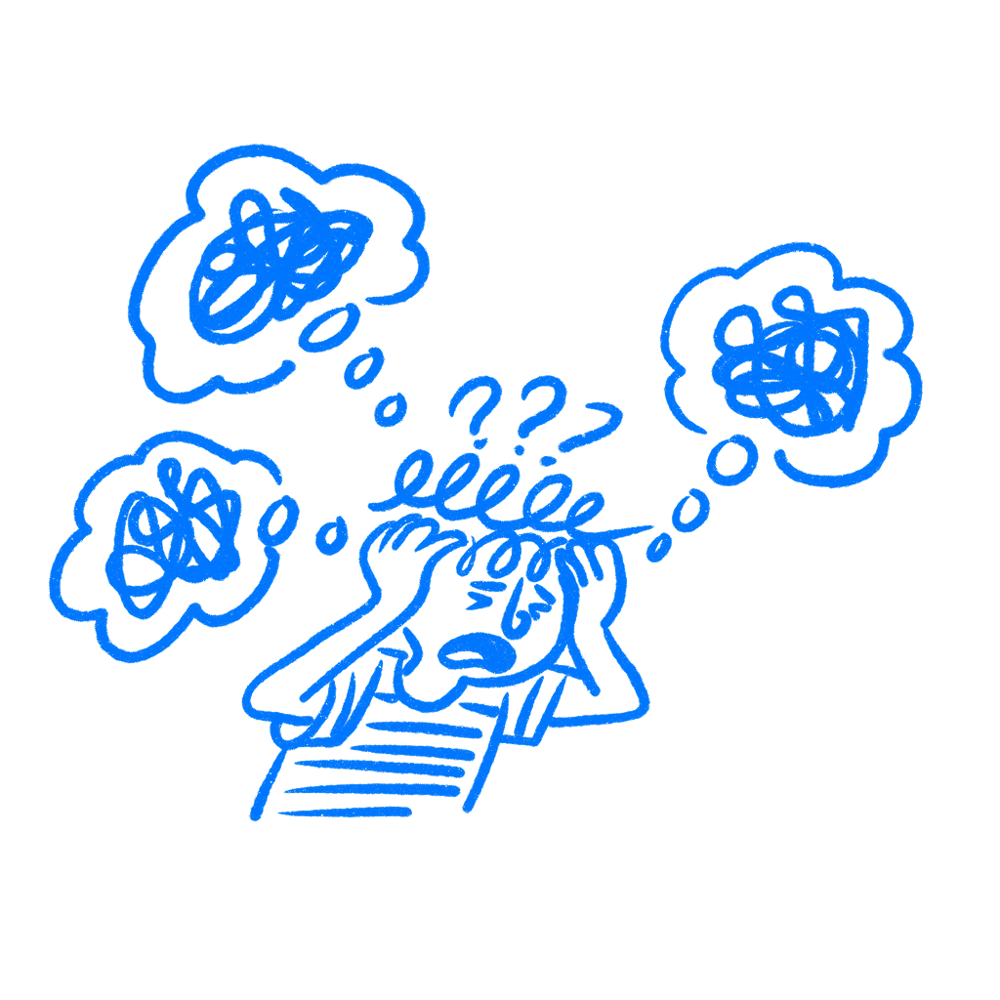

## 제25장 · 사용자는 새 디자인을 미워한다

*손실 회피가 모든 업데이트를 도둑질처럼 느끼게 만드는 과정*

디자인과 사용자 경험을 더 좋게 만들었는데도 사람들은 여전히 미워했다. 디자이너가 가장 이해하기 어려운 대목이 바로 여기 있다. 디자이너는 더 깔끔해진 화면, 더 단순해진 흐름, 더 정돈된 내비게이션을 보면서 사람들이 새 버전을 있는 그대로 평가해 주기를 기대한다. 기존 사용자는 대개 그렇게 하지 않는다. 자신이 방금 잃어버린 것을 기준 삼아 평가한다.

### 손실은 이득보다 먼저 도착한다

1979년, [대니얼 카너먼과 에이머스 트버스키](https://web.mit.edu/curhan/www/docs/Articles/15341_Readings/Behavioral_Decision_Theory/Kahneman_Tversky_1979_Prospect_theory.pdf)는 핵심 문장을 논문에 남겼다. "손실은 이득보다 더 크게 다가온다." 이 문장이 이 장의 중심이다. 이 장은 모든 전환이나 모든 도입을 다루지 않는다. 사용자가 이미 무언가를 가진 상태에서 그것을 제거하거나 옮기는 리디자인을 다룬다.

[윌리엄 새뮤얼슨과 리처드 제크하우저](https://scholar.harvard.edu/files/rzeckhauser/files/status_quo_bias_in_decision_making.pdf)는 현재 상태가 한번 자리 잡으면 얼마나 끈덕지게 되는지 보여줬다. [잭 브렘](https://books.google.com/books/about/A_Theory_of_Psychological_Reactance.html?id=0uN9AAAAMAAJ)은 동의 없이 무언가를 빼앗길 때 사람이 느끼는 반발을 추가로 설명한다. 이 둘을 손실 회피 옆에 놓으면 패턴은 금방 선명해진다. 당신의 리디자인은 이미 낡은 패턴을 알고 있고, 이미 그것에 의존하며, 지금은 익숙한 것이 사라졌다고 느끼는 사용자를 만나는 셈이다.

리디자인의 논리가 리디자인에 대한 반응에 자주 지는 이유가 바로 여기에 있다.

팀은 여기서 자꾸 놓친다. 구버전과 신버전을 마치 두 버전 모두 머릿속에서 동등하게 꺼내 쓸 수 있는 것처럼 비교하기 때문이다. 실제로는 그렇지 않다. 구버전에는 반복과 기억과 속도가 뒷받침되어 있다. 신버전을 뒷받침하는 것은 의도뿐이다. 두 무게는 같지 않다.

내부 디자인 리뷰가 실제 출시 현장과 동떨어져 보일 수 있는 이유이기도 하다. 팀 안에서는 신버전에 모든 관심이 쏠린다. 팀 밖에서는 여전히 구버전 편에 습관이 붙어 있다.

### 스냅챗은 낡은 제품을 걷어 갔다

2018년 2월, [스냅챗](https://en.wikipedia.org/wiki/Snapchat)은 몇 년 만에 가장 큰 규모의 리디자인을 출시했다. 팀은 친구 콘텐츠와 퍼블리셔 콘텐츠를 분리하고 앱을 더 이해하기 쉽게 만들려 했다. 서류상으로는 이 논리를 따라가기 어렵지 않았다.

사용자의 반응은 거셌다. 리디자인을 원상 복구하라는 체인지닷오르그(Change.org) 청원이 120만 명의 서명을 모았다. 출시가 진행되는 동안 유고브(YouGov)의 18세에서 34세 사이 브랜드 인상 데이터는 73퍼센트 하락했다. 다음 분기에 스냅은 일일 활성 사용자 수의 첫 감소를 보고했다. 300만 명이 사라진 것이다. 에번 스피겔은 리디자인이 원인이라고 말했다.

핵심이 바로 여기 있다. 이 이야기는 사용자가 새로움을 거부한다는 얘기만은 아니다. 리디자인이 그들이 이미 가지고 있던 것을 제거했다. 팀은 이득이라고 본 것을 출시했다. 사용자는 손실을 먼저 느꼈고, 그 반응이 더 세게 박혔다.

청원 덕분에 이 반응을 놓치기는 어렵다. 대부분의 리디자인은 청원까지 받지 못한다. 대신 더 느려진 사용, 더 많아진 지원 티켓, 조용한 원망, 그리고 회의 때마다 반복되는 같은 말을 받는다. 사람들은 시간만 있으면 적응한다는 것이다. 때로는 정말 그렇다. 하지만 상당히 많은 경우 사람들이 하려는 말은 이것이다. 리디자인이 자신이 의존하던 것을 가져갔는데, 그 보상을 충분히 빨리 돌려주지 않았다는 것이다.

### 빼앗긴 것은 무엇인가

제품은 이미 사용자의 일과에 들어 있었는데, 그 아래에서 바꿔버리는 셈이다.

이것은 감정적으로 전혀 다른 사건이다. 옮겨진 기능은 새 위치가 더 깔끔하더라도 도둑질처럼 느껴질 수 있다. 사라진 패턴은 사용자가 대체물을 공정하게 평가할 시간을 갖기도 전에 분노를 만들어낸다. 나는 팀들이 이것을 커뮤니케이션 문제라고 부르는 것을 봐왔다. 고칠 수 있는 문제처럼 들리기 때문이다. 하지만 상당히 많은 경우, 리디자인은 준 것보다 더 많이 가져갔을 뿐이다.

바로 여기서 팀은 사용성 언어로 자신을 속인다. 새 흐름은 더 짧다고 말한다. 내비게이션은 더 단순하다고, 화면은 더 산만하지 않다고 말한다. 그 말이 전부 사실이라 해도 진짜 문제를 놓칠 수 있다. 사용자가 잃는 것은 클릭만이 아니다. 익숙함과 속도와 자신감을 잃는다. 이런 손실은 디자인 시스템 보드에는 나타나지 않지만 사용자는 빠르게 느낀다.

이것은 분노가 항상 새 버전이 더 나쁘다는 신호는 아니라는 뜻이기도 하다. 때로는 구버전이 팀이 인정했던 것보다 일상 사용에 더 깊이 짜여 있었다는 신호다. 그래도 여전히 디자인으로 풀어야 할 당신의 문제다.

### 손실 점검부터 먼저하라

리디자인을 출시하기 전에 손실 점검을 하라.

기존 사용자가 생각 없이 의존하는 것들을 적어 내려가라. 자랑스러워하는 기능이 아니라 말이다. 익숙한 동작, 외워 버린 위치, 손이 이미 익힌 단축키를 적으라. 그다음 각 항목에 리디자인이 무엇을 하는지 표시하라.

손실 목록이 무겁다면 이득도 그만큼 무거워야 한다. 그렇지 않다면 출시 속도를 늦춰라. 단계적으로 나누고, 한동안 두 버전을 함께 두고, 제거 시점을 미뤄라. 사람들이 실제 대가를 치른 변경을 미워할 때 놀라는 체하지 마라.

단계적 출시가 디자인 확신보다 도움이 되는 지점이기도 하다. 변경이 학습된 패턴을 제거한다는 것을 알고 있다면 그것을 실제 비용으로 취급하고 사용자에게 여유를 만들어 줘라. 경고를 듣고 전환하게 하고, 비교하게 하고, 회복하게 하라. 목적은 모두를 만족시키는 것이 아니다. 손실이 가상의 것이라는 꾸며 댐을 그만두는 것이다.

단계적으로 나눌 수 없다면 최소한 리뷰 자리에서는 정직하라. 새 레이아웃을 더 좋아한다는 이유만으로 그 반응을 비합리적이라고 부르지 마라. 사용자는 팀과 다른 화폐로 대가를 치르고 있다.

진짜 질문은 새 버전이 더 나은지가 아니다. 가져간 것을 치를 만큼 충분히 더 나은지이다.

### 참고 자료

- **Kahneman, D., & Tversky, A. (1979). Prospect theory: An analysis of decision under risk.** Econometrica, 47(2), 263–291. [https://web.mit.edu/curhan/www/docs/Articles/15341_Readings/Behavioral_Decision_Theory/Kahneman_Tversky_1979_Prospect_theory.pdf](https://web.mit.edu/curhan/www/docs/Articles/15341_Readings/Behavioral_Decision_Theory/Kahneman_Tversky_1979_Prospect_theory.pdf)
- **Brehm, J. W. (1966). A Theory of Psychological Reactance.** Academic Press. [https://books.google.com/books/about/A_Theory_of_Psychological_Reactance.html?id=0uN9AAAAMAAJ](https://books.google.com/books/about/A_Theory_of_Psychological_Reactance.html?id=0uN9AAAAMAAJ)
- **Samuelson, W., & Zeckhauser, R. (1988). Status quo bias in decision making.** Journal of Risk and Uncertainty, 1(1), 7–59. [https://scholar.harvard.edu/files/rzeckhauser/files/status_quo_bias_in_decision_making.pdf](https://scholar.harvard.edu/files/rzeckhauser/files/status_quo_bias_in_decision_making.pdf)
- **Wikipedia: Loss aversion.** [https://en.wikipedia.org/wiki/Loss_aversion](https://en.wikipedia.org/wiki/Loss_aversion)
- **Wikipedia: Reactance (psychology).** [https://en.wikipedia.org/wiki/Reactance_(psychology)](https://en.wikipedia.org/wiki/Reactance_%28psychology%29)
- **Nielsen Norman Group: Prospect Theory and Loss Aversion: How Users Make Decisions.** [https://www.nngroup.com/articles/prospect-theory/](https://www.nngroup.com/articles/prospect-theory/)
- **Wikipedia: Snapchat.** [https://en.wikipedia.org/wiki/Snapchat](https://en.wikipedia.org/wiki/Snapchat)
