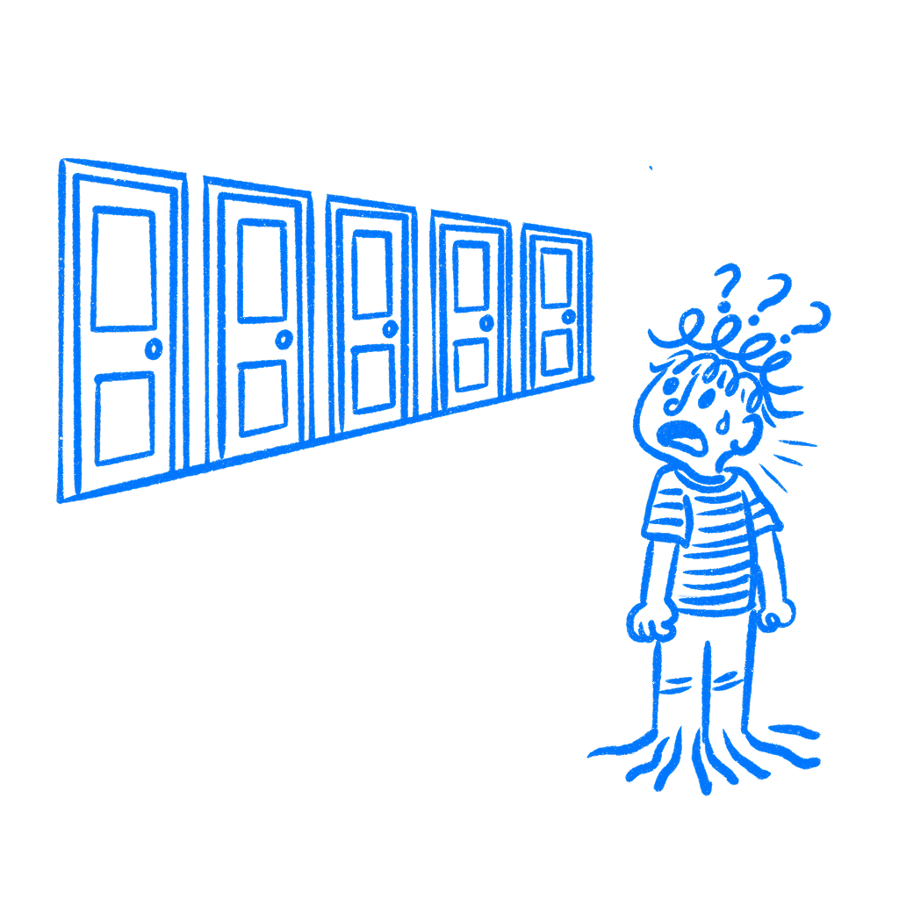

## 제28장 · 선택지가 많을수록 사용자는 떠난다

*기능을 추가할수록 제품이 쓰기 어려워지는 이유*

사용자에게 더 많이 주었는데 제품은 더 나빠졌다. 그것이 기능의 함정이다.

팀은 더 많은 선택지가 더 많은 가치로 보이기 때문에 기능을 계속 추가한다. 그러고 나면 사용자는 그 제품을 열고, 시간을 절약해 줘야 할 제품 속에서 선택하고, 훑어보고, 비교하고, 의심하며 헤쳐 나가야 한다.

### 사람들은 복잡성을 과다 구매한다

[데보라 비아나 톰프슨, 리베카 해밀턴, 롤랜드 러스트](https://www.semanticscholar.org/paper/Feature-Fatigue:-When-Product-Capabilities-Become-a-Thompson-Hamilton/852b7884ac24609e9b82338cc5df688ef5dbadc0)는 2005년에 이 패턴에 이름을 붙였다. 기능 피로(feature fatigue)이다. 사람들이 제품을 소유하기 전에는 추가 기능이 제품을 유능해 보이게 한다. 소유한 뒤에는 같은 기능이 피해서 지나가고 감당해 내야 하는 대상으로 변한다.

[배리 슈와츠](https://www.harpercollins.com/products/the-paradox-of-choice-barry-schwartz)는 같은 문제를 다른 각도에서 밀었다. 선택이 많아지면 만족이 아니라 후회와 회피가 늘어나는 경우가 많다. [윌리엄 힉](https://doi.org/10.1080/17470215208416600)은 그보다 훨씬 앞서 더 단순한 말로 비용을 측정했다. 선택지가 많으면 결정이 느려진다.

여기서 문제는 노력 일반이 아니다. 사용자에게 경로와 기능과 설정과 동작이 너무 많아져 선택 자체가 부담으로 변하는 순간이 문제이다.

이 부담은 두 번 나타난다. 먼저 구매 결정에서는 더 완전한 제품이 더 많은 경우를 덮어 줄 것처럼 보여 안전해 보인다. 그리고 사용 중에는 같은 풍요가 메뉴의 무게, 설정의 무게, 의심으로 바뀐다. 비교에서 제품을 이기게 도운 그것이, 사용자가 안에 들어온 뒤에는 실제 작업을 느리게 만들 수 있다.

### 당신이 추가한 것은 대부분 쓰이지 않는다

2019년, [펜도(Pendo)](https://www.pendo.io/resources/the-2019-feature-adoption-report/)는 소프트웨어 제품 615개를 조사해 기능의 80퍼센트가 거의 또는 전혀 쓰이지 않는다는 사실을 발견했다. 이 숫자가 중요한 이유는, 쓰이지 않는 기능이 코드베이스에 가만히만 있는 것이 아니기 때문이다. 그것은 메뉴와 설정과 온보딩과 내비게이션과 비교 페이지에 나타난다.

그런 기능 하나하나가 사용자가 훑고 지나가거나 결정해야 하는 대상 하나씩이다. 바로 여기서 팀은 자신을 속인다. 안 쓰는 기능은 핵심 작업만 되면 무해하다고 생각한다. 무해하지 않다. 그 기능들은 사용자에게 신호와 잡음을 계속 가려 내라고 요구한다. 나는 사람이 한 가지를 바꾸러 왔다가 열다섯 가지를 맞닥뜨리는 설정 페이지에서 이 장면을 봐왔다.

안 쓰는 기능은 아직 아무도 쓰기 전에 제품의 느낌부터 바꾼다. 붐비는 도구 모음은 이 제품은 공이 들어간다고 말한다. 꽉 찬 설정 페이지는 시스템을 이해해야 신뢰할 수 있다고 말한다. 사용자가 컨트롤 절반을 무시하더라도, 그 모든 잡동사니를 통해 제품을 이해해야 한다.

### 지라는 결정으로 가득한 제품이 되었다

[지라(Jira)](https://en.wikipedia.org/wiki/Jira_(software))는 버그 트래커로 시작했다. 그다음 자라났다. 커스텀 필드, 권한 계층, 이슈 유형, 자동화 규칙, 더 많은 워크플로 상태, 더 많은 모듈, 더 많은 플러그인. 규모가 커지자 많은 팀은 제품을 이해 가능한 상태로 유지하기 위해서만 관리자가 필요하게 되었다.

나는 디그리드(Degreed)에서 지라로 전환했을 때를 아직 기억한다. 나를 때린 것은 나쁜 기능 하나가 아니었다. 내비게이션, 선택지, 동작, 설정, 곳곳에 널린 결정들이 쌓인 더미였다. 하러 온 일을 하기도 전에 이미 무겁게 느껴졌다. 나와 내 팀은 될 수 있으면 지라를 피하기 시작했다.

복잡성이 언제나 나쁜 것은 아니다. 문제는 주 작업이 이미 명확해진 한참 뒤에도 제품이 사용자에게 결정을 계속 떠넘기는 때이다. [리니어(Linear)](https://linear.app/)는 반대 방향으로 밀어서 매력의 일부를 만들었다. 커스텀 결정은 줄이고, 기본값은 늘리고, 묻는 것은 줄였다.

지라가 좋은 예인 이유는 아픔이 단지 공이 든다는 데 있지 않기 때문이다. 사용자가 결정하러 온 적 없는 것을 계속 결정하게 만든다는 데 있다.

그렇다고 모든 전문가 도구가 소비자적 의미에서 단순해야 하는 것은 아니다. 정말 깊이가 필요한 제품도 있다. 문제는 제품이 기본값으로 모든 사람에게, 그중에서도 평범한 일 하나만 하고 떠나러 온 사람까지 전문가 수준의 선택을 떠넘길 때 시작된다.

이 구분이 중요하다. 깊이는 적이 아니다. 시기 이른 깊이가 적이다. 도구가 사용자와 함께 자라면 추가 능력은 맥락이 따라잡은 시점에 도착한다. 도구가 첫날부터 결정 트리 전체를 쏟아 부으면, 제품은 사용자에게 아직 필요 없는 강력함의 대가를 치르게 만드는 것이다.

기본값이 여기서 특히 중요한 이유이기도 하다. 좋은 기본값은 제품이 쉬운 결정을 사용자 대신 내려 주게 한다. 나쁜 기본값은 부담 전부를 도로 사용자 무릎에 쏟아 놓고 그것을 유연함이라 부른다.

### 결정을 세어라

선택지 점검을 돌려라. 화면이 실제로 요구하는 결정을 세어라. 내비게이션 항목, 보조 동작, 필터, 탭, 모드, 겹쳐진 설정, 그리고 설정할 수 있지만 거의 필요 없는 것들까지 말이다. 그다음 각 항목이 대부분의 사용자에게 대부분의 순간에 핵심 작업에 도움이 되는지 물어라.

도움이 되지 않는다면 잘라라. 고급 사용자가 정말로 필요해서 자를 수 없다면, 사용자가 실제로 필요로 할 때까지 주 경로 밖에 두어라.

점진적 공개가 값을 증명하는 지점이 바로 여기 있다. 명확한 기본값 하나, 더 작은 첫 선택 묶음, 사용자가 요구하거나 그 수준에 다다를 때 드러나는 추가 컨트롤이 여기에 해당한다. 이것은 제품을 우습게 단순화하는 것이 아니다. 복잡성을 실제 필요에 붙어 있는 나중으로 미루고, 모두에게 앞에서 쏟아붓지 않는 것이다.

이렇게 만든 제품을 쓰면 차이는 금방 느껴진다. 주 경로는 움직이고, 고급 경로는 기다린다. 보통 이것이 올바른 순서이다. 먼저 적게 물어라. 사용자가 신경 쓸 이유가 생겼을 때 더 물어라.

추가하는 선택지 하나하나가 사용자가 느려지거나 망설이거나 그만두는 순간이 된다.

### 참고 자료

- **Iyengar, S. S., & Lepper, M. R. (2000). When choice is demotivating: Can one desire too much of a good thing?** Journal of Personality and Social Psychology, 79(6), 995–1006. [https://faculty.washington.edu/jdb/345/345%20Articles/Iyengar%20%26%20Lepper%20(2000).pdf](https://faculty.washington.edu/jdb/345/345%20Articles/Iyengar%20%26%20Lepper%20%282000%29.pdf)
- **Schwartz, B. (2004). The Paradox of Choice: Why More Is Less.** Ecco/HarperCollins. [https://www.harpercollins.com/products/the-paradox-of-choice-barry-schwartz](https://www.harpercollins.com/products/the-paradox-of-choice-barry-schwartz)
- **Hick, W. E. (1952). On the rate of gain of information.** Quarterly Journal of Experimental Psychology, 4(1), 11–26. [https://doi.org/10.1080/17470215208416600](https://doi.org/10.1080/17470215208416600)
- **Thompson, D. V., Hamilton, R. W., & Rust, R. T. (2005). Feature fatigue: When product capabilities become too much of a good thing.** Journal of Marketing Research, 42(4), 431–442. [https://www.semanticscholar.org/paper/Feature-Fatigue:-When-Product-Capabilities-Become-a-Thompson-Hamilton/852b7884ac24609e9b82338cc5df688ef5dbadc0](https://www.semanticscholar.org/paper/Feature-Fatigue:-When-Product-Capabilities-Become-a-Thompson-Hamilton/852b7884ac24609e9b82338cc5df688ef5dbadc0)
- **Pendo. (2019). The 2019 Feature Adoption Report.** [https://www.pendo.io/resources/the-2019-feature-adoption-report/](https://www.pendo.io/resources/the-2019-feature-adoption-report/)
- **Wikipedia: Paradox of choice.** [https://en.wikipedia.org/wiki/The_Paradox_of_Choice](https://en.wikipedia.org/wiki/The_Paradox_of_Choice)
- **Wikipedia: Hick's law.** [https://en.wikipedia.org/wiki/Hick%27s_law](https://en.wikipedia.org/wiki/Hick%27s_law)
- **Maeda, J. (2006). The Laws of Simplicity.** MIT Press. [https://mitpress.mit.edu/9780262539470/the-laws-of-simplicity/](https://mitpress.mit.edu/9780262539470/the-laws-of-simplicity/)
- **Nielsen Norman Group: Simplicity Wins over Abundance of Choice.** [https://www.nngroup.com/articles/simplicity-vs-choice/](https://www.nngroup.com/articles/simplicity-vs-choice/)
