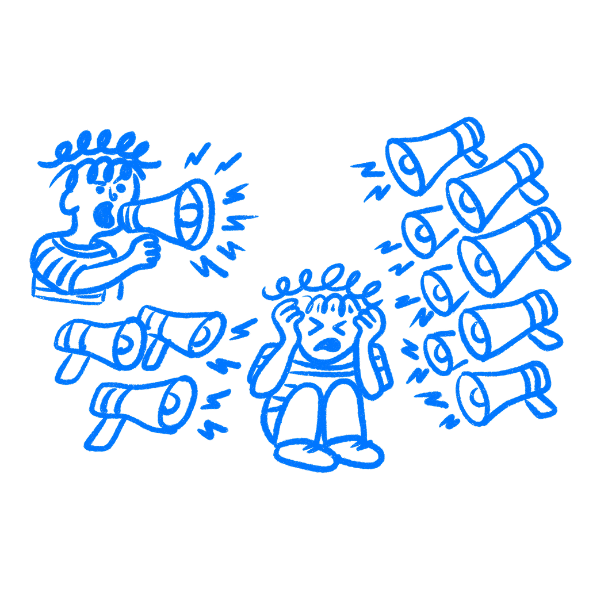

## 제29장 · 사용자는 당신을 무시한다

*사용자가 당신이 만든 것 대부분을 무시하는 이유*

당신은 소중히 여기는 무언가를 만들었다. 레이아웃을 다듬고 문구를 다시 쓰고 디테일을 계속 조정했다. 그런데 사용자는 그것을 열고, 2초 훑고, 지나쳐 버렸다. 당신 작업이 나빠서가 아니다. 이미 너무 많은 다른 것들이 그들의 주의를 두고 경쟁하고 있었기 때문이다.

많은 제품 업무 밑에 깔린 나쁜 가정이 바로 이것이다. 사용자는 몰입할 준비를 갖추고 나타난다고 믿는 것이다. 그렇지 않다. 누군가 당신의 제품에 도착할 무렵이면 그의 주의는 이미 다른 곳에 쓰였다. 성난 이메일 하나. 슬랙 메시지 하나. 길어진 통화 하나. 어중간하게 남은 할 일 하나. 당신이 받는 것은 그렇게 남은 찌끼이다. 어떤 날은 별로 남지 않는다.

### 주의는 한정되어 있다

[허버트 사이먼](https://www.press.jhu.edu/)은 인터넷이 이 문제를 절박하게 만들기 한참 전인 1971년에 이것을 썼다. 그는 정보 과잉을 들여다보다가 지금도 유효한 결론에 도달했다.

> *풍부한 정보는 주의의 결핍을 만들고, 과잉으로 넘쳐나는 정보원들 사이에서 그 주의를 효율적으로 배분해야 할 필요를 만든다.*
> — Herbert Simon

정보는 공짜로 머릿속에 들어오지 않는다. 정보 하나하나에 처리가 필요하다. 처리에는 주의가 든다. 그리고 주의는 그것을 두고 경쟁하는 정보와 달리 늘어나지 않는다. 누군가를 콘텐츠로 범벅으로 만들 수는 있다. 그것을 받아들일 수 있는 용량을 더 줄 수는 없다.

[대니얼 카너먼의](https://books.google.com/books?id=hAkFAAAAMAAJ) 1973년 주의 연구는 주의가 원하는 곳을 향해 조준하는 스포트라이트가 아님을 보여줬다. 주의는 예산이다. 그것도 한정된 예산이다. 걸러 내기는 일찍 시작되고, 대부분의 것은 결코 통과하지 못한다. 당신은 무시한 것을 알아차리지도 못한다. 무시하는 것이 바로 목적이기 때문이다.

배너 실명(banner blindness)이 실재하고, 배너를 리디자인해도 사라지지 않는 이유가 여기에 있다. 사용자는 페이지의 특정 위치가 잡음을 뜻한다고 학습한다. 그 연결이 한번 생기면 두뇌는 그 영역을 반사적으로 건너뛴다. 나중에 그 자리에 유용한 것이 들어 있어도 마찬가지이다. [닐슨 노먼 그룹](https://www.nngroup.com/articles/banner-blindness-old-and-new-findings/)은 시선 추적 연구로 이 문제를 수년간 추적해 왔다. 패턴이 잡음으로 낙인찍히면 그 안의 콘텐츠는 기록조차 되지 않는다.

### 갈라진 주의는 모든 메시지를 약하게 만든다

[데이비드 스트레이어와 윌리엄 존스턴](https://pubmed.ncbi.nlm.nih.gov/11760132/)은 2001년에 운전 시뮬레이터에 운전자를 앉히고 운전 중 전화 통화를 하게 했다. 손에 든 전화: 성능 저하. 핸즈프리 전화: 같은 결과. 문제는 손이 아니었다. 대화였다. 휴대 전화를 한 운전자는 방해받지 않은 운전자보다 두 배 이상 많은 모의 교통 신호를 놓쳤다. 그들의 눈은 도로에 있었다. 주의는 도로에 없었다. 스트레이어와 존스턴은 이것을 주의 없는 실명(inattentional blindness)이라 불렀다. 눈을 뜨고 바로 보아도 놓칠 수 있다. 보는 것은 뜬 눈 이상을 요구하기 때문이다.

당신의 제품을 여는 사람은 바로 이런 사람이다. 깨끗한 일정과 고요한 머리를 가진 백지 상태의 사람이 아니다. 생각 중간, 작업 중간, 화면이 뜨기도 전에 이미 부분적으로 딴 데 가 있는 사람이다.

집중을 요구하는 인터페이스는 대개 시작도 전에 지고 있다. 순간을 끊는 알림은 사용자가 당신과 나누기로 동의한 적 없는 예산에서 끌어 쓴다. 3초 만에 뜨는 모달은 오늘 나타난 주의 찌끼를 들고, 이 사람에게, 바로 지금이 이 제품의 적기이라는 판에 오른다. 그 판은 보통 나쁜 판이다.

### 페이스북은 문제를 측정했다

2018년, [페이스북은 뉴스 피드 알고리즘을 다시 썼다](https://www.wsj.com/articles/the-facebook-files-11631713039). 내부 고발자 [프랜시스 하우겐](https://en.wikipedia.org/wiki/Frances_Haugen)이 넘기고 월스트리트 저널이 2021년에 공개한 문서는 단순한 이야기를 들려준다. 수정된 알고리즘은 댓글과 공유와 격한 답글을 끌어내는 종류의 감정적 반응에 맞춰 최적화되었다. 그런 신호를 가장 많이 만들어 내는 콘텐츠는 사람을 화나게 만드는 콘텐츠였다. 내부 메모는 유해한 콘텐츠가 "재공유 항목에서 유독 많았다(inordinately prevalent among reshares)"고 기록했다.

알고리즘이 해낸 일은 주의를 붙잡는 신뢰할 만한 방법을 찾은 것이었다. 분노는 차분한 콘텐츠가 잘 못 하는 방식으로 사람을 붙들어 둔다. 하지만 그 주의도 어디선가에서 온다. 페이스북이 붙잡은 추가 1분은 매번 다른 것에서 나왔다. 잠, 휴식, 대화, 일, 아니면 그 사람이 하려던 다른 무엇이었다. 페이스북은 주의를 착취할 만큼 잘 이해했다. 그러면서 주의를 유한하고 보호할 가치가 있는 것으로 취급하지 않았고, 그 문제는 나중에 의회 청문회에까지 올랐다.

### 교훈은 제품을 더 시끄럽게 만드는 것이 아니다

알림을 보내기 전, 모달을 띄우기 전, 탭에 배지를 붙이기 전에 질문 하나를 던져라. 이 사람은 이 순간 전에 무엇을 하고 있었고, 이것이 그 사람을 방해할 가치가 있는가? 앞부분에 답할 수 없다면 당신은 제품 밖에 삶이 없는 사람을 위해 디자인하고 있는 것이다. 대부분의 제품이 만나는 사람은 그런 사람이 아니다.

누군가 당신이 만든 것을 지나쳐 갈 때, 답은 그것을 키우는 것이 아니다. 커지는 것은 종종 사람들이 당신을 더 빨리 걸러 내도록 가르친다. 나는 팀이 더 밝은 색과 더 요란한 배지를 추가했다가 다음 번에 더 무시하기 쉬워지기만 한 것을 봐왔다.

그 방해 자체가 정당했는지부터 물어라. 정당하지 않았다면 잘라라.

사용자가 제품을 무시하는 것은 신경 쓰지 않아서가 아니다. 배너와 모달과 푸시 알림을 건너뛰는 것이야말로 그들이 하루를 버티는 방식이기 때문이다.

### 참고 자료

- **Kahneman, D. (1973). Attention and Effort.** Prentice-Hall. [https://books.google.com/books?id=hAkFAAAAMAAJ](https://books.google.com/books?id=hAkFAAAAMAAJ)
- **Strayer, D. L., & Johnston, W. A. (2001). Driven to distraction: Dual-task studies of simulated driving and conversing on a cellular telephone.** Psychological Science, 12(6), 462–466. [https://pubmed.ncbi.nlm.nih.gov/11760132/](https://pubmed.ncbi.nlm.nih.gov/11760132/)
- **Simon, H. A. (1971). Designing organizations for an information-rich world.** In M. Greenberger (Ed.), Computers, Communication, and the Public Interest. Johns Hopkins Press.
- **Wikipedia: Attention economy.** [https://en.wikipedia.org/wiki/Attention_economy](https://en.wikipedia.org/wiki/Attention_economy)
- **Wikipedia: Inattentional blindness.** [https://en.wikipedia.org/wiki/Inattentional_blindness](https://en.wikipedia.org/wiki/Inattentional_blindness)
- **Nielsen Norman Group: Banner Blindness: Old and New Findings.** [https://www.nngroup.com/articles/banner-blindness-old-and-new-findings/](https://www.nngroup.com/articles/banner-blindness-old-and-new-findings/)
- **Horwitz, J. (2021). The Facebook Files.** Wall Street Journal. [https://www.wsj.com/articles/the-facebook-files-11631713039](https://www.wsj.com/articles/the-facebook-files-11631713039)
