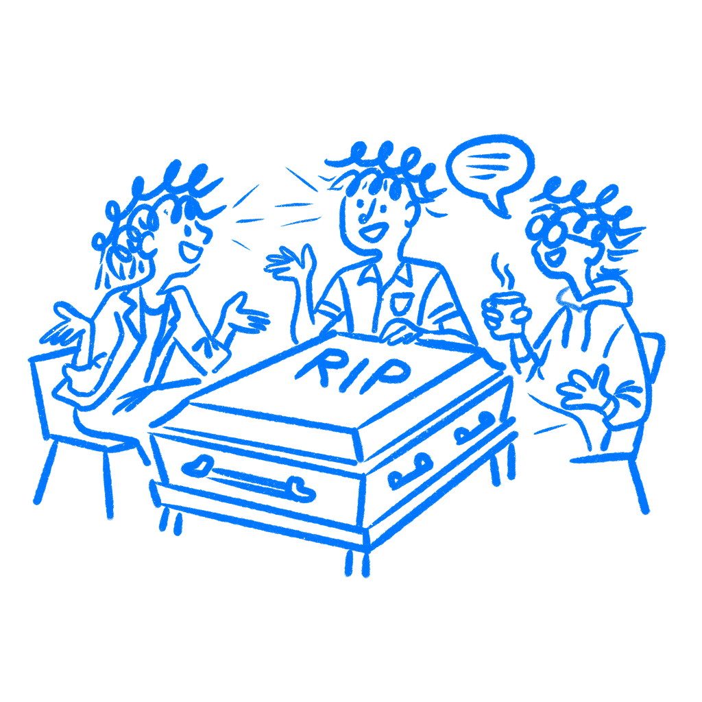

## 제32장 · 좋은 디자인은 회의실에서 죽는다

*동조와 집단 양극화가 어떻게 좋은 작업을 죽이는가*

회의실은 사람들이 정말로 생각하는 것을 보여주지 않았다. 사람들이 서로 앞에서 말하는 내용을 바꿔버렸다. 회의가 디자인에 그렇게 작용한다.

많은 디자인 책은 회의 문제를 목소리가 가장 큰 사람 탓으로 돌린다. 때로는 그것이 이야기의 일부이기도 하다. 이 장이 다루는 것은 권력자가 아무도 결과를 강제하지 않을 때에도 벌어지는 일이다. 똑똑한 사람들로 채워진 회의실도 스스로 더 안전하고 더 밋밋한 답 쪽으로 휘어질 수 있다.

### 사람들은 회의실에서 답을 바꾼다

[솔로몬 애시](https://gwern.net/doc/psychology/1952-asch.pdf)는 1950년대에 유명한 선 길이 실험을 진행했다. 과제는 쉬웠다. 어느 선이 일치하는지 분명하게 보였다. 그런데도 진짜 참가자 주변의 사람들이 자신감 있게, 공개적으로 잘못된 답을 말했다. 애시는 진짜 참가자의 답 3분의 1이 집단 쪽으로 이동했다는 사실을 발견했다. 그는 "비판 집단의 모든 추정 가운데 3분의 1은 다수의 왜곡된 추정 방향으로 향한 오류였다"고 썼다.

여기서 중요한 점은 실수가 눈에 보였다는 사실이다. 그런데도 사람들은 휘어졌다.

나는 리뷰 회의실에서 같은 일을 봤다. 누군가는 지난 라운드 이후 디자인이 나빴다고 생각한다. 그런데 다른 두 사람이 긍정적으로 들리자, 이의가 입 밖으로 나오는 과정에서 부드럽게 다듬어진다. 회의실은 당신을 침묵시킬 필요가 없다. 이견을 내는 일이 사회적으로 비싸 보이게 만들기만 하면 된다.

그래서 많은 회의 결정이 그 주변에서 오가는 사적인 대화보다 옅게 느껴지는 것이다. 사적으로 사람들은 무엇이 약한지 정확히 말해준다. 회의실에서는 같은 생각이 더 쓸 만하고, 더 정중하고, 훨씬 덜 유용한 무언가로 반올림된다.

### 그리고 회의실은 굳어진다

[세르주 모스코비치와 마리자 자발로니](https://doi.org/10.1037/h0027568)는 다음 문제를 보여주었다. 집단은 동조만 하지 않는다. 양극화한다. 옅은 기울기로 시작한 회의실은 같은 방향의 훨씬 강한 버전으로 회의를 마칠 수 있다. 토론이 판단을 항상 좋게 만들지는 않는다. 때로는 회의실을 더 확실하게 만들 뿐이다.

[어빙 재니스](https://web.mit.edu/curhan/www/docs/Articles/15341_Readings/Group_Dynamics/Janis_Groupthink.pdf)는 이와 닮은 현상에 다른 이름을 붙였다. 집단사고(groupthink)다. 재니스의 연구 가운데 여기서 가장 중요한 부분은 자기 검열이다. 사람들은 회의실이 어디로 향하는지 감지할 수 있기 때문에, 자신이 정말로 생각하는 것에서 날카로운 부분을 다듬어 버린다. 결과는 가짜 합의다. 그리고 모두가 그 가짜 합의를 증거로 착각한다.

위에서 아무도 밀어붙일 필요가 없다. 집단은 스스로에게 이런 일을 할 수 있다.

이 과정은 협력적으로 느껴지기까지 한다. 모두가 눈에 보이는 갈등은 줄어들고, 정리된 회의록과, 어느 쪽에도 들리는 결정을 안고 회의실을 나선다. 서류상으로는 건강해 보인다. 때로는 그것이 회의실이 진짜 반대 의견으로부터 자신을 보호하는 법을 배웠다는 신호일 뿐이다.

### 뉴코크는 한 사람의 잘못된 판단이 아니었다

1985년, 코카콜라는 수년간의 테스트, 조사, 위원회 절차를 거쳐 [뉴코크](https://en.wikipedia.org/wiki/New_Coke)를 출시했다. 새 공식은 블라인드 테스트에서 좋은 성적을 냈다. 과정은 신중해 보였다. 그래서 이 이야기가 유용하다.

그 과정은 또한 자기가 감당할 수 없는 경고 신호를 만들어냈다. 포커스 그룹에서는 공식을 아예 바꾸는 것에 대한 분노가 표면으로 나왔다. 그 신호는 존재했다. 그러나 절차는 이미 그 결정에 너무 많은 확신을 쌓은 뒤였고, 경고는 우선순위에서 밀려났다.

뉴코크는 1985년 4월 23일에 출시됐다. 79일 뒤, 원래 공식이 코카콜라 클래식으로 돌아왔다. 이 실패는 나쁜 데이터 탓도, 고집 센 임원 한 명 탓도 아니었다. 의심을 묵살하기 쉽고 확신을 증폭하기 쉬운 절차 그 자체였다.

제품 팀이 기억해야 할 부분이 바로 여기에 있다. 절차는 진지해 보여도, 일단 추진 기운이 붙기 시작하면 가장 중요한 이의를 붙잡아 두지 못할 수 있다. 회의를 더 한다고 해결되지 않는다. 슬라이드를 더 만든다고 해결되지 않는다. 회의실이 의심을 보호하지 못하면, 회의실은 계속 스스로가 마땅한 수준보다 더 확실해질 것이다.

### 회의실이 움직이기 전에 할 일

사람들의 반응은 서로의 의견을 듣기 전에 받아라.

이것이 내가 이 문제에서 가장 신뢰하는 해법이다. 리뷰가 시작되기 전에, 모두에게 생각을 비공개로 적을 2분을 준다. 아직 토론은 없다. 눈썹을 치켜드는 사람도 없다. 다른 모두가 반응할 첫 번째 큰 의견도 없다. 그다음에 대화를 연다.

나는 이 방식이 처음부터 자유롭게 토론하는 것보다 잘 작동하는 것을 봤다. 사람들이 지우려던 참 생각을 붙잡기 때문이다. 회의실이 한쪽으로 기울기 시작하면, 그 첫 반응은 다시 돌아오지 않는다.

결정 기록지(decision log)로 같은 일을 할 수 있다. 이기지 못한 이의를 적어 두라. 기분 상한 마음을 보존하려는 것이 아니다. 회의실이 지워버리고 싶어했던 정보를 보존하려는 것이다. 그러면 나중에 그 회의가 명확성을 만들어냈는지, 아니면 정리만 깔끔해진 동조를 만들어냈는지 알아보기 쉬워진다. 또한 아무도 어려운 논점을 처음에 꺼내지 않았다고 회의실이 거짓말하는 것도 막는다.

기록은 다음 리뷰에게 기억을 준다. 그것이 없으면 회의실은 매번 자신의 확실함을 새로 쓰면서, 아무도 처음에 어려운 논점을 꺼내지 않았던 것처럼 위장할 수 있다.

회의는 디자인을 승인받기 쉽게 만들 수 있다. 그것은 디자인을 더 좋게 만드는 것과 같지 않다.

회의실은 사용자가 아니다.

### 참고 자료

- **Asch, S. E. (1951). Effects of group pressure upon the modification and distortion of judgments.** [https://gwern.net/doc/psychology/1952-asch.pdf](https://gwern.net/doc/psychology/1952-asch.pdf)
- **Janis, I. L. (1972). Victims of Groupthink.** Houghton Mifflin. [https://web.mit.edu/curhan/www/docs/Articles/15341_Readings/Group_Dynamics/Janis_Groupthink.pdf](https://web.mit.edu/curhan/www/docs/Articles/15341_Readings/Group_Dynamics/Janis_Groupthink.pdf)
- **Moscovici, S., & Zavalloni, M. (1969). The group as a polarizer of attitudes.** Journal of Personality and Social Psychology, 12(2), 125–135. [https://doi.org/10.1037/h0027568](https://doi.org/10.1037/h0027568)
- **Wikipedia: Groupthink.** [https://en.wikipedia.org/wiki/Groupthink](https://en.wikipedia.org/wiki/Groupthink)
- **Simply Psychology: Asch Conformity Line Experiment.** [https://www.simplypsychology.org/asch-conformity.html](https://www.simplypsychology.org/asch-conformity.html)
- **Harvard Business Review: Making Dumb Groups Smarter (Sunstein & Hastie, 2014).** [https://hbr.org/2014/12/making-dumb-groups-smarter](https://hbr.org/2014/12/making-dumb-groups-smarter)
- **Wikipedia: New Coke.** [https://en.wikipedia.org/wiki/New_Coke](https://en.wikipedia.org/wiki/New_Coke)
