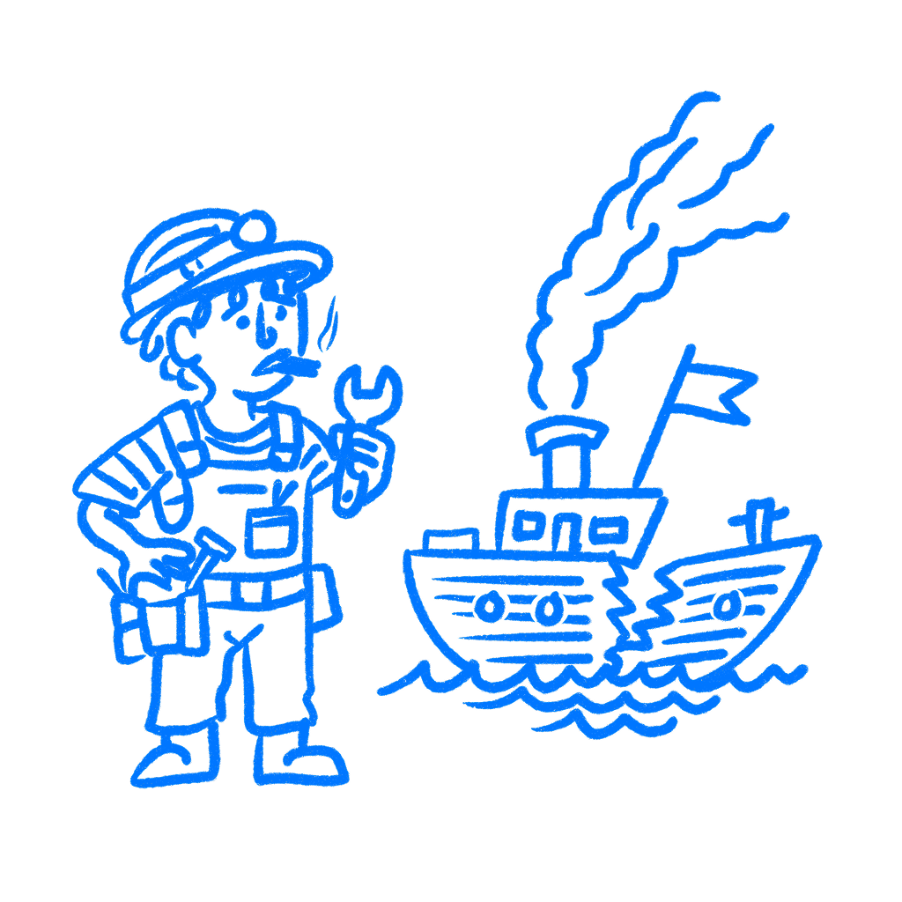

## 제36장 · 인정하느니 차라리 출시한다

*매몰비용이 어떻게 이미 쓴 비용을 나쁜 결정으로 바꾸는가*

당신은 이것을 멈춰야 한다는 것을 알았고, 그런데도 계속 나아갔다. 로드맵이 그렇게 말해서만은 아니다. 팀이 이미 너무 많은 시간을 부어놓아서, 그것을 죽이는 일이 신뢰하지 않는 무언가를 출시하는 일보다 더 나쁘게 느껴졌기 때문에 계속 나아갔다.

이것이 매몰비용의 함정이다. 시간과 노력은 이미 사라졌지만, 여전히 다음 결정 위에 그림자를 드리운다. 지금 무엇이 말이 되는지 묻는 대신, 팀은 이미 쓴 비용이 덜 무의미하게 느껴지는 방법을 찾기 시작한다.

### 팀이 잘라야 할 작업을 계속 보호하는 이유

매몰비용은 되돌릴 수 없는 돈, 시간, 노력이다. 올바른 결정은 그것을 무시하는 것이다. [핼 아키스와 캐서린 블루머](https://doi.org/10.1016/0749-5978(85)90049-4)는 사람들이 이 지점에서 얼마나 크게 실패하는지 보여주었다. 일단 무언가를 부어넣은 사람들은, 증거가 멈추라고 말하는데도 계속 나아가려는 당김을 느낀다. 두 사람은 이를 "일단 투자가 이루어진 뒤에는 그 작업을 계속하려는 경향"이라고 불렀다.

[리처드 세일러](https://doi.org/10.1016/0167-2681(80)90051-7)는 그 이유를 설명해 준다. 손실은 아프다. 기능에 몇 달을 썼다면, 그것을 죽이는 일은 그 손실을 공식화하는 느낌을 준다. 출시하는 일은 어쩌면 무언가를 여전히 구할 수 있을지도 모른다는 느낌을 준다. 이 논리는 나쁘다. 그 당김은 실재한다.

계획은 사라졌을 수 있다. 마감은 옮겨갔을 수 있다. 그래도 팀은 이미 그 자리에 놓여 있는 비용을 정면으로 바라보는 것을 견디지 못해서 나쁜 것을 계속 살려 둔다.

이 점이 매몰비용을 로드맵 압박과 다르게 만든다. 이제 아무도 그 기능을 요구하지 않아도 상관없다. 그 작업은 팀 스스로가 쏟은 노력을 손실 처리하지 못하기 때문에 살아 남는다. 과거는 계속 회의실에 자리를 차고 앉아 있는다.

### 마이크로소프트는 그럼에도 킨을 출시했다

2010년, 마이크로소프트는 젊은 사용자를 겨냥한 두 대의 전화기인 [킨](https://en.wikipedia.org/wiki/Microsoft_Kin)을 출시했다. 회사는 이 플랫폼을 만드는 데 약 2년과 대략 10억 달러를 썼다. 그리고 48일을 버틴 제품을 출시했다.

킨이 여기서 유용한 이유는 단지 실패해서가 아니다. 경고가 출시 전에 이미 있었다는 점 때문이다. 2012년, [와이어드](https://www.wired.com/2012/11/unreleased-internal-microsoft-videos-show-why-kin-crashed-and-burned/)는 내부 사용성 영상을 공개했다. 테스터들이 기본 과제에서 막히고, 이 전화들을 답답하고 혼란스럽다고 부르는 장면들이었다. 문제는 미묘하지 않았다. 그래도 마이크로소프트는 출시했다.

제품에서 매몰비용은 이렇게 생긴다. 수년의 작업. 거대한 지출. 이미 너무 많이 만들어진 것. 그 시점에 이르면 그것을 죽이는 일은 손실을 명백하게 인정하는 일을 의미했다.

그리고 팀이 일단 그 지점에 도달하면, 거의 모든 땜질이 매력적으로 들리기 시작한다. 스프린트 하나 더. 수정 한 패스 더. 망가진 부분을 둘러싼 설명 한 겹 더. 그 움직임들이 근본 문제를 해결해서가 아니다. 누군가가 원래의 투자가 결실을 맺지 못했다고 말해야 하는 순간을 미루기 때문이다.

### 제품 팀에서 이것은 이렇게 보인다

[콩코르드](https://en.wikipedia.org/wiki/Concorde)가 이 패턴의 유명한 버전이다. 그 비행기는 놀라운 엔지니어링이었지만, 경제성은 프로젝트가 끝나기 한참 전부터 말이 되지 않았다. 정부들은 그럼에도 계속 지원했다. 이미 너무 많이 쓴 까닭에 멈추는 것이 손실을 있는 그대로 받아들이는 것처럼 느껴지는 탓도 컸다.

킨은 제품 팀이 내리는 종류의 판단에 더 가깝다. 팀은 이미 그것을 만들었다. 테스트는 나쁘게 나왔다. 사람들은 기본 과제에서 막혔다. 제품은 놓치기 어려운 방식으로 혼란스러웠다.

그러면 누군가 어쩌면 땜질할 수 있지 않겠느냐고 말한다. 라벨을 추가하자. 안내를 추가하자. 한 패스를 더 돌리자. 그것들이 문제를 해결해서가 아니다. 그것을 내다버는 일이 망가진 버전을 출시하는 일보다 더 나쁘게 느껴지기 때문이다. 나는 팀들이 몇 달의 작업 뒤에, 큰 데모 뒤에, 내부 출시일이 발표된 뒤에 이 일을 하는 것을 봐왔다. 그 기능은 아무도 이미 테이블 위에 놓인 비용을 인정하고 싶지 않아서 살아 남는다.

여기서 물어야 할 질문이 그것이다. "우리가 이것을 약속했는가?"는 잊어라. "로드맵에 있는가?"도 잊어라. 대신 이것을 물어라. 우리는 이미 그것이 우리에게 비용을 치르게 했다는 이유로, 여전히 그 작업을 보호하고 있는가? 나는 그 논리가 일관성에 대한 염려, 브랜드, 추진력, 팀 사기에 대한 걱정의 모습으로 나타나는 것을 들어왔다.

팀들은 여기서 같은 결정을 정중한 언어로 꾸미기 시작한다. 그 기능이 거의 다 되었다고 말한다. 사용자가 익힐 것이라고 말한다. 출시가 더 많은 것을 가르쳐 줄 것이라고 말한다. 때로는 출시가 실제로 더 많은 것을 가르쳐 주기도 한다. 때로는 팀이 이미 충분히 알고 있고, 그 추가 학습은 손실을 자르기를 거부하는 일을 가리는 덮개일 뿐이다.

### 그럼에도 출시하기 전에 물어야 할 것

질문 하나를 던져라. 오늘 아무 연혁 없이 이것이 당신 책상 위에 놓였다면, 당신은 그것을 출시하겠는가?

그 질문은 당신 뇌가 계속 밀반입하는 부분을 걷어낸다. 쏟은 시간. 데모. 스트레스. 일정 피해. 그것이 여전히 잘못되어 있다면, 그 어느 것도 사용자를 돕지 못한다.

[카너먼](https://us.macmillan.com/books/9780374275631/thinkingfastandslow)이 여기서 유용한 이유는, 그가 끊임없이 같은 수정을 밀기 때문이다. 당신이 갇혀 있는 이야기에서 벗어나, 더 차가운 어딘가에서 결정을 바라보라는 것이다. 지난 지출은 실재하지만, 그렇다고 해서 무엇이든 결정할 권리를 갖는 것은 아니다.

나는 이 질문을 좋아한다. 잠시 동안 회의실에서 연혁을 몰아내기 때문이다. 그것이 오늘 첫 대면에서 살아남지 못할 것이라면, 그 뒤에 있는 몇 달은 그것을 더 강하게 만들지 않는다. 죽이기 더 어렵게 만들 뿐이다. 대개 그 순간이 되어서야 회의실은 그 기능을 3개월 전의 모습이 아니라 지금의 모습으로 마주 본다.

이것은 사용자 문제가 아니라 관리 문제다. 사용자에게 떠넘기지 마라.

### 참고 자료

- **Arkes, H. R., & Blumer, C. (1985). The psychology of sunk cost.** Organizational Behavior and Human Decision Processes, 35(1), 124–140. [https://doi.org/10.1016/0749-5978(85)90049-4](https://doi.org/10.1016/0749-5978%2885%2990049-4)
- **Thaler, R. H. (1980). Toward a positive theory of consumer choice.** Journal of Economic Behavior & Organization, 1(1), 39–60. [https://doi.org/10.1016/0167-2681(80)90051-7](https://doi.org/10.1016/0167-2681%2880%2990051-7)
- **Kahneman, D. (2011). Thinking, Fast and Slow.** Farrar, Straus and Giroux. [https://us.macmillan.com/books/9780374275631/thinkingfastandslow](https://us.macmillan.com/books/9780374275631/thinkingfastandslow)
- **Wikipedia: Sunk cost.** [https://en.wikipedia.org/wiki/Sunk_cost](https://en.wikipedia.org/wiki/Sunk_cost)
- **Wikipedia: Concorde.** [https://en.wikipedia.org/wiki/Concorde](https://en.wikipedia.org/wiki/Concorde)
- **The Decision Lab: The Sunk Cost Fallacy.** [https://thedecisionlab.com/biases/the-sunk-cost-fallacy](https://thedecisionlab.com/biases/the-sunk-cost-fallacy)
- **Simply Psychology: Sunk Cost Fallacy.** [https://www.simplypsychology.org/sunk-cost-fallacy.html](https://www.simplypsychology.org/sunk-cost-fallacy.html)
- **Wikipedia: Microsoft Kin.** [https://en.wikipedia.org/wiki/Microsoft_Kin](https://en.wikipedia.org/wiki/Microsoft_Kin)
- **Wired. (2012). Exclusive: Internal Videos Show Why the Microsoft Kin Cratered.** [https://www.wired.com/2012/11/unreleased-internal-microsoft-videos-show-why-kin-crashed-and-burned/](https://www.wired.com/2012/11/unreleased-internal-microsoft-videos-show-why-kin-crashed-and-burned/)
