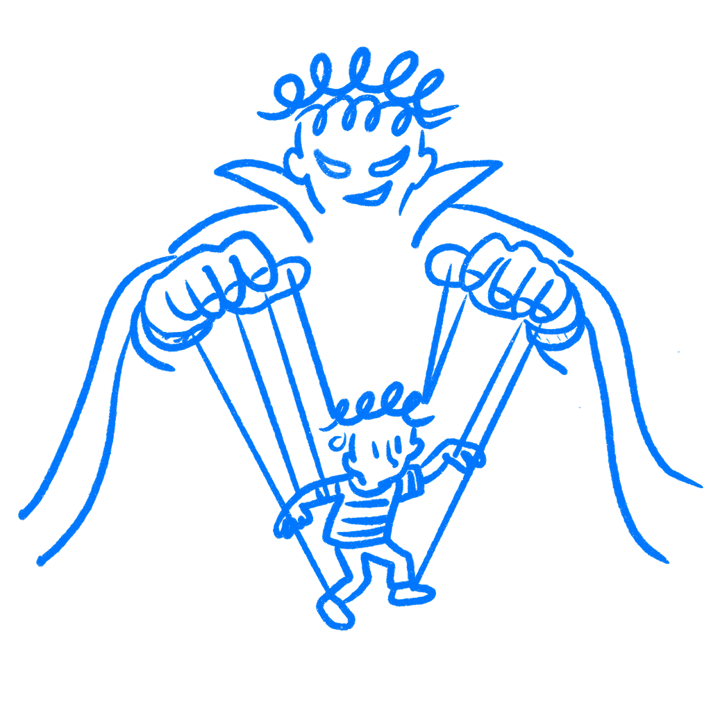

## 제40장 · 이제 당신은 너무 많이 안다

*심리학 지식으로 디자인할 때의 윤리*

당신은 사람들이 다시 생각할 필요 없이 쓸 수 있는 것을 만들고 싶어서 디자인에 들어왔다. 무엇을 어디에 둘지, 어떤 선택이 왜 옳게 느껴지는지, 작은 변경 하나가 과제를 얼마나 수월하게 끝내게 하는지 같은 솜씨의 문제를 신경 썼다.

이제 당신은 그보다 많이 안다. 기본값이 사람들을 어떻게 이끄는지, 마찰이 행동을 어떻게 바꾸는지, 압박과 습관과 프레이밍이 결정을 어떻게 빚는지 안다. 그 지식은 일을 더 잘하게 만든다. 동시에 그 지식은 당신에게, 명확한 조건이었다면 사람들이 스스로 선택하지 않았을 곳으로 그들을 밀어 낼 힘도 준다.

그것을 안 이상, 디자인이 중립적이라고 가장할 권리는 없다.

### 이 지식은 애초에 중립적이지 않았다

[B. J. 포그](https://www.sciencedirect.com/book/9781558606432/persuasive-technology)는 기술이 사람들의 생각과 행동을 어떻게 바꾸는지 그 지도를 그리는 데 여러 해를 썼다. 그는 이 분야를 가리키는 말로 캡톨로지라는 단어를 만들었다. 설득 기술로서의 컴퓨터라는 뜻이다. 2003년에 나온 그의 책은 지금도 묵직하게 남는 질문으로 끝난다.

> *디지털 영향력이라는 힘을 누가 쥘 것인가? 그리고 어디에 쓸 것인가?*
> — B. J. Fogg

포그는 그 질문을 곱씹어 보라는 초대로 던졌다. 도구는 성찰보다 빨리 퍼졌다. 기본값, 프레이밍, 손실 회피, 목표 구배, 인지 부하, 사회적 증거는 모두 사람들이 의지하는 제품 속에서 매일 쓰인다. 어떤 선택은 사람들이 하러 온 일을 하도록 돕는다. 어떤 선택은 다른 곳으로 민다.

기본값에 대한 당신의 지식은 옵트인을 옵트아웃으로 뒤집는 일을 가능하게 한다. 손실 회피를 이해하면 안심시키는 되돌리기 버튼을 만들 수도 있고, 떠나는 일을 비싸 보이게 만드는 해지 흐름을 만들 수도 있다. 거의 다 왔다고 느낄 때 사람에게 동기가 더 붙는다는 사실을 알면, 실제 과제를 계속 나아가게 하는 진행 바를 만들 수도 있고, 사용자가 생각을 멈추기 전에 행동 하나를 더 끌어 내는 가짜 추진력을 만들 수도 있다. 심리학은 동일하다. 방향은 선택이다.

### 업계가 내놓은 것

2018년 유럽 전역에서 [GDPR](https://en.wikipedia.org/wiki/General_Data_Protection_Regulation)이 발효됐다. 웹사이트는 개인정보를 수집하기 전에 진짜 동의가 필요해졌다. 법은 구체적이었다. 동의는 정보에 입각해야 하고 강요 없이 이루어져야 하며, 철회하는 일도 주는 일만큼 쉬워야 한다.

오르후스 대학교와 MIT의 연구자들([Nouwens, Liccardi, Veale, Karger, & Kagal, 2020](https://arxiv.org/abs/2001.02479))은 영국 상위 1만 개 웹사이트에서 가장 인기 있는 동의 관리 플랫폼 다섯 종의 디자인을 수집해 분석했다. 최소한의 법적 요건을 충족한 사이트는 11.8%에 불과했다. 나머지는 마찰과 프레이밍과 빠진 선택지로 사용자를 쿠키 수락 쪽으로 몰아 붙인 다크 패턴을 썼다. 40명을 대상으로 한 후속 실험에서 연구진은 첫 화면에서 옵트아웃 버튼을 치우자 쿠키 수락률이 22~23%포인트 올라간다는 사실을 보여줬다.

메시지는 바뀌지 않았다. 거절이 찾기만 어려워졌을 뿐이다. 결과는 예측 가능했다. 수락은 늘고 정보에 입각한 선택은 줄었다. 패턴은 널리 퍼졌다는 이유로 용인되지 않는다. 이것은 예외 사례가 아니라 표본 전반에 걸친 현상이었다.

### 선을 긋기 어려운 이유

설득이 조종으로 바뀌는 지점에 깨끗한 경계선은 없다. 그래서 이 문제가 어렵다. 실제 과제를 끝내도록 돕는 진행 바는 좋은 디자인이다. 가짜 마감일로 긴박함을 제조하는 진행 바는 다크 패턴이다. 차이는 컴포넌트에 있지 않다. 그 뒤에 놓인 의도와 그것이 전달하는 내용의 정확성에 있다. 이 표시는 참인 것을 비추는가? 아니면 사용자가 원하든 원하지 않든 행동을 밀어 내려고 만들어졌는가?

[해리 브리그널](https://archive.org/details/DarkPatterns-UxBrighon2010)은 2010년에 다크 패턴에 이름을 붙이고 여러 해에 걸쳐 목록을 정리했다. 속임수 질문, 숨겨진 비용, 죄책감을 자극하는 문구, 가입보다 탈퇴를 어렵게 만드는 일 같은 것들이다. 이 목록은 도움이 된다. 그러면서도 더 어려운 사례는 남겨 둔다. 노골적인 속임수는 아니지만 여전히 혼란과 압박과 피로에 기대는 패턴들이다. 미리 체크된 동의 상자는 명백하다. 가짜 긴박함을 만드는 카운트다운 타이머는 조금 덜 명백하다. 무료 요금제를 참을 수 없이 불편하게 만들어 대부분이 온전한 선택 없이 유료로 올라가게 하는 인터페이스는 또 다른 자리에 놓인다.

당신은 그 회색 지대에서 일할 것이다. 문제는 그곳에서 무엇을 하느냐다.

### 출시 전에 물어야 할 것

여기에는 체크리스트가 없다. 설득이 끝나고 조종이 시작되는 지점을 알려 주는 프레임워크도 없다. 무언가를 출시하기 전에 이것을 물어야 한다. 이것을 쓰는 사람이 내가 여기에 무엇을, 왜 만들었는지 정확히 알았다면, 도움을 받았다고 느낄까, 속았다고 느낄까?

나는 평범한 짜증이나 마찰을 말하는 것이 아니다. 그런 것은 일의 일부다. 디자인에는 트레이드오프가 있고, 사용자가 내 모든 결정을 좋아할 필요는 없다. 내가 신경 쓰는 선은 더 단순하다. 그 사람은 자신이 동의한 것이 무엇인지 이해했는가, 아니면 화면이 더 명확했다면 다르게 내렸을 선택을 지나치도록 디자인이 그를 실어 나랐는가? 대개 나는 내가 어느 쪽을 만들었는지 안다.

여기까지 온 다음에 찾아오는 불편함이 바로 이것이다. 더는 몰랐다고 주장할 수 없다. 기본값이 무엇을 하는지 당신은 안다. 마찰이 행동을 어떻게 빚는지도 이제 안다. 해지 버튼을 숨기는 일은 내가 어느 편에 서 있는지에 관한 선택이다. 나는 일이 중립이기를 멈추는 지점이 바로 거기라고 생각한다.

디자이너는 지금 그 어느 때보다 많은 심리학 지식을 손끝에 두고 있다. 조심스럽게 쓰면 그 지식은 것들을 더 쉽고 덜 답답하게 만든다. 사람들에게 등을 돌리고 쓰면 그 지식은 우리 대부분이 지겹게 여기는 웹을 만들어 낸다.

이 책의 내용은 단독으로는 한 가지 일을 한다. 이 일이 얼마나 큰 영향력을 갖고 있는지 보여 주는 일이다. 제품을 쓰는 사람을 위해 그 지식을 쓰면 길을 열어 준다. 그들에게 등을 돌리고 쓰면 사람들이 인터페이스를 의심하며 다가오는 이유에 보탠다.

이제 당신은 충분히 안다. 그 결과를 더는 중립이라고 부를 수 없다.

### 참고 자료

- **Fogg, B. J. (2003). Persuasive Technology: Using Computers to Change What We Think and Do.** Morgan Kaufmann / Elsevier. [https://www.sciencedirect.com/book/9781558606432/persuasive-technology](https://www.sciencedirect.com/book/9781558606432/persuasive-technology)
- **Brignull, H. (2010). Dark patterns: User interfaces designed to trick people.** Talk presented at UX Brighton, 2010. [https://archive.org/details/DarkPatterns-UxBrighon2010](https://archive.org/details/DarkPatterns-UxBrighon2010)
- **Nouwens, M., Liccardi, I., Veale, M., Karger, D., & Kagal, L. (2020). Dark patterns after the GDPR: Scraping consent pop-ups and demonstrating their influence.** CHI '20: Proceedings of the 2020 CHI Conference on Human Factors in Computing Systems. [https://arxiv.org/abs/2001.02479](https://arxiv.org/abs/2001.02479)
- **Thaler, R. H., & Sunstein, C. R. (2008). Nudge: Improving Decisions About Health, Wealth, and Happiness.** Yale University Press. [https://yalebooks.yale.edu/book/9780143115267/nudge/](https://yalebooks.yale.edu/book/9780143115267/nudge/)
- **Wikipedia: Dark pattern.** [https://en.wikipedia.org/wiki/Dark_pattern](https://en.wikipedia.org/wiki/Dark_pattern)
- **Wikipedia: Persuasive technology.** [https://en.wikipedia.org/wiki/Persuasive_technology](https://en.wikipedia.org/wiki/Persuasive_technology)
- **Nielsen Norman Group: Ethics in UX Design.** [https://www.nngroup.com/topic/ethics/](https://www.nngroup.com/topic/ethics/)
