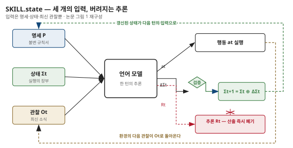

## 제2장 · 세 개의 입력

> 원문: SKILL.state — arXiv:2608.26263 · §3 SKILL.state (구조 개요)

### 한 줄 요약

매 실행 단계에서 모델은 불변 명세와 현재 상태와 최신 관찰만 받는다 — 이 세 가지가 다음 행동을 결정하는 데 필요한 전부라는 설계 선언이다.

### 하나의 식

SKILL.state의 실행은 한 줄의 식으로 요약됩니다. 실행 단계 $t$에서 모델이 받는 입력 $A_t$는 다음과 같습니다.

$$A_t = (P, \Sigma_t, O_t)$$

$P$는 절차 명세(procedural specification), $\Sigma_t$는 단계 $t$의 구조화된 실행 상태, $O_t$는 최신 관찰입니다. 눈여겨볼 것은 식에 없는 것입니다. 지난 관찰도, 지난 행동도, 지난 추론도 없습니다. 모델은 지나온 이야기를 전혀 받지 않습니다.

이 세 가지가 하는 일은 각각 다릅니다. $P$는 처음부터 끝까지 바뀌지 않는 규칙서입니다 — 누가, 무엇을, 어떤 행동 공간으로 실행하는지. $\Sigma_t$는 지금까지의 실행이 남긴 결과물의 목록입니다 — 발견한 사실, 해본 시도, 열어본 파일. $O_t$는 방금 환경에서 도착한 하나의 소식입니다. 규칙서와 장부와 오늘의 편지. 일하는 데 필요한 것이 이 셋뿐이라는 주장입니다.

### 추론은 연료가 아니라 연기

이 설계에서 가장 급진적인 결정은 추론의 취급입니다. SKILL.state는 모델의 사고 자체를 무시하지 않습니다. 오히려 단계 안에서의 다단계 사고 — 여러 걸음의 논리를 차곡차곡 쌓는 연쇄 추론 — 를 온전히 허용합니다. 모델은 관찰을 해석하고, 상태를 읽고, 다음 행동을 고르는 데 필요한 만큼 충분히 생각합니다.

그러나 그 사고는 산출물을 낸 뒤 버려집니다. 모델이 내놓는 것은 세 묶음입니다 — 추론 흔적 $R_t$, 상태 갱신 $\Delta\Sigma_t$, 그리고 실행할 행동 $a_t$.

$$(R_t, \Delta\Sigma_t, a_t)$$

상태 갱신이 결정론적 검증을 통과해 적용되는 순간 $R_t$는 영구히 폐기되고, 이후 어떤 프롬프트에도 다시 나타나지 않습니다. 논문의 표현을 옮기면, 추론은 상태 전이를 만들어내는 **중간 계산**일 뿐입니다. 잠깐 타오르고 남는 것은 재가 아니라 상태라는 것 — 이 은유가 이 설계 전체를 요약합니다.

이 취급이 반직관적으로 들린다면, 인간의 일을 떠올려 보십시오. 창고 관리자는 어제 무슨 생각을 하며 물건을 옮겼는지 기억하지 못해도 일합니다. 선반의 현재 배치와 오늘 도착한 출하지시만 있으면 됩니다. 그가 기억해야 하는 것은 추론이 아니라 추론의 결과입니다. SKILL.state는 에이전트에게 같은 직무 규정을 부과한 셈입니다.

### 실행은 상태 전이다

이 그릇 교체가 실행의 본질에 대한 재정의를 동반합니다. 대화형 런타임에서 실행은 **이야기의 누적**입니다. SKILL.state에서 실행은 **상태의 전이**입니다. 매 단계는 현재 상태에서 다음 상태로 옮겨 가는 한 걸음이고, 이야기는 그 걸음의 부산물일 뿐입니다.

이 재정의가 주는 귀결은 강력합니다. 실행의 정확성이 이야기를 얼마나 잘 재생하는지에 달리지 않고, 상태가 얼마나 참인지에 달립니다. 다음 장에서 이 상태가 어떤 스키마로 짜이고, 어떻게 검증되고, 어떻게 병합되는지를 봅니다. 4장에서는 이 구조가 비용을 어떻게 선형으로 떨어뜨리는지 계산합니다.

### 베이스라인의 세 얼굴

논문은 이 설계를 세 개의 기존 패러다임과 나란히 놓고 시험합니다. 이름이 헷갈릴 수 있어 여기서 정의합니다.

**프롬프트(ReAct형)** — 표준 관습. 모든 관찰·추론·행동을 계속 붙이는 전사본입니다.

**메모리(요약형)** — 과거를 자연어 요약으로 압축해 최근 세 턴과 함께 다는 방식. MemGPT 계열의 아이디어를 벤치마크용으로 정리한 것입니다.

**스테이트풀(LangGraph형)** — 구조 상태 블록을 문맥에 주입하되, 대화 전사본을 그대로 유지합니다. 상태를 보조 자료로 더하는 방식입니다.

뉘앙스가 보이십니까. 셋 다 이력이 기본 그릇입니다. 메모리는 이력을 요약하고, 스테이트풀은 이력에 상태를 얹습니다. SKILL.state만 이력을 버립니다. 베이스라인의 이 배열이 논문의 실험 해석을 함께 결정합니다 — 상태를 더하는 것과 이력을 버리는 것은 다른 일입니다. 9장의 예산 매칭 실험이 이 차이를 정면으로 시험합니다.

### 나의 해석 — 충분통계량으로서의 상태

이 장의 읽기 하나를 남깁니다. $A_t = (P, \Sigma_t, O_t)$는 통계학의 오래된 개념을 에이전트에 이식한 것으로 읽힙니다. 미래에 필요한 모든 것이 지금의 요약 안에 들어 있다는 **충분통계량**의 생각. 논문은 이 말을 쓰지 않지만 16장에서 다룰 한계 서술 — "과거가 미래에 영향을 주는 모든 것이 알려지는 즉시 상태로 투영될 수 있다면 폐기는 무손실이다" — 는 정확히 충분통계량의 정의 문장입니다. 이 읽기는 13장의 대화 상태 추적 계보와 이어지고, 16장의 세 가지 붕괴 지점도 모두 충분통계량 가정이 무너지는 지점들입니다. 책의 뼈대가 되는 읽기이므로 여기서 심어둡니다.
