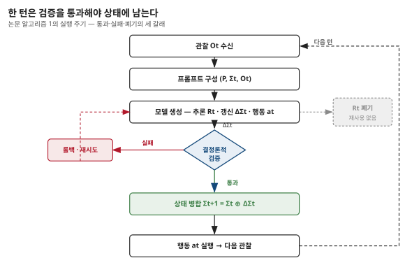

## 제3장 · 상태는 어떻게 자라나나

> 원문: SKILL.state — arXiv:2608.26263 · §3.1~3.2, 알고리즘 1, 부록 A.4·B.3

### 한 줄 요약

상태는 모델이 제안하고 런타임이 검증한다 — 이 역할 분담이 잘못된 상태 갱신이 영구 장부를 오염시키는 일을 원천적으로 막는다.

### 저자는 도메인당 한 번 쓴다

2장의 세 입력 중 실제로 자라나는 것은 $\Sigma_t$ 하나입니다. 이 상태가 어떤 모양이어야 하는지가 설계의 첫 문제입니다. 논문의 대답은 "일마다 쓰지 말고 도메인마다 한 번 쓰라"는 것입니다.

상태 스키마는 도메인의 성질에서 나옵니다. 창고를 다룬다면 재고의 위치가, 저장소를 다룬다면 브랜치와 풀 리퀘스트의 상태가, 고객 응대를 다룬다면 주문과 환불의 내역이 미래의 실행을 좌우하는 정보입니다. 논문이 드는 예가 인상적입니다 — InterCode CTF 벤치마크의 서로 다른 100개 도전 과제 전체에서 에이전트는 **정적 5필드 스키마 하나**를 재사용합니다. 발견한 플래그(discovered_flags), 시험해 본 가설(tested_hypotheses), 열어본 파일(active_files), 작업 디렉터리(working_dir), 명령 요약(cmd_summary). 과제마다 상태를 새로 설계하는 것이 아니라, 도메인의 골격을 한 번 잡으면 그대로 쓴다는 것입니다.

이 결정의 무게는 17장의 실무 장에서 다시 다룹니다. 여기서는 방향만 짚습니다 — 상태 설계는 코딩이 아니라 도메인 모델링이며, 한 번 잘 하면 여러 번 수확이 나온다.

### 한 턴의 해부

실행의 한 바퀴를 순서대로 뜯어봅니다. 논문의 알고리즘 1을 글로 옮기면 다음과 같습니다.

먼저 런타임이 최신 관찰 $O_t$를 받습니다. 이어서 세 입력으로 프롬프트를 구성해 모델을 부릅니다. 모델은 추론하고, 세 묶음 $(R_t, \Delta\Sigma_t, a_t)$을 냅니다. 런타임은 상태 갱신 $\Delta\Sigma_t$를 **결정론적으로 검증**합니다. 통과하면 상태에 병합하고, 행동 $a_t$를 실행합니다. 그리고 다음 관찰을 받아 같은 일을 반복합니다.

여기서 구체의 냄새가 나는 부분 두 곳을 논문 부록에서 가져옵니다. 먼저 실제 실행 프롬프트의 골격입니다 — SKILL.state 런타임이 매 턴 모델에게 주는 지시는 대략 이런 모양입니다.

```text
Instructions:
{skill.instructions}

Skill Execution State:
{현재 상태의 JSON}

Latest Observation: {최신 관찰}

Provide your response with:

1. Step-by-step reasoning (will be discarded after execution)

2. A JSON block containing both your State Patch and your Action.
   The JSON block MUST have exactly these two keys:
   { "state_patch": { <dict: your state updates, set keys to null to delete> },
     "action": "<string: the exact command you want to execute>" }
```

프롬프트 자체가 설계를 웅변합니다. 상태는 통째로 직렬화되어 들어가고, 사고는 "실행 뒤 버려질 것"이라고 미리 공지되고, 산출 계약은 정확히 두 개의 키로 못 박힙니다. 다음은 창고 환경에서의 실제 한 턴입니다. "Customer ordered item_12"라는 관찰이 왔을 때 모델의 산출은 이랬습니다.

```json
{
  "state_patch": {
    "inventory": {
      "shelf_42": null
    }
  },
  "action": "Ship item_12 shelf_42"
}
```

모델의 사고 — "item_12는 shelf_42에 있으니 출하하고 선반을 비워야 한다" — 는 이 턴이 끝나면 사라집니다. 남는 것은 선반 42번이 비었다는 사실 하나입니다. 추론의 그림자가 아니라 추론의 결론만이 다음 턴으로 건너갑니다.

### 병합 연산자와 삭제의 문법

상태 갱신은 덮어쓰기가 아니라 병합입니다. 논문은 갱신을 다음처럼 씁니다.

$$\Sigma_{t+1} = \Sigma_t \oplus \Delta\Sigma_t$$

$\oplus$는 null-삭제 의미론을 가진 딕셔너리 병합 연산자입니다. 갱신 조각의 키 값이 null이면 그 키를 상태에서 지우고, 그 외에는 값을 덮어쓰거나 더합니다. 위의 예에서 `"shelf_42": null`이 정확히 이 문법입니다 — 출하 완료라는 사실을 "선반 42번 삭제"라는 연산으로 표현한 것입니다.

이 작은 문법 선택이 우연이 아닌 이유가 15장에서 드러납니다. 소형 모델의 1위 오류가 기존 키를 갱신에 누락시켜 통째로 날려버리는 것이었기 때문입니다. 갱신을 "새 상태 전체를 쓰기"가 아니라 "바뀐 부분만 말하기"로 계약하면, 실수의 폭발 반경이 턴 하나로 좁아듭니다.

### 검증은 런타임의 몫

설계에서 가장 조용하지만 가장 중요한 분업이 여기 있습니다. 상태 갱신을 **제안**하는 것은 모델이지만, 스키마 소유와 **검증**은 결정론적 런타임에 있습니다. 모델이 흉터 난 JSON을 내놓으면 그 갱신은 적용되지 않습니다. 영구 상태가 오염되는 길이 원천적으로 닫혀 있는 것입니다. 잘못된 제안은 롤백-재시도 주기를 돌 뿐입니다.

이 분업의 대비가 선명합니다. 대화형 런타임에서는 모델의 실수가 곧 문맥의 실수입니다 — 잘못된 결론이 이력에 적히면 그것이 사실로 재생됩니다. SKILL.state에서 실수는 상태에 도달하기 전에 걸러집니다. 형식 오류는 시스템이, 의미 오류는 다음 관찰이 잡습니다. 7장의 상태 회복 실험에서 이 구조가 무음 붕괴 앞에서 어떻게 행동하는지 봅니다.



### 나의 해석 — 두 겹의 기억 시스템

이 장의 구조를 한 걸음 물러나 보면, SKILL.state는 기억을 두 겹으로 나눈 시스템입니다. 딱딱한 겉껍질 — 검증과 병합을 책임지는 결정론적 런타임 — 과 무른 속 — 매 턴 새로 태어나는 추론. 컴퓨터 구조의 레지스터와 연산 회로가 떠오르는 배치입니다. 무른 쪽이 틀려도 딱딱한 쪽이 온전하면 시스템은 다음 턴에 재시도할 기회를 갖습니다.

MemGPT가 이 문제를 접근한 방식과 겹쳐 보면 대비가 재미있습니다. MemGPT는 모델 스스로가 자기 기억을 편집하는 쪽으로 설계를 밀었습니다 — 지능이 높을수록 기억 관리도 잘하리라는 베팅입니다. SKILL.state는 반대로 베팅합니다 — 기억의 무결성은 지능에 맡기지 않는다. 11장에서 이 두 베팅의 갈림길을 다시 만납니다.
