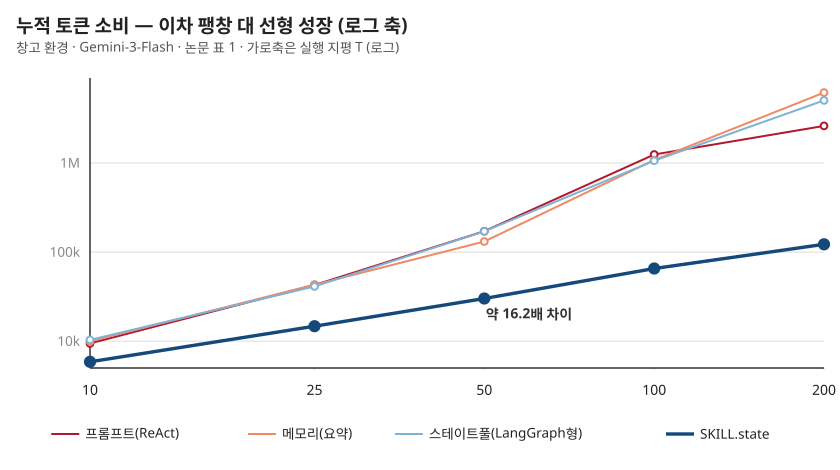
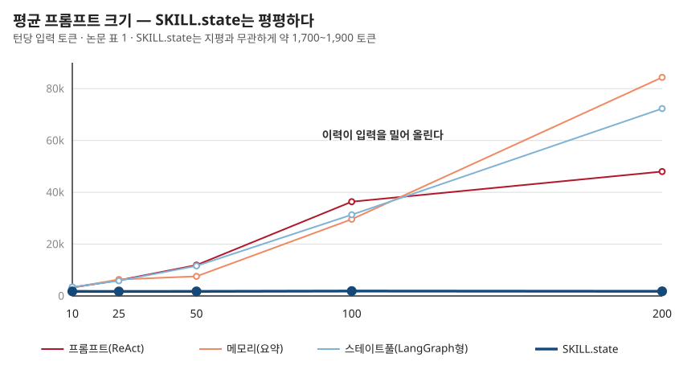
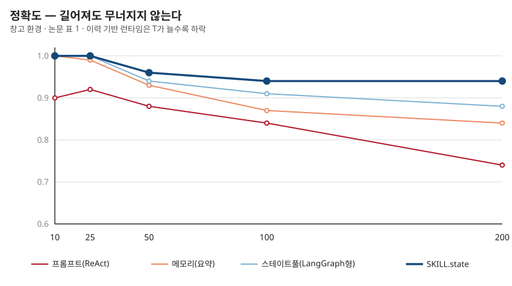

## 제6장 · 평평한 프롬프트

> 원문: SKILL.state — arXiv:2608.26263 · §5.1~5.2, 표 1

### 한 줄 요약

지평을 10에서 200까지 늘려도 SKILL.state의 입력은 그 자리에 있고 정확도는 오히려 역전한다 — 첫 실험의 풍경이다.

### 실험의 문법

본격적인 결과 읽기에 앞서 논문의 실험 문법을 정리합니다. 비교 대상은 2장에서 정의한 세 베이스라인 — 프롬프트(ReAct형), 메모리(요약형), 스테이트풀(LangGraph형)입니다. 실행 모델은 세 족속에서 뽑습니다 — 구글의 Gemini-3-Flash, 개방 가중치의 Gemma-4-31B-it와 Qwen-3-8B-it. 디코딩은 온도 0.0, top-p 1.0으로 못 박아 재현성을 확보하고, 통제 실험은 다섯 개의 절차 생성 시드로 돌려 평균과 표준편차를 냅니다. 지평 50 이상에서의 격차는 짝비교 t 검정으로 p가 0.01 미만 — 우연의 여지가 통계적으로 닫혀 있다는 뜻입니다.

첫 실험의 독립변수는 하나 — 실행 지평을 10, 25, 50, 100, 200 단계로 늘리는 것입니다. 종속변수는 셋 — 정확도, 평균 프롬프트 크기, 누적 토큰.

### 표 전체를 놓고 보면

창고 환경, Gemini-3-Flash의 전체 결과입니다. 논문 표 1을 그대로 옮겼습니다 (평균 ± 표준편차, 5 시드).

| 지평 | 런타임 | 정확도 | 평균 프롬프트 | 총 토큰 |
|---|---|---|---|---|
| 10 | 프롬프트(ReAct) | 0.90 ± 0.02 | 3,249 ± 94 | 9,438 ± 371 |
|  | 메모리(요약) | 1.00 ± 0.00 | 3,300 ± 123 | 9,972 ± 204 |
|  | 스테이트풀(LangGraph) | 1.00 ± 0.00 | 3,430 ± 42 | 10,337 ± 299 |
|  | SKILL.state | 1.00 ± 0.00 | 1,775 ± 74 | 5,870 ± 131 |
| 25 | 프롬프트(ReAct) | 0.92 ± 0.02 | 6,052 ± 192 | 42,689 ± 2,238 |
|  | 메모리(요약) | 0.99 ± 0.00 | 6,357 ± 203 | 43,067 ± 1,948 |
|  | 스테이트풀(LangGraph) | 1.00 ± 0.00 | 5,858 ± 301 | 41,238 ± 3,196 |
|  | SKILL.state | 1.00 ± 0.00 | 1,736 ± 49 | 14,714 ± 564 |
| 50 | 프롬프트(ReAct) | 0.88 ± 0.04 | 11,931 ± 346 | 171,658 ± 6,978 |
|  | 메모리(요약) | 0.93 ± 0.03 | 7,582 ± 283 | 131,455 ± 6,841 |
|  | 스테이트풀(LangGraph) | 0.94 ± 0.00 | 11,594 ± 438 | 170,992 ± 7,918 |
|  | SKILL.state | 0.96 ± 0.01 | 1,773 ± 53 | 30,151 ± 1,231 |
| 100 | 프롬프트(ReAct) | 0.84 ± 0.07 | 36,362 ± 1,304 | 1,245,413 ± 53,241 |
|  | 메모리(요약) | 0.87 ± 0.05 | 29,607 ± 978 | 1,082,154 ± 83,212 |
|  | 스테이트풀(LangGraph) | 0.91 ± 0.02 | 31,354 ± 831 | 1,062,387 ± 53,839 |
|  | SKILL.state | 0.94 ± 0.01 | 1,905 ± 93 | 65,408 ± 5,431 |
| 200 | 프롬프트(ReAct) | 0.74 ± 0.14 | 48,007 ± 2,092 | 2,608,755 ± 102,415 |
|  | 메모리(요약) | 0.84 ± 0.09 | 84,364 ± 3,446 | 6,175,509 ± 294,089 |
|  | 스테이트풀(LangGraph) | 0.88 ± 0.03 | 72,305 ± 3,096 | 5,041,164 ± 346,925 |
|  | SKILL.state | 0.94 ± 0.02 | 1,811 ± 184 | 122,384 ± 4,522 |

표를 세로로 읽으면 4장의 이론이 그대로 실측이 됩니다. 세 베이스라인의 총 토큰은 지평의 제곱에 맞물려 자라다 못해 지평 200에서는 요약 방식이 오히려 앞서던 ReAct를 추월해 6.18백만 토큰을 찍습니다 — 요약문이 눈덩이처럼 불어나는 한계상황입니다. SKILL.state의 같은 열은 5,870에서 122,384로, 지평에 거의 정비례합니다.

로그 축은 자릿수의 언어입니다. 그림 6-1에서 세 베이스라인의 곡선은 우측으로 갈수록 가파라지는 제곱의 문양이고, SKILL.state의 직선은 지평과 무관한 기울기로 내려그립니다. 지평 100에서 벌어지는 약 16.2배의 세로 간격이 이 책 전체를 관통하는 숫자입니다.

### 입력은 그 자리에 있다

평균 프롬프트의 흐름을 따로 보는 이유는, 이것이 턴당 체감 — 지연과 문맥 건강 — 과 직결되기 때문입니다.

그림 6-2에서 세 베이스라인은 3천 토큰대에서 출발해 3만~8만 토큰대로 올라갑니다. SKILL.state는 어떤 지평에서도 1,736~1,905 토큰의 밴드 안에 있습니다. 이 밴드의 존재가 단순한 절약이 아니라는 것이 다음 장의 주제입니다 — 입력이 자라지 않으면 소음도, 낡은 사실도, 죽은 추론도 쌓일 곳이 없습니다.

### 길어져도 무너지지 않는다

비용이 아니라 실력의 문 — 정확도입니다.

그림 6-3의 문양을 언어로 옮기면 이렇습니다. 지평 10에서는 넷 다 0.90~1.00 — 짧은 일에서는 관습도 충분합니다. 격차는 50부터 벌어지고 100에서는 역전이 자릿수로 굳습니다. 지평 200에서 ReAct는 0.74로 내려앉고 편차도 ±0.14로 흔들리는 반면, SKILL.state는 0.94를 유지합니다 — 지평 100과 같은 값입니다. 실행이 길어지는 것이 SKILL.state에게는 추가 비용조차 아니라는 뜻에서, 이 수치는 "유지"가 아니라 "면역"에 가깝습니다.

부록의 저장소 환경(표 6)도 뼈대는 같습니다 — 지평 100에서 SKILL.state가 0.78, 베이스라인은 0.53~0.63. 창고보다 전체적으로 낮은 점수는 그래프 추론의 난이도를 반영하고, 그 어려운 세계에서도 격차의 방향은 그대로입니다.

### 나의 해석 — 표준편차도 데이터다

이 장의 표에서 제 눈이 먼저 가는 곳은 평균이 아니라 편차 열입니다. 지평 200의 ReAct는 ±0.14 — 시드 다섯 개에서 0.6대와 0.8대가 섞였다는 뜻입니다. 무엇이 갈랐을까요. 제 추측은 이렇습니다 — 이력이 길어지면 어떤 사건 열에서는 재생이 성공하고 어떤 열에서는 과거의 유물이 이깁니다. 재생의 성패가 사건 순서의 주사위에 달렸다는 것이 바로 결정론이 아니라 우연에 의존하는 실행의 정의입니다. 반면 SKILL.state의 편차는 지평 200에서 ±0.02입니다. 상태만 남는 구조에서는 사건 순서가 흔들어도 결론이 흔들리지 않습니다. 평균은 어느 쪽이 나은지를 말하고, 편차는 어느 쪽이 믿을 만한지를 말합니다 — 운용에서는 후자가 먼저입니다.

### 이 장에서 가져갈 것

당신의 에이전트가 긴 일을 맡는다면 오늘 밤 재볼 지표 두 개 — 턴당 입력 크기의 추이와, 실행 길이를 늘렸을 때 성공률의 기울기. 입력이 턴 수에 비례해 자라는 그래프라면 4장의 제곱 청구서가 이미 발행되고 있는 것입니다. 두 지표는 로그 한 줄이면 담을 수 있고, 이 그림들의 문양과 나란히 놓기만 해도 진단이 됩니다.
