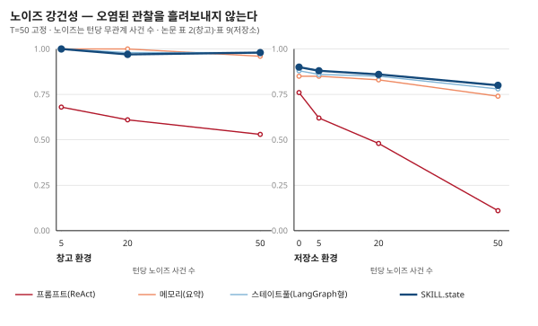
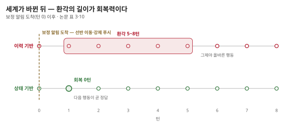

## 제7장 · 시끄러운 방과 무음의 붕괴

> 원문: SKILL.state — arXiv:2608.26263 · §5.3~5.4, 표 2·3·9·10, 부록 C

### 한 줄 요약

오염된 관찰 앞에서는 걸러내는 힘이, 세계가 소리 없이 바뀌는 앞에서는 잊는 힘이 시험받는다 — SKILL.state는 둘 다 구조로 해결한다.

### 시끄러운 방 — 실험 2

실전의 관찰은 깨끗하지 않습니다. 시스템 텔레메트리, 무관한 로그, 지나가는 이벤트가 진짜 소식과 섞여 도착합니다. 논문은 지평을 50으로 고정하고 턴당 노이즈 사건을 5개, 20개, 50개씩 끼워 넣습니다. 노이즈의 제조법이 치밀합니다 — 값은 매 단계 무작위로 다시 뽑고, 의미는 과제와 철저히 무관하며, 세계의 실제 상태를 절대 바꾸지 않는, 관찰 전용 방해물입니다. 창고에는 로봇 배터리 잔량·온도 센서·카메라 인식 로그가, 저장소에는 접속조차 안 된 서버의 시스로그가 "--- BACKGROUND TELEMETRY ---" 꼬리표를 달고 꼬리처럼 따라붙습니다.

| 노이즈 | 런타임 | 점수 |
|---|---|---|
| 5개 (낮음) | 프롬프트(ReAct) | 0.68 |
|  | 메모리(요약) | 1.00 |
|  | 스테이트풀(LangGraph) | 1.00 |
|  | SKILL.state | 1.00 |
| 20개 (중간) | 프롬프트(ReAct) | 0.61 |
|  | 메모리(요약) | 1.00 |
|  | 스테이트풀(LangGraph) | 0.98 |
|  | SKILL.state | 0.97 |
| 50개 (높음) | 프롬프트(ReAct) | 0.53 |
|  | 메모리(요약) | 0.96 |
|  | 스테이트풀(LangGraph) | 0.98 |
|  | SKILL.state | 0.98 |

창고(표 2)에서 ReAct형이 0.68에서 0.53으로 미끄러지는 동안 SKILL.state는 0.97 이상을 지킵니다. 논문의 설명은 기계적입니다 — 방해물이 상태 갱신 생성 단계에서 걸러지고, 걸러진 이상 다음 프롬프트에 영원히 들어가지 못합니다. 소음에 대한 면역이 필터의 성능이 아니라 구조의 성질이라는 것.

저장소 환경(표 9)은 드라마가 더 큽니다. 노이즈 0에서 50으로 가는 동안 ReAct형이 0.76에서 0.11로 몰락하고, 요약형도 0.85에서 0.74로 내려갑니다. SKILL.state는 0.90에서 0.80으로 — 내리긴 하지만 무너지지는 않습니다. 구조가 어려운 세계일수록 소음이 묻히는 곳도 깊어진다는 것, 그리고 상태의 둑은 그 안에서도 높이를 유지한다는 것.

### 무음의 붕괴 — 실험 3

더 무서운 시나리오는 소음이 아니라 침묵 속의 변경입니다. 에이전트의 행동 루프 밖에서 — 외부 행위자가 — 세계가 바뀌는 경우입니다. 창고의 물건이 몰래 옮겨지고, 저장소의 브랜치가 강제 푸시되는 상황. 논문은 보정 알림이 도착한 뒤 에이전트가 몇 턴을 헤매는지로 회복력을 잽니다.

| 시나리오 | 런타임 | 성공 | 회복 단계 |
|---|---|---|---|
| A · 은밀 감사 | 세 베이스라인 | 예 | 5~8 |
|  | SKILL.state | 예 | 0 |
| B · 은밀 바코드 | 세 베이스라인 | 예 | 6~8 |
|  | SKILL.state | 예 | 0 |
| C · 은밀 이동 | 세 베이스라인 | 예 | 5~8 |
|  | SKILL.state | 예 | 0 |
| D · 취소된 주문 | 전부 | 아니오 | 해당 없음 |

결과가 노골적입니다. 이력 기반 런타임은 5~8턴 동안 환각합니다 — 프롬프트에 남은 옛 사실이 모순되는 새 관찰을 이기기 때문입니다. 저장소 환경(표 10)에서는 이 지연이 더 길어져 강제 푸시 앞에서 8~12턴, 불안정 CI 앞에서 9~14턴을 헤맵니다. SKILL.state의 회복 단계는 전 시나리오에서 **0**입니다. 결정이 현재 상태에만 의존하므로 보정 알림이 상태를 갱신하는 즉시 다음 행동이 올바른 행동이 됩니다. 잊는 것이 곧 적응인 구조입니다.

### 나의 해석 — 두 실험은 같은 이야기의 앞뒤다

이 장의 두 실험을 따로 보면 각각 잡음 제거와 결함 허용의 교훈으로 읽히지만, 나는 한 문장으로 읽습니다 — **과거가 미래를 이기는가, 현재가 미래를 이기는가.** 노이즈 실험에서 지는 쪽은 무관한 과거에게 이기는 쪽은 현재의 관찰입니다. 회복 실험에서 지는 쪽은 뒤집힌 과거에게 이기는 쪽은 뒤집힌 현재입니다. 두 실험 다, 이력이 곧 권위가 되는 구조의 취약성을 반대 방향에서 두 번 찌른 것입니다.

운영의 언어로 바꾸면 더 실감이 납니다. 에이전트가 사람의 개입을 받아들이는 일 — 계획 변경, 외부 수정, 긴급 취소 — 은 전부 무음의 붕괴입니다. "취소된 주문" 시나리오에서 전 런타임이 실패한 것도 시사적입니다. 회복이 빠른 시스템은 사람과 일할 수 있고, 회복이 느린 시스템은 사람의 수정을 자기 서사와의 충돌로 겪습니다. 협업의 유연성이 기억의 유연성에서 나온다는 것 — 이 장의 교훈을 조직에 옮기면 이렇게 됩니다.

### 이 장에서 가져갈 것

실험 재현은 어렵지 않습니다. 당신의 에이전트에 오늘 중 한 번, 실행 중간에 세계를 바꿔 보십시오 — 파일을 직접 수정하거나, 데이터를 지우거나, 계획을 철회하거나. 몇 턴 만에 적응하는지 세어 보면 됩니다. 다섯 턴을 넘게 헤맨다면 그 에이전트의 결정은 상태가 아니라 이야기를 보고 있다는 뜻입니다. 그리고 그 진단이 내려진 순간, 고칠 곳도 정해집니다 — 17장의 절차를 따라 바뀐 사실이 이야기가 아니라 상태로 들어오는 길을 트십시오.
