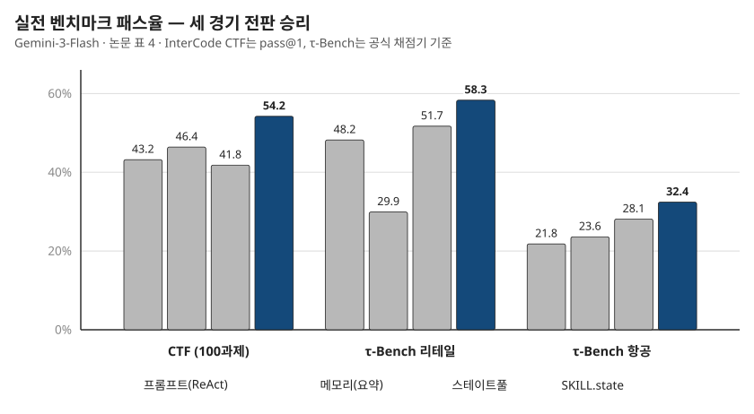

## 제8장 · 실전에서도 통하는가

> 원문: SKILL.state — arXiv:2608.26263 · §4.2·5.5, 표 4

### 한 줄 요약

통제된 세계의 결론은 통제 없는 세계에서도 성립한다 — 리눅스 침입 시험과 기업 고객 응대에서 SKILL.state는 정확도와 비용을 함께 가져간다.

### 두 개의 실전 벤치마크

5장의 SkillExecBench가 병리 실험실이라면 이 장의 두 벤치마크는 야전입니다. 과제가 무엇인지 모르는 채 탐색해야 하고, 세계가 결정론적이지 않으며, 성공이 점수가 아니라 실제 결과로 판명나는 세계입니다.

**InterCode CTF.** 도커 컨테이너 안의 리눅스 터미널에서 100개의 캡처 더 플래그 도전을 푸는 벤치마크입니다. 역공학, 포렌식, 암호 해독, 바이너리 익스플로잇이 섞여 있고, 에이전트는 bash 명령을 치며 가설을 시험하고 숨겨진 플래그를 찾아냅니다. 성공은 이진 판정 — 플래그의 정확한 일치(pass@1)입니다. 이 벤치마크의 본질은 반복 시행의 세계입니다. 같은 명령을 다시 치면 안 되고, 실패한 가설은 기억해 다시 시도하지 말아야 하며, 발견한 단서는 잊지 말아야 합니다. 실행 상태 관리가 점수로 직결되는 구조입니다.

**Sierra τ-Bench.** 소매(retail)와 항공(airline) 두 도메인의 기업 고객 응대 벤치마크입니다. 에이전트는 시뮬레이션된 고객과 대화하며 관계형 데이터베이스를 도구로 조회하고, 항공권 재예약이나 환불 같은 트랜잭션을 비즈니스 정책의 제약 아래 수행합니다. 채점은 공식 프로그램 채점기가 합니다 — 최종 데이터베이스 상태가 고객 의도를 충족하면서 정책 위반이 없는지를 기계적으로 검증합니다. 데이터베이스 응답이 크고, 사용자가 말을 바꾸고, 정책이 빡빡한 — 문맥이 무겁고 지저분한 세계입니다.

### 결과 — 세 경기 전판

| 런타임 | CTF pass@1 | CTF 토큰 | 리테일 패스 | 리테일 토큰 | 항공 패스 | 항공 토큰 |
|---|---|---|---|---|---|---|
| 프롬프트(ReAct) | 43.2% | 977k | 48.2% | 4.48M | 21.8% | 4.85M |
| 메모리(요약) | 46.4% | 1.03M | 29.9% | 4.24M | 23.6% | 4.65M |
| 스테이트풀(LangGraph) | 41.8% | 1.13M | 51.7% | 3.92M | 28.1% | 5.28M |
| SKILL.state | 54.2% | 387k | 58.3% | 3.47M | 32.4% | 2.88M |



CTF에서 SKILL.state는 pass@1 54.2%로 최강 베이스라인보다 7.8점, 스테이트풀보다 12.4점 앞섭니다. 동시에 총 토큰은 ReAct 대비 60.4% 줄어든 387k, 스테이트풀 대비로는 65.9% 줄어듭니다. 논문의 해석이 정확합니다 — 발견한 플래그와 시험한 가설을 $\Sigma_t$에 명시적으로 유지하는 것이 실패한 명령의 반복을 막는다는 것. 3장의 5필드 스키마가 점수로 나타난 장면입니다.

τ-Bench 리테일에서는 58.3%로 1위를 달리면서 총 토큰도 3.47M으로 최저입니다. 항공이 가장 드라마틱합니다. 이 도메인은 데이터베이스 응답이 커서 베이스라인의 프롬프트가 한 턴에 11,000 토큰을 넘기로 치솟는데, SKILL.state는 턴당 약 2,800 토큰의 평평한 발걸음을 유지하며 32.4%를 냅니다. 절약 폭은 ReAct 대비 40.5%, 스테이트풀 대비 45.4%.

```infographic
{
  "layout": "cards",
  "kicker": "REAL WORLDS",
  "title": "세 실전에서 정확도와 비용을 함께 가져갔다",
  "thesis": "통제 벤치마크의 결론이 탐색·대화·트랜잭션이 섞인 실전에서도 성립한다.",
  "evidence": "§1",
  "cards": [
    { "title": "CTF 54.2%", "text": "pass@1 최고 — 토큰은 60.4% 절감", "value": "탐색" },
    { "title": "리테일 58.3%", "text": "패스율 1위, 총 3.47M로 최저" },
    { "title": "항공 32.4%", "text": "턴당 약 2,800 토큰의 평평한 걸음" }
  ],
  "note": "편집 요약: 논문 표 4의 공개 벤치마크 결과를 재배열한 도식이다."
}
```

### 나의 해석 — 토큰 절감은 부산물이고 반복 억제가 본체

이 장의 숫자를 "비용 절감 기법의 승리"로 읽으면 절반만 읽은 것입니다. 정확도가 오른 이유를 따져야 합니다. CTF의 오류 프로파일을 생각해 보면 — 이력 기반 에이전트의 전형적인 실패는 같은 명령을 다시 치고, 같은 깨진 가설을 다시 굴리고, 이미 열어본 파일을 다시 뒤지는 것입니다. 이건 기억이 없어서가 아니라 기록이 넘쳐서입니다. 5,000 토큰 깊이의 실패 기록 속에서 "내가 이걸 해봤는가"를 매번 재판하는 것이 실수를 낳습니다.

상태가 작고 명시적이면 이 재판이 필요 없어집니다. tested_hypotheses에 이미 있는 가설은 다시 굴리지 않습니다. 그러므로 이 장의 진짜 메커니즘은 **반복 억제**이고, 토큰 절감은 그 부산물입니다. 순서가 중요합니다 — 절감이 목표였다면 9장의 압축 기법들이 있었고, 그들은 절감에는 성공하고 점수에서 무너졌습니다. 방향이 반대라는 것.

항공 도메인의 교훈도 같은 맥락에서 읽힙니다. 턴당 11,000 토큰의 데이터베이스 응답은 대화형 런타임에게는 흡수해야 하는 홍수지만, SKILL.state에게는 한 번 훑고 필요한 것만 상태로 뽑아내면 끝나는 원료입니다. 큰 관찰 자체는 문제가 아니고, 큰 관찰이 쌓이는 구조가 문제라는 것 — 이 논문의 세계관을 가장 잘 보여주는 사례입니다.

### 이 장에서 가져갈 것

당신의 에이전트 로그에서 "반복"을 세어 보십시오. 같은 파일을 다시 읽은 횟수, 같은 질의를 다시 날린 횟수, 같은 실패를 다시 한 횟수. 이 숫자가 0에 가깝다면 이력 관리가 잘 되고 있는 것이고, 크다면 상태 부재의 증상입니다. 반복은 눈에 잘 띄는 지표인 데다 개선의 손잡이도 분명합니다 — "해본 일" 목록을 상태로 들고 있는 것만으로 잘 걷힙니다. 17장의 첫 단계가 바로 이 목록입니다.
