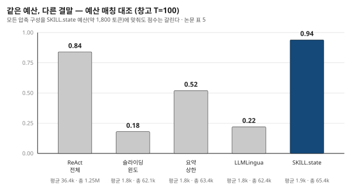
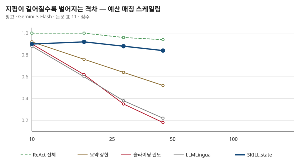

## 제9장 · 짧아서 좋은 게 아니다

> 원문: SKILL.state — arXiv:2608.26263 · §5.6, 표 5·11

### 한 줄 요약

SKILL.state가 이기는 이유가 "프롬프트가 짧아서"라는 반론을 논문은 정면으로 시험한다 — 같은 예산에 묶은 압축 기법들은 전부 무너졌다.

### 가장 중요한 대조

여기까지 읽었다면 누구나 품게 되는 반론이 있습니다. "짧은 입력이 좋다는 거잖아? 그럼 그냥 짧게 만들면 되는 거 아니야?" 이 반론은 옳은 질문을 담고 있습니다 — SKILL.state의 승리가 **구조화된 상태** 덕분인지, 그저 **입력이 짧다는 사실** 덕분인지를 가려야 하기 때문입니다. 두 설명이 같은 결과를 예측한다면 이론은 절반만 있는 것입니다.

논문의 시험 설계가 훌륭합니다. 창고, 지평 100, Gemini-3-Flash 조건에서 세 압축 구성을 SKILL.state의 예산 — 턴당 약 1,800 토큰 — 에 딱 맞춰 묶습니다. 예산이 같으니 남는 변수는 하나 — **짧게 만드는 방식**입니다.

- 슬라이딩 윈도 — 최근 턴만 남기고 자른다
- 요약 상한 — 자연어 요약에 딱딱한 토큰 천장을 건다
- ReAct + LLMLingua — 작은 모델의 혼란도로 토큰을 통계적으로 가지치기한다

| 구성 | 점수 | 평균 프롬프트 | 총 토큰 |
|---|---|---|---|
| ReAct 전체 이력 (무제한) | 0.84 | 36,362 | 1,245,413 |
| 슬라이딩 윈도 | 0.18 | 1,800 | 62,100 |
| 요약 상한 | 0.52 | 1,840 | 63,400 |
| ReAct + LLMLingua | 0.22 | 1,810 | 62,350 |
| SKILL.state | 0.94 | 1,905 | 65,408 |

### 무너지는 방식이 기법의 지문이다

결과는 참혹하지만 참혹함에 서명이 있습니다. 각 기법이 왜 무너지는지가 그 기법의 본질을 드러내기 때문입니다.

슬라이딩 윈도는 0.18로 떨어집니다. 이유는 명확합니다 — 초반의 재고 배치가 창밖으로 쫓겨나기 때문입니다. 창고 과제의 정답은 이른 관찰에 숨어 있고, 최근 턴만 보는 창은 그 관찰이 지나간 뒤에야 문을 닫습니다. **잊는 방향이 정해져 있지 않은 절단**은 필연적으로 중요한 것을 자릅니다.

LLMLingua는 0.22. 통계적 혼란도 기준으로 "복제 가능한" 토큰을 가지치다가 의미상 결정적인 슬롯 식별자들을 지워버립니다. 엔트로피는 중요함의 척도가 아닙니다 — "shelf_42"는 통계적으로 심심한 토큰이지만 창고 세계에서는 그 자체가 정답의 절반입니다. **통계는 구조를 못 지킨다**는 것이 이 0.22의 이름입니다.

요약 상한은 0.52로 그나마 버티지만 여전히 참패입니다. 요약은 사람이 읽기 좋은 산문을 만들지, 실행 가능한 정확한 장부를 만들지는 못하기 때문입니다. "3번 선반쯤에 뭐가 있었던 것 같다"는 요약은 이야기로는 자연스럽고 실행기로는 못 씁니다.

그리고 같은 예산에서 SKILL.state는 0.94. 6장의 무제한 조건(0.94)과 동일합니다 — 예산에 묶여서도 흔들리지 않았다는 뜻입니다. 짧음이 아니라 **무엇을 남기는지**가 문제였다는 것. 이 대조 하나가 이 논문의 논지를 한 방에 정리합니다.

### 격차는 지평과 함께 벌어진다

논문 부록의 다중 지평 버전(표 11)이 이 결론을 시간 축으로 확장합니다.

| 지평 | SKILL.state | 요약 상한 | 슬라이딩 윈도 | LLMLingua | ReAct 전체 |
|---|---|---|---|---|---|
| 10 | 1.00 | 0.92 | 0.90 | 0.88 | 0.90 |
| 25 | 1.00 | 0.76 | 0.62 | 0.60 | 0.92 |
| 50 | 0.96 | 0.64 | 0.35 | 0.38 | 0.88 |
| 100 | 0.94 | 0.52 | 0.18 | 0.22 | 0.84 |

지평 10에서는 다섯 구성이 0.88~1.00으로 붙어 있습니다. 짧은 일에서는 아무 방식이나 대충 해도 됩니다. 격차는 지평과 함께 벌어져 100에서는 0.18과 0.94로 자릿수가 갈립니다. 절단과 압축의 실패가 우연이 아니라 **법칙**이라는 것 — 기억해야 할 것이 늘어날수록 못 지키는 방식과 지키는 방식의 차이가 커진다는 것.

### 나의 해석 — 요약과 장부의 존재론

이 장의 실험을 나는 "요약과 장부의 존재론"으로 부릅니다. 요약은 사람을 위한 기억입니다 — 대의를 전하고 뉘앙스를 살리고 흐름을 잇습니다. 장부는 기계를 위한 기억입니다 — 정확하고 갱신 가능하고 조회 가능합니다. 긴 실행을 버티는 것은 장부이고, 요약은 짧은 자리를 메꾸는 재봉틀입니다. 요약 상한이 0.52에서 멈춘 것은 재봉틀로 이불을 짓려 한 값입니다.

실무의 습관을 돌아보게 되는 대목입니다. "지난 대화를 요약해서 넣는다"는 이제 에이전트 제품의 상투구가 됐습니다. 이 장의 수치는 그 상투구의 값을 묻습니다 — 요약이 실행에 필요한 정보를 얼마나 살리는지를 측정해 본 적이 있는가. 요약의 품질을 문장이 자연스러운지로 평가하는 습관이, 실행 가능성으로 평가하는 습관을 밀어냈습니다. 12장에서 LLMLingua 계열 압축 연구의 전모를, 그리고 이 실험이 그 연구사 위에서 갖는 위치를 다룹니다.

### 이 장에서 가져갈 것

컨텍스트를 줄이는 방안을 논의할 때 "얼마나 줄었나"와 함께 "무엇을 지켰나"를 물으십시오. 절단은 지키는 것 없이 줄이고, 압축은 통계가 아까워하는 것을 지키고, 상태는 미래가 필요로 하는 것을 지킵니다. 이 세 층위의 구분이 없으면 "토큰 90% 절감!"이라는 광고가 0.18의 참사로 도착합니다. 그리고 그 구분을 실측하는 법도 이 장이 보여줍니다 — 같은 예산에 묶어 놓고 점수를 재는 것. 이 예산 매칭 대조는 논문 읽기의 도구로도 남습니다. 어떤 "효율화" 주장도 이 대조 앞에 세워 보면 본심이 드러납니다.
