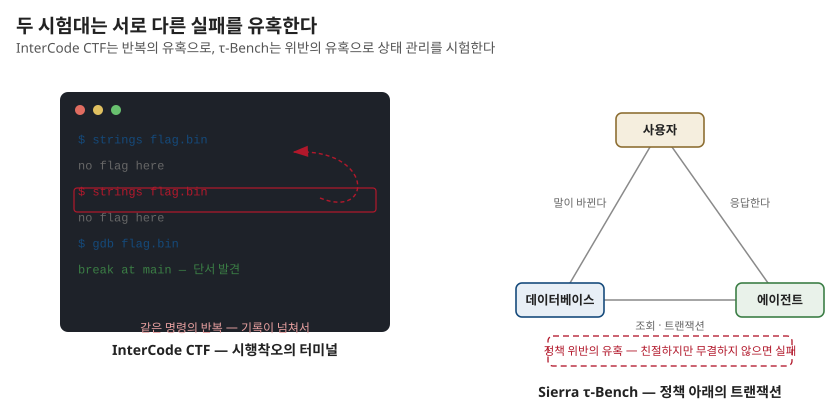

## 제14장 · 시험대의 설계

> 원문 연구: InterCode(Yang 외, NeurIPS 2023) · τ-Bench(Yao 외, arXiv:2406.12045) — SKILL.state §4.2가 세운 시험대의 설계도를 파헤친다

### 한 줄 요약

8장의 결과가 나온 두 시험대는 우연히 뽑힌 게 아니다 — 하나는 반복 억제의 이득을 극대화하는 시행착오 세계, 하나는 상태 정합성의 이득을 극대화하는 규칙 세계다.

### 왜 벤치마크를 다시 읽는가

벤치마크는 흔히 결과의 배경으로만 읽힌다. 그러나 좋은 벤치마크는 주장의 일부다 — 무엇을 시험하는지가 무엇이 입증되는지를 결정하니까. 8장에서 SKILL.state가 세 경기에서 이겼다고 할 때, 그 세 경기가 어떤 운동장인지를 몰라 하면 승리의 성격을 오독하게 된다. 이 장은 5장의 통제 세계와 짝을 이루는 야전 두 개를 설계도 수준에서 뜯어 본다. 인용의 정확성을 위해 밝혀두면 이 장의 서술은 두 벤치마크 원논문에 대한 내 요약이며, 결과 숫자는 8장에서 이미 다루었다.

### InterCode — 시행착오의 표준화

InterCode의 출발 문장이 사랑스럽다 — 코드를 **행동**으로, 실행 피드백을 **관찰**로. 코딩을 닫힌 문제(문제를 주고 정답을 받는)가 아니라 열린 상호작용(명령을 치고 결과를 보고 다시 치는)으로 재정의한 것이다. 에이전트는 격리된 도커 컨테이너 안에서 명령을 실행하고, 환경은 실행 출력과 상태를 돌려준다. 데이터베이스 질의 트랙과 리눅스 bash 트랙이 있고, 그 bash 트랙의 한가운데에 CTF 하위 과제 — 100개의 숨겨진 플래그 회수 — 가 앉아 있다.

이 설계가 상태 관리를 시험하는 데 얼마나 좋은지 보려면, CTF의 실패 모드를 상상해 보면 된다. 같은 도구를 같은 순서로 다시 돌리는 것(기억 없음), 한 번 깨진 가설을 다시 굴리는 것(망각 없음), 발견한 단서를 잃는 것(기록 없음). 세 실패 모두 이력이 넘치거나 상태가 부실할 때 발생한다. InterCode는 특별히 상태를 겨냥해 만들어진 벤치마크가 아닌데도 — 상호작용을 표준화했다는 사실 자체가 — 상태 관리의 검증장이 된다. 좋은 시험대의 무게가 이렇다.

### τ-Bench — 규칙 아래의 트랜잭션

τ-Bench가 노리는 취약점은 다르다. 도구를 쓰는 것과 **쓸 만한 상태를 유지하는 것**은 다른 일임을 보여주는 데 이 벤치마크의 사명이 있다. 구성이 삼각형이다 — 에이전트, 도구(관계형 데이터베이스 조회와 트랜잭션), 그리고 시뮬레이션된 사용자. 소매와 항공 두 도메인의 실무 시나리오에서 사용자의 말은 바뀌고, 데이터베이스의 응답은 크고, 비즈니스 정책은 빡빡하다. 환불 규정을 어기며 친절해진 답은 성공이 아니고, 정책을 지키며 고객 의도를 데이터베이스의 최종 상태로 옮겨 놓은 실행만 성공이다. 채점이 프로그램으로 되어 있다는 것이 두 번째 미덕 — 최종 상태의 정합성과 정책 준수를 기계적으로 판정하니 채점의 주관이 없다.

그리고 이 벤치마크가 남긴 가장 유명한 발견을 짚고 지나가야 한다 — **일관성의 벽**. 한 번 잘하는 것과 매번 잘하는 것은 다른 축이라는 것. 반복 실행 전체의 성공(pass^k로 표기하는, k번 연속 성공의 확률)은 k가 늘수록 처참하게 떨어지는데, 강한 모델조차 예외가 아니었다. 데모 한 번의 영웅과 운용 첫날의 평균 사이에 이 격차가 끼어 있다. 상태 기반 실행이 이 벤치마크에서 강한 까닭도 여기에 닿아 있다 — 결과의 분산이 이력 재생의 운이 아니라 상태의 정확성에서 오는 구조는, 운에 기대는 구조보다 반복에 강하다.

| 구분 | InterCode CTF | τ-Bench |
|---|---|---|
| 세계의 모양 | 격리된 도커 컨테이너의 bash 세계 | 사용자·도구·데이터베이스의 삼각형 |
| 실패의 양상 | 같은 명령 반복·깨진 가설 재시도·단서 망각 | 정책 위반·DB 불일치·사용자 의도 누락 |
| 채점 | 플래그의 정확한 일치 (이진) | 최종 상태·정책 준수의 기계 판정 |
| 상태 관리가 점수가 되는 길 | 반복 억제 → 시도의 다양화 | 정합성 유지 → 무결한 트랜잭션 |
| 저자들이 뽑은 이유 | 시행착오 세계에서 실행 역학 검증 | 오염된 문맥 속 트랜잭션 검증 |

### 나의 해석 — 시험대는 주장의 문법이다

이 장을 다 읽고 8장의 표로 돌아가면 보이는 것이 있다. SKILL.state의 승리가 세 경기에서 나왔다는 말은, 사실 **두 종류의 승리**였다는 말이다. CTF의 승리는 반복을 줄여 시도의 다양성을 늘린 이야기(탐색의 개선)고, τ-Bench의 승리는 오염된 문맥 속에서 정합성을 지킨 이야기(신뢰성의 개선)다. 하나의 설계가 성질이 다른 두 시험대에서 같은 방향의 결과를 냈다는 것 — 이중 증언이 논문의 설득력의 뼈대다.

실무로 가져갈 교훈도 문법의 교훈이다. 당신의 에이전트를 시험할 때 시험대의 성격을 먼저 쓰라 — 반복의 유혹이 있는가, 위반의 유혹이 있는가. 그리고 개선을 주장할 때는 이 장의 표처럼 어떤 유혹을 이겼는지로 문장을 쓰라. "정확도가 올랐다"는 문장은 약하고, "같은 파일을 다시 읽는 빈도가 줄어 탐색이 다양해졌다"는 문장은 강하다. 벤치마크를 설계도로 읽는 습관이 주장의 문장을 바꾼다.
