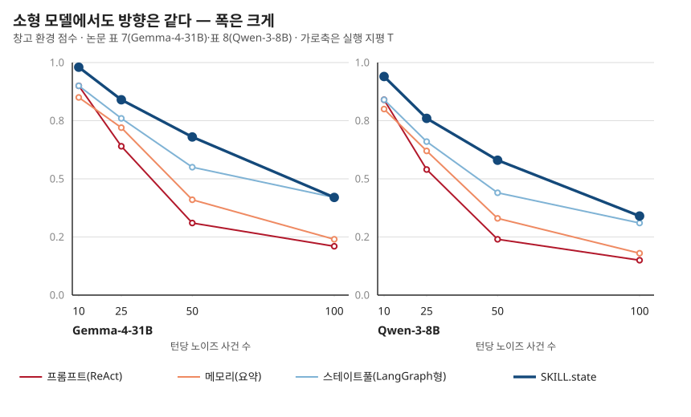
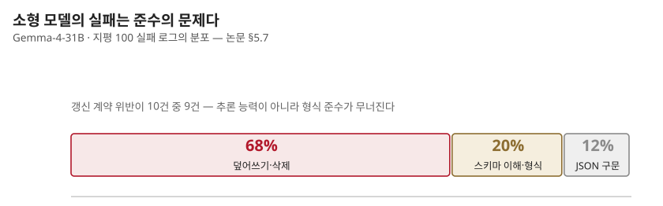

## 제15장 · 작은 모델은 어디서 무너지나

> 원문: SKILL.state — arXiv:2608.26263 · §5.7, 표 7·8

### 한 줄 요약

소형 모델에서 구조의 이득은 더 크지만 천장은 낮다 — 실패 로그의 분포는 문제가 추론 능력이 아니라 구조화 출력 준수임을 가리킨다.

### 두 개의 작은 모델, 같은 문양

지금까지의 실험은 Gemini-3-Flash였다. 이 논문의 주장이 진짜라면 모델이 바뀌어도 방향은 유지되어야 한다. 표 7과 표 8이 그 확인이다 — 개방 가중치의 Gemma-4-31B-it와 Qwen-3-8B-it를 창고 환경에 세운 결과다.

| 모델 | 지평 | 프롬프트 | 메모리 | 스테이트풀 | SKILL.state |
|---|---|---|---|---|---|
| Gemma-4-31B | 10 | 0.90 | 0.85 | 0.90 | 0.98 |
|  | 25 | 0.64 | 0.72 | 0.76 | 0.84 |
|  | 50 | 0.31 | 0.41 | 0.55 | 0.68 |
|  | 100 | 0.21 | 0.24 | 0.42 | 0.42 |
| Qwen-3-8B | 10 | 0.84 | 0.80 | 0.84 | 0.94 |
|  | 25 | 0.54 | 0.62 | 0.66 | 0.76 |
|  | 50 | 0.24 | 0.33 | 0.44 | 0.58 |
|  | 100 | 0.15 | 0.18 | 0.31 | 0.34 |

읽을 거리가 둘 있다. 하나 — 모든 지평에서 SKILL.state가 1위다. 작은 모델일수록 격차가 벌어진다는 것은 이 구조가 모델 능력을 보완하는 쪽이라는 뜻이다. 지평 50의 Gemma에서 베이스라인 최강인 스테이트풀이 0.55인데 SKILL.state는 0.68 — 31B 모델이 구조의 도움으로 앞선 런타임을 이긴다.

둘 — 지평 100의 Gemma에서 스테이트풀과 SKILL.state가 0.42로 동률이다. Qwen의 0.31 대 0.34도 거의 붙어 있다. 천장의 존재다. 구조가 아무리 좋아도 상태 갱신 자체를 틀리는 모델에게는 그 이상이 안 된다. 그리고 이 천장의 원인을 논문은 실패 로그를 뜯어 찾았다.

### 오류의 세 얼굴

Gemma-4-31B의 지평 100 실패 로그를 분류한 결과가 이 논문의 가장 실용적인 발견 중 하나다.

**첫째, 조기 상태 덮어쓰기·삭제 — 68%.** 모델이 갱신 조각을 낼 때 기존 키를 빠뜨리는 것이 아니라 아예 누락시켜 통째로 지우는 실수. "바뀐 것만 말하기" 계약(3장)을 어기는 경우다. 가장 흔하고 가장 치명적이다 — 장부의 페이지가 사라지면 이후의 모든 조회가 틀린다.

**둘째, 스키마 이해·형식 강제 — 20%.** 중첩 리스트와 딕셔너리의 구분을 흐리는 경우. 상태의 모양 자체를 잘못 이해하는 실패다.

**셋째, JSON 구문 사고 — 12%.** 쉼표 하나, 괄호 하나의 실수. 문법 파탄은 검증 게이트에서 걸리니 영구 상태는 오염되지 않지만, 재시도에 턴과 토큰이 소모된다.

### 진단 — 추론이 아니라 준수다

이 분포의 뜻은 명확하다. 소형 모델의 한계는 **생각이 부족해서가 아니라 계약을 지키는 일이 부족해서**다. 셋 다 구조화된 출력의 형식적 준수에 속하는 실패라는 것 — 그래서 논문의 처방은 모델을 키우는 것이 아니라 **문법 제약 디코딩**이다. 가능한 출력의 공간을 문법 자체로 좁혀 구문 오류를 원천 봉쇄하고, 모델에게 의미적 전이에만 전념하게 하는 기술. 68%의 덮어쓰기까지는 못 미치지만 12%의 구문 사고를 0으로 만들고, 병합 연산자의 설계를 조이면 최빈 오류의 폭도 좁힐 수 있다.

이 진단은 3장의 분업을 다시 떠올리게 한다 — 상태의 무결성을 런타임이 지키는 대가로, 모델의 실수가 시스템의 실수로 번지는 통로가 닫혀 있었던 것. 소형 모델의 천장은 그 통로가 닫혀 있어도 여전히 존재하지만, 그 천장의 재질이 "추론력"이 아니라 "준수력"이라는 것이 이 장의 결론이다.

### 나의 해석 — 비대칭의 뜻

표의 비대칭이 말이 많다. 짧은 지평에서의 격차는 크고 긴 지평에서는 좁아진다 — 지평 100의 Gemma에서 1위와 2위가 동률이 되는 것. 내 독해는 이렇다. 구조의 이득은 두 몫이다 — 이력 병리를 없애는 몫(모든 지평에서 유효)과 상태 갱신을 정확히 하는 몫(모델 준수력에 비례). 대형 모델은 두 몫을 다 받는데, 소형 모델은 첫 몫은 받고 둘째 몫의 한계에 부딪힌다. 그래서 "방향은 같고 천장은 낮다"가 되는 것.

이 독해의 실무적 딸림표 — 이 구조를 소형 모델로 돌리려면 준수력부터 올려야 한다. 문법 제약 디코딩, 스키마 검증의 재시도 예산, 더 단순한 스키마. 모델을 바꾸는 것이 마지막 수단이지 첫 수단이 아니다. 17장의 체크리스트에 이 순서가 반영되어 있다.
