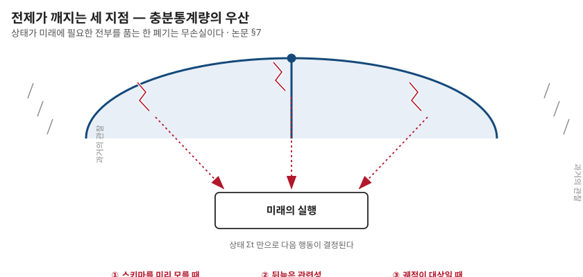

## 제16장 · 이 설계가 무너지는 세 지점

> 원문: SKILL.state — arXiv:2608.26263 · §7 Limitations

### 한 줄 요약

"상태가 충분통계량이다"라는 전제가 깨지는 곳에서 이 설계도 깨진다 — 논문 스스로 적은 세 붕괴 지점을 읽는 것이 도입을 판단하는 첫걸음이다.

### 전제를 먼저 분명히

SKILL.state의 모든 마법은 하나의 전제 위에 서 있다 — **과거가 미래에 영향을 주는 모든 것이 알려지는 즉시 상태로 투영될 수 있다면, 중간 추론과 대화 이력을 버리는 일은 무손실이다.** 2장에서 충분통계량이라 이름 붙인 전제다. 이 전제가 성립하는 한 폐기는 임의의 절약이 아니라 수학적 권리다.

논문의 품격이 돋보이는 대목은 이 전제가 깨지는 자리를 스스로 세 곳으로 적어 두었다는 것이다. 좋은 설계의 시그니처는 자기 적용 범위의 지도를 함께 내놓는 것이다.

### 첫째 — 스키마를 미리 모를 때

상태는 스키마 위에 산다. 그런데 스키마는 도메인마다 한 번 짠다고 했는데(3장), 도메인의 골격 자체가 실행 중에야 드러난다면? 탐색적 과제 — 무엇을 찾아야 하는지도 모르고 시작하는 조사, 상황이 굴러가며 형태가 정해지는 디버깅, 처음 보는 장르의 사건 분석 — 에서는 무엇을 장부에 올릴지 미리 알 수 없다. 관련 구조를 실행 중에 발견해야 하는데, 받아 쓸 스키마가 없으면 SKILL.state는 시작조차 어렵다.

이 지점에서 이 설계는 보수적이다 — 알고 있는 세계의 실행기라는 것. 15장의 실무 절차가 "스키마를 먼저 쓰라"로 시작하는 것도 이 붕괴 지점의 반영이다.

### 둘째 — 뒤늦은 관련성

둘째 붕괴는 더 미묘하다. 어떤 관찰은 처음 봤을 때는 아무 뜻 없는 디테일이었다가, 스무 턴 뒤에 결정적 증거가 되는 경우다. SKILL.state의 문법에서 그 관찰은 이미 버려졌다 — 상태 갱신을 만들지 못한 관찰은 다음 날 갈 길로 남는데, 갈 곳이 없다. "그때 그게 중요한 줄 어떻게 알았겠냐"는 세계에서는 이력을 통째로 들고 다니는 쪽이 나을 수 있다. 

다만 이 한계의 실제 무게는 재보아야 한다. 방어법이 있기 때문이다 — 확실하지 않은 관찰을 미리 상태에 올려 두는 것. 보수적인 스키마는 "나중에 중요할지 모르는 것"의 칸을 가질 수 있고, 실은 CTF의 5필드 스키마가 정확히 그런 문법이다(tested_hypotheses는 회고를 위한 칸이 아니라 미래의 반복 억제를 위한 칸이지만, discovered_flags는 명중 여부가 뒤늦게 밝혀지는 것들의 창고다). 원시 이력 전부를 보존하는 것과 아무것도 보존하지 않는 것 사이에는, 상태에 후보를 올려 두는 중간지대가 있다.

### 셋째 — 궤적 자체가 대상일 때

셋째는 가장 근본적이다. 감사(auditing), 디버깅의 근거 추적, 과거 행동의 설명 — 이런 과제의 산출물은 궤적 그 자체다. 이력이 비용이 아니라 상품인 세계에서 이력을 버리는 것은 재고를 태우는 것이다. SKILL.state의 관점에서 보면 이런 과제는 "실행"이 아니라 "기록의 판독"이므로 설계의 바깥이다 — 다만 바깥이라고 선을 긋는 순간, 그 바깥의 일을 하는 시스템에 이 설계를 이식하면 안 된다는 경계도 함께 생긴다. 실행 계층과 감사 계층을 분리하라는 교훈으로 읽는 것이 옳다. 실행은 상태로 굴리고, 감사가 필요하면 상태 전이의 로그(이력이 아니라 갱신의 연쇄)를 별도로 쌓는다 — 전사본과는 다른, 훨씬 얇은 로그다.

### 그리고 두 개의 미완

논문은 여기에 미완을 두 개 더 적는다. **다중 에이전트** — 공유 상태가 조율의 중심 기질이 되는 확장은 자연스러워 보이지만, 동시 쓰기가 생기면 병합 연산자는 결정론적 충돌 해결 규칙을 가져야 하는데 지금은 외통수뜨리 검증만 있다. **제약 디코딩** — 15장의 처방으로, 구문 오류를 문법으로 봉쇄하는 일이 후속 과제로 남아 있다.

### 나의 해석 — 붕괴 지점은 도입 질문이 아니라 설계 질문

이 장의 세 지점을 "그래서 못 믿는다"의 근거로 쓰는 것은 잘못 읽은 것이다. 올바른 용법은 이것을 **입구의 분류기**로 쓰는 것이다 — 내 과제가 세 지점 어디에도 걸리지 않는가를 먼저 묻는 것. 걸리지 않는다면 이 설계의 이득을 통째로 받을 수 있다. 걸린다면 세 지점 각각에 대응 설계가 있다 — 스키마 발견이 필요하면 이질적 이력을 한동안 허용하는 과도기, 뒤늦은 관련성이 걱정되면 후보 칸을 둔 보수적 스키마, 궤적이 대상이면 상태 전이 로그라는 얇은 별도 계층.

그리고 네 장의 계보 읽기(10~13장)를 여기에 얹으면 이 한계 장이 완성된다 — 세 붕괴 지점은 각각 계보의 다른 가지가 담당하던 땅이다. 스키마 발견은 ReAct의 탐색이, 뒤늦은 관련성은 장기 기억 계열(Mem0·MemoryBank)이, 궤적 보존은 감사 로그가 맡으면 된다. SKILL.state는 만능 대체재가 아니라 분업의 한 자리다 — 그 자리의 경계를 이토록 정직하게 그려 둔 것이 이 논문을 신뢰하는 이유다.
