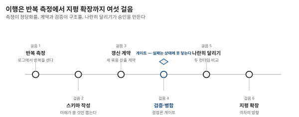

## 제17장 · 상태 설계 역설

> 원문: SKILL.state — arXiv:2608.26263 전편의 실무 적용 (이 장은 논문의 결과를 딛고 쓴 저자의 가이드다)

### 한 줄 요약

이 책의 실무 요약 — 무엇을 상태에 올릴지 정하는 질문 여섯 개와, 기존 대화형 에이전트를 상태형으로 옮기는 절차.

### 상태 설계의 질문 여섯

16장의 분류기를 통과했다면 — 과제가 절차적이고, 스키마를 미리 그릴 수 있고, 궤적 자체가 산출물이 아니라면 — 남은 일은 상태를 짜는 것이다. 논문과 계보에서 뽑은 여섯 개의 질문이 전부다.

**하나 — 미래가 필요로 하는가.** 상태에 올릴 자격은 딱 이것뿐이다. 다음 행동을 고르는 데 참조되지 않는 사실은 아무리 흥미로워도 상태가 아니라 잡동사니다. "이 정보가 뒤에 또 쓰이는가"를 모든 필드에 던져 보라 — 걸리는 필드는 지우는 것이 상태의 다이어트다.

**둘 — 도메인 전체를 덮는가.** 일 건건이 스키마를 새로 짜지 마라. 창고의 500선반이 그랬고 CTF의 100과제가 그랬듯, 도메인의 뼈대 하나면 수많은 일을 받친다. 스키마가 일 따라 늘어난다면 도메인 모델링이 아니라 코딩을 하고 있는 것이다.

**셋 — 갱신이 문장인가 명령인가.** 상태 갱신은 산문이 아니라 연산이어야 한다. "3번 선반쯤에 있었던 것 같다"가 아니라 `"shelf_3": null`이다. 요약 상한이 0.52에서 멈춘 이유(9장)를 문법의 차이로 다시 읽는 것이다.

**넷 — 지워야 할 것도 말할 수 있는가.** null-삭제 문법을 가져라. 사실은 생기기만 하지 않는다 — 출하되고, 취소되고, 뒤집힌다. 갱신 계약이 삭제 동사를 모르면 상태는 쓰레기장이 된다.

**다섯 — 틀린 갱신이 어디서 멈추는가.** 검증의 자리를 정해 두어라. 스키마 위반·자료형 위반은 런타임이, 의미의 오류는 다음 관찰이 잡는다. 모델의 실수가 영구 장부로 통과하는 경로가 하나라도 있으면 이 설계의 보험(3장의 분업)은 끊긴다.

**여섯 — 회복은 즉시인가.** 세계가 내 동작 밖에서 바뀌는 통로를 만들어 두고, 그 통로로 온 소식이 상태를 즉시 갱신하는지 시험해라. 7장의 실험 3이 재현 규격이다 — 회복 단계 0이 목표이고, 몇 턴을 헤매는지가 설계의 성적표다.

### 이행 절차 — 다섯 걸음

이미 돌아가는 대화형 에이전트를 상태형으로 옮기는 절차. 논문의 구조를 그대로 실무의 단계로 옮긴 것이다.

**걸음 1 · 반복을 센다.** 로그에서 같은 행동의 반복 — 다시 읽은 파일, 다시 날린 질의, 다시 실패한 시도 — 을 센다(8장). 이 숫자가 이행의 정당화이자 이행 뒤 성과의 기준선이 된다.

**걸음 2 · 스키마를 쓴다.** 도메인에서 미래의 실행을 좌우하는 것들만 뽑아 필드로 만든다. 다섯 개 안팎에서 시작하라 — CTF가 그랬다. 후보 칸(중요할지 모르는 것)을 하나 둘 수 있으나 전부 후보면 스키마가 아니다.

**걸음 3 · 갱신 계약을 문다.** 매 턴의 산출을 추론·갱신·행동의 세 묶음으로 못 박고, 갱신은 JSON 병합 조각으로만 받는다. 프롬프트에 "추론은 실행 뒤 버린다"고 미리 공지하는 것까지 논문의 문법 그대로.

**걸음 4 · 검증과 병합을 런타임에 둔다.** 갱신의 검증을 결정론 코드로 쓰고, null-삭제 병합을 구현한다. 재시도 예산을 정해 두고, 검증 실패가 영구 상태에 닿지 않는 것을 테스트로 못 박는다.

**걸음 5 · 나란히 달려 옮긴다.** 한쪽을 버리지 말고 두 런타임을 같은 과제 묶음에 돌려 정확도·턴당 입력·총 토큰을 나란히 적는다. 6장의 표가 목표 형태다. 그리고 지평을 늘려가며 격차의 방향을 본다 — 이 대조가 이행의 승인 도장이다.

### 나의 해석 — 역설의 이름을 풀다

장의 제목을 풀 마지막 자리다. 상태 설계의 역설은 이것이다 — **가장 좋은 상태는 가장 적게 남은 상태다.** 이력을 다 갖는 것이 아니라 아무것도 안 갖는 것이 문제였으니, 해답은 "많이 기억"과 "덜 기억"의 중간이 아니라 **옳게 기억**의 다른 자리에 있다. 무엇이 남아야 하는지 아는 순간 얼마나 남는지는 자동으로 정해진다. 그래서 이 장의 절차가 상태를 "쌓는" 순서가 아니라 "고르는" 질문으로 시작하는 것이다.

마지막으로 한 점 — 이 설계는 프레임워크가 아니라 패턴이다. 오늘 밤 파이썬 백 지면으로 시작할 수 있고, 기존 시스템의 세션 변수를 재활용할 수도 있다(12장). 도입의 비용이 낮다는 것이 이 논문이 실무에게 주는 덤이다. 필요한 것은 코드가 아니라 질문이다 — "지금, 상태가 뭔가."
