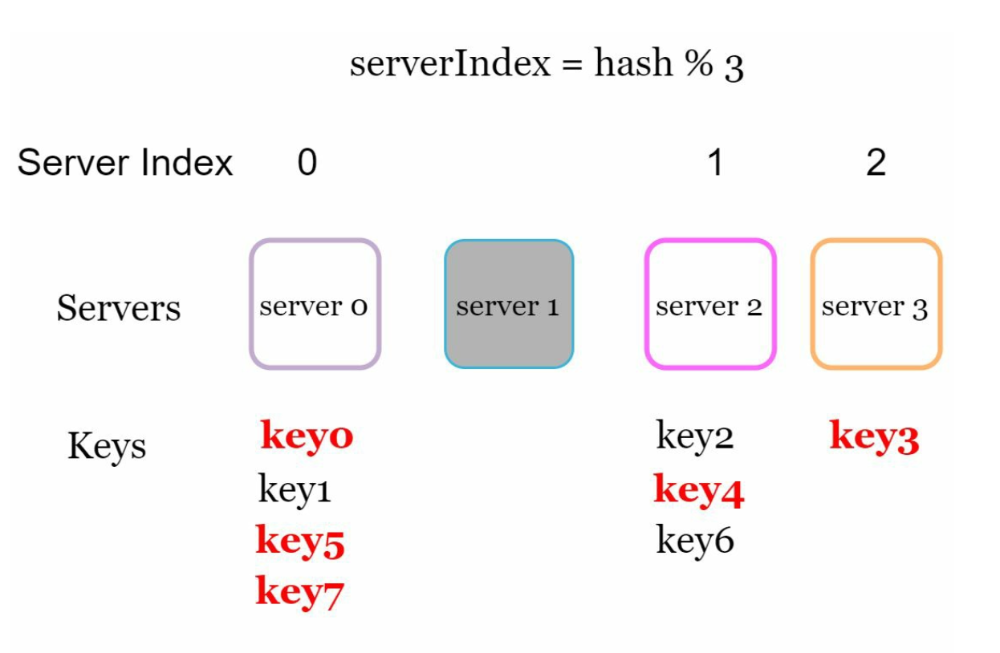
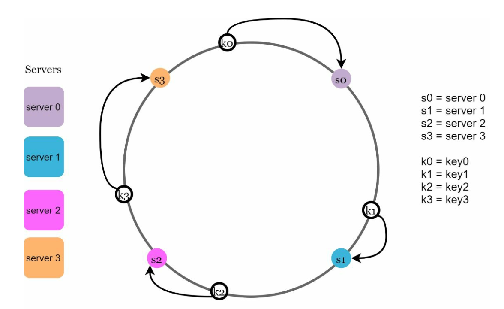
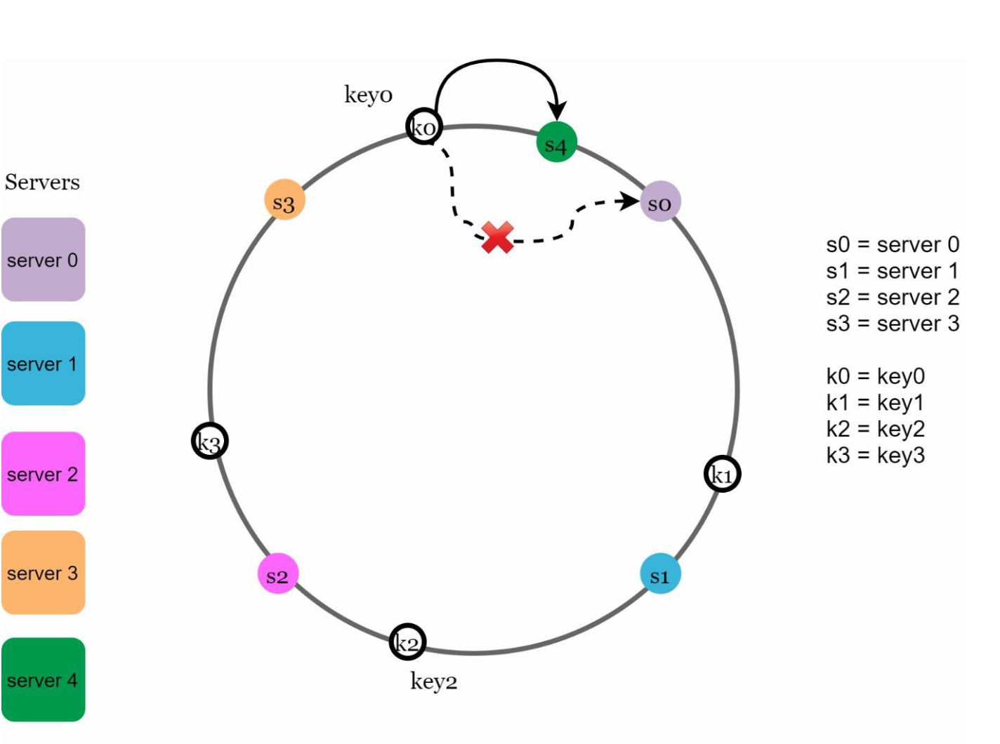
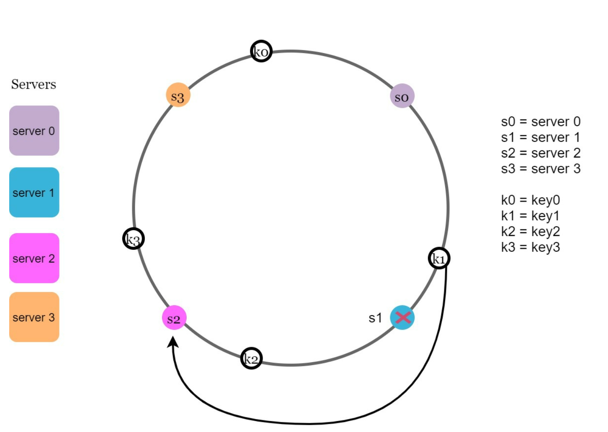

## CHAPTER 05 · 일관성 해시 설계

### 들어가며
이 장에서는 일관성 해시(consistent hashing)를 다룬다. 일관성 해시는 요청과 데이터를 서버에 효율적으로 분산하여 수평적 확장을 달성하는 데 필수적인 기술이다. 서버가 추가되거나 제거될 때 데이터 재분배를 최소화하고, 데이터를 고르게 분배하여 서버 핫스팟 같은 문제를 완화한다.

### 재해싱 문제
#### 설명
전통적인 해싱 방식(예: `serverIndex = hash(key) % N`)에서는 서버 수가 변하면 데이터 재분배가 문제가 된다. 예를 들어:
- 서버를 제거하면 대부분의 키가 재할당되어 캐시 미스가 발생한다.
- 서버를 추가하면 불필요한 키 재분배가 일어난다.

- 이 방식은 서버 풀의 크기가 고정되어 있을 때는 잘 동작한다. 하지만 새 서버가 추가되거나 기존 서버가 제거되면 문제가 생긴다.

#### 핵심 문제
서버 수가 변할 때 대부분의 키가 재분배되면 비효율과 과부하를 초래한다.

### 일관성 해시
#### 정의
일관성 해시는 서버가 추가되거나 제거될 때 재매핑되는 키가 일부에 그치도록 보장한다. 이는 중단을 최소화하고 확장성을 높인다.

#### 핵심 개념
1. **해시 공간과 링:** 해시 공간은 연속적인 링을 이루며, 해시 값은 `0`부터 `2^160-1`까지 분포한다(예: SHA-1 같은 해시 함수 사용). 양 끝을 연결하면 링이 된다.

- 같은 해시 함수 f를 사용해 서버를 서버 IP나 이름 기준으로 링 위에 배치한다.

1. **서버 조회**
- 키가 속할 서버는 링을 시계 방향으로 순회하다가 처음 만나는 서버로 정해진다.

2. **서버 추가와 제거**
- 서버를 추가하면 인접한 키만 재분배된다. 즉 일부 키만 새 서버로 재분배된다.

- 서버를 제거하면 해당 범위의 키에만 영향을 미친다. 제거된 서버의 키만 시계 방향으로 다음 서버에 재할당된다.

### 과제와 해결책
#### 기본 접근법의 두 가지 문제
1. **파티션 크기의 불균형:** 서버마다 데이터 파티션 크기가 다를 수 있다.
2. **키 분포의 불균형:** 일부 서버가 다른 서버보다 지나치게 많은 키를 받을 수 있다.

#### 해결책: 가상 노드
- 각 서버는 링 위에 고르게 분포한 여러 개의 가상 노드(virtual node)로 표현된다.
- 가상 노드는 키 분포를 개선하고 부하를 고르게 한다. 가상 노드 수가 늘어날수록 키 분포는 더 균형 잡힌다. 가상 노드가 많아지면 표준편차가 작아져 데이터 분포가 균형을 이루기 때문이다.

### 영향을 받는 키
서버가 추가되거나 제거될 때:
- **서버 추가:** 영향을 받는 키는 새 서버와 그 이전 노드 사이에 있는 키다. 다음 예에서는 서버 4가 링에 추가된다. 영향 범위는 s4(새로 추가된 노드)에서 시작해 링을 반시계 방향으로 이동하다가 서버(s3)를 만나면 끝난다. 따라서 s3와 s4 사이에 있는 키는 s4로 재분배해야 한다.

- **서버 제거:** 영향을 받는 키는 제거된 서버와 그 이전 노드 사이에 있는 키다. 다음 예에서는 서버(s1)가 제거된다. 영향 범위는 s1(제거된 노드)에서 시작해 링을 반시계 방향으로 이동하다가 서버(s0)를 만나면 끝난다. 따라서 s0과 s1 사이에 있는 키는 s2로 재분배해야 한다.

### 일관성 해시의 장점
- **최소화된 재분배:** 일부 키만 재할당된다.
- **확장성:** 수평적 확장이 가능하다.
- **핫스팟 완화:** 데이터 분포를 고르게 하여 서버 과부하를 막는다.

### 실제 사례
- Amazon Dynamo DB
- Apache Cassandra
- Discord
- Akamai CDN
- Maglev Load Balancer
