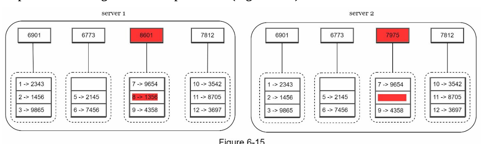
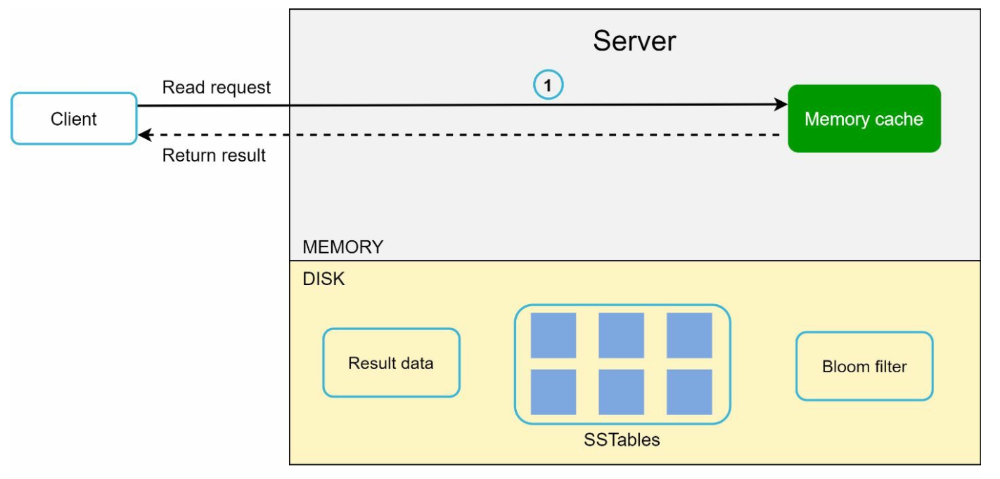

## CHAPTER 06 · 키-값 저장소 설계

### 들어가며
**키-값 저장소(key-value store)**는 데이터를 키-값 쌍으로 저장하는 비관계형 데이터베이스의 한 종류이다. 각 키는 고유하며, 값을 이 키로 조회한다. 이 장에서는 다음과 같은 연산을 지원하는, 확장 가능하고 고가용성인 분산 키-값 저장소를 설계하는 방법을 상세히 다룬다:
- 데이터를 삽입하는 `put(key, value)`.
- 데이터를 조회하는 `get(key)`.

#### 설계의 특성
- 작은 크기의 키-값 쌍(<10 KB).
- 고가용성과 확장성으로 빅데이터 지원.
- 자동 확장과 조정 가능한 일관성.
- 낮은 지연 시간.

### 단일 서버 키-값 저장소
#### 구현
- 메모리에 키-값 쌍을 저장하는 데 **해시 테이블**을 사용한다.
- 최적화 기법:
  - 데이터 압축.
  - 자주 접근하지 않는 데이터를 디스크에 저장.

#### 한계
단일 서버의 메모리는 제한적이므로, 확장성을 위해서는 **분산 접근법**이 필요하다.

### 분산 키-값 저장소
**분산 키-값 저장소**는 데이터를 여러 서버에 파티셔닝하며, **CAP 정리(CAP theorem)**가 제시하는 트레이드오프를 반드시 다뤄야 한다.

#### CAP 정리
1. **일관성(consistency):** 모든 클라이언트가 같은 데이터를 동시에 본다.
2. **가용성(availability):** 일부 노드에 장애가 생겨도 시스템이 모든 요청에 응답한다.
3. **파티션 감내(partition tolerance):** 네트워크 파티션이 발생하더라도 시스템이 계속 동작한다.

**트레이드오프:** CAP 정리에 따르면 세 가지 보장 중 두 가지만 만족시킬 수 있다.

#### 시스템 유형:
- **CP 시스템:** 가용성을 희생하고 일관성과 파티션 감내를 선택한다(예: 은행 시스템).
- **AP 시스템:** 일관성을 희생하고 가용성과 파티션 감내를 선택한다(예: 최종적 일관성).
- **CA 시스템:** 파티션 감내를 희생하고 일관성과 가용성을 선택한다.

    **네트워크 장애는 피할 수 없으므로 분산 시스템은 네트워크 파티션을 감내해야 한다. 따라서 CA 시스템은 실제 환경에는 존재할 수 없다.**

    분산 시스템에서 파티션은 피할 수 없다. 파티션이 발생하면 일관성과 가용성 중 하나를 선택해야 한다. 예를 들어 노드 n3에 장애가 발생하면, 노드 n1이나 n2에 기록된 데이터는 n3로 전파될 수 없다. 반대로 데이터가 n3에 기록되었지만 아직 n1과 n2로 전파되지 않았다면 n1과 n2는 오래된 데이터를 갖게 된다.

    

- CP 시스템을 선택하면 데이터 불일치를 피하기 위해 n1과 n2의 모든 쓰기 연산을 차단해야 한다.
- AP 시스템을 선택하면 오래된 데이터를 반환할 수 있더라도 시스템은 계속 읽기를 받아들인다. 쓰기의 경우 n1과 n2가 계속 쓰기를 받아들이며, 네트워크 파티션이 해결되면 데이터가 n3로 동기화된다.

### 시스템 컴포넌트
#### 1. 데이터 파티셔닝
- **기법:** 일관성 해시를 사용해 데이터를 여러 서버에 고르게 분산한다.
- **장점:**
  - 서버 추가·제거 시 자동 확장.
  - 가상 노드를 통한 이질성 지원. 서버의 가상 노드 수는 서버 용량에 비례한다.

#### 2. 데이터 복제
- 고가용성을 위해 데이터를 `N`개 서버에 복제한다.
- N개 서버는 해당 서버의 위치에서 시계 방향으로 링을 순회하며 처음 만나는 N개 서버로 선택해 데이터 사본을 저장한다. 가상 노드를 사용하는 경우 사본을 서로 다른 데이터 센터에 배치해 신뢰성을 높인다.

    

#### 3. 일관성
데이터가 여러 노드에 복제되므로 사본 간에 동기화되어야 한다.
- **쿼럼 합의(quorum consensus):**
  - `N`: 사본 총 개수.
  - `W`: 쓰기 쿼럼 크기. 쓰기가 성공으로 간주되려면 W개 사본으로부터 쓰기 승인을 받아야 한다.
  - `R`: 읽기 쿼럼 크기. 읽기가 성공으로 간주되려면 최소 R개 사본의 응답을 기다려야 한다.
  - **규칙:** `W + R > N`이면 강한 일관성이 보장된다.
  - W, R, N의 구성은 지연 시간과 일관성 사이의 전형적인 트레이드오프다.

    

    - R = 1이고 W = N이면 시스템은 빠른 읽기에 최적화된다.
    - W = 1이고 R = N이면 시스템은 빠른 쓰기에 최적화된다.
    - W + R > N이면 강한 일관성이 보장된다(보통 N = 3, W = R = 2).
    - W + R <= N이면 강한 일관성은 보장되지 않는다.

- **모델:**
  - **강한 일관성:** 읽기 연산은 가장 최근에 갱신된 쓰기 데이터 항목의 결과에 해당하는 값을 반환한다.
  - **약한 일관성:** 이후의 읽기 연산은 최신 값을 보지 못할 수 있다.
  - **최종적 일관성:** 충분한 시간이 지나면 모든 갱신이 전파되어 모든 사본이 일관성을 이룬다.

#### 4. 불일치 해결
복제는 고가용성을 제공하지만 사본 간 불일치를 유발한다. 불일치 문제를 해결하기 위해 버전화(versioning)와 벡터 시계(vector clock)를 사용한다.
- **버전화:**
    - **벡터 시계**를 사용해 데이터 버전을 추적하고 충돌을 해결한다.
    - 버전화는 데이터가 수정될 때마다 이를 새로운 불변 버전의 데이터로 다룬다는 뜻이다.

        
        

    - 서버 1이 이름을 변경하고, 서버 2도 이름을 변경한다. 두 변경은 동시에 수행된다. 이제 v1과 v2라는 버전으로 불리는 충돌하는 값을 갖게 된다.

- **벡터 시계**
    1. **구성**: 벡터 시계는 데이터 항목에 연관된 [서버, 버전] 쌍이다. 이를 사용하여 한 버전이 다른 버전보다 앞서는지, 뒤지는지, 충돌하는지 판별할 수 있다.
        - 벡터 시계를 D([S1, v1], [S2, v2], …, [Sn, vn])로 표현한다고 하자. 데이터 항목 D가 서버 Si에 기록되면, 시스템은 다음 작업 중 하나를 수행해야 한다.
        - 여기서 `D`는 데이터 항목, `Si`는 서버 식별자, `vi`는 서버 `Si`에 있는 데이터의 버전 카운터다.

    2. **벡터 시계 갱신:** 서버에서 데이터 항목이 수정되면:
        - 해당 서버가 벡터 시계에 이미 존재하면 그 버전 카운터를 증가시킨다.
        - 그렇지 않으면 벡터 시계에 새 항목을 추가한다.

    3. **충돌 감지:**
        - **충돌 없음:** 버전 X의 모든 카운터가 버전 Y의 대응 카운터 이하이면 X는 Y의 조상이다.
        - **충돌 존재:** Y에 X의 대응 카운터보다 작은 카운터가 하나라도 있으면 두 버전은 형제(sibling) 관계다.

    4. **충돌 해결:** 충돌(형제 버전)이 감지되면, 시스템은 애플리케이션별 로직이나 클라이언트 개입에 의존하여 데이터를 조정한다.

        

- **과제:**
  - 클라이언트 복잡도 증가.
  - 갱신이 많아지면 벡터 시계 크기가 커질 수 있어, 크기를 제한하는 다듬기 전략이 필요하다.

#### 5. 장애 처리

#### a. 장애 감지
다른 서버가 어떤 서버의 장애를 보고했다는 이유만으로 그 서버가 죽었다고 믿는 것은 충분하지 않다. 보통 서버를 장애로 표시하려면 최소 두 개의 독립적인 정보원이 필요하다.
- **가십 프로토콜(gossip protocol):**

    

    - 각 노드는 멤버 ID와 하트비트 카운터를 유지한다.
    - 각 노드는 주기적으로 자신의 하트비트 카운터를 증가시킨다.
    - 각 노드는 주기적으로 무작위로 선택한 노드 집합에 하트비트를 보낸다.
    - 사전에 정의한 기간보다 오랫동안 하트비트가 증가하지 않으면 해당 멤버를 오프라인으로 간주한다.

#### b. 일시적 장애
- **느슨한 쿼럼(sloppy quorum):** 정상 노드를 사용해 연산을 일시적으로 유지한다.

        

    - 장애를 감지한 후 시스템은 가용성을 보장하기 위해 몇 가지 메커니즘을 배치해야 한다.
    - 시스템은 쿼럼 요건을 엄격히 적용하는 대신, 해시 링(hash ring)에서 쓰기에는 처음 만나는 W개의 정상 서버를, 읽기에는 처음 만나는 R개의 정상 서버를 선택한다.
    - 오프라인 서버는 무시한다. 서버를 사용할 수 없으면 다른 서버가 일시적으로 요청을 처리한다.

- **힌티드 핸드오프(hinted handoff):** 오프라인이었던 서버는 복구된 후 변경 사항을 따라잡는다.
    - 장애 서버가 다시 살아나면 변경 사항을 다시 밀어넣어 데이터 일관성을 달성한다.

#### c. 영구 장애
- 사본 간 효율적인 동기화를 위해 **머클 트리(Merkle tree)**를 사용한다.
    **머클 트리**(해시 트리라고도 한다)는 영구 장애 상황에서 사본 간 불일치를 효율적으로 감지하고 해결하는 데이터 구조다.

- 동작 방식
    1. **구조:**
        - **리프 노드**는 개별 데이터 블록의 해시를 저장한다.
        - **리프가 아닌 노드**는 자식 노드들의 해시를 저장한다.
        - **루트 해시**는 트리에 있는 전체 데이터의 통합 상태를 나타낸다.

    2. **머클 트리 구축:**
        - **1단계:** 키 공간을 버킷으로 나눈다.

            

        - **2단계:** 버킷 안의 각 키를 균등 해싱으로 해싱한다.

            

        - **3단계:** 버킷마다 하나의 해시를 만든다.

            

        - **4단계:** 버킷 해시들을 조합해 상위 수준의 해시를 계산하고, 최종적으로 루트 해시를 만든다.

            

    3. **동기화:**
        - 두 사본을 동기화하려면:
            - 양쪽의 루트 해시를 비교한다.
            - 루트 해시가 같으면 두 사본은 일관적이다.
            - 루트 해시가 다르면 자식 해시를 재귀적으로 비교하여 불일치하는 버킷을 찾아낸다.
        - 불일치하는 데이터만 동기화한다.

- 장점
    - **효율성:** 불일치하는 데이터만 동기화하므로 데이터 전송량이 줄어든다.
    - **확장성:** 최소한의 동기화 오버헤드로 대규모 데이터셋에 효과적이다.
    - **신뢰성:** 사본 간 데이터 일관성을 보장한다.

#### 6. 데이터 센터 장애 처리
- 장애 발생 시에도 가용성을 보장하려면 데이터를 여러 데이터 센터에 복제한다.

### 쓰기 경로와 읽기 경로
#### 1. 쓰기 경로 (Cassandra 아키텍처 기반)

- 쓰기를 **커밋 로그(commit log)**에 기록한다.
- 데이터를 **메모리 캐시**에 저장한다.
- 캐시가 가득 차면 데이터를 디스크의 **SSTable**(Sorted String Table)로 플러시한다.

#### 2. 읽기 경로

- **메모리 캐시**에서 데이터를 확인한다.
- 없으면 **블룸 필터**를 사용해 SSTable에서 데이터 위치를 찾는다.
- 데이터를 가져와 반환한다.

### 최종 아키텍처

- 클라이언트는 get(key)와 put(key, value)라는 간단한 API로 키-값 저장소와 통신한다.
- 코디네이터는 클라이언트와 키-값 저장소 사이에서 프록시 역할을 하는 노드다.
- 노드는 일관성 해시를 사용해 링 위에 분산된다.
- 시스템은 완전히 탈중앙화되어 있어 노드 추가와 이동이 자동으로 이루어질 수 있다.
- 데이터는 여러 노드에 복제된다.
- 모든 노드가 동일한 책임 집합을 갖고 있으므로 단일 장애 지점이 없다.
