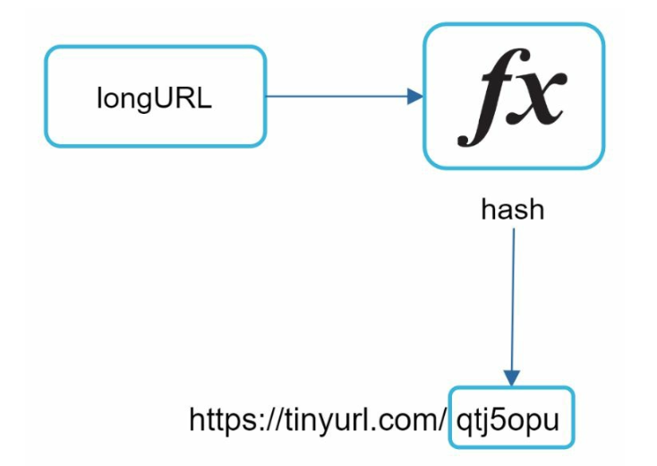
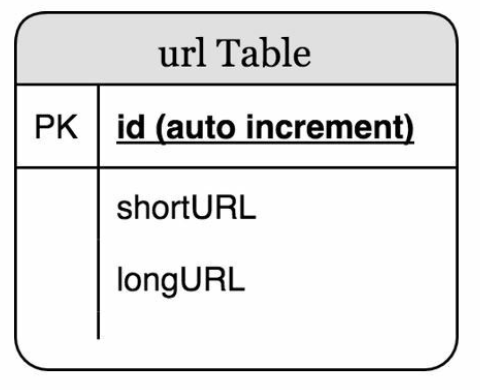
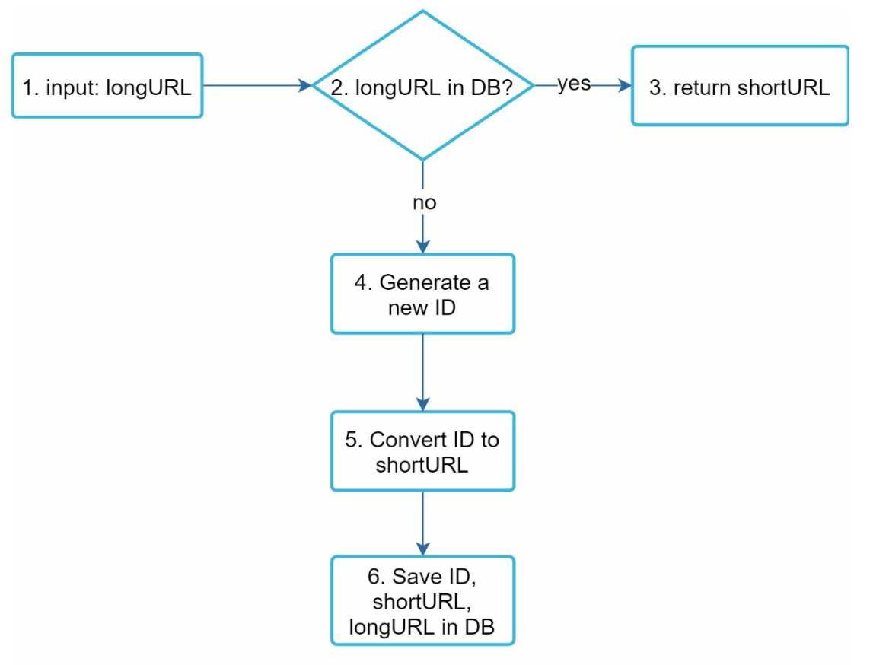
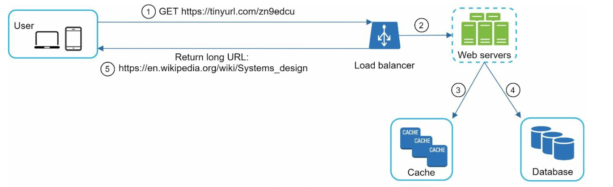

## CHAPTER 08 · URL 단축기 설계

### 들어가며
이 장에서는 TinyURL 같은 URL 단축 서비스의 설계를 다룬다. 시스템의 주요 목표는 **URL 단축**, **리다이렉션**, 그리고 대량 트래픽을 감당할 **높은 확장성**이다.

#### 요구사항
- 단축 URL은 **고유**해야 하고 가능한 한 **짧아야** 한다.
- **하루 100 million 건의 URL 생성**을 처리하며 10년 운영을 지원한다.
- 읽기와 쓰기가 10:1인 비율에서 **효율적인 읽기 연산**을 지원한다.
- 365 billion 건의 레코드를 저장하며, 10년 동안 약 **365 TB**의 저장 공간이 필요하다.

### 1단계: 개략적 설계

#### API 엔드포인트
1. **URL 단축:**
   - 엔드포인트: `POST api/v1/data/shorten`
   - 매개변수: `{longUrl: longURLString}`
   - 반환: `shortURL`

2. **URL 리다이렉션:**
   - 엔드포인트: `GET api/v1/shortUrl`
   - 반환: 리다이렉션용 `longURL`.

    

#### URL 리다이렉션
- **301 리다이렉션:** 301 리다이렉션은 요청된 URL이 긴 URL로 "영구적으로" 이동했음을 나타낸다. 브라우저가 응답을 캐시하므로, 같은 URL에 대한 이후 요청은 URL 단축 서비스로 전송되지 않는다.
- **302 리다이렉션:** 일시적 이동이며, 클릭 추적 같은 분석에 유용하다.

#### URL 단축

- **해시 함수**를 사용해 긴 URL을 고유한 단축 버전으로 매핑하는 단축 URL을 생성한다.
- 해시 함수는 다음 요구사항을 만족해야 한다:
    - 각 longURL은 하나의 hashValue로 해시되어야 한다.
    - 각 hashValue는 다시 longURL로 역매핑될 수 있어야 한다.

### 2단계: 상세 설계

#### 데이터 모델
메모리 사용을 최적화하기 위해 `<shortURL, longURL>` 매핑을 관계형 데이터베이스에 저장한다. 테이블 스키마는 다음을 포함한다:
- `id` (기본 키),
- `shortURL`,
- `longURL`.

    

#### 해시 함수
#### 1. Base 62 변환:
- 숫자를 `[0-9, a-z, A-Z]` 문자로 인코딩하며, **62개의 사용 가능한 문자**를 제공한다.
- 진법 변환은 URL 단축기에서 널리 쓰는 또 다른 접근법이다.
- 단축 URL에 고유 id를 할당하고, 이 ID를 Base 62로 변환해 단축 URL을 얻을 수 있다.
- 7자 해시는 최대 **3.5 trillion 개의 고유 URL**을 지원하며, 365 billion 개 URL로는 충분하다.

**예시:**
ID `2009215674938`를 Base 62로 변환:
- `2009215674938` → `zn9edcu`.

#### 2. 해시 + 충돌 해결:
- CRC32, MD5, SHA-1 같은 해시 함수를 사용한다.

    

- 한 가지 방법은 해시 값의 첫 7자를 사용하는 것이지만, 이 방식은 해시 충돌을 일으킬 수 있다.
- 충돌을 해결하려면 미리 정의된 문자열을 재귀적으로 덧붙여 더 이상 충돌이 없을 때까지 반복하지만, 비용이 클 수 있다.
- **블룸 필터**로 충돌을 해결해 효율적으로 조회한다.

    

#### 비교

-  **해시 + 충돌 해결:**
    - 단축 URL 길이가 고정된다
    - 고유 ID 생성기가 필요 없다
    - 충돌이 발생할 수 있어 해결이 필요하다
    - ID에 의존하지 않으므로 다음으로 사용 가능한 단축 URL을 찾을 수 없다

- **Base 62 변환**
    - 길이가 고정되지 않고 ID가 커지면 길어진다
    - 고유 ID 생성기가 필요하다
    - 충돌이 발생하지 않는다
    - ID가 1씩 증가하면 다음 단축 URL을 찾기 쉽다(보안 문제가 될 수 있다)

#### URL 단축 흐름

1. `longURL`이 데이터베이스에 있는지 확인한다.
2. 있으면 기존 `shortURL`을 반환한다.
3. 없다면:
   - **분산 ID 생성기**로 고유 ID를 생성한다.
   - 이 ID를 Base 62로 변환해 `shortURL`을 만든다.
   - `<id, shortURL, longURL>` 매핑을 데이터베이스에 저장한다.

#### URL 리다이렉션 흐름

1. 사용자가 `shortURL`을 클릭한다.
2. `<shortURL, longURL>` 매핑을 조회한다:
   - 더 빠른 접근을 위해 먼저 **캐시**를 확인한다.
   - 캐시에 없으면 데이터베이스에 조회한다.
3. 사용자를 `longURL`로 리다이렉트한다.

### 추가 고려사항
#### 처리율 제한 장치
- IP별 요청 한도를 설정해 남용을 막는다.

#### 확장성
1. **웹 계층:** 무상태이며, 웹 서버를 추가·제거해 확장한다.
2. **데이터베이스 계층:** 복제와 샤딩을 사용한다.

#### 분석
- 비즈니스 인사이트를 위해 클릭률, 유입 출처, 타임스탬프 같은 데이터를 수집한다.

#### 고가용성과 신뢰성
- 데이터베이스 복제와 내결함 설계를 통해 일관되고 신뢰할 수 있는 서비스를 보장한다.
