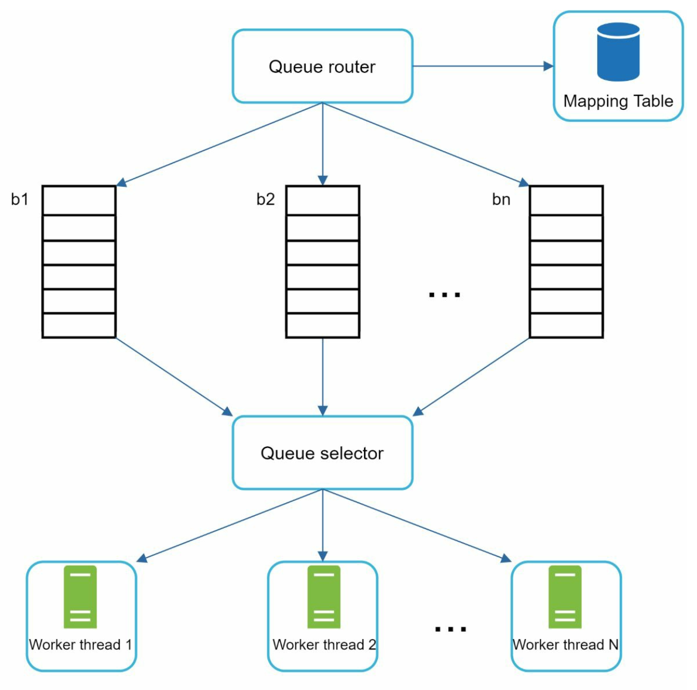

## CHAPTER 09 · 웹 크롤러 설계

### 소개
**웹 크롤러(web crawler)**는 스파이더(spider) 또는 로봇(robot)이라고도 하며, 웹 페이지, 이미지, 비디오 같은 웹 콘텐츠를 발견하고 수집하는 데 사용한다. 이 장에서는 **검색 엔진 인덱싱**을 위한 규모 확장 가능한 웹 크롤러를 설계한다.

#### 웹 크롤러의 활용 사례
1. **검색 엔진 인덱싱:** 검색 가능한 인덱스를 만들기 위해 웹 페이지를 수집한다(예: Googlebot).
2. **웹 아카이빙:** 웹 데이터를 보존하여 향후 사용할 수 있게 한다(예: 미국 의회도서관).
3. **웹 마이닝:** 웹 데이터에서 지식을 추출한다(예: 주주 보고서에 대한 재무 분석).
4. **웹 모니터링:** 저작권 또는 상표권 침해를 탐지한다.

#### 설계 과제
좋은 웹 크롤러는 다음을 해결해야 한다:
- **규모 확장성:** 병렬화를 통해 수십억 개의 페이지를 처리한다.
- **견고성:** 잘못된 HTML, 크래시, 악성 링크를 처리한다.
- **예의(politeness):** 지나치게 많은 요청으로 서버에 부하를 주지 않는다.
- **확장성:** 최소한의 변경으로 새로운 콘텐츠 유형을 지원한다.

### 1단계: 문제 이해

#### 요구사항
1. **월 10억 개의 웹 페이지**를 크롤링한다(초당 400페이지, 최대 800 QPS).
2. **HTML 콘텐츠만** 수집한다.
3. 새로 추가되거나 갱신된 페이지를 추적한다.
4. 중복 콘텐츠는 무시한다.
5. 크롤링한 데이터를 **5년간** 보관하며, 약 30 PB의 저장 공간이 필요하다.

### 2단계: 개략적 설계

#### 컴포넌트

1. **시드 URL:** 크롤러의 시작점이다.
    - 크롤러가 가능한 한 많은 링크를 순회하는 데 활용할 수 있는 좋은 출발점이 되도록 신중하게 선택해야 한다.
    - 인기 웹사이트의 지역성 또는 주제를 기준으로 정할 수 있다.
    - 전략: 지역이나 주제(예: 스포츠, 헬스케어)로 분류한다.

2. **URL 프론티어(URL frontier):** 다운로드할 URL을 보관한다.
   - **FIFO 큐**로 구현한다.

3. **HTML 다운로더:** URL 프론티어가 제공한 URL로 웹 페이지를 다운로드한다.

4. **DNS 리졸버:** URL을 IP 주소로 변환한다.

5. **콘텐츠 파서:** 웹 페이지의 유효성을 검증하고 파싱한다.
   - 잘못된 형식의 페이지는 버린다.

6. **콘텐츠 중복 확인(Content Seen?):** 해시 비교(두 웹 페이지의 해시값 비교)로 중복 콘텐츠를 검사한다.

7. **콘텐츠 저장소:** HTML 페이지를 디스크에 저장한다(인기 콘텐츠는 지연 시간을 줄이기 위해 메모리에 둔다).

8. **URL 추출기:** 파싱된 페이지에서 새 링크를 추출한다.

9. **URL 필터:** 블랙리스트에 있거나 잘못된 URL은 제외한다.

10. **URL 중복 확인(URL Seen?):** 이미 방문한 URL을 추적해 중복을 피한다.

11. **URL 저장소:** 이미 방문한 URL을 보관한다.

#### 작업 흐름
1. **시드 URL**을 URL 프론티어에 추가한다.
2. **HTML 다운로더**가 URL을 가져와 DNS 리졸버로 해당 IP를 해석한다.
3. **콘텐츠 파서**가 콘텐츠의 유효성을 검증한 뒤 "콘텐츠 중복 확인(Content Seen?)" 컴포넌트로 전달한다.
4. 콘텐츠가 새것이면 **URL 추출기**로 링크를 추출한다.
5. 필터링한 뒤 중복 없는 링크를 URL 프론티어에 추가한다.

### 3단계: 핵심 컴포넌트 상세 설계
#### DFS/BFS
-  웹은 웹 페이지를 노드, 하이퍼링크(URL)를 간선으로 하는 방향 그래프로 볼 수 있다.
-  그래프 순회에는 주로 너비 우선 탐색(BFS)을 사용한다. 깊이가 매우 깊어질 수 있어 깊이 우선 탐색(DFS)은 적합하지 않기 때문이다.
-  표준 BFS는 URL의 우선순위를 고려하지 않는데, 모든 페이지의 품질과 중요도가 같은 수준인 것은 아니다.

#### URL 프론티어
- **예의:**
    - 한 번에 호스트당 요청이 하나만 발생하도록 보장한다. 두 다운로드 작업 사이에는 지연 시간을 둔다.
    - 호스트명과 큐, 그리고 작업(다운로드) 스레드를 매핑해 사용한다.
    - 각 다운로더 스레드는 자기 전용 FIFO 큐를 가지며, 그 큐의 URL만 다운로드한다.

        

    - **큐 라우터:** 각 큐(b1, b2, … bn)에 같은 호스트의 URL만 담기도록 보장한다.
    - **매핑 테이블:** 각 호스트를 큐에 매핑한다.
    - **큐 선택기:** 각 작업 스레드는 FIFO 큐 하나에 매핑되며, 그 큐의 URL만 다운로드한다. 큐 선택 로직은 큐 선택기가 수행한다.
    - **작업 스레드 1~N:** 작업 스레드는 같은 호스트의 웹 페이지를 순차적으로 다운로드한다. 두 다운로드 작업 사이에 지연을 둘 수 있다.

- **우선순위:**
    - 중요한 페이지에 높은 우선순위를 부여한다(예: PageRank나 갱신 빈도 기준).

        

    - **우선순위 계산기(prioritizer):** URL을 입력받아 우선순위를 계산한다.
    - **큐 f1~fn:** 각 큐에는 우선순위가 할당되어 있다. 우선순위가 높은 큐가 더 높은 확률로 선택된다.
    - **큐 선택기:** 높은 우선순위의 큐 쪽으로 편향된 무작위 선택을 한다.
    - **프런트 큐(front queue):** 우선순위를 관리한다.
    - **백 큐(back queue):** 예의를 관리한다.

- **신선도:** 갱신 이력이나 중요도에 따라 다시 크롤링한다.

#### HTML 다운로더
- **robots.txt 준수:** robots.txt 파일의 규칙을 존중한다.
- **성능 최적화:**
  1. 여러 서버를 이용한 분산 크롤링.
  2. 반복 조회를 피하기 위해 **DNS 캐시**를 사용한다.
  3. 더 빠른 다운로드를 위해 크롤 서버를 지리적으로 분산한다.
  4. 느리거나 응답하지 않는 서버를 피하기 위해 짧은 타임아웃을 사용한다.

#### 견고성
1. **안정 해시:** 서버 간 부하를 효과적으로 분산한다.
2. **에러 처리:** 예외로 인한 시스템 크래시를 막는다.
3. **데이터 검증:** 콘텐츠 무결성을 보장한다.

#### 확장성
- 새 콘텐츠 유형을 위한 모듈을 추가한다(예: PNG 다운로더, 웹 모니터).
- 예: 웹 콘텐츠의 저작권 침해를 감시하는 모듈을 플러그인 형태로 끼워 넣는다.

    

#### 문제가 되는 콘텐츠 회피
1. **중복 콘텐츠:** 해시 비교로 탐지한다.
2. **스파이더 트랩:** URL 길이 제한 같은 기법으로 무한 루프를 피한다.
3. **데이터 노이즈:** 광고나 스팸 같은 무관한 콘텐츠를 걸러낸다.

### 4단계: 마무리
#### 핵심 정리
1. 웹 크롤러는 규모 확장성, 견고성, 예의, 확장성의 균형을 맞춰야 한다.
2. **예의**는 서버 과부하를 막고, **우선순위**는 중요한 페이지를 먼저 크롤링하도록 보장한다.
3. 대규모 크롤링을 처리하려면 효율적인 저장소와 에러 처리가 필수적이다.

#### 추가 고려사항
- **서버 사이드 렌더링:** JavaScript나 AJAX가 생성하는 동적 콘텐츠를 처리한다.
- **스팸 방지 조치:** 저품질이거나 무관한 페이지를 제외한다.
- **데이터베이스 샤딩:** 복제와 샤딩으로 데이터 계층의 규모를 확장한다.
- **수평적 규모 확장:** 상태 비저장 서버로 크롤 작업을 효율적으로 확장한다.
- **분석:** 데이터를 수집·분석해 인사이트를 얻는다.
