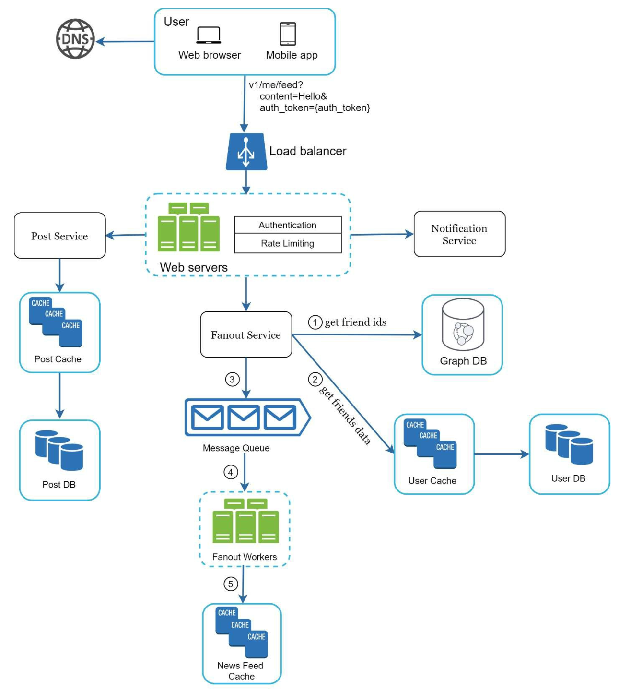
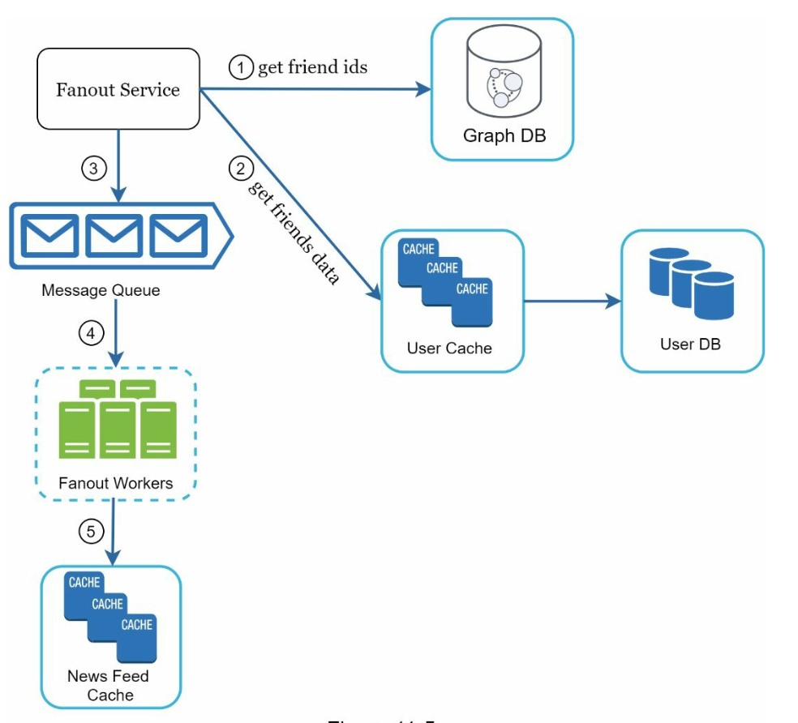

## CHAPTER 11 · 뉴스 피드 시스템 설계

### 소개
**뉴스 피드 시스템(news feed system)**은 사용자의 연결(connections)이 올린 게시물(상태 업데이트, 사진, 비디오, 링크)을 지속적으로 갱신해 보여 주는 목록이다. Facebook의 뉴스 피드, Instagram의 피드, Twitter의 타임라인이 예시다. 이 장에서는 규모 확장 가능한 뉴스 피드 시스템의 설계를 다룬다.

### 1단계: 문제 이해

#### 요구사항
1. **플랫폼:** 웹과 모바일 앱을 모두 지원한다.
2. **기능:**
   - 사용자가 게시물을 발행할 수 있다.
   - 사용자가 뉴스 피드에서 친구의 게시물을 볼 수 있다.
3. **정렬:** 단순화를 위해 피드를 **시간 역순(reverse chronological order)**으로 정렬한다.
4. **규모:**
   - 사용자는 최대 5,000명의 친구를 가질 수 있다.
   - 일일 활성 사용자 1,000만 명(DAU).
   - 피드에는 텍스트, 이미지, 비디오가 포함될 수 있다.

### 2단계: 개략적 설계

#### 개요
이 설계에는 두 개의 주요 흐름이 있다:
1. **피드 발행:** 사용자가 게시물을 발행하면 데이터베이스에 저장되고 친구들의 피드로 전파된다.
2. **뉴스 피드 생성:** 사용자가 친구들의 게시물을 시간 역순으로 모아 뉴스 피드를 가져온다.

#### 뉴스 피드 API
1. **피드 발행 API:**
   - **엔드포인트:** `POST /v1/me/feed`
   - **파라미터:** `content`(게시물 텍스트)와 `auth_token`(인증).

2. **뉴스 피드 가져오기 API:**
   - **엔드포인트:** `GET /v1/me/feed`
   - **파라미터:** `auth_token`(인증).

#### 피드 발행

1. **사용자 조작:** 사용자가 피드 발행 API로 게시물을 발행한다.
2. **로드밸런서:** 트래픽을 웹 서버로 분산한다.
3. **웹 서버:** 요청을 인증하고 서비스로 전달한다.
4. **게시물 서비스:** 게시물을 데이터베이스와 캐시에 저장한다.
5. **팬아웃 서비스(fanout service):** 게시물을 캐시에 있는 친구들의 뉴스 피드로 전파한다.
6. **알림 서비스:** 친구들에게 알림을 보낸다.

#### 뉴스 피드 생성

1. **사용자 조작:** 사용자가 피드 가져오기 API로 뉴스 피드를 요청한다.
2. **로드밸런서:** 트래픽을 웹 서버로 분산한다.
3. **웹 서버:** 요청을 뉴스 피드 서비스로 전달한다.
4. **뉴스 피드 서비스:** 뉴스 피드 캐시에서 게시물 ID를 가져오고, 데이터베이스나 캐시에서 게시물의 전체 상세 정보를 조회한다.

### 3단계: 상세 설계

#### 피드 발행 상세 설계
1. **웹 서버:**
   - `auth_token`으로 사용자를 인증한다.
   - 스팸을 막기 위해 처리율 제한을 적용한다.

2. **팬아웃 서비스:**
   - **쓰기 시 팬아웃(fanout on write):** 게시물을 쓸 때 친구들의 피드에 푸시한다.
     - **장점:** 실시간 갱신, 빠른 피드 조회.
     - **단점:** 친구가 많은 사용자에게 자원이 많이 든다.
   - **읽기 시 팬아웃(fanout on read):** 읽을 때 게시물을 당겨 온다.
     - **장점:** 비활동 사용자에게 효율적이다.
     - **단점:** 피드 조회가 느리다.
   - **하이브리드 접근:** 대부분의 사용자에게는 푸시 모델을, 연결이 많은 사용자(예: 유명인)에게는 풀 모델을 사용한다.

        

    **팬아웃 서비스**는 다음과 같이 동작한다:

    1. **친구 ID 가져오기:** 그래프 데이터베이스에서 친구 목록을 조회한다.
    2. **캐시로 친구 걸러내기:** 캐시의 사용자 설정을 확인해 특정 친구(예: 뮤트한 친구나 선택적 공유 설정)를 제외한다.
    3. **메시지 큐로 전송:** 걸러낸 친구 목록과 새 게시물 ID를 메시지 큐로 보내 처리한다.
    4. **팬아웃 워커:** 워커가 메시지 큐에서 데이터를 꺼내 뉴스 피드 캐시를 갱신한다. 캐시는 메모리를 아끼려고 사용자·게시물 전체 객체 대신 `<post_id, user_id>` 매핑을 저장한다.
    5. **뉴스 피드 캐시에 저장:** 친구들의 뉴스 피드 캐시에 새 게시물 ID를 추가한다. 대부분의 사용자는 최신 콘텐츠에 집중하므로, 설정 가능한 상한을 두어 최신 게시물만 저장하고 캐시 메모리 소비를 관리 가능한 수준으로 유지한다.

        

### 뉴스 피드 가져오기 상세 설계

#### 캐시 아키텍처
캐시는 다섯 개 계층으로 나뉜다:
1. **뉴스 피드 캐시:** 빠른 조회를 위해 게시물 ID를 저장한다.
2. **콘텐츠 캐시:** 게시물 상세 정보를 저장한다(인기 게시물은 핫 캐시에).
3. **소셜 그래프 캐시:** 사용자 관계 데이터를 저장한다.
4. **액션 캐시:** 사용자 행위(좋아요, 답글, 공유)를 추적한다.
5. **카운터 캐시:** 좋아요, 답글, 팔로워 등의 수를 유지한다.

    

### 핵심 최적화

#### 규모 확장
1. **데이터베이스 규모 확장:**
   - 수평적 규모 확장과 샤딩.
   - 트래픽이 많은 쿼리에는 읽기 복제본을 사용한다.
2. **상태 비저장 웹 계층:** 수평적 규모 확장이 가능하도록 웹 서버를 상태 비저장으로 유지한다.

#### 캐싱
1. 자주 접근하는 데이터를 메모리에 저장한다.
2. 캐시 계층을 사용해 지연 시간과 데이터베이스 부하를 줄인다.

#### 신뢰성
1. **안정 해시:** 요청을 서버에 고르게 분산한다.
2. **메시지 큐:** 시스템 컴포넌트의 결합을 느슨하게 만들고 트래픽을 버퍼링한다.

#### 모니터링
1. QPS(초당 쿼리 수)나 지연 시간 같은 핵심 지표를 추적한다.
2. 캐시 적중률을 모니터링하고 그에 맞게 설정을 조정한다.
