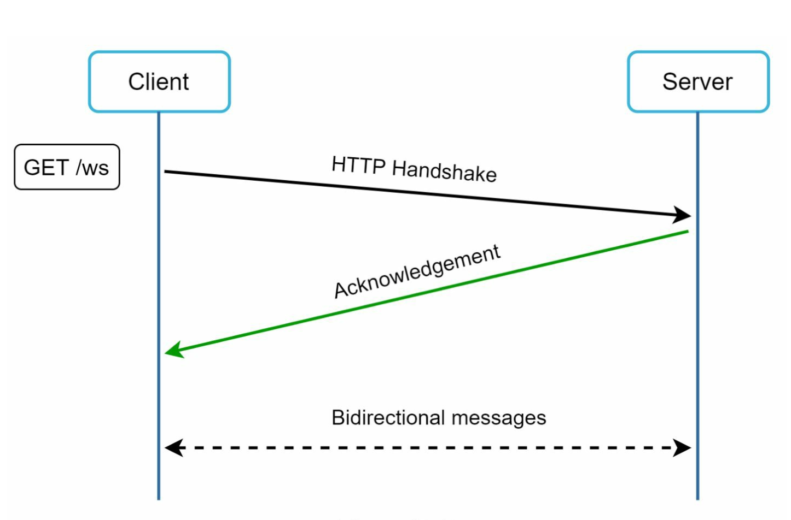
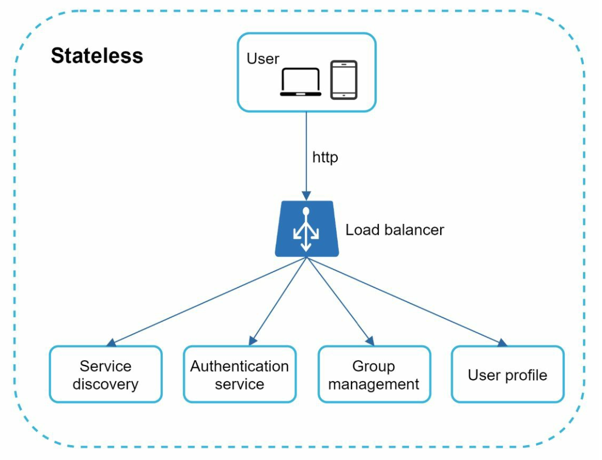
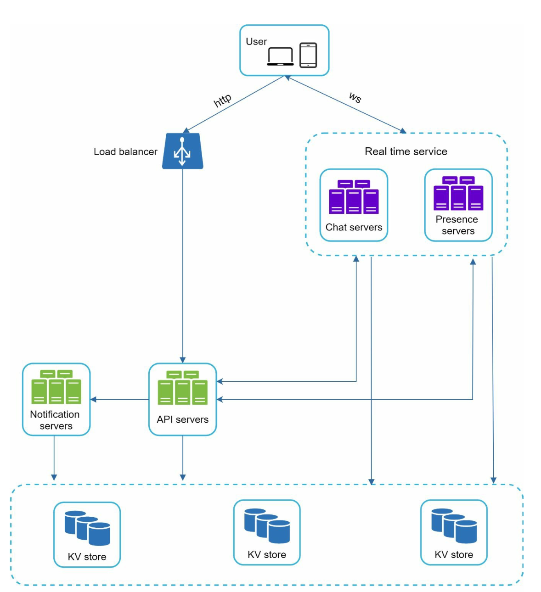
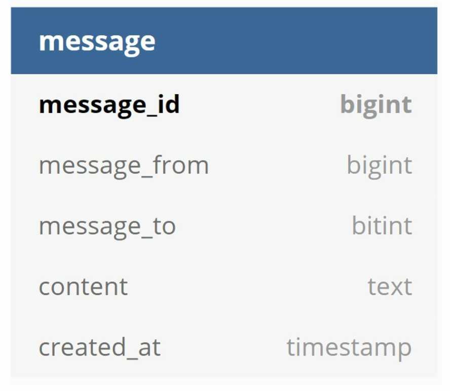

## CHAPTER 12 · 채팅 시스템 설계

### 소개
**채팅 시스템(chat system)**은 사용자 사이의 실시간 메시징을 지원한다. 이 장에서는 다음 기능을 포함하는 채팅 앱 설계에 초점을 맞춘다:
- **일대일 채팅**
- **그룹 채팅(최대 100명)**
- **온라인 상태 표시**
- **다중 기기 지원**
- **푸시 알림**

이 시스템은 **일일 활성 사용자 5,000만 명(DAU)**을 목표로 하며, 채팅 기록을 영구히 보관한다.

### 1단계: 문제 이해

#### 요구사항
1. **기능:**
   - 일대일 채팅과 그룹 채팅(최대 100명).
   - 텍스트 기반 메시지(최대 100,000자).
   - 온라인/오프라인 표시.
   - 다중 기기 지원.
   - 푸시 알림.
2. **규모:** DAU 5,000만 명을 기준으로 설계한다.
3. **저장소:** 채팅 기록을 영구 보관한다.

### 2단계: 개략적 설계

#### 통신 프로토콜
1. **송신 측:** 메시지 전송에는 HTTP를 사용하되, 효율을 위해 지속성 연결을 활용한다.

2. **수신 측:**
   - **폴링(polling):**
      - 클라이언트가 주기적으로 서버에 새 메시지가 있는지 물어본다.
      - 잦고 중복된 요청 때문에 비효율적이다.

         

   - **롱 폴링(long polling):**
      - 메시지가 도착할 때까지 연결을 열어 둔다.
      - 비활동 사용자에게는 비효율적이다.

         

   - **웹소켓(WebSocket):**
      - 실시간 통신을 위한 양방향 지속성 연결이며, 메시지 송신과 수신 양쪽에 선택되었다.
      - 메시지 송수신에는 WebSocket(ws) 프로토콜을 사용한다.

         

#### 컴포넌트

1. **상태 비저장 서비스:**
   - 회원가입, 로그인, 사용자 프로필 관리를 담당한다.
   - 서비스 디스커버리(service discovery)와 연동해 최적의 채팅 서버를 추천한다.
2. **상태 유지 서비스:**
   - 채팅 서버는 지속성 WebSocket 연결을 유지한다.
   - 메시지 전달과 동기화를 담당한다.
3. **서드파티 연동:**
   - 푸시 알림 서비스가 새 메시지를 사용자에게 알린다.
   - 알림 구현은 알림 시스템 장을 참고한다.

#### 설계

클라이언트는 실시간 메시징을 위해 채팅 서버와 지속성 WebSocket 연결을 유지한다.

- 채팅 서버는 메시지 송수신을 중개한다.
- 프레즌스 서버(presence server)는 온라인/오프라인 상태를 관리한다.
- API 서버는 로그인, 회원가입, 프로필 변경 등 나머지 전부를 처리한다.
- 알림 서버는 푸시 알림을 보낸다.
- 마지막으로, 채팅 기록 저장에는 키-값 저장소를 사용한다. 채팅 기록 데이터의 데이터베이스로 키-값 저장소를 선택한 이유는 다음과 같다:
   - 손쉬운 수평적 규모 확장이 가능하다.
   - 키-값 저장소는 데이터 접근 지연 시간이 매우 짧다.
   - 관계형 데이터베이스는 데이터의 롱 테일(long tail)을 잘 다루지 못한다. 인덱스가 커지면
임의 접근 비용이 비싸진다.
   - 검증된 신뢰성 있는 채팅 애플리케이션, 예컨대 Facebook 메신저와 Discord 모두
키-값 저장소를 채택했다.

다음은 일대일 채팅과 그룹 채팅의 데이터 모델이다.
   - 기본 키는 message id로, 메시지 순서를 결정하는 데 사용한다.
   - 그룹 채팅의 복합 기본 키는 (channel_id, message_id)다.
      - ID는 Snowflake 같은 전역 64비트 시퀀스 번호 생성기로 만들 수 있다.
      - 더 나은 방법은 지역 시퀀스 번호 생성기를 쓰는 것이다. 지역(local)이란 ID가 그룹 안에서만 유일하다는 뜻이다.
      - 지역 ID가 동작하는 이유는, 일대일 채널이나 그룹 채널 안에서 메시지 순서만 유지하면 충분하기 때문이다.

      
      

### 3단계: 상세 설계

#### 서비스 디스커버리

- 서비스 디스커버리의 주 역할은 지리적 위치, 서버 용량 같은 기준에 따라 클라이언트에게
최적의 채팅 서버를 추천하는 것이다.
- 지리적 위치와 서버 용량 같은 기준으로 채팅 서버를 배정하는 데 **Apache Zookeeper**를 사용한다.
- 효율적인 부하 분산을 보장하고 지연 시간을 최소화한다.

#### 메시지 흐름
#### 일대일 채팅

1. 사용자 A가 채팅 서버 1로 메시지를 보낸다.
2. 채팅 서버 1은 고유한 메시지 ID를 할당하고 메시지를 키-값 저장소에 저장한다.
3. 사용자 B가 온라인이면 메시지는 지속성 WebSocket 연결을 유지하는 채팅 서버 2로 전달된다.
4. 사용자 B가 오프라인이면 푸시 알림을 보낸다.

#### 그룹 채팅

- 메시지는 그룹의 각 수신자별 개별 수신함에 복사된다.
- 동기화가 단순해지지만 그룹이 커지면 비용이 커진다.
- 수신자 쪽에서는 한 수신자가 여러 사용자의 메시지를 받을 수 있다. 각 수신자는
서로 다른 발신자의 메시지를 담는 수신함(메시지 동기화 큐)을 가진다.

#### 메시지 동기화

많은 사용자가 여러 기기를 사용한다. 기기 사이에서 메시지를 동기화해야 한다.
각 기기는 기기의 최신 메시지 ID를 추적하는 cur_max_message_id라는 변수를 유지한다. 다음
두 조건을 만족하는 메시지를 새 메시지로 간주한다:

- 수신자 ID가 현재 로그인한 사용자 ID와 같다.
- 키-값 저장소의 메시지 ID가 cur_max_message_id보다 크다

#### 온라인 상태
1. **하트비트 메커니즘:**

   - 클라이언트는 자신이 온라인임을 알리려고 프레즌스 서버에 주기적으로 하트비트를 보낸다.
   - 임계값(예: x = 30) 안에 하트비트가 도착하지 않으면 사용자를 오프라인으로 표시한다.

2. **팬아웃 모델:**

   - 프레즌스 갱신은 발행/구독(pub/sub) 모델로 친구에게 푸시되며, 각 친구 쌍은 채널 하나를 유지한다.
   - 사용자 A의 온라인 상태가 바뀌면 이벤트를 A-B, A-C, A-D 세 채널에 발행한다.
   - 세 채널은 각각 사용자 B, C, D가 구독해 온라인 상태 업데이트를 받는다.
   - 위 설계는 사용자 그룹이 작을 때 효과적이다.

### 추가 고려사항
#### 규모 확장성
- **수평적 규모 확장:** 사용자가 늘면 서버를 추가한다.
- **로드밸런싱:** 트래픽을 서버에 고르게 분산한다.
- **캐싱:** 데이터베이스 부하를 줄이고 지연 시간을 개선한다.

#### 에러 처리
- **재시도 메커니즘:** 메시지 전달 실패는 재시도와 큐잉으로 처리한다.
- **서버 장애:** 장애가 발생하면 서비스 디스커버리로 새 서버를 배정한다.

#### 향후 확장
1. **미디어 지원:** 사진과 비디오 처리를 추가한다. 압축과 클라우드 저장소 포함.
2. **종단간 암호화:** 메시지 프라이버시를 보장한다.
3. **클라이언트 측 캐싱:** 데이터 전송량을 줄여 성능을 높인다.
4. **로딩 시간 개선:** 지리적으로 분산된 캐싱 네트워크를 사용한다.
