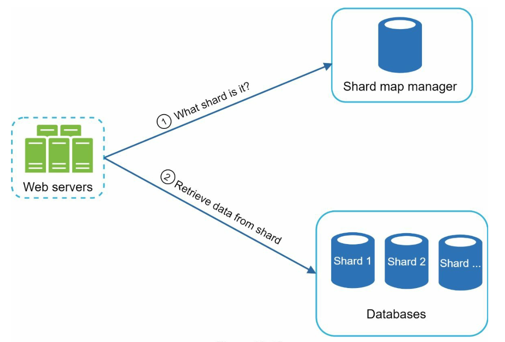

## CHAPTER 13 · 검색어 자동완성 시스템 설계

### 들어가며
자동완성은 타입어헤드(typeahead) 또는 점진적 검색(incremental search)이라고도 하며, 사용자가 검색창에 입력하는 동안 실시간으로 제안을 제공한다. 시스템은 과거 질의 데이터를 기반으로 관련성과 인기도가 높은 상위 k개(top-k) 제안을 효율적으로 전달해야 한다.

#### 핵심 기능
- 최대 **5개의 자동완성 결과**를 제안한다.
- **질의 인기도**(빈도) 기반이다.
- **소문자 영어 문자**만 지원한다.
- 빠른 응답 시간(<100 ms)과 확장성.

### 1단계: 문제 이해

#### 요구사항
1. **실시간 제안:** 사용자가 입력하는 동안 관련 있는 일치 항목을 표시한다.
2. **상위 k개 결과:** 인기도 순으로 정렬된 최대 5개의 결과를 반환한다.
3. **확장성:** **10 million DAU**를 처리하며 피크 QPS는 **48,000**이다.
4. **고가용성:** 시스템 중단 없이 장애를 처리한다.
5. **데이터 증가:** 새 질의 데이터로 인한 하루 **0.4 GB**의 저장소 증가를 지원한다.

### 2단계: 개략적 설계
개략적으로 시스템은 두 개의 서비스로 나뉜다:
1. **데이터 수집 서비스:**
    - 사용자 질의를 수집해 빈도 분석을 위해 실시간으로 집계한다.
    - 대규모 데이터셋에는 실시간 처리가 실용적이지 않지만, 좋은 출발점이 된다

2. **질의 서비스:** 사용자 입력에 기반해 상위 k개 제안을 제공한다.

#### 데이터 수집 서비스

- 분석 로그에서 질의 데이터를 집계해 빈도 테이블을 갱신한다.
- 주 단위로 과거 데이터를 처리해 **트라이(trie)**(접두어 트리)를 만든다.

#### 질의 서비스

- 데이터 수집 서비스가 만든 빈도 테이블을 사용한다.
- 사용자 입력을 처리하고 트라이를 사용해 빈도 테이블에서 상위 k개 제안을 가져온다.
- 캐싱과 효율적인 자료구조를 활용해 빠른 조회에 최적화한다.
- 예를 들어 사용자가 검색창에 "tw"를 입력하면 다음과 같이 가장 많이 검색된 상위 5개 질의가 표시된다.

### 3단계: 상세 설계

#### 트라이 자료구조
**트라이**는 질의 문자열을 효율적으로 저장하고 조회하는 데 사용되는 트리 형태의 자료구조다.

#### 핵심 기능
1. **간결한 저장:** 접두어를 계층적으로 표현해 중복을 최소화한다.
2. **빈도 정보:** 각 노드에 질의의 인기도를 저장한다.

4. **가장 많이 검색된 상위 k개 질의를 얻는 단계**

   

    - 접두어를 찾는다
    - 접두어 노드에서 서브트리를 순회해 유효한 모든 자식을 얻는다
    - 자식들을 정렬해 상위 k개를 얻는다

3. **최적화:**
   - 조회 속도를 높이고 트라이 전체를 순회하지 않도록 각 노드에 상위 k개 질의를 캐시한다.

        

   - 사용자가 아주 긴 검색 질의를 입력하는 일은 드물므로(예: 50자) 접두어 길이를 제한해 검색 공간을 줄인다.

#### 트라이 연산
1. **생성:**
    - 집계된 질의 데이터로 매주 만든다.
    - 데이터 출처는 분석 로그/DB다.
2. **갱신:** 실시간으로 갱신하는 일은 드물며, 주 단위 갱신이 기존 데이터를 대체한다.
3. **삭제:**

      

    - 필터는 원치 않거나 유해한 제안(예: 혐오 발언)을 걷어낸다.
    - 필터 계층을 두면 다양한 필터 규칙에 따라 결과를 제거할 수 있는 유연성을 얻는다.
    - 원치 않는 제안은 데이터베이스에서 비동기적으로 물리적으로 제거된다.

#### 질의 처리 흐름
1. **접두어 검색:**
   - 사용자 입력에 해당하는 접두어 노드를 찾는다.
   - 서브트리를 순회해 유효한 제안을 수집한다.
2. **상위 k개 정렬:**
   - 정렬 오버헤드를 줄이기 위해 각 노드에 상위 k개 제안을 캐시한다.
3. **응답 생성:**
   - 빠른 응답 시간을 위해 캐시된 데이터로 결과를 만든다.

#### 최적화
1. **각 노드 캐시:**
   - 불필요한 순회를 피하려고 상위 k개 질의를 저장한다.
2. **접두어 길이 제한:**
   - 더 빠른 조회를 위해 접두어 길이를 작은 값(예: 50자)으로 제한한다.
3. **AJAX 요청:**
   - 실시간 응답을 위해 가벼운 비동기 요청을 사용한다.
4. **브라우저 캐싱:**
   - 자주 검색되는 용어의 자동완성 결과를 브라우저 캐시에 저장한다.

#### 데이터 수집 파이프라인
개략적 설계에서는 사용자가 검색 질의를 입력할 때마다 데이터가 실시간으로 갱신된다. 이 접근법은 실용적이지 않다.
- 사용자는 하루에 수십억 개의 질의를 입력할 수 있다. 매 질의마다 트라이를 갱신하는 것은 불가능하다.
- 트라이가 한 번 만들어지면 상위 제안은 크게 바뀌지 않는다.

#### 갱신된 설계

1. **분석 로그:**
   - 주 단위 집계를 위해 원시 질의 데이터를 로그로 저장한다.
   - 로그는 추가 전용(append-only)이며 색인되지 않는다
2. **집계기:**
   - 로그를 트라이 구축에 적합한 빈도 테이블로 가공한다.
   - 트위터 같은 실시간 애플리케이션에는 더 짧은 시간 간격으로 데이터를 집계한다.
   - 그 외의 경우에는 주 1회처럼 덜 자주 집계해도 충분하다.
3. **워커:**
   - 비동기 서버는 트라이를 다시 만들어 영구 저장소에 저장한다.
4. **저장소 선택지:**
    - **트라이 캐시**: 트라이 캐시는 빠른 읽기를 위해 트라이를 메모리에 유지하는 분산 캐시 시스템이다.
    - **트라이 DB**
        1. **문서 저장소(예: MongoDB)**: 새 트라이를 매주 만들므로, 주기적으로 스냅숏을 찍어 직렬화하고 직렬화한 데이터를 MongoDB 같은 데이터베이스에 저장할 수 있다
        2. **키-값 저장소:**
            - 빠른 접근을 위해 접두어를 노드 데이터에 매핑한다.
            - 트라이의 모든 접두어는 해시 테이블의 키로 매핑된다.
            - 각 트라이 노드의 데이터는 해시 테이블의 값으로 매핑된다.

                

#### 확장성
1. **샤딩:**
   - 접두어 범위(예: `a-m`, `n-z`)에 따라 트라이 노드를 여러 서버에 분산한다.
   - 불균형한 분포를 맞추기 위해 접두어 내부를 더 잘게 샤딩한다(예: `aa-ag`, `ah-an`).
2. **부하 분산:**

   

   - 샤드 맵 관리자를 사용해 요청을 적절한 서버로 라우팅한다.

### 4단계: 고급 기능

#### 다국어 지원
1. **유니코드 문자:** 영어 외 언어를 지원하려면 유니코드를 사용한다.
2. **국가별 트라이:** 국가나 지역마다 별도의 트라이를 만든다.

#### 인기 급상승 질의
- 트라이 노드를 동적으로 갱신하거나 최근 질의에 더 높은 가중치를 부여해 실시간 이벤트를 처리한다.
