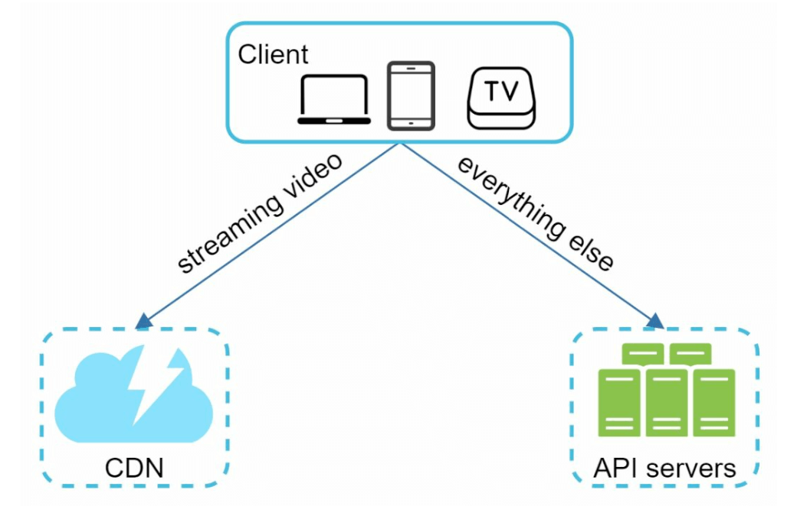

## CHAPTER 14 · 유튜브 설계

### 들어가며
유튜브는 비디오 업로드, 재생, 다양한 상호작용을 지원하는 거대한 비디오 스트리밍 플랫폼이다. 이 장에서는 다음 핵심 기능을 갖춘, 확장 가능한 비디오 스트리밍 시스템 설계에 집중한다:
- **빠른 비디오 업로드**
- **끊김 없는 비디오 스트리밍**
- **비디오 화질 변경 기능**
- **낮은 인프라 비용**
- **높은 가용성과 신뢰성**

#### 주요 통계 (2020)
- **월 2 billion 명의 활성 사용자**
- **하루 5 billion 개 비디오 시청**
- **모바일 인터넷 트래픽의 37%가 유튜브에서 발생**
- **80개 언어** 지원
- 2019년 **광고 수익 $15.1 billion**

### 1단계: 문제와 범위 이해

#### 핵심 기능
1. 비디오 업로드
2. 비디오 시청

#### 지원 플랫폼
- 모바일 앱, 웹 브라우저, 스마트 TV

#### 가정
- **일일 활성 사용자(DAU):** 5 million
- **평균 비디오 크기:** 300 MB
- **업로드 제한:** 비디오당 최대 1 GB
- **일일 저장소 필요량:** 150 TB
- **CDN 비용:** 5 million * 5 videos * 0.3GB * $0.02 = $150,000/day (Amazon CloudFront 기준)

### 2단계: 개략적 설계

#### 컴포넌트

1. **클라이언트:** 스마트폰, 컴퓨터, TV 같은 기기.
2. **CDN(콘텐츠 전송 네트워크):** 비디오를 저장하고 스트리밍한다.
3. **API 서버:** 비디오 스트리밍을 제외한 모든 사용자 상호작용을 처리한다(예: 업로드, 메타데이터 갱신).
4. **메타데이터 데이터베이스:** 비디오 메타데이터를 저장한다(예: 제목, 설명, 크기).
5. **원본 저장소:** 업로드된 비디오를 위한 블롭 저장소.
6. **트랜스코딩 서버:** 비디오를 여러 해상도와 포맷으로 변환한다.
7. **트랜스코딩 저장소:** 트랜스코딩된 비디오를 위한 블롭 저장소.

#### 핵심 워크플로
#### 1. 비디오 업로드 흐름
- **병렬 처리:**
  1. 비디오를 원본 저장소에 업로드한다.
  2. 데이터베이스의 비디오 메타데이터를 갱신한다.

- **비디오 업로드 (단계):**

    

    - [1] 비디오는 블롭 저장소에 업로드된다.
    - [2] 트랜스코딩 서버가 비디오를 여러 포맷으로 변환한다.
    - [3] 트랜스코딩이 하나 완료되면 다음 두 단계가 병렬로 실행된다.
        - [3a] 트랜스코딩된 비디오는 트랜스코딩 저장소로 보내진다.
        - [3b] 트랜스코딩 완료 이벤트는 완료 큐에 쌓인다.
    - [3a.1] 비디오는 CDN으로 배포된다.
    - [3b.1] 완료 핸들러가 메타데이터를 갱신하고 사용자에게 알린다.

- **메타데이터 업로드 (단계):**

    

    - 클라이언트는 병렬로 비디오 메타데이터 갱신 요청을 보낸다
    - 요청에는 파일 이름, 크기, 포맷 등 비디오 메타데이터가 포함된다.

#### 2. 비디오 스트리밍 흐름

- 지연 시간을 최소화하기 위해 CDN의 엣지 서버에서 직접 비디오를 스트리밍한다.
- 널리 쓰이는 스트리밍 프로토콜로는 MPEG_DASH, Apple HLS, Adobe HDS가 있다.
- *스트리밍 프로토콜마다 지원하는 비디오 인코딩과 재생 플레이어가 다르다.*

### 3단계: 상세 설계

#### 비디오 트랜스코딩
#### 중요성
1. 원본 비디오는 많은 저장 공간을 차지한다. 트랜스코딩은 저장 공간을 줄인다.
2. 기기와 브라우저 간 호환성을 보장한다.
3. 네트워크 상황에 맞게 비디오 화질을 조정한다.

#### 구성 요소
- **컨테이너:** 비디오, 오디오, 메타데이터를 담는다(예: MP4, AVI).
- **코덱:** 압축·해제 알고리즘이다(예: H.264, VP9).

#### 방향성 비순환 그래프(DAG) 모델

- 비디오 트랜스코딩은 계산 비용이 크고 시간이 오래 걸린다.
- DAG 모델은 인코딩, 썸네일 생성, 워터마크 삽입 같은 작업을 정의한다.
- 비디오 처리에서 높은 병렬성을 가능하게 한다.

- 원본 비디오는 비디오, 오디오, 메타데이터로 나뉜다.
    - 비디오 인코딩: 비디오는 다양한 해상도, 코덱, 비트레이트를 지원하도록 변환된다.
    - 썸네일: 사용자가 업로드하거나 시스템이 자동으로 생성할 수 있다.
    - 워터마크: 비디오 위에 겹쳐 놓는 이미지로, 비디오의 식별 정보를 담는다.

#### 비디오 트랜스코딩 아키텍처

1. **전처리기:** 비디오를 더 작은 조각으로 나눈다(GOP 정렬). 4가지 책임을 갖는다.

    

    - 비디오 분할: 비디오 스트림은 더 작은 GOP(Group of Pictures) 정렬 단위로 나뉘거나 더 잘게 나뉜다.
    - 오래된 클라이언트를 위해 GOP 정렬로 비디오를 나눈다.
    - 클라이언트 프로그래머가 작성한 설정 파일을 기반으로 DAG를 생성한다.
    - 인코딩이 실패할 경우를 대비해 GOP와 메타데이터를 임시 저장소에 저장하고, 시스템은 저장된 데이터로 재시도 작업을 수행할 수 있다.

2. **DAG 스케줄러:** 작업을 순차적 또는 병렬 단계로 구성한다.

    

    - DAG 그래프를 작업 단계로 나눠 리소스 관리자의 작업 큐에 넣는다.
    - 1단계: 비디오, 오디오, 메타데이터.
    - 비디오 파일은 2단계에서 비디오 인코딩과 썸네일 두 작업으로 더 나뉜다.

3. **리소스 관리자:** 리소스 할당 효율 관리를 담당한다. 큐 3개와 작업 스케줄러로 구성된다.

    

    - 작업 큐: 실행할 작업을 담은 우선순위 큐.
    - 워커 큐: 워커 사용률 정보를 담은 우선순위 큐.
    - 실행 큐: 현재 실행 중인 작업과 그 작업을 실행하는 워커를 담는다.
    - 작업 스케줄러: 최적의 작업/워커를 골라 선정된 작업 워커에게 작업 실행을 지시한다.

4. **작업 워커:** 트랜스코딩과 다른 연산을 수행한다.

    

    - 서로 다른 작업 워커는 서로 다른 작업을 실행할 수 있다

5. **임시 저장소:** 재시도를 위한 중간 데이터를 저장한다.
    - 저장소 시스템 선택은 데이터 유형, 크기, 접근 빈도, 데이터 수명 같은 요소에 따라 달라진다.
6. **출력:** 배포할 준비가 된 트랜스코딩 비디오.

### 시스템 최적화

#### 속도 최적화
1. **병렬 비디오 업로드:** 더 빠르고 이어 올리기 가능한 업로드를 위해 비디오를 작은 조각으로 나눈다.

    

2. **분산 업로드 센터:** 사용자와 가까운 곳의 CDN을 업로드 허브로 사용한다.
3. **병렬 처리:** 메시지 큐로 모듈을 분리해 높은 병렬성을 얻는다.

    
    

#### 안전성 최적화
1. **사전 서명 URL(pre-signed URL):** 인증된 사용자만 비디오를 업로드할 수 있게 제한한다.

    

2. **비디오 보호:**
   - **DRM 시스템**(예: Apple FairPlay, Google Widevine).
   - **AES 암호화.**
   - **워터마킹.**

#### 비용 절감 최적화
1. 인기 비디오만 CDN으로 서비스하고, 인기가 낮은 비디오는 대용량 서버에서 서비스한다.
2. 거의 접근되지 않는 비디오는 필요할 때 인코딩한다.
3. 인기도에 따라 비디오 배포를 지역별로 조정한다.
4. 자체 CDN을 구축하고 ISP와 제휴해 대역폭 비용을 줄인다.

### 오류 처리
#### 복구 가능한 오류
- 실패한 업로드, 트랜스코딩, 리소스 할당 작업을 재시도한다.

#### 복구 불가능한 오류
- 잘못된 형식의 비디오 처리를 중단하고 오류 코드를 반환한다.
