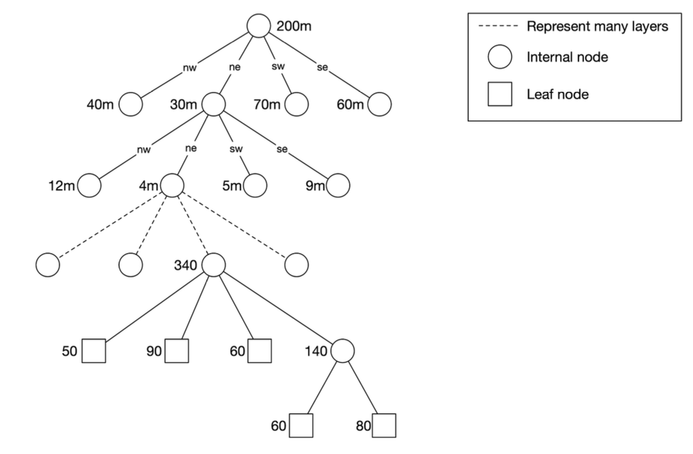
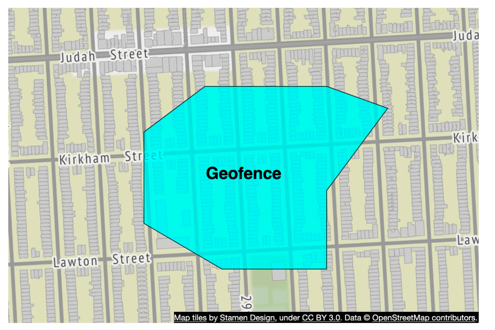
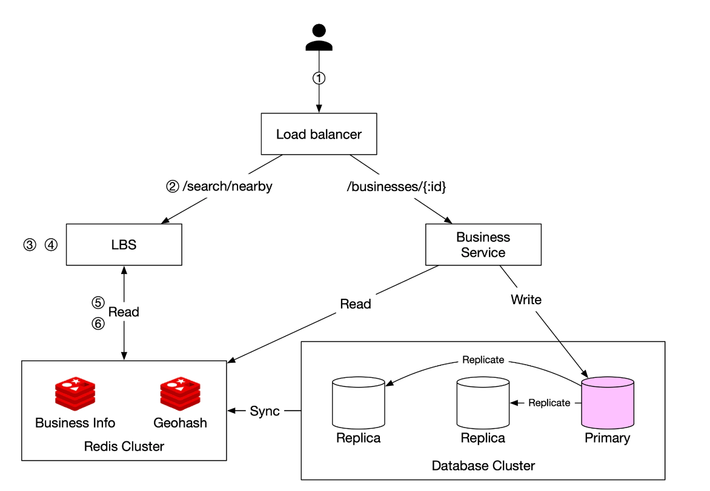

## CHAPTER 16 · 주변 서비스 설계

### 들어가며
**주변 서비스(proximity service)**는 식당, 호텔, 주유소 같은 가까운 장소를 찾도록 설계된 서비스다. 이 기능은 **Google Maps**나 **Yelp** 같은 애플리케이션에서 사용자가 정의된 반경 안의 장소를 찾도록 돕는 데 쓰인다.

### 1단계: 문제 이해와 범위 설정

#### **기능 요구사항**
1. 사용자 위치(위도, 경도)와 검색 반경을 기준으로 **사업장을 검색**한다.
2. 사업장 소유자가 사업장을 추가·갱신·삭제할 수 있게 한다(실시간 아님).
3. 요청이 오면 **상세 사업장 정보를 제공**한다.

#### **비기능 요구사항**
- **낮은 지연 시간**: 사용자가 빠른 응답을 받아야 한다.
- **데이터 프라이버시**: GDPR과 CCPA 규정을 준수한다.
- **높은 가용성**: 번화지역의 혼잡 시간대 급증 트래픽을 감당한다.

#### **개략적 규모 추정**
- **일일 활성 사용자 100 million 명**.
- 시스템에 등록된 **사업장 200 million 개**.
- **검색 QPS 계산**:
  - 사용자가 **하루 5회 검색**한다.
  - **검색 QPS** = (100M × 5) / 86,400 ≈ **5,000 QPS**.

### 2단계: 개략적 설계

#### **API 설계**
#### **주변 사업장 검색**
GET /v1/search/nearby

- **요청 매개변수**:
  - `latitude`: 사용자 위치의 위도.
  - `longitude`: 사용자 위치의 경도.
  - `radius`: 검색 반경(기본값: 5000m).

#### **사업장 API**
| API 엔드포인트                     | 설명                                      |
|-----------------------------------|----------------------------------------------|
| `GET /v1/businesses/{id}`         | 상세 사업장 정보 조회                    |
| `POST /v1/businesses`             | 새 사업장 추가                              |
| `PUT /v1/businesses/{id}`         | 사업장 상세 정보 갱신                         |
| `DELETE /v1/businesses/{id}`      | 시스템에서 사업장 제거               |

#### **데이터 모델**
- 두 기능이 아주 많이 사용되어 읽기량이 많으므로, MySQL 같은 관계형 데이터베이스가 적합하다.
  - 주변 사업장 검색
  - 사업장 상세 정보 보기

#### **데이터 스키마**
- 핵심 데이터베이스 테이블은 사업장 테이블과 지리공간 인덱스 테이블이다.
- 사업장 테이블은 사업장의 상세 정보로 구성된다.

#### **개략적 시스템 아키텍처**
시스템은 위치 기반 서비스(LBS)와 사업장 관련 서비스, 두 부분으로 구성된다.


- **위치 기반 서비스(LBS)**:
  - 위치 기반 검색 질의를 처리한다.
  - 쓰기 요청이 없는 읽기 중심 서비스다.
  - 특히 인구 밀집 지역의 혼잡 시간대에 QPS가 높으며, 시스템은 무상태다.
- **사업장 서비스**: 두 종류의 요청을 다룬다.
  - 사업장 소유자가 사업장을 생성·갱신·삭제한다.
  - 고객이 사업장의 상세 정보를 본다.
- **로드밸런서**: 트래픽을 LBS와 사업장 서비스로 라우팅한다.
- **데이터베이스 클러스터**:
  - 읽기가 많은 워크로드를 위해 **프라이머리-레플리카 아키텍처**를 사용한다.
  - LBS가 읽은 데이터와 프라이머리 데이터베이스가 기록한 데이터 사이에 약간의 차이가 있을 수 있다.
  - 사업장 정보가 실시간으로 갱신되지 않으므로 이 불일치는 문제가 되지 않는다.

### 3단계: 주변 사업장 조회 알고리즘

#### **옵션 1: 2차원 검색 (나이브한 접근)**


가장 직관적인 방법은 미리 정의한 반지름의 원을 그리고 원 안에 있는 모든 사업장을 찾는 것이다.

**SQL 질의:**
```
SELECT business_id, latitude, longitude
FROM business
WHERE (latitude BETWEEN :lat - radius AND :lat + radius)
AND (longitude BETWEEN :long - radius AND :long + radius);
```
**문제점:**
- **비효율적**: 전체 데이터베이스를 훑어야 한다.
- **1차원 인덱스의 한계**가 있다(위도/경도).

개선 방법으로 경도와 위도 컬럼에 인덱스를 만드는 것이 있지만, 조금 나아질 뿐 여전히 매우 느리다.

#### 더 나은 접근법
- 앞선 접근법의 문제는 데이터베이스 인덱스가 한 차원에서만 검색 속도를 높일 수 있다는 점이다.
- 최적의 접근법은 지리공간 인덱싱을 사용해 2차원 데이터를 1차원으로 표현하는 것이다.
  - 해시: 균등 격자(even grid), 지오해시(geohash)
  - 트리: 쿼드트리(quadtree), Google S2, RTree

  

#### **옵션 2: 균등 분할 격자**

  

- **세계를 고정 크기 격자로 나눈다**.
- **문제점**: 사업장 분포가 균일하지 않다(도시는 조밀, 농촌은 희소).

#### **옵션 3: 지오해시**
- 본초자오선과 적도를 기준으로 지구를 4개 사분면으로 나눈다. 그런 다음 각 격자를 다시 4개의 더 작은 격자로 나눈다.
- 각 격자는 경도와 위도 비트를 번갈아 사용해 표현할 수 있다.
- 이 분할을 반복한다

  
  

- **위도와 경도를 하나의 영숫자 문자열로 인코딩한다**. 12단계의 정밀도(레벨)를 갖는다
- **계층적 격자 구조**가 효율적인 검색을 가능하게 한다.
- 표에 따라 최소 지오해시 길이를 사용해 알맞은 정밀도를 선택한다.

  

- 지오해시는 두 지오해시가 공유하는 접두어가 길수록 가깝다는 것을 보장한다.

- **과제**:

  

  - **경계 문제**(격자 가장자리에 가까운 사업장이 누락될 수 있다).
    - 두 지점이 아주 가까워도 공유 접두어가 전혀 없을 수 있다(적도 반대편일 수 있다)
    - 두 지점이 긴 공유 접두어를 갖고도 서로 다른 지오해시에 속할 수 있다.
  - 해결책: 인접 격자도 함께 검색해야 한다.

#### **옵션 4: 쿼드트리**

쿼드트리는 2차원 공간을 재귀적으로 4개 사분면으로 나누는 트리 자료구조로, 각 내부 노드는 공간의 4개 하위 영역을 나타내는 정확히 4개의 자식을 갖는다.
- 쿼드트리는 메모리 상의 자료구조로, 각 LBS 서버에서 동작하며 서버 시작 시점에 만들어진다.

  

- 루트 노드는 x개(이 예에서는 100개)를 초과하는 사업장을 가진 노드가 없을 때까지 재귀적으로 4개 사분면으로 쪼개진다.

  

- 쿼드트리 인덱스는 메모리를 그리 많이 쓰지 않아(보통 GB 단위) 한 대의 서버에 충분히 들어간다.
- 트리 구축의 시간 복잡도는 nlogn이므로 트리를 만드는 데 몇 분 걸릴 수 있다.
- **k-최근접 검색 질의에 효율적**이다(예: 가장 가까운 주유소 찾기).

  

#### 운영상 고려사항
 - 사업장이 약 200 million 개이면 서버 시작 시점에 쿼드트리를 만드는 데 몇 분 걸릴 수 있다.
 - 쿼드트리를 만드는 동안에는 트래픽을 처리할 수 없으므로, 새 버전은 서버 일부에 점진적으로 배포해야 한다.
 - 사업장을 갱신하거나 추가할 때 가장 쉬운 방법은 쿼드트리를 점진적으로 다시 만드는 것이다(많은 캐시 무효화를 유발한다).
 - 쿼드트리를 즉시 갱신하는 것도 가능하지만 구현이 더 복잡하다(잠금 메커니즘이 필요하다).

#### **옵션 5: Google S2**
Google S2는 힐베르트 곡선(Hilbert curve)을 기반으로 구면을 1차원 인덱스에 매핑한다. 힐베르트 곡선 위에서 가까운 두 점은 1차원 공간에서도 가깝다.

  
  

- **힐베르트 곡선을 사용해 지구를 작은 셀로 나눈다**.
- 다양한 레벨로 임의의 영역을 덮을 수 있어 지오펜싱(geofencing)에 적합하다.
- 지오펜싱은 관심 영역을 둘러싼 매개변수를 정의할 수도 있다.
- 또 다른 장점은 고정된 정밀도 레벨 대신 S2에서 최소·최대 레벨과 최대 셀 수를 지정할 수 있다는 것이다.

### 트레이드오프 비교

#### 지오해시
- 사용과 구현이 쉽다 - 트리를 만들거나 다시 만들 필요가 없다
- 고정 반경 결과를 지원한다
- 인덱스 갱신이 쉽다.
- 인구 밀도에 따라 격자 크기를 동적으로 조정할 수 없다.

#### 쿼드트리
- 구현이 조금 더 어렵다.
- k-최근접 사업장 조회를 지원한다.
- 인구 밀도에 따라 격자 크기를 동적으로 조정할 수 있다.
- 전체 트리를 다시 만들어야 할 수 있어 인덱스 갱신이 더 복잡하다.

### 4단계: 데이터베이스 확장과 캐싱 전략

#### **사업장 테이블 확장**
- **사업장 ID 기준 샤딩**은 데이터를 고르게 분산한다.
- 테이블에서 각 사업장은 별도의 행을 갖는다.

| Geohash | Business ID |
|---------|------------|
| 9q9hvu  | 343        |
| 9q9hvu  | 347        |
| 9q9hvu  | 112        |

#### **지리공간 인덱스 확장**
- 지오해시 테이블에는 잘 맞지 않을 수 있다. 이 경우 모든 데이터가 한 대의 서버에 들어가므로 샤딩할 기술적 이유가 없다.
- 더 나은 방법은 읽기 부하를 나눠 줄 읽기 복제본(read-replica)을 두는 것이다.

#### **캐시 전략**
가장 분명해 보이는 캐시 키 선택지는 위치 좌표지만, 몇 가지 문제가 있다:
 - GPS의 위치 좌표는 정확하지 않다.
 - 사용자가 이동하면 위치 좌표가 바뀐다.
 - 더 나은 키는 지오해시다.

| 캐시 키  | 캐시 값 |
|------------|------------|
| `geohash`  | 해당 격자 안의 사업장 ID 목록 |
| `business_id` | 사업장 상세 정보(이름, 주소, 리뷰 등) |

### 5단계: 배포 전략과 최종 아키텍처

#### **리전과 가용성 영역**
- LBS와 사업장 서비스를 **여러 리전에 걸쳐** 배포한다.

#### **실시간 갱신 처리**
- **사업장 갱신은 매일 일괄 처리**된다.

#### **최종 시스템 아키텍처**

  

최종 알고리즘은 다음과 같다:

### 주변 사업장을 조회하는 단계
1. **사용자 요청:**
   - 사용자가 **500미터** 반경 안의 식당을 검색한다.
   - 클라이언트가 **위도(37.776720), 경도(-122.416730), 반경(500m)**을 **로드밸런서**로 보낸다.

2. **요청 전달:**
   - **로드밸런서(LB)**가 요청을 **위치 기반 서비스(LBS)**로 전달한다.

3. **지오해시 계산:**
   - LBS가 반경에 맞는 **지오해시 길이**를 결정한다.
   - 참조 테이블에 따르면 **500m는 지오해시 길이 = 6**에 해당한다.

4. **인접 지오해시 가져오기:**
   - LBS는 주변 영역을 포함하도록 **인접 지오해시**를 계산한다.
   - 결과는 다음 목록이다:
     ```
     [my_geohash, neighbor1_geohash, neighbor2_geohash, ..., neighbor8_geohash]
     ```

5. **Redis에서 사업장 ID 가져오기:**
   - 목록의 각 지오해시에 대해 LBS는 **지오해시 Redis 서버**에 질의해 **사업장 ID**를 가져온다.
   - 지연 시간을 최소화하기 위해 병렬 질의를 사용한다.

6. **사업장 조회와 순위 매기기:**
   - LBS는 **사업장 정보 Redis 서버**에서 **전체 사업장 상세 정보**를 가져온다.
   - 사업장은 사용자 위치로부터의 **거리순으로 정렬**된다.
   - **순위가 매겨진 결과**를 클라이언트로 되돌려준다.

### 핵심 최적화
- **병렬 Redis 호출**: 응답 시간을 줄인다.
- **지오해시 인덱싱**: 효율적인 공간 질의를 보장한다.
- **캐싱**: 사업장 데이터 조회와 검색을 빠르게 한다.

이 방식은 사용자 위치 근처 사업장을 **낮은 지연 시간으로 확장 가능하게** 조회하는 것을 보장한다.

### **최적의 인덱싱 방법 선택**
| 인덱싱 방법 | 장점 | 단점 |
|----------------|------|------|
| **지오해시** | 구현이 쉽고 근접 검색에 효율적 | 경계 문제, 고정 격자 크기 |
| **쿼드트리** | 밀도에 동적으로 대응, k-최근접 질의 지원 | 더 복잡, 트리 리밸런싱 필요 |
| **Google S2** | 고급 지오펜싱, 구글 지도에서 사용 | 구현이 더 어려움 |

### 참고 자료
1. [Geohash 알고리즘](https://www.movable-type.co.uk/scripts/geohash.html)
2. [쿼드트리 인덱싱](https://en.wikipedia.org/wiki/Quadtree)
3. [Google S2 지오메트리](https://s2geometry.io/)
