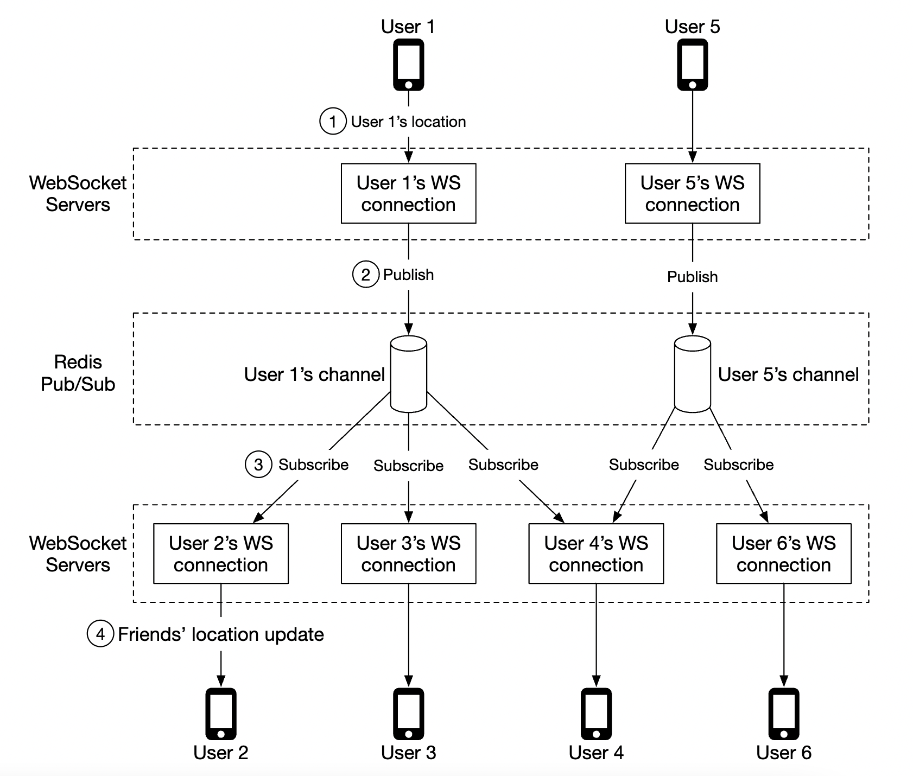

## CHAPTER 17 · 근처 친구 설계

### 소개

이 장에서는 사용자가 자기 위치를 공유하고 **근처**에 있는 친구를 발견할 수 있는 애플리케이션의 규모 확장 가능한 백엔드를 설계한다.

근접 서비스 장과의 주요 차이는, 이 문제에서는 **위치가 계속 변한다**는 점이고 근접 서비스에서는 사업장 주소가 거의 고정이라는 점이다.

### 1단계: 문제 이해와 설계 범위 확정

면접을 이끌 몇 가지 질문:
 * 지원자: 얼마나 가까워야 "근처"로 간주하나요?
 * 면접관: 5마일이며, 이 값은 설정으로 바꿀 수 있어야 합니다.
 * 지원자: 거리는 직선 거리로 계산하나요, 아니면 예컨대 친구 사이에 강이 있는 경우처럼 그런 요소를 고려하나요?
 * 면접관: 네, 직선 거리가 합리적인 가정입니다.
 * 지원자: 이 앱의 사용자는 몇 명인가요?
 * 면접관: 10억 명이고, 그중 10%가 근처 친구 기능을 사용합니다.
 * 지원자: 위치 이력을 저장해야 하나요?
 * 면접관: 네, 예컨대 머신러닝에 가치가 있을 수 있습니다.
 * 지원자: 비활동 친구는 10분 뒤 기능에서 사라진다고 가정해도 되나요?
 * 면접관: 네.
 * 지원자: GDPR 같은 규정을 걱정해야 하나요?
 * 면접관: 아니요, 단순화를 위해 제외합시다.

#### **기능 요구사항**

 * 사용자는 모바일 앱에서 근처 친구를 볼 수 있어야 한다. 각 친구에는 거리와, 위치가 갱신된 시점을 나타내는 타임스탬프가 표시된다.
 * 근처 친구 목록은 몇 초마다 갱신되어야 한다.

#### **비기능 요구사항**

- **낮은 지연**: 위치 갱신을 지나친 지연 없이 받는 것이 중요하다.
- **신뢰성**: 가끔 데이터 포인트가 유실되는 것은 허용되지만, 시스템은 전반적으로 가용 상태여야 한다.
- **결과적 일관성**: 위치 데이터 저장소에 강한 일관성은 필요 없다. 서로 다른 복제본이 위치 데이터를 받는 데 수 초 지연이 있어도 허용된다.

#### **개략적 규모 추정**

잠재적 규모를 가늠하기 위한 추정:
 * 근처 친구는 반경 5마일 이내의 친구다.
 * 위치 갱신 주기는 30초다. 사람의 걷는 속도는 느리므로 위치를 너무 자주 갱신할 필요가 없다.
 * 평균적으로 매일 1억 명이 이 기능을 사용하며, 동시 사용자는 10%인 1,000만 명이다.
 * 사용자는 평균 400명의 친구가 있고, 이들이 모두 근처 친구 기능을 사용한다.
 * 앱은 페이지당 근처 친구 20명을 보여 준다.
 * **위치 갱신 QPS** = 10mil / 30 == 초당 약 334k 갱신

### 2단계: 개략적 설계안 제시 및 동의 얻기

API와 데이터 모델 설계를 살펴보기 전에, 전통적인 요청-응답 통신 모델만큼 널리 알려져 있지 않은, 우리가 사용할 통신 프로토콜을 먼저 공부한다.

#### **개략적 설계**

개괄적으로 우리는 피어 사이에 효과적인 메시지 전달을 확립하고자 한다. 피어 투 피어(peer-to-peer) 프로토콜로도 가능하지만, 연결이 불안정하고 전력 소모 제약이 빠듯한 모바일 앱에는 실용적이지 않다.

더 실용적인 방법은 공유 백엔드를 통해 도달하려는 친구에게 팬아웃하는 것이다:

백엔드는 무엇을 하나?
 * 모든 활동 사용자에게서 위치 갱신을 받는다.
 * 각 위치 갱신에 대해, 이를 받아야 할 모든 활동 사용자를 찾아 전달한다.
 * 친구 사이 거리가 설정된 임계값을 넘으면 위치 데이터를 전달하지 않는다.

단순하게 들리지만, 과제는 우리가 다루는 규모에서 동작하도록 시스템을 설계하는 것이다.

먼저 더 단순한 설계로 시작하고, 상세 설계에서 더 진보된 접근을 다룬다:

- **로드밸런서**: REST API 서버와 양방향 웹소켓 서버에 트래픽을 분산한다.
- **REST API 서버**: 친구 관리, 프로필 갱신 같은 보조 작업을 처리한다.
- **웹소켓 서버**: 상태 유지 서버로, 위치 갱신을 해당 클라이언트로 전달한다. 또한 초기화 시 근처 친구 위치로 모바일 클라이언트를 채워 주는 작업도 관리한다(뒤에서 자세히 다룬다).
- **Redis 위치 캐시**: 각 활동 사용자의 최신 위치 데이터를 저장한다. 캐시의 각 엔트리에는 TTL이 설정되어 있다. TTL이 만료되면 사용자는 더 이상 활동 상태가 아니며 해당 데이터는 캐시에서 제거된다.
- **사용자 데이터베이스**: 사용자와 친구 관계 데이터를 저장한다. 관계형이나 NoSQL 데이터베이스 중 어느 쪽이든 이 용도로 쓸 수 있다.
- **위치 이력 데이터베이스**: 사용자 위치 데이터의 이력을 저장한다. 근처 친구 기능에서 직접 쓰이기보다는 분석 목적으로 과거 데이터를 추적하는 데 쓰인다.
- **Redis pub/sub**: 위치 갱신을 위해 사용자 채널마다 서로 다른 토픽을 둘 수 있는 가벼운 메시지 버스로 사용한다.

위 예에서 웹소켓 서버는 자기에게 연결된 사용자의 채널을 구독하며, 위치 갱신을 받으면 그때마다 적절한 사용자에게 전달한다.

#### **주기적 위치 갱신**

주기적 위치 갱신 흐름은 다음과 같이 동작한다:

 * 모바일 클라이언트가 로드밸런서로 위치 갱신을 보낸다.
 * 로드밸런서는 그 클라이언트의 지속성 연결을 유지하는 웹소켓 서버로 위치 갱신을 전달한다.
 * 웹소켓 서버는 위치 데이터를 위치 이력 데이터베이스에 저장한다.
 * 위치 캐시의 위치 데이터를 갱신한다. 웹소켓 서버는 이후 그 사용자의 거리 계산을 위해 위치 데이터를 메모리에도 저장한다.
 * 웹소켓 서버는 Redis pub/sub으로 사용자 채널에 위치 데이터를 발행한다.
 * Redis pub/sub은 그 사용자 채널의 모든 구독자, 즉 그 사용자의 친구를 담당하는 서버에 위치 갱신을 브로드캐스트한다.
 * 구독 중인 웹소켓 서버는 위치 갱신을 받아 이 갱신을 어떤 사용자에게 보내야 하는지 계산해 전송한다.

같은 흐름의 더 자세한 버전이다:

사용자는 평균 400명의 친구가 있고 그중 10%가 한 시점에 온라인이므로, 평균적으로 전달할 위치 갱신이 40건 발생한다.

#### **API 설계**

지원해야 할 웹소켓 루틴:
 * 주기적 위치 갱신 - 사용자가 웹소켓 서버로 위치 데이터를 보낸다.
 * 클라이언트의 위치 갱신 수신 - 서버가 친구의 위치 데이터와 타임스탬프를 보낸다.
 * 웹소켓 클라이언트 초기화 - 클라이언트가 사용자 위치를 보내면 서버가 근처 친구 위치 데이터를 돌려준다.
 * 새 친구 구독 - 예컨대 친구가 처음 온라인에 나타났을 때, 웹소켓 서버가 모바일 클라이언트가 추적해야 할 친구 ID를 보낸다.
 * 친구 구독 해지 - 예컨대 친구가 오프라인이 되었을 때, 웹소켓 서버가 모바일 클라이언트가 구독 해지해야 할 친구 ID를 보낸다.

HTTP API - 보조 기능을 위한 전통적인 요청/응답 페이로드.

#### **데이터 모델**

 * 위치 캐시는 `user_id`와 `lat,long,timestamp` 사이의 매핑을 저장한다. 현재 위치만 필요하고 우리 사례에 필요한 TTL 제거(eviction)를 지원하므로 Redis가 이 캐시에 적합한 선택이다.
 * 위치 이력 테이블은 같은 데이터를 위에 언급한 네 컬럼으로 이루어진 관계형 테이블에 저장한다. 쓰기가 많은 부하에 최적화되어 있어 이 데이터에는 Cassandra를 쓸 수 있다.

### 3단계: 상세 설계

개략적 설계를 우리가 목표하는 규모에서 동작하도록 어떻게 확장할지 논의한다.

#### **각 컴포넌트의 확장성은 어느 정도인가?**

- **API 서버**: 오토스케일링 그룹과 서버 인스턴스 복제로 손쉽게 확장할 수 있다.
- **웹소켓 서버**: 웹소켓 서버는 쉽게 스케일 아웃할 수 있지만, 서버를 종료할 때 기존 연결을 우아하게 닫아야 한다. 예를 들어 서버 풀에서 최종 제거되기 전에 로드밸런서에서 해당 서버를 "draining"으로 표시해 새 연결을 보내지 않게 할 수 있다.
- **클라이언트 초기화**: 클라이언트가 서버에 처음 연결되면, 서버는 사용자의 친구를 가져오고 Redis pub/sub에서 그들의 채널을 구독하며, 캐시에서 그들의 위치를 가져와 최종적으로 클라이언트에 전달한다.
- **사용자 데이터베이스**: user_id 기준으로 샤딩할 수 있다. 사용자/친구 데이터를 전담 팀이 관리하는 별도 서비스와 API로 노출하는 것도 합리적일 수 있다.
- **위치 캐시**: Redis 노드를 여러 개 띄워 쉽게 샤딩할 수 있다. 또한 TTL이 한 번에 점유할 수 있는 최대 메모리에 상한을 둔다. 그래도 큰 쓰기 부하는 처리해야 한다.
- **Redis pub/sub 서버**: 채널이 초기화되어 있어도 사용 중이 아니면 메모리가 소모되지 않는다는 사실을 활용한다. 따라서 근처 친구 기능을 사용하는 모든 사용자의 채널을 미리 할당해, 예컨대 사용자가 온라인이 될 때 새 채널을 만들고 활동 웹소켓 서버에 알리는 같은 일을 처리할 필요를 없앨 수 있다.

#### **Redis pub/sub 컴포넌트 확장 심층 분석**

모든 pub/sub 채널을 유지하려면 약 200GB의 메모리가 필요하다. 각 100GB짜리 Redis 서버 2대로 해결할 수 있다.

초당 약 1,400만 건의 위치 갱신을 푸시해야 하므로, 서버 한 대가 초당 약 100k 푸시를 처리한다고 가정하면 최소 140대의 Redis 서버가 필요하다.

따라서 강한 CPU 부하를 감당하려면 분산 Redis 서버 클러스터가 필요하다.

분산 Redis 클러스터를 지원하려면, 어떤 서버가 살아 있는지 추적하기 위해 Zookeeper나 etcd 같은 서비스 디스커버리 컴포넌트를 활용해야 한다.

서비스 디스커버리 컴포넌트에 담아야 할 데이터는 다음과 같다:

웹소켓 서버는 Zookeeper에서 가져온 이 인코딩된 데이터로 특정 채널이 어디에 있는지 판단한다. 효율을 위해 해시 링 데이터를 각 웹소켓 서버의 메모리에 캐시할 수 있다.

서버 클러스터를 늘리거나 줄이는 것과 관련해서는, 과거 트래픽 데이터에 따라 필요한 만큼 클러스터를 조절하는 일일 작업을 둘 수 있다. 부하 급증에 대비해 클러스터를 여유 있게 프로비저닝할 수도 있다.

Redis 클러스터는 채널을 위해 일부 상태를 유지하고, 구독자가 클러스터에 새로 프로비저닝된 노드로 인계되도록 조율할 필요가 있으므로 상태 유지 저장소 서버로 볼 수 있다.

확장 작업 중 잠재적 문제 몇 가지를 유의해야 한다:
 * 채널이 이리저리 옮겨지면서 웹소켓 서버에서 재구독 요청이 많이 발생한다.
 * 작업 중 일부 위치 갱신이 클라이언트에 누락될 수 있는데, 이 문제에서는 허용되지만 그래도 발생을 최소화해야 한다. 이런 작업은 하루 중 트래픽이 가장 낮은 시점에 수행할 것을 고려하라.
 * 안정 해시를 활용해 서버 추가/제거 시 이동하는 채널 수를 최소화할 수 있다.

#### **친구 추가/제거**

친구가 추가/제거될 때마다, 영향 받는 사용자를 담당하는 웹소켓 서버는 그 친구의 채널을 구독/구독 해지해야 한다.

"근처 친구" 기능은 더 큰 앱의 일부이므로, 이런 이벤트가 발생할 때마다 모바일 클라이언트 쪽에 콜백을 등록할 수 있고, 클라이언트가 적절한 동작을 수행하도록 웹소켓 서버로 메시지를 보낸다고 가정할 수 있다.

#### **친구가 많은 사용자**

친구 수에 상한을 둘 수 있다. 예컨대 Facebook은 최대 5,000명의 친구 제한이 있다.

"고래(whale)" 사용자를 담당하는 웹소켓 서버는 더 큰 부하를 감당할 수 있지만, 웹소켓 서버가 충분하다면 문제없다.

#### **근처의 무작위 사람**

면접관이 근처 친구 지도에 가끔 무작위 사람이 나타나는 기능을 설계에 추가하라고 하면 어떻게 할까?

한 가지 처리 방법은 geohash 기반으로 pub/sub 채널 풀을 정의하는 것이다:

geohash 안에 있는 사람은 모두 적절한 채널을 구독해 무작위 사용자의 위치 갱신을 받는다:

가깝지만 인접 geohash에 있는 경우에 대비해 여러 geohash를 구독할 수도 있다:

#### **Redis pub/sub의 대안**

pub/sub에 Redis를 쓰는 대안으로, 분산 컴퓨팅 애플리케이션에 최적화된 범용 프로그래밍 언어인 Erlang을 활용하는 방법이 있다.

Erlang으로는 서로 통신하는 수백만 개의 작은 Erlang 프로세스를 띄울 수 있다. 분산 Erlang 애플리케이션 안에서 웹소켓 연결과 pub/sub 채널을 모두 처리할 수 있다.

다만 Erlang의 어려움은 틈새 언어라서 역량 있는 Erlang 개발자를 구하기 어려울 수 있다는 점이다.

### 4단계: 마무리

근처 친구 기능을 지원하는 시스템을 성공적으로 설계했다.

핵심 컴포넌트:
- **웹소켓 서버**: 클라이언트와 서버 사이의 실시간 통신
- **Redis**: 위치 데이터의 빠른 읽기·쓰기 + pub/sub 채널

REST API 서버, 웹소켓 서버, 데이터 계층, Redis pub/sub 서버의 확장 방법과 Redis pub/sub의 대안도 살펴봤다. "근처의 무작위 사람" 기능도 다뤘다.
