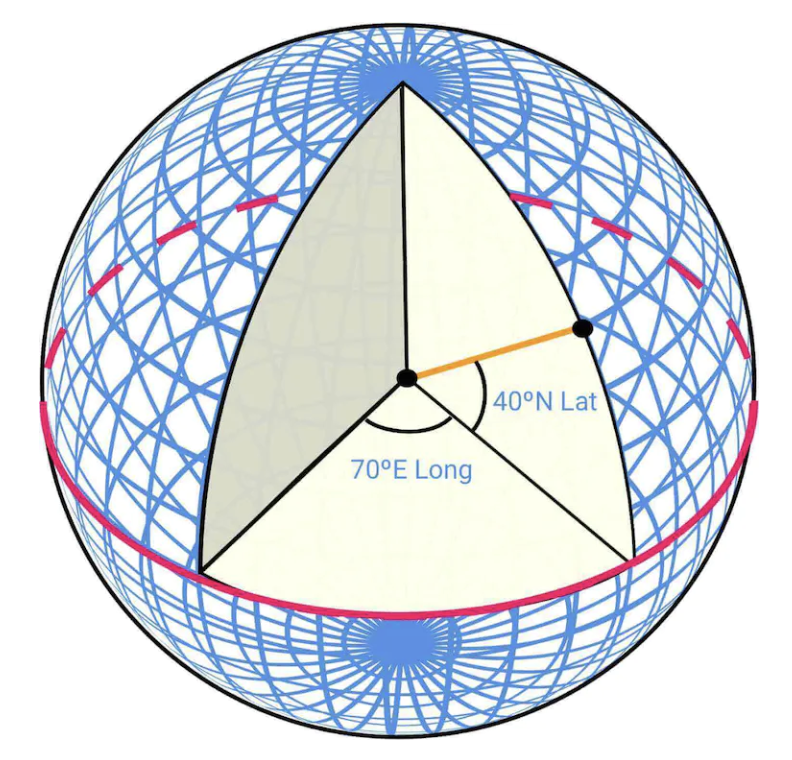

## CHAPTER 18 · 구글 지도 설계

### 소개

**구글 지도(Google Maps)**의 간단한 버전을 설계한다.

구글 지도에 관한 몇 가지 사실:
 * 2005년에 시작됐다.
 * 위성 이미지, 거리 지도, 실시간 교통 상황, 경로 계획 같은 다양한 서비스를 제공한다.
 * 2021년까지 일일 활성 사용자 10억 명, 전 세계 99% 커버리지, 하루 2,500만 건의 실시간 위치 정보 갱신을 기록했다.

### 1단계: 문제 이해와 설계 범위 확정

지원자와 면접관 사이의 예시 질의응답:
 * 지원자: 몇 명의 일일 활성 사용자를 다뤄야 하나요?
 * 면접관: DAU 10억 명입니다.
 * 지원자: 어떤 기능에 집중해야 하나요?
 * 면접관: 위치 갱신, 내비게이션, ETA, 지도 렌더링입니다.
 * 지원자: 도로 데이터는 얼마나 큰가요? 접근 권한이 있나요?
 * 면접관: 여러 출처에서 도로 데이터를 확보했고, 원본 데이터는 TB 단위입니다.
 * 지원자: 교통 상황을 고려해야 하나요?
 * 면접관: 네, 정확한 시간 추정을 위해 고려해야 합니다.
 * 지원자: 도보, 자전거, 운전 같은 이동 수단은요?
 * 면접관: 지원해야 합니다.
 * 지원자: 경유지가 여러 개인 길찾기는요?
 * 면접관: 면접 범위에서는 제외합시다.
 * 지원자: 사업장과 사진은요?
 * 면접관: 좋은 질문이지만 고려할 필요는 없습니다.

세 가지 핵심 기능에 집중한다 - 사용자 위치 갱신, ETA를 포함한 내비게이션 서비스, 지도 렌더링.

#### **비기능 요구사항**

- **정확성**: 사용자가 잘못된 안내를 받아서는 안 된다.
- **부드러운 내비게이션**: 사용자는 부드러운 지도 렌더링을 경험해야 한다.
- **데이터·배터리 사용량**: 클라이언트는 가능한 한 적은 데이터와 배터리를 써야 한다. 모바일 기기에 중요하다.
- 일반적인 가용성과 규모 확장성 요구사항.

#### **지도 기초**

설계로 들어가기 전에, 이해해야 할 지도 관련 개념 몇 가지가 있다.

#### 위치 좌표 시스템

지구는 자전축을 중심으로 회전하는 구체다. 위치는 위도(남북으로 얼마나 떨어져 있는가)와 경도(동서로 얼마나 떨어져 있는가)로 정의된다:



#### 3D에서 2D로

3D 점을 2D 평면으로 옮기는 과정을 "지도 투영(map projection)"이라고 한다.

여러 방법이 있고 각각 장단점이 있다. 거의 모두 실제 기하를 왜곡한다.


구글 지도는 "Web Mercator"라 불리는 메르카토르 투영의 변형을 선택했다.

#### 지오코딩

지오코딩(geocoding)은 주소를 지리 좌표로 변환하는 과정이다.

역방향 과정은 "리버스 지오코딩(reverse geocoding)"이라고 한다.

한 가지 방법은 보간(interpolation)을 사용하는 것으로, 도로 네트워크가 지리 좌표 공간에 매핑된 여러 출처(예: GIS)의 데이터를 활용한다.

#### 지오해싱

지오해싱(geohashing)은 지리 영역을 문자와 숫자열로 인코딩하는 인코딩 시스템이다.

세계를 평평한 표면으로 묘사하고, 이를 재귀적으로 4개 사분면으로 세분화한다:


#### 지도 렌더링

지도 렌더링은 타일링으로 이뤄진다. 전체 지도를 하나의 거대한 커스텀 이미지로 렌더링하는 대신, 세계를 더 작은 타일로 나눈다.

클라이언트는 필요한 타일만 내려받아 모자이크를 이어 붙이듯 렌더링한다.

줌 수준마다 서로 다른 타일이 있다. 클라이언트는 자신의 줌 수준에 맞는 타일을 고른다.

예를 들어 전 세계가 보이게 줌을 빼면, 전 세계를 나타내는 단 하나의 256x256 타일만 내려받는다.

#### 내비게이션 알고리즘을 위한 도로 데이터 처리

대부분의 라우팅 알고리즘에서 교차로는 노드로, 도로는 간선으로 표현한다:


대부분의 내비게이션 알고리즘은 Djikstra나 A* 알고리즘의 변형을 사용한다.

경로 탐색 성능은 그래프 크기에 민감하다. 규모를 감당하려면 전 세계를 하나의 그래프로 표현해 알고리즘을 실행할 수는 없다.

대신 타일링과 비슷한 기법을 쓴다 - 세계를 점점 더 작은 그래프로 세분화한다.

라우팅 타일은 인접 타일에 대한 참조를 가지며, 알고리즘은 상호 연결된 타일을 순회하며 더 큰 도로 그래프를 이어 붙일 수 있다:


이 기법으로 메모리 대역폭을 크게 줄이고, 주어진 출발지/목적지 쌍에 필요한 타일만 불러올 수 있다.

하지만 더 긴 경로에서는 작고 상세한 라우팅 타일을 이어 붙이는 일이 여전히 시간과 메모리를 많이 쓴다. 대신 상세 수준이 다른 라우팅 타일을 두고, 알고리즘은 향하는 목적지에 따라 적절한 상세도의 타일을 사용한다:


#### **개략적 규모 추정**

저장소 관점에서 저장해야 할 것:
 * 전 세계 지도 - 저장할 모든 타일을 기준으로 약 70PB로 추정하되, 매우 유사한 타일(예: 광활한 사막)의 압축은 반영한 수치다.
 * 메타데이터 - 크기가 무시할 만하므로 계산에서 제외한다.
 * 도로 정보 - 라우팅 타일로 저장한다.

내비게이션 요청 추정 QPS - DAU 10억 명, 주당 35분 사용 -> 하루 50억 분.
GPS 갱신 요청을 배칭한다고 가정하면 200k QPS, 최대 부하에서 1mil QPS에 도달한다.

### 2단계: 개략적 설계안 제시 및 동의 얻기


#### **위치 서비스**


사용자의 위치 갱신을 기록하는 역할이다:
 * 위치 갱신은 `t`초마다 전송된다.
 * 위치 데이터 스트림은 시간이 지나며 서비스를 개선하는 데 쓸 수 있다. 예컨대 더 정확한 ETA 제공, 교통 데이터 모니터링, 폐쇄된 도로 탐지, 사용자 행동 분석 등이다.

위치 갱신을 서버로 계속 보내는 대신, 클라이언트 쪽에서 갱신을 묶어 배치로 보낼 수 있다:


이 최적화에도 구글 지도 규모의 시스템에서는 부하가 여전히 크다. 따라서 Cassandra처럼 무거운 쓰기에 최적화된 데이터베이스를 활용할 수 있다.

이후 분석을 위한 위치 갱신의 효율적인 스트림 처리에는 Kafka를 활용할 수도 있다.

위치 갱신 요청 페이로드 예시:

```
POST /v1/locations
Parameters
  locs: JSON encoded array of (latitude, longitude, timestamp) tuples.
```

#### **내비게이션 서비스**

이 컴포넌트는 합리적인 시간 안에 A와 B 사이의 빠른 경로를 찾는 역할이다(약간의 지연은 괜찮다). 경로가 가장 빠를 필요는 없지만 정확성이 중요하다.

요청 페이로드 예시:

```
GET /v1/nav?origin=1355+market+street,SF&destination=Disneyland
```

응답 예시:

```json
{
  "distance": {"text":"0.2 mi", "value": 259},
  "duration": {"text": "1 min", "value": 83},
  "end_location": {"lat": 37.4038943, "Ing": -121.9410454},
  "html_instructions": "Head <b>northeast</b> on <b>Brandon St</b> toward <b>Lumin Way</b><div style=\"font-size:0.9em\">Restricted usage road</div>",
  "polyline": {"points": "_fhcFjbhgVuAwDsCal"},
  "start_location": {"lat": 37.4027165, "lng": -121.9435809},
  "geocoded_waypoints": [
    {
       "geocoder_status" : "OK",
       "partial_match" : true,
       "place_id" : "ChIJwZNMti1fawwRO2aVVVX2yKg",
       "types" : [ "locality", "political" ]
    },
    {
       "geocoder_status" : "OK",
       "partial_match" : true,
       "place_id" : "ChIJ3aPgQGtXawwRLYeiBMUi7bM",
       "types" : [ "locality", "political" ]
    }
  ],
  "travel_mode": "DRIVING"
}
```

교통 변화와 경로 재계산은 아직 고려하지 않으며, 상세 설계 섹션에서 다룬다.

#### **지도 렌더링**

지도 타일 전체 데이터셋을 클라이언트에 두는 것은 페타바이트 크기라 불가능하다.

클라이언트 위치와 줌 수준에 따라 서버에서 필요할 때 가져와야 한다.

새 타일을 언제 가져와야 하나 - 사용자가 줌 인/아웃할 때와 내비게이션 중 새 타일 쪽으로 이동할 때다.

지도 타일을 클라이언트에 어떻게 제공해야 하나?
 * 동적으로 만들 수도 있지만, 서버에 큰 부하를 주고 캐싱도 어렵게 만든다.
 * 지도 타일은 클라이언트가 계산할 수 있는 geohash 기준으로 정적으로 제공한다. 정적으로 저장해 CDN에서 제공할 수 있다.


CDN은 지연을 최소화하려고 사용자가 지도 타일을 자신과 가장 가까운 POP(point-of-presence) 서버에서 가져오게 한다:


지도 타일 결정 방법 후보:
 * 지도 타일의 geohash는 클라이언트에서 계산할 수 있다. 그렇다면 이 방식의 타일 계산에 장기적으로 전념해야 함을 유의해야 한다. 클라이언트 업데이트를 강제하기는 어렵기 때문이다.
 * 대안으로, 추가 API 호출 비용을 감수하고 클라이언트를 대신해 지도 타일 URL을 계산하는 간단한 API를 둘 수 있다.


### 3단계: 상세 설계

#### **데이터 모델**

다루는 여러 유형의 데이터를 어떻게 저장할지 논의한다.

#### 라우팅 타일

초기 도로 데이터셋은 여러 출처에서 얻는다. 위치 갱신 데이터를 바탕으로 시간이 지나며 개선된다.

도로 데이터는 비정형이다. 주기적인 오프라인 처리 파이프라인이 이 원시 데이터를 앱에 필요한 그래프 기반 라우팅 타일로 변환한다.

데이터베이스 기능이 필요 없으므로 이 타일을 데이터베이스에 저장하는 대신, S3 객체 저장소에 저장하면서 공격적으로 캐싱할 수 있다.

인접 리스트를 이진 파일로 효율적으로 압축하는 라이브러리도 활용할 수 있다.

#### 사용자 위치 데이터

사용자 위치 데이터는 교통 상황을 갱신하고 각종 분석을 하는 데 매우 유용하다.

이런 데이터는 본질적으로 쓰기가 많으므로 저장에 Cassandra를 쓸 수 있다.

예시 행:


#### 지오코딩 데이터베이스

이 데이터베이스는 위/경도 쌍과 장소의 키-값 쌍을 저장한다.

읽기는 잦고 쓰기는 드물므로, 빠른 읽기 속도를 위해 Redis를 쓸 수 있다.

#### 미리 계산한 세계 지도 이미지

논의한 대로 지도 타일링 이미지를 미리 계산해 CDN에 저장한다.


#### **서비스**

#### 위치 서비스

이 서비스의 데이터베이스 설계와 사용자 위치 저장 방식을 자세히 살펴보자.


위치 갱신의 무거운 쓰기 부하를 감당하려면 NoSQL 데이터베이스를 쓸 수 있다. 사용자 위치 데이터는 새 갱신이 도착하며 자주 바뀌고 금방 낡으므로, 일관성보다 가용성을 우선한다.

모든 요구사항에 잘 맞으므로 데이터베이스로 Cassandra를 선택한다.

저장할 예시 행:


 * `user_id`는 특정 사용자의 모든 위치 갱신에 빠르게 접근하기 위한 파티션 키다.
 * `timestamp`는 위치 갱신 수신 시각 기준으로 정렬해 저장하기 위한 클러스터링 키다.

위치 갱신이 필요한 여러 다른 서비스에 위치 갱신을 스트리밍하는 데도 Kafka를 활용한다:


#### 지도 렌더링

지도 타일은 여러 줌 수준으로 저장된다. 가장 낮은 줌 수준에서는 전 세계가 단 하나의 256x256 타일로 표현된다.

줌 수준이 올라가면 지도 타일 수는 4배가 된다:


쓸 수 있는 최적화 하나는 전체 이미지 정보를 네트워크로 보내는 대신, 타일을 벡터(경로와 폴리곤)로 표현해 클라이언트가 동적으로 렌더링하게 하는 것이다.

이렇게 하면 대역폭을 상당히 아낄 수 있다.

#### 내비게이션 서비스

이 서비스는 가장 빠른 경로를 찾는 역할이다:


이 하위 시스템의 각 컴포넌트를 하나씩 살펴보자.

먼저 주소를 위/경도 쌍 위치로 해석하는 지오코딩 서비스가 있다.

요청 예시:

```
https://maps.googleapis.com/maps/api/geocode/json?address=1600+Amphitheatre+Parkway,+Mountain+View,+CA
```

응답 예시:

```json
{
   "results" : [
      {
         "formatted_address" : "1600 Amphitheatre Parkway, Mountain View, CA 94043, USA",
         "geometry" : {
            "location" : {
               "lat" : 37.4224764,
               "lng" : -122.0842499
            },
            "location_type" : "ROOFTOP",
            "viewport" : {
               "northeast" : {
                  "lat" : 37.4238253802915,
                  "lng" : -122.0829009197085
               },
               "southwest" : {
                  "lat" : 37.4211274197085,
                  "lng" : -122.0855988802915
               }
            }
         },
         "place_id" : "ChIJ2eUgeAK6j4ARbn5u_wAGqWA",
         "plus_code": {
            "compound_code": "CWC8+W5 Mountain View, California, United States",
            "global_code": "849VCWC8+W5"
         },
         "types" : [ "street_address" ]
      }
   ],
   "status" : "OK"
}
```

경로 계획 서비스는 현재 교통 상황에 따라 이동 시간을 최적화한 추천 경로를 계산한다.

최단 경로 서비스는 객체 저장소의 라우팅 타일에 대해 A* 알고리즘의 변형을 실행해 최적 경로를 계산한다:
 * 출발지/목적지 쌍을 받아 위/경도 쌍으로 변환하고, 이 쌍에서 geohash를 도출해 라우팅 타일을 얻는다.
 * 알고리즘은 초기 라우팅 타일에서 시작해, 목적지 타일로 충분히 좋은 경로를 찾을 때까지 순회한다.


ETA 서비스는 경로 계획 서비스가 호출하며, 교통 데이터 기반으로 ETA를 예측하는 머신러닝 알고리즘으로 예상 시간을 얻는다.

랭커 서비스는 사용자가 전달한 필터, 즉 유료 도로나 고속도로 회피 플래그에 따라 가능한 여러 경로의 순위를 매기는 역할을 한다.

업데이터 서비스는 중요한 데이터베이스 몇 개를 최신 상태로 유지하도록 비동기로 갱신한다.

#### 개선 - 적응형 ETA와 경로 재계산

가능한 개선 하나는 새로 확보된 교통 데이터에 따라 진행 중인 경로를 적응적으로 갱신하는 것이다.

구현 방법 하나는 현재 경로를 내비게이션 중인 사용자를, 통과해야 할 모든 타일과 함께 데이터베이스에 저장하는 것이다.

데이터는 다음과 같은 모습일 수 있다:

```
user_1: r_1, r_2, r_3, …, r_k
user_2: r_4, r_6, r_9, …, r_n
user_3: r_2, r_8, r_9, …, r_m
...
user_n: r_2, r_10, r21, ..., r_l
```

어떤 타일에서 교통 사고가 발생하면, 그 타일을 지나는 경로를 가진 모든 사용자를 찾아 경로를 다시 계산해 줄 수 있다.

데이터베이스에 저장하는 타일 수를 줄이려면, 대신 출발 라우팅 타일과 목적지 타일이 포함될 때까지 서로 다른 해상도 수준의 라우팅 타일 몇 개를 저장할 수 있다:

```
user_1, r_1, super(r_1), super(super(r_1)), ...
```


이렇게 하면 사용자가 영향을 받는지 확인하려고 사용자의 최종 타일이 교통 사고 타일을 포함하는지만 검사하면 된다.

내비게이션 중인 사용자의 가능한 모든 경로를 추적하다가, 더 빠른 우회 경로가 생기면 알릴 수도 있다.

#### 전달 프로토콜

서버에서 클라이언트로 능동적으로 데이터를 푸시할 수 있는 옵션은 여러 가지다:
 * 모바일 푸시 알림은 페이로드가 제한되고 웹 앱에서 쓸 수 없어 적합하지 않다.
 * 웹소켓은 서버 계산 부담이 더 적어 일반적으로 롱 폴링보다 나은 선택이다.
 * 서버 전송 이벤트(SSE)도 쓸 수 있지만, 예컨대 라스트마일 배달 기능에 유용한 양방향 통신을 지원하는 웹소켓 쪽으로 기운다.

### 4단계: 마무리

최종 설계는 다음과 같다:


추가로 제공할 수 있는 기능 하나는 경유지가 여러 개인 내비게이션으로, 여러 위치를 방문하는 최적 경로를 정하기 위해 Uber나 Lyft 같은 기업 고객에게 팔 수 있다.
