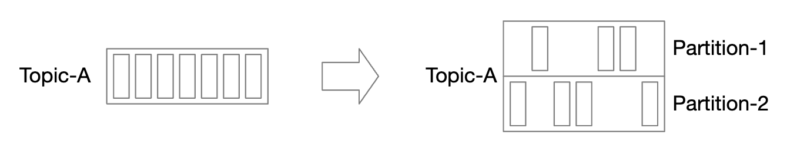
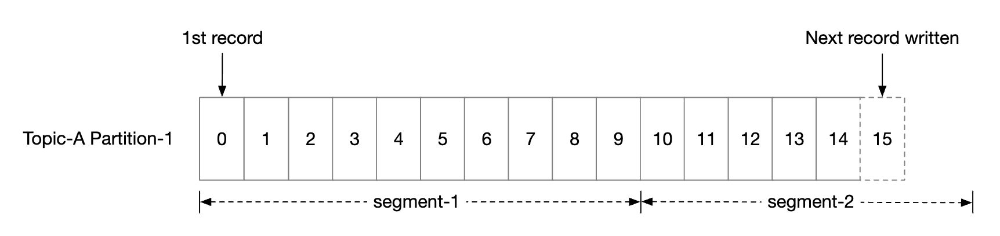
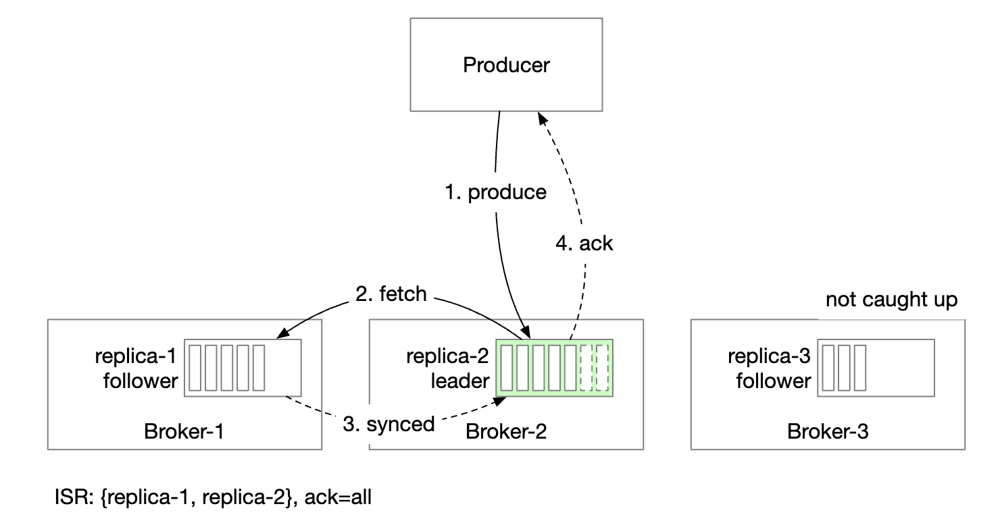
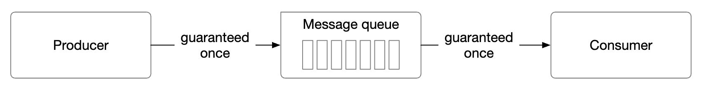

## CHAPTER 19 · 분산 메시지 큐 설계

### 소개

이 장에서는 **분산 메시지 큐(distributed message queue)**를 설계한다.

메시지 큐의 장점:
- **결합도 완화**: 컴포넌트 사이의 강한 결합을 없앤다. 각자 따로 갱신할 수 있다.
- **향상된 규모 확장성**: 프로듀서와 컨슈머를 트래픽에 따라 독립적으로 확장할 수 있다.
- **높아진 가용성**: 시스템 일부가 죽어도 나머지 부분은 큐와 계속 상호작용한다.
- **더 나은 성능**: 프로듀서는 컨슈머 확인을 기다리지 않고 메시지를 생산할 수 있다.

널리 쓰이는 메시지 큐 구현체 - Kafka, RabbitMQ, RocketMQ, Apache Pulsar, ActiveMQ, ZeroMQ.

엄밀히 말하면 Kafka와 Pulsar는 메시지 큐가 아니라 이벤트 스트리밍 플랫폼이다.
다만 기능이 수렴하면서 메시지 큐와 이벤트 스트리밍 플랫폼의 구분이 흐려지고 있다.

이 장에서는 긴 데이터 보관(retention), 반복 메시지 소비 같은 고급 기능을 지원하는 메시지 큐를 만든다.

### 1단계: 문제 이해와 설계 범위 확정

메시지 큐는 기본 기능 몇 가지를 지원해야 한다 - 프로듀서가 메시지를 생산하고 컨슈머가 이를 소비한다.
하지만 성능, 메시지 전달, 데이터 보관 등에서 고려할 점이 각기 다르다.

지원자와 면접관 사이에 오갈 수 있는 질문 세트:
 * 지원자: 메시지 형식과 평균 크기는 어떻게 되나요? 텍스트만인가요?
 * 면접관: 메시지는 텍스트 전용이고 보통 수 KB입니다.
 * 지원자: 메시지를 반복해서 소비할 수 있나요?
 * 면접관: 네, 서로 다른 컨슈머가 메시지를 반복 소비할 수 있어야 합니다. 전통적인 메시지 큐는 지원하지 않는 추가 요구사항입니다.
 * 지원자: 메시지가 생산된 순서대로 소비되나요?
 * 면접관: 네, 순서 보장이 유지되어야 합니다. 전통적인 메시지 큐가 지원하지 않는 추가 요구사항입니다.
 * 지원자: 데이터 보관 요구사항은 무엇인가요?
 * 면접관: 메시지를 2주간 보관해야 합니다. 추가 요구사항입니다.
 * 지원자: 몇 개의 프로듀서와 컨슈머를 지원해야 하나요?
 * 면접관: 많을수록 좋습니다.
 * 지원자: 어떤 데이터 전달 시맨틱스를 지원하나요? 최대 한 번, 최소 한 번, 정확히 한 번?
 * 면접관: 최소 한 번은 반드시 지원해야 합니다. 이상적으로는 모두 지원하고 설정 가능하게 만듭니다.
 * 지원자: 종단간 지연 목표 처리량은 어떻게 되나요?
 * 면접관: 로그 수집 같은 사례에는 높은 처리량을, 전통적인 사례에는 낮은 처리량을 지원해야 합니다.

#### **기능 요구사항**

 * 프로듀서가 메시지 큐로 메시지를 보낸다.
 * 컨슈머가 큐에서 메시지를 소비한다.
 * 메시지는 한 번 또는 반복적으로 소비될 수 있다.
 * 과거 데이터는 잘라낼(truncate) 수 있다.
 * 메시지 크기는 KB 수준이다.
 * 메시지 순서는 유지되어야 한다.
 * 데이터 전달 시맨틱스는 설정 가능하다 - 최대 한 번/최소 한 번/정확히 한 번.

#### **비기능 요구사항**

- **높은 처리량 또는 낮은 지연**: 사례에 따라 설정 가능하다.
- **규모 확장 가능**: 시스템은 분산되어 있고 메시지 양의 급증을 감당해야 한다.
- **영속적이고 내구성 있음**: 데이터는 디스크에 저장되고 노드 사이에 복제되어야 한다.

전통적인 메시지 큐는 보통 데이터 보관을 지원하지 않고 순서 보장도 제공하지 않는다. 덕분에 설계가 크게 단순해지며, 이를 먼저 논의한다.

### 2단계: 개략적 설계안 제시 및 동의 얻기

메시지 큐의 핵심 컴포넌트:

 * 프로듀서는 큐로 메시지를 보낸다.
 * 컨슈머는 큐를 구독하고 구독한 메시지를 소비한다.
 * 메시지 큐는 중간에 있는 서비스로 프로듀서와 컨슈머를 분리해 각자 독립적으로 확장하게 한다.
 * 프로듀서와 컨슈머는 모두 클라이언트이고, 메시지 큐가 서버다.

#### **메시징 모델**

첫 번째 메시징 모델은 포인트 투 포인트(point-to-point)로, 전통적인 메시지 큐에서 흔히 볼 수 있다:

 * 메시지는 큐로 전송되며 정확히 한 컨슈머가 소비한다.
 * 컨슈머가 여럿일 수 있지만, 메시지는 한 번만 소비된다.
 * 메시지가 소비되어 확인(acknowledge)되면 큐에서 제거된다.
 * 포인트 투 포인트 모델에는 데이터 보관이 없지만, 우리 설계에는 있다.

반면 발행/구독(pub/sub) 모델은 이벤트 스트리밍 플랫폼에서 더 흔하다:

 * 이 모델에서 메시지는 토픽(topic)에 연결된다.
 * 컨슈머는 토픽을 구독하며, 그 토픽으로 보내진 모든 메시지를 받는다.

#### **토픽, 파티션, 브로커**

토픽의 데이터 양이 너무 크면 어떻게 할까? 확장 방법 하나는 토픽을 파티션(partition, 일명 샤딩)으로 나누는 것이다:

 * 토픽으로 보내진 메시지는 파티션에 고르게 분배된다.
 * 파티션을 호스팅하는 서버를 브로커(broker)라고 한다.
 * 각 토픽은 메시지 처리에 FIFO를 쓰는 큐처럼 동작한다. 메시지 순서는 파티션 안에서 유지된다.
 * 파티션 안에서 메시지의 위치를 **오프셋(offset)**이라고 한다.
 * 생산된 각 메시지는 특정 파티션으로 전송된다. 파티션 키(partition key)가 메시지가 어느 파티션에 들어갈지 정한다.
   * 예컨대 `user_id`를 파티션 키로 쓰면 같은 사용자의 메시지 순서를 보장할 수 있다.
 * 각 컨슈머는 하나 이상의 파티션을 구독한다. 같은 메시지를 대상으로 컨슈머가 여럿이면 컨슈머 그룹을 이룬다.

#### **컨슈머 그룹**

컨슈머 그룹은 함께 토픽의 메시지를 소비하는 컨슈머의 집합이다:

 * 메시지는 컨슈머별이 아니라 컨슈머 그룹별로 복제된다.
 * 각 컨슈머 그룹은 자기 오프셋을 유지한다.
 * 컨슈머 그룹이 메시지를 병렬로 읽으면 처리량은 늘지만 순서 보장이 약해진다.
 * 그룹당 한 컨슈머만 한 파티션을 구독하게 하면 완화할 수 있다.
 * 즉, 그룹의 컨슈머 수가 파티션 수를 넘을 수 없다.

#### **개략적 아키텍처**

- **클라이언트**: 프로듀서와 컨슈머. 프로듀서는 지정된 토픽으로 메시지를 푸시한다. 컨슈머 그룹은 토픽의 메시지를 구독한다.
- **브로커**: 여러 파티션을 보유한다. 파티션은 토픽 메시지의 일부를 담는다.
- **데이터 저장소**: 파티션의 메시지를 저장한다.
- **상태 저장소**: 컨슈머 상태를 보관한다.
- **메타데이터 저장소**: 설정과 토픽 속성을 저장한다.
- **조정 서비스**: 서비스 디스커버리(어떤 브로커가 살아 있는지)와 리더 선출(파티션 배정을 담당하는 리더 브로커가 누구인지)을 담당한다.

### 3단계: 상세 설계

높은 처리량과 높은 데이터 보관 요구를 달성하기 위해 몇 가지 중요한 설계 선택을 했다:
 * 현대 HDD의 특성과 현대 OS의 디스크 캐싱 전략을 활용하는 온디스크 데이터 구조를 선택했다.
 * 대량·고트래픽 시스템에서 피하고 싶은 불필요한 복사를 막으려고 메시지 데이터 구조를 불변(immutable)으로 만들었다.
 * 작은 I/O는 높은 처리량의 적이므로 쓰기를 배칭을 중심으로 설계했다.

#### **데이터 저장소**

메시지에 가장 맞는 저장소를 찾으려면 메시지의 특성을 살펴야 한다:
 * 읽기와 쓰기가 모두 많다.
 * 갱신/삭제 연산이 없다. 전통적인 메시지 큐에는 메시지를 보관하지 않으므로 "삭제" 연산이 있다.
 * 순차적인 읽기/쓰기 접근 패턴이 지배적이다.

선택지:
- **데이터베이스**: 전형적인 데이터베이스는 읽기·쓰기가 모두 무거운 시스템을 잘 지원하지 못해 이상적이지 않다.
- **쓰기 전 로그(write-ahead log, WAL)**: 추가(append)만 지원하는 단순 텍스트 파일로 HDD에 매우 친화적이다.
  * 아주 큰 파일 하나를 관리하지 않도록 파티션을 세그먼트로 나눈다.
  * 오래된 세그먼트는 읽기 전용이다. 쓰기는 최신 세그먼트만 받는다.

WAL 파일은 전통적인 HDD와 함께 쓰면 극도로 효율적이다.

HDD 접근이 느리다는 오해가 있지만, 이는 접근 패턴에 크게 좌우된다.
접근 패턴이 순차적이면(우리 사례가 그렇다) HDD는 초당 수 MB의 읽기/쓰기 속도를 내며, 이는 우리 요구에 충분하다.
또한 OS가 디스크 데이터를 메모리에 공격적으로 캐시한다는 사실을 활용한다.

#### **메시지 데이터 구조**

불필요한 복사를 피하려면 메시지 스키마가 프로듀서, 큐, 컨슈머 사이에서 호환되어야 한다. 그래야 훨씬 효율적인 처리가 가능하다.

메시지 구조 예시:

메시지 키는 메시지가 어느 파티션에 속하는지 지정한다. 매핑 예시는 `hash(key) % numPartitions`다.
유연성을 더하려면 프로듀서가 기본 키를 덮어써 메시지가 어느 파티션에 분배될지 통제할 수 있다.

메시지 값은 메시지의 페이로드다. 평문이나 압축된 이진 블록일 수 있다.

**참고:** 전통적인 키-값 저장소와 달리 메시지 키는 유일하지 않아도 된다. 키가 중복되거나 아예 없어도 괜찮다.

그 밖의 메시지 필드:
- **Topic**: 메시지가 속한 토픽
- **Partition**: 메시지가 속한 파티션의 ID
- **Offset**: 파티션 안 메시지의 위치. 메시지는 `topic`, `partition`, `offset`으로 찾을 수 있다.
- **Timestamp**: 메시지가 저장된 시각
- **Size**: 이 메시지의 크기
- **CRC**: 메시지 무결성을 보장하는 체크섬

필터링 같은 추가 기능은 필드를 더해 지원할 수 있다.

#### **배칭(batching)**

배칭은 시스템 성능에 결정적이다. 프로듀서, 컨슈머, 메시지 큐 모두에 적용한다.

결정적인 이유:
 * 운영체제가 메시지를 묶을 수 있어, 비싼 네트워크 왕복 비용을 분산시킨다.
 * 메시지가 WAL에 순차적으로 묶여 쓰여, 대량의 순차 쓰기와 디스크 캐싱으로 이어진다.

지연과 처리량 사이에는 트레이드오프가 있다:
 * 배칭이 크면 처리량은 높아지지만 지연도 커진다.
 * 배칭이 작으면 처리량은 낮아지지만 지연도 줄어든다.

전통적인 메시지 큐로 배포되어 더 낮은 지연이 필요하다면, 더 작은 배치 크기를 쓰도록 조정할 수 있다.

처리량에 맞춰 조정했다면, 더 느린 순차 디스크 쓰기 처리량을 보완하려고 토픽당 파티션을 더 늘려야 할 수 있다.

#### **프로듀서 흐름**

프로듀서가 파티션으로 메시지를 보내려면 어느 브로커에 접속해야 할까?

한 가지 방법은 메시지를 올바른 브로커로 전달하는 라우팅 계층을 두는 것이다. 복제가 켜져 있으면 올바른 브로커는 리더 복제본이다:

 * 라우팅 계층은 메타데이터 저장소에서 복제 계획을 읽어 로컬에 캐시한다.
 * 프로듀서가 라우팅 계층으로 메시지를 보낸다.
 * 메시지는 해당 파티션의 리더인 브로커 1로 전달된다.
 * 팔로워 복제본이 리더에서 새 메시지를 가져온다. 충분한 확인이 모이면 리더가 데이터를 커밋하고 프로듀서에 응답한다.

복제본을 두는 이유는 장애 내성을 확보하기 위해서다.

이 방식은 동작하지만 몇 가지 단점이 있다:
 * 추가 컴포넌트 때문에 네트워크 홉이 늘어난다.
 * 이 설계는 메시지 배칭을 할 수 없다.

이 문제를 완화하려면 라우팅 계층을 프로듀서 안에 내장하면 된다:

 * 네트워크 홉이 줄어 지연이 낮아진다.
 * 프로듀서가 메시지가 어느 파티션으로 갈지 통제할 수 있다.
 * 버퍼로 메시지를 메모리에 묶어 더 큰 배치를 한 번의 요청으로 보낼 수 있어 처리량이 늘어난다.

배치 크기 선택은 처리량과 지연 사이의 고전적 트레이드오프다.

 * 배치 크기가 크면 배치가 커밋되기 전 대기 시간이 길어진다.
 * 배치 크기가 작으면 요청이 더 빨리 전송되어 지연은 낮아지지만 처리량도 낮아진다.

#### **컨슈머 흐름**

컨슈머는 파티션에서 자기 오프셋을 지정하고, 그 오프셋부터 시작하는 메시지 묶음을 받는다:

컨슈머 설계에서 중요한 고려 하나는 푸시 모델과 풀 모델 중 무엇을 쓸지다:
- **푸시 모델**: 브로커가 메시지를 받는 대로 컨슈머에 푸시하므로 지연이 낮다.
  * 하지만 소비 속도가 생산 속도를 따라가지 못하면 컨슈머가 압도될 수 있다.
  * 브로커가 소비 속도를 통제하므로 처리 능력이 제각각인 컨슈머를 다루기 어렵다.
- **풀 모델**: 컨슈머가 소비 속도를 통제한다.
  * 소비 속도가 느려도 컨슈머가 압도되지 않고, 따라잡도록 확장할 수 있다.
  * 풀 모델은 배치 처리에 더 맞다. 푸시 모델에서는 브로커가 컨슈머가 메시지를 얼마나 처리할 수 있는지 알 수 없기 때문이다.
  * 반면 풀 모델에서는 컨슈머가 큰 메시지 배치를 공격적으로 가져올 수 있다.
  * 단점은 새 메시지가 없을 때 지연이 커지고 네트워크 호출이 늘어난다는 것이다. 후자는 롱 폴링으로 완화할 수 있다.

그래서 대부분의 메시지 큐(그리고 우리도)는 풀 모델을 선택한다.

 * 새 컨슈머가 토픽 A를 구독하고 그룹 1에 합류한다.
 * 올바른 브로커 노드는 그룹 이름을 해싱해 찾는다. 이렇게 하면 그룹의 모든 컨슈머가 같은 브로커에 접속한다.
 * 이 컨슈머 그룹 코디네이터는 조정 서비스(ZooKeeper)와 다르다는 점에 유의한다.
 * 코디네이터는 컨슈머의 그룹 합류를 확인하고 그 컨슈머에게 파티션 2를 배정한다.
 * 파티션 배정 전략은 여러 가지다 - 라운드 로빈, 범위(range) 등.
 * 컨슈머는 마지막 오프셋 이후의 최신 메시지를 가져온다. 상태 저장소가 컨슈머 오프셋을 보관한다.
 * 컨슈머는 메시지를 처리하고 오프셋을 브로커에 커밋한다. 이 연산들의 순서가 메시지 전달 시맨틱스에 영향을 준다.

#### **컨슈머 리밸런싱**

컨슈머 리밸런싱은 어느 컨슈머가 어느 파티션을 담당할지 결정한다.

이 절차는 컨슈머가 합류/이탈하거나 파티션이 추가/제거될 때 일어난다.

코디네이터 역할을 하는 브로커가 리밸런싱 작업 흐름을 지휘하는 데 큰 역할을 한다.

 * 같은 그룹의 모든 컨슈머는 같은 코디네이터에 접속한다. 코디네이터는 그룹 이름을 해싱해 찾는다.
 * 컨슈머 목록이 바뀌면 코디네이터가 그룹의 새 리더를 뽑는다.
 * 그룹 리더는 새 파티션 배치 계획을 계산해 코디네이터에 보고하고, 코디네이터가 이를 다른 컨슈머에게 브로드캐스트한다.

코디네이터가 그룹 컨슈머의 하트비트를 받지 못하게 되면 리밸런싱이 촉발된다:

컨슈머가 그룹에 합류할 때 무슨 일이 일어나는지 살펴보자:

 * 처음에는 컨슈머 A만 그룹에 있고 모든 파티션을 소비한다.
 * 컨슈머 B가 그룹 합류 요청을 보낸다.
 * 코디네이터는 하트비트에 대한 응답으로, 수동적으로 모든 그룹 멤버에게 리밸런싱할 때임을 알린다.
 * 모든 컨슈머가 그룹에 다시 합류하면 코디네이터가 리더를 뽑고 나머지에게 선출 결과를 알린다.
 * 리더가 파티션 배치 계획을 만들어 코디네이터로 보낸다. 나머지는 배치 계획을 기다린다.
 * 컨슈머는 새로 배정된 파티션부터 소비를 시작한다.

컨슈머가 그룹을 떠날 때는 다음과 같다:

 * 컨슈머 A와 B가 같은 그룹에 있다.
 * 컨슈머 B가 그룹 이탈을 요청한다.
 * 코디네이터는 A의 하트비트를 받으면 리밸런싱할 때임을 알린다.
 * 나머지 단계는 같다.

컨슈머가 오랫동안 하트비트를 보내지 않을 때도 절차가 비슷하다:

#### **상태 저장소**

상태 저장소는 파티션과 컨슈머의 매핑, 그리고 파티션의 마지막 소비 오프셋을 저장한다.

그룹 1의 오프셋이 6이다. 즉, 이전 메시지를 모두 소비했다. 컨슈머가 크래시하면 새 컨슈머가 그 메시지부터 이어서 소비한다.

컨슈머 상태의 데이터 접근 패턴:
 * 읽기/쓰기 연산은 잦지만 양은 적다.
 * 데이터는 자주 갱신되지만 거의 삭제되지 않는다.
 * 무작위 읽기/쓰기.
 * 데이터 일관성이 중요하다.

이 요구를 고려하면 Zookeeper 같은 빠른 키-값 저장소가 이상적이다.

#### **메타데이터 저장소**

메타데이터 저장소는 설정과 토픽 속성 - 파티션 수, 보관 기간, 복제본 분포 - 을 저장한다.

메타데이터는 자주 바뀌지 않고 양도 적지만, 일관성 요구는 높다.
이 저장소에도 Zookeeper가 좋은 선택이다.

#### **ZooKeeper**

Zookeeper는 분산 메시지 큐를 만드는 데 필수적이다.

계층형 키-값 저장소로, 분산 설정, 동기화 서비스, 네이밍 레지스트리(즉 서비스 디스커버리)에 널리 쓰인다.

이렇게 바꾸면 브로커는 메시지 데이터만 유지하면 된다. 메타데이터와 상태 저장소는 Zookeeper에 있다.

Zookeeper는 브로커 복제본의 리더 선출도 돕는다.

#### **복제**

분산 시스템에서 하드웨어 문제는 피할 수 없다. 복제로 높은 가용성을 달성할 수 있다.

 * 각 파티션은 여러 브로커에 복제되지만, 리더 복제본은 하나뿐이다.
 * 프로듀서는 리더 복제본으로 메시지를 보낸다.
 * 팔로워는 리더에서 복제 메시지를 가져온다.
 * 충분한 복제본이 동기화되면 리더가 프로듀서에게 확인(ack)을 돌려준다.
 * 파티션별 복제본 분포를 복제본 분포 계획이라고 부른다.
 * 해당 파티션의 리더가 복제본 분포 계획을 만들어 Zookeeper에 저장한다.

#### **ISR(in-sync replicas)**

해결해야 할 문제 하나는 해당 파티션의 리더와 팔로워 사이에서 메시지를 동기화 상태로 유지하는 것이다.

ISR은 파티션에서 리더와 동기화를 유지하는 복제본이다.

`replica.lag.max.messages`는 복제본이 동기 상태로 간주되기 위해 리더보다 최대 몇 개 메시지까지 뒤질 수 있는지 정의한다.

 * 커밋된 오프셋은 13이다.
 * 새 메시지 두 개가 리더에 쓰였지만 아직 커밋되지 않았다.
 * 메시지는 ISR의 모든 복제본이 동기화하면 커밋된다.
 * 복제본 2와 3은 리더를 완전히 따라잡았으므로 ISR에 있다.
 * 복제본 4는 뒤져 있어 당장은 ISR에서 제거되었다.

ISR은 성능과 내구성 사이의 트레이드오프를 반영한다.
 * 프로듀서가 메시지를 잃지 않으려면, 확인을 보내기 전에 모든 복제본이 동기화되어야 한다.
 * 하지만 느린 복제본 하나가 파티션 전체를 사용 불가로 만들 수 있다.

확인 처리는 설정 가능하다.

`ACK=all`은 ISR의 모든 복제본이 메시지를 동기화해야 한다는 뜻이다. 메시지 전송은 느리지만 내구성이 가장 높다.

`ACK=1`은 리더가 메시지를 받으면 프로듀서가 확인을 받는다는 뜻이다. 전송은 빠르지만 내구성이 낮다.

`ACK=0`은 리더의 확인을 기다리지 않고 메시지를 보낸다는 뜻이다. 전송이 가장 빠르고 내구성이 가장 낮다.

컨슈머 쪽에서는 파티션의 리더에 모든 컨슈머를 접속시켜 리더에서 메시지를 읽게 할 수 있다:
 * 가장 단순한 설계이자 가장 운영하기 쉽다.
 * 파티션의 메시지는 그룹의 한 컨슈머에게만 가므로, 리더 복제본 연결이 제한된다.
 * 토픽이 아주 뜨겁지만 않다면 리더 복제본 연결 수는 보통 높지 않다.
 * 뜨거운 토픽은 파티션과 컨슈머 수를 늘려 확장할 수 있다.
 * 어떤 시나리오에서는, 예컨대 컨슈머가 별도 데이터 센터에 있다면 ISR에서 읽게 하는 것이 합리적일 수 있다.

ISR 목록은 리더가 유지하며, 리더는 자신과 각 복제본 사이의 지연(lag)을 추적한다.

#### **규모 확장성**

시스템의 여러 부분을 어떻게 확장할 수 있는지 평가해 보자.

#### 프로듀서

프로듀서는 컨슈머보다 훨씬 간단하다. 프로듀서 인스턴스를 추가/제거하는 것만으로 확장이 쉽게 달성된다.

#### 컨슈머

컨슈머 그룹은 서로 격리되어 있다. 원하는 대로 컨슈머 그룹을 추가/제거하기 쉽다.

리밸런싱은 그룹에서 컨슈머가 추가/제거되는 상황을 우아하게 처리한다.

컨슈머 그룹과 리밸런싱이 규모 확장성과 장애 내성을 달성해 준다.

#### 브로커

브로커는 장애를 어떻게 다루나?

 * 브로커가 실패해도 파티션 데이터 손실을 피할 만큼의 복제본이 남아 있다.
 * 새 리더가 선출되고, 브로커 코디네이터가 실패한 브로커에 있던 파티션을 기존 복제본에 재분배한다.
 * 기존 복제본은 새 파티션을 맡아 리더를 따라잡아 ISR이 될 때까지 팔로워로 동작한다.

브로커를 장애 내성 있게 만드는 추가 고려사항:
 * 최소 ISR 수는 지연과 안전 사이의 균형을 이룬다. 필요에 맞게 미세 조정할 수 있다.
 * 파티션의 모든 복제본이 같은 노드에 있으면 자원 낭비다. 복제본은 서로 다른 브로커에 분산해야 한다.
 * 파티션의 모든 복제본이 죽으면 데이터는 영원히 사라진다. 복제본을 데이터 센터에 걸쳐 분산하면 도움이 되지만 지연이 크게 늘어난다. 한 가지 방법은 [데이터 미러링](https://cwiki.apache.org/confluence/pages/viewpage.action?pageId=27846330)을 우회책으로 쓰는 것이다.

새 브로커가 추가될 때 복제본 재분배는 어떻게 처리하나?

 * 새 브로커가 따라잡을 때까지, 설정보다 많은 복제본을 임시로 허용할 수 있다.
 * 따라잡으면 더 이상 필요 없는 파티션 복제본을 제거하면 된다.

#### 파티션

새 파티션이 추가되면 프로듀서에게 알리고 컨슈머 리밸런싱이 촉발된다.

데이터 저장소 관점에서는, 기존 메시지를 전부 복사하는 대신 새 메시지만 새 파티션에 저장하면 된다:

파티션 수를 줄이는 일은 더 복잡하다:

 * 파티션이 폐지되면 새 메시지는 남은 파티션만 받는다.
 * 폐지된 파티션은 아직 메시지를 소비할 수 있으므로 즉시 제거하지 않는다.
 * 미리 설정한 보관 기간이 지나면 데이터를 잘라내고 저장 공간이 풀린다.
 * 과도기에는 프로듀서는 활성 파티션에만 메시지를 보내지만, 컨슈머는 전부에서 읽는다.
 * 보관 기간이 만료되면 컨슈머를 리밸런싱한다.

#### **데이터 전달 시맨틱스**

여러 전달 시맨틱스를 논의해 보자.

#### 최대 한 번(at-most once)

이 보장에서는 메시지가 최대 한 번 전달되며, 아예 전달되지 않을 수도 있다.

 * 프로듀서는 토픽에 메시지를 비동기로 보낸다. 전달이 실패해도 재시도하지 않는다.
 * 컨슈머는 메시지를 가져오자마자 오프셋을 커밋한다. 메시지를 처리하기 전에 컨슈머가 크래시하면 그 메시지는 처리되지 않는다.

#### 최소 한 번(at-least once)

메시지는 두 번 이상 보내질 수 있지만, 어떤 메시지도 처리되지 않은 채 남으면 안 된다.

 * 프로듀서는 `ack=1` 또는 `ack=all`로 메시지를 보낸다. 문제가 생기면 계속 재시도한다.
 * 컨슈머는 메시지를 가져오고, 처리를 마친 뒤에야 오프셋을 소비한다.
 * 예컨대 컨슈머가 메시지를 처리한 뒤 오프셋을 커밋하기 전에 크래시하면 메시지가 두 번 이상 전달될 수 있다.
 * 그래서 데이터 중복이 허용되거나 중복 제거가 가능한 사례에 적합하다.

#### 정확히 한 번(exactly once)

사용자에게 가장 친숙한 보장이지만, 시스템에 구현하기에는 극도로 비싸다:

#### **고급 기능**

면접에서 다룰 수 있는 고급 기능 몇 가지를 논의해 보자.

#### 메시지 필터링

일부 컨슈머는 파티션 안에서 특정 유형의 메시지만 소비하고 싶을 수 있다.

메시지 부분집합마다 별도 토픽을 만들면 되지만, 시스템에 제각각인 사례가 너무 많으면 비용이 커질 수 있다.
 * 같은 메시지를 서로 다른 토픽에 저장하는 것은 자원 낭비다.
 * 컨슈머 요구가 늘 때마다 프로듀서가 바뀌어야 해 프로듀서가 컨슈머와 강하게 결합된다.

메시지 필터링으로 해결할 수 있다.
 * 단순한 방법은 컨슈머 쪽에서 필터링하는 것이지만, 불필요한 컨슈머 트래픽이 생긴다.
 * 대안으로, 메시지에 태그를 붙이고 컨슈머가 어떤 태그를 구독할지 지정할 수 있다.
 * 메시지 페이로드로 필터링할 수도 있지만, 암호화/직렬화된 메시지에는 어렵고 안전하지 않을 수 있다.
 * 더 복잡한 수학 공식이라면 브로커가 문법 파서나 스크립트 실행기를 구현할 수도 있지만, 메시지 큐에는 무거울 수 있다.

#### 지연 메시지와 예약 메시지

어떤 사례에서는 메시지 전달을 지연하거나 예약하고 싶을 수 있다.
예를 들어 지금부터 30분 뒤에 결제 검증 확인을 제출해, 컨슈머가 결제가 성공했는지 확인하도록 할 수 있다.

브로커의 임시 저장소로 메시지를 보냈다가 정확한 시점에 파티션으로 옮기면 된다:

 * 임시 저장소는 하나 이상의 특수 메시지 토픽일 수 있다.
 * 타이밍 기능은 전용 지연 큐나 [계층적 타이밍 휠](http://www.cs.columbia.edu/~nahum/w6998/papers/sosp87-timing-wheels.pdf)로 구현할 수 있다.

### 4단계: 마무리

추가 논의 주제:
- **통신 프로토콜**: 중요 고려사항 - 모든 사례와 큰 데이터 양 지원, 그리고 메시지 무결성 검증. 널리 쓰이는 프로토콜 - AMQP와 Kafka 프로토콜.
- **재시도 소비**: 메시지를 즉시 처리할 수 없다면, 전용 재시도 토픽으로 보내 나중에 다시 시도할 수 있다.
- **과거 데이터 아카이브**: 오래된 메시지는 HDFS나 객체 저장소(예: S3) 같은 대용량 저장소에 백업할 수 있다.
