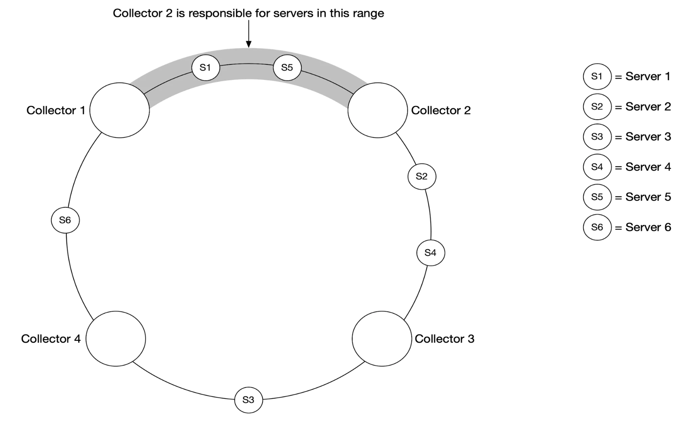
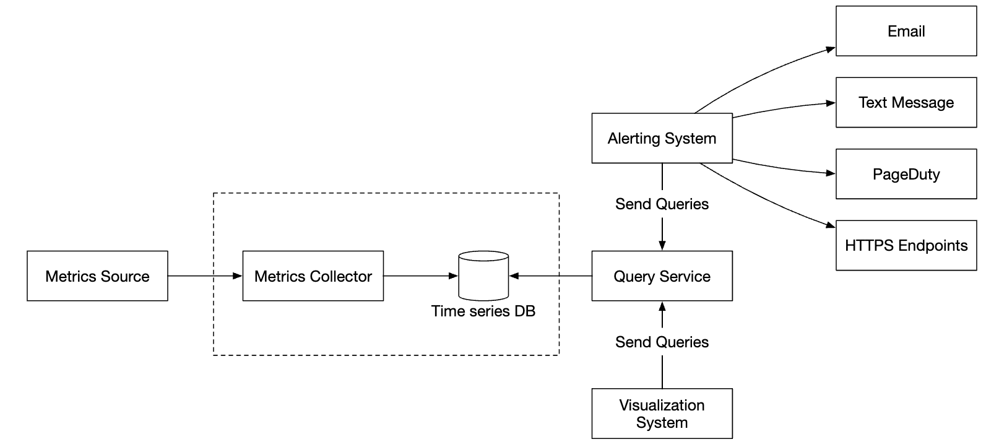
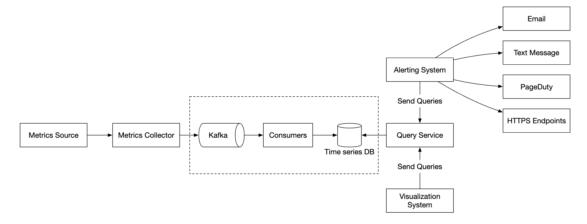
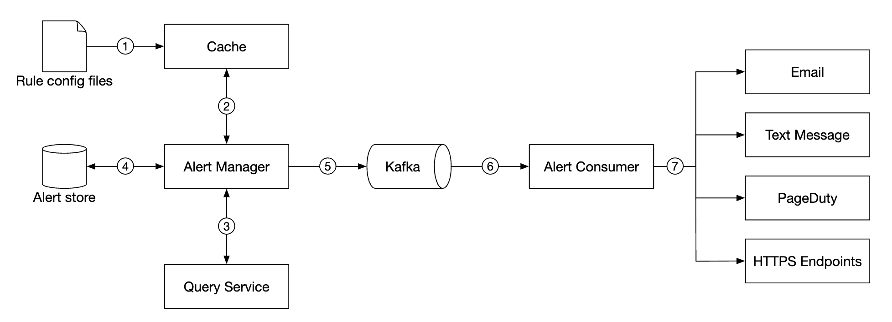
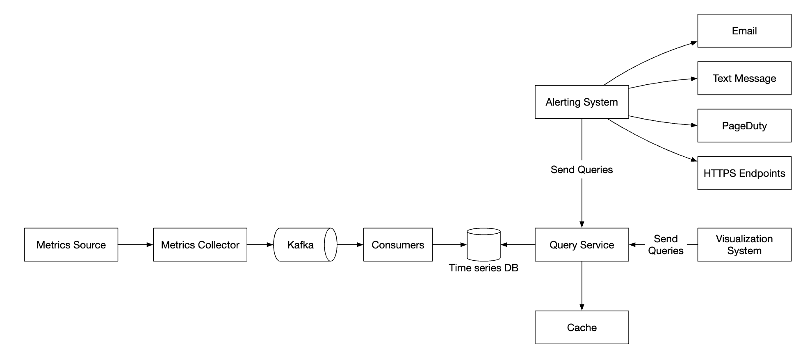

## CHAPTER 20 · 지표 모니터링과 경고 시스템 설계

### 소개
이 장에서는 높은 가용성과 신뢰성을 보장하는 데 필수적인, 규모 확장성이 높은 **지표 모니터링과 경고 시스템(metrics monitoring and alerting system)** 설계에 집중한다.

### 1단계: 문제 이해와 설계 범위 확정
지표 모니터링 시스템은 여러 가지를 의미할 수 있다 - 예컨대 면접관이 인프라 지표에만 관심이 있는데 로그 수집 시스템을 설계하고 싶지는 않을 것이다.

먼저 문제를 이해해 보자:
 - 지원자: 누구를 위해 시스템을 만드나요? 대형 테크 기업의 사내 모니터링 시스템인가요, DataDog 같은 SaaS인가요?
 - 면접관: 사내용으로만 만듭니다.
 - 지원자: 어떤 지표를 수집하나요?
 - 면접관: 운영 시스템 지표 - CPU 부하, 메모리, 데이터 디스크 공간. 초당 요청 수 같은 상위 지표도 포함합니다. 비즈니스 지표는 범위 밖입니다.
 - 지원자: 모니터링할 인프라 규모는 어느 정도인가요?
 - 면접관: DAU 1억 명, 서버 풀 1,000개, 풀당 머신 100대입니다.
 - 지원자: 데이터를 얼마나 오래 보관하나요?
 - 면접관: 1년 보관으로 가정합시다.
 - 지원자: 장기 저장을 위해 지표 데이터 해상도를 낮춰도 되나요?
 - 면접관: 새로 받은 지표는 7일간 보관합니다. 이후 30일은 1분 해상도로 롤업하고, 30일이 지나면 다시 1시간 해상도로 롤업합니다.
 - 지원자: 지원하는 경고 채널은 무엇인가요?
 - 면접관: 이메일, 전화, PagerDuty, 웹훅입니다.
 - 지원자: 에러 로그나 접근 로그 같은 로그를 수집해야 하나요?
 - 면접관: 아니요.
 - 지원자: 분산 시스템 트레이싱을 지원해야 하나요?
 - 면접관: 아니요.

#### **개략적 요구사항과 가정**
모니터링 대상 인프라는 대규모다:
 - DAU 1억 명
 - 서버 풀 1,000개 * 머신 100대 * 머신당 약 100개 지표 -> 약 1,000만 개 지표
 - 1년 데이터 보관
 - 데이터 보관 정책 - 원본 7일, 30일간 1분 해상도, 1년간 1시간 해상도

다양한 지표를 모니터링할 수 있다:
 - CPU 부하
 - 요청 수
 - 메모리 사용량
 - 메시지 큐의 메시지 수

#### **비기능 요구사항**
 - **규모 확장성**: 더 많은 지표와 경고를 수용하도록 확장 가능해야 한다.
 - **낮은 지연**: 대시보드와 경고를 위해 낮은 쿼리 지연이 필요하다.
 - **신뢰성**: 중요한 경고를 놓치지 않도록 매우 신뢰할 수 있어야 한다.
 - **유연성**: 미래에 새 기술을 쉽게 통합할 수 있어야 한다.

범위 밖 요구사항은 무엇인가?
 - **로그 모니터링**: 이 사례에는 ELK 스택이 널리 쓰인다.
 - **분산 시스템 트레이싱**: 시스템 안에서 요청이 여러 서비스를 흐르는 동안의 수명 주기 데이터를 수집하는 것을 뜻한다.

### 2단계: 개략적 설계안 제시 및 동의 얻기

#### **기초**
지표 모니터링과 경고 시스템에는 다섯 개의 핵심 컴포넌트가 관여한다:


 - **데이터 수집**: 여러 출처에서 지표 데이터를 수집한다.
 - **데이터 전송**: 출처에서 지표 모니터링 시스템으로 데이터를 옮긴다.
 - **데이터 저장소**: 들어온 데이터를 정리해 저장한다.
 - **경고**: 들어온 데이터를 분석해 이상을 감지하고 경고를 만든다.
 - **시각화**: 그래프, 차트 등으로 데이터를 보여 준다.

#### **데이터 모델**
지표 데이터는 보통 타임스탬프가 붙은 값들의 집합인 시계열(time-series)로 기록된다.
시계열은 이름과 선택적인 태그 집합으로 식별할 수 있다.

예시 1 - 20:00에 프로덕션 서버 인스턴스 i631의 CPU 부하는?


데이터는 다음 표로 식별할 수 있다:


시계열은 지표 이름, 레이블, 특정 시각의 단일 지점으로 식별된다.

예시 2 - 최근 10분 동안 us-west 리전의 모든 웹 서버에 대한 평균 CPU 부하는?

```
CPU.load host=webserver01,region=us-west 1613707265 50

CPU.load host=webserver01,region=us-west 1613707265 62

CPU.load host=webserver02,region=us-west 1613707265 43

CPU.load host=webserver02,region=us-west 1613707265 53

...

CPU.load host=webserver01,region=us-west 1613707265 76

CPU.load host=webserver01,region=us-west 1613707265 83
```

이 질문에 답하려고 저장소에서 꺼낼 수 있는 데이터 예시다.
평균 CPU 부하는 행의 마지막 컬럼 값들을 평균 내면 계산할 수 있다.

위 형식을 라인 프로토콜(line protocol)이라고 부르며, 시장의 유명 모니터링 소프트웨어 다수가 사용한다 - 예컨대 Prometheus, OpenTSDB.

모든 시계열의 구성 요소:


데이터가 어떻게 보이는지 시각화한 좋은 예다:


 - x축은 시간이다.
 - y축은 질의하는 차원이다 - 예컨대 지표 이름, 태그 등.

데이터 접근 패턴은 쓰기가 많고 읽기는 튀는 형태다. 지표를 많이 수집하지만 접근은 드물고, 예컨대 장애가 진행 중일 때는 집중적으로 발생한다.

데이터 저장소 시스템은 이 설계의 심장이다.
 - 이 문제에 범용 데이터베이스를 쓰는 것은 권장되지 않는다. 전문가 수준의 튜닝을 거치면 좋은 규모를 달성할 수는 있다.
 - NoSQL 데이터베이스는 이론상 동작하지만, 시계열 데이터를 효과적으로 저장·질의하는 확장 가능한 스키마를 설계하기 어렵다.

시계열 데이터 저장에 특화된 데이터베이스는 많다. 상당수가 커스텀 질의 인터페이스를 지원해 시계열 데이터를 효과적으로 질의할 수 있다.
 - OpenTSDB는 분산 시계열 데이터베이스지만 Hadoop과 HBase 기반이다. 그런 인프라가 프로비저닝되어 있지 않으면 쓰기 어렵다.
 - Twitter는 MetricsDB를 쓰고 Amazon은 Timestream을 제공한다.
 - 가장 널리 쓰이는 두 시계열 데이터베이스는 InfluxDB와 Prometheus다.
 - 둘 다 대량의 시계열 데이터 저장에 맞게 설계되었다. 둘 모두 메모리 캐시 + 온디스크 저장소에 기반한다.

InfluxDB 규모 예시 - 8코어와 32GB RAM으로 프로비저닝했을 때 초당 250k 이상의 쓰기:


지표 데이터베이스 내부를 이해할 것으로 기대하지는 않는다. 틈새 지식이기 때문이다. 이력서에 언급했을 때만 물어볼 수 있다.

면접 목적상, 지표가 시계열 데이터라는 점과 InfluxDB 같은 유명 시계열 데이터베이스를 아는 것으로 충분하다.

시계열 데이터베이스의 좋은 기능 하나는 레이블별로 대량의 시계열 데이터를 효율적으로 집계·분석하는 것이다.
예컨대 InfluxDB는 레이블마다 인덱스를 만든다.

다만 레이블의 카디널리티를 낮게 유지하는 것이 결정적이다 - 즉, 유일한 레이블을 너무 많이 쓰지 않는다.

#### **개략적 설계**


 - **지표 출처**: 애플리케이션 서버, SQL 데이터베이스, 메시지 큐 등.
 - **지표 수집기**: 지표 데이터를 모아 시계열 데이터베이스에 쓴다.
 - **시계열 데이터베이스**: 지표를 시계열로 저장한다. 대량 지표 분석을 위한 커스텀 질의 인터페이스를 제공한다.
 - **쿼리 서비스**: 시계열 DB에서 데이터를 쉽게 질의·조회하게 해 준다. DB 인터페이스가 충분히 강력하다면 완전히 대체될 수 있다.
 - **경고 시스템**: 다양한 경고 대상지로 경고 알림을 보낸다.
 - **시각화 시스템**: 그래프/차트 형태로 지표를 보여 준다.

### 3단계: 상세 설계
시스템의 더 흥미로운 부분 몇 곳을 깊이 들여다보자.

#### **지표 수집**
지표 수집에서 가끔의 데이터 유실은 치명적이지 않다. 클라이언트가 발사 후 잊기(fire and forget) 방식을 써도 괜찮다.


지표 수집 구현 방법은 두 가지다 - 풀(pull) 또는 푸시(push).

풀 모델은 다음과 같은 모습일 수 있다:


이 해법에서 지표 수집기는 서비스와 지표 엔드포인트의 최신 목록을 유지해야 한다.
이 목적으로 Zookeeper나 etcd를 쓸 수 있다 - 서비스 디스커버리다.

서비스 디스커버리에는 언제 어디서 지표를 수집할지에 대한 설정 규칙이 담겨 있다:


지표 수집 흐름의 자세한 설명이다:


 - 지표 수집기는 서비스 디스커버리에서 설정 메타데이터를 가져온다. 풀 주기, IP 주소, 타임아웃·재시도 파라미터가 포함된다.
 - 지표 수집기는 미리 정의된 HTTP 엔드포인트(예: `/metrics`)로 지표 데이터를 당겨 온다. 보통 클라이언트 라이브러리가 수행한다.
 - 대안으로, 지표 수집기는 서비스 엔드포인트가 바뀌면 알림을 받도록 서비스 디스커버리에 변경 이벤트 알림을 등록할 수 있다.
 - 또 다른 방법은 지표 수집기가 주기적으로 지표 엔드포인트 설정 변경을 폴링하는 것이다.

우리 규모에서는 지표 수집기 하나로 부족하다. 인스턴스가 여러 개여야 한다.
하지만 두 수집기가 같은 지표를 두 번 수집하지 않도록, 수집기 사이에 어떤 동기화도 필요하다.

한 가지 해법은 수집기와 서버를 안정 해시 링 위에 배치하고, 서버 집합을 단 하나의 수집기에만 연결하는 것이다:



반면 푸시 모델에서는 서비스가 자기 지표를 지표 수집기로 능동적으로 푸시한다:


이 방식에서는 보통 수집 에이전트를 서비스 인스턴스 옆에 설치한다.
에이전트는 서버에서 지표를 모아 지표 수집기로 푸시한다.


이 모델에서는 수집기로 보내기 전에 지표를 집계할 수 있어, 수집기가 처리하는 데이터 양이 줄어든다.

반대로 지표 수집기는 부하를 감당하지 못하면 푸시 요청을 거부할 수 있다.
따라서 수집기를 로드밸런서 뒤의 오토스케일링 그룹에 두는 것이 중요하다.

그럼 어느 쪽이 나은가? 두 접근에는 트레이드오프가 있고 시스템마다 다른 방식을 쓴다:
 - Prometheus는 풀 아키텍처를 쓴다.
 - Amazon Cloud Watch와 Graphite는 푸시 아키텍처를 쓴다.

푸시와 풀의 주요 차이점:
|          | 풀(Pull)                                                                                                                                                               | 푸시(Push)                                                                                                                                                                                              |
|----------|-----------------------------------------------------------------------------------------------------------------------------------------------------------------------|--------------------------------------------------------------------------------------------------------------------------------------------------------------------------------------------------------|
| 디버깅 용이성 | 지표를 당겨 오는 용도로 쓰이는 애플리케이션 서버의 /metrics 엔드포인트로 언제든 지표를 볼 수 있다. 노트북에서도 가능하다. 풀이 이긴다.                                                    | 지표 수집기가 지표를 받지 못하면 네트워크 문제 때문일 수 있다.                                                                                                                                           |
| 헬스 체크 | 애플리케이션 서버가 풀에 응답하지 않으면 서버가 죽었는지 빠르게 알 수 있다. 풀이 이긴다.                                                                                                    | 지표 수집기가 지표를 받지 못하면 네트워크 문제 때문일 수 있다.                                                                                                                                           |
| 수명이 짧은 작업 |                                                                                                                                                                       | 일부 배치 작업은 수명이 짧아 풀 대상이 되기 전에 끝날 수 있다. 푸시가 이긴다. 풀 모델에 푸시 게이트웨이를 도입하면 해결할 수 있다 [22].                                                                                   |
| 방화벽이나 복잡한 네트워크 구성 | 서버가 지표를 당겨 오려면 모든 지표 엔드포인트에 도달할 수 있어야 한다. 데이터 센터가 여러 곳인 구성에서는 문제가 될 수 있다. 더 정교한 네트워크 인프라가 필요할 수 있다. | 지표 수집기를 로드밸런서와 오토스케일링 그룹으로 구성하면 어디서든 데이터를 받을 수 있다. 푸시가 이긴다.                                                                                                       |
| 성능 | 풀 방식은 보통 TCP를 쓴다.                                                                                                                                                    | 푸시 방식은 보통 UDP를 쓴다. 즉 푸시 방식이 더 낮은 지연의 지표 전송을 제공한다. 반론은 TCP 연결 수립 비용이 지표 페이로드 전송 비용에 비해 작다는 것이다.                                                                       |
| 데이터 진위성 | 지표를 수집할 애플리케이션 서버는 설정 파일에 미리 정의된다. 그 서버에서 모은 지표는 진짜임이 보장된다.                                                                                  | 어떤 클라이언트든 지표 수집기로 지표를 푸시할 수 있다. 지표를 받을 서버를 화이트리스트로 지정하거나 인증을 요구하면 고칠 수 있다.                                                                                        |

명확한 승자는 없다. 큰 조직은 아마 둘 다 지원해야 할 것이다. 애초에 푸시 에이전트를 설치할 방법이 없을 수도 있다.

#### **지표 전송 파이프라인 확장**



푸시든 풀이든, 지표 수집기는 오토스케일링 그룹으로 프로비저닝한다.

하지만 시계열 DB가 죽으면 데이터 유실 가능성이 있다. 완화하려면 큐잉 메커니즘을 프로비저닝한다:



 - 지표 수집기가 지표 데이터를 Kafka로 푸시한다.
 - 컨슈머나 Apache Storm, Flink, Spark 같은 스트림 처리 서비스가 데이터를 처리해 시계열 DB로 푸시한다.

이 접근의 장점:
 - Kafka가 매우 신뢰할 수 있고 확장 가능한 분산 메시지 플랫폼으로 쓰인다.
 - 데이터 수집과 데이터 처리를 서로 분리한다.
 - Kafka에 데이터를 보관해 데이터 유실을 막을 수 있다.

Kafka는 지표 이름당 파티션 하나로 설정해, 컨슈머가 지표 이름별로 데이터를 집계할 수 있다.
확장하려면 태그/레이블로 더 분할하고, 먼저 수집할 지표를 분류하고 우선순위를 둘 수 있다.


이 문제에 Kafka를 쓰는 주된 단점은 유지보수/운영 오버헤드다.
대안은 [Gorilla](https://www.vldb.org/pvldb/vol8/p1816-teller.pdf) 같은 대규모 수집(ingestion) 시스템을 쓰는 것이다.
이 방식이 큐잉에 Kafka를 쓰는 것만큼 확장성이 있다고 볼 수도 있다.

#### **집계가 일어날 수 있는 위치**
지표는 여러 위치에서 집계할 수 있다. 선택지마다 트레이드오프가 있다:
 - **수집 에이전트**: 클라이언트 쪽 수집 에이전트는 단순한 집계 로직만 지원한다. 예컨대 1분간 카운터를 모아 지표 수집기로 보낸다.
 - **수집 파이프라인**: DB에 쓰기 전에 집계하려면 Flink 같은 스트림 처리 엔진이 필요하다. 쓰기량이 준다는 장점이 있지만, 원본 데이터를 저장하지 않아 데이터 정밀도를 잃는다.
 - **질의 쪽**: 시각화 시스템으로 쿼리를 실행할 때 집계할 수 있다. 데이터 유실은 없지만, 많은 데이터 처리 때문에 질의가 느릴 수 있다.

#### **쿼리 서비스**
시계열 DB와 별도의 쿼리 서비스를 두면 시각화·경고 시스템을 데이터베이스에서 분리해, DB를 클라이언트에서 분리하고 자유롭게 교체할 수 있다.

시계열 데이터베이스 부하를 줄이려고 여기에 캐시 계층을 추가할 수 있다:


쿼리 서비스 자체를 생략할 수도 있다. 대부분의 시각화·경고 시스템이 대부분의 시계열 데이터베이스와 통합하는 강력한 플러그인을 갖고 있기 때문이다.
시계열 DB를 잘 고르면 자체 캐싱 계층도 도입할 필요가 없을 수 있다.

대부분의 시계열 DB는 SQL을 지원하지 않는다. 시계열 데이터 질의에 비효율적이기 때문이다. 지수 이동 평균을 계산하는 SQL 질의 예시다:

```
select id,
       temp,
       avg(temp) over (partition by group_nr order by time_read) as rolling_avg
from (
  select id,
         temp,
         time_read,
         interval_group,
         id - row_number() over (partition by interval_group order by time_read) as group_nr
  from (
    select id,
    time_read,
    "epoch"::timestamp + "900 seconds"::interval * (extract(epoch from time_read)::int4 / 900) as interval_group,
    temp
    from readings
  ) t1
) t2
order by time_read;
```

같은 질의를 InfluxDB가 쓰는 질의 언어 Flux로 나타내면:

```
from(db:"telegraf")
  |> range(start:-1h)
  |> filter(fn: (r) => r._measurement == "foo")
  |> exponentialMovingAverage(size:-10s)
```

#### **저장소 계층**
시계열 데이터베이스를 신중하게 고르는 것이 중요하다.

Facebook이 발표한 연구에 따르면 운영 저장소 질의의 약 85%가 지난 26시간 데이터였다.

이 특성을 활용하는 데이터베이스를 고르면 시스템 성능에 큰 영향을 줄 수 있다. InfluxDB가 그런 선택지 하나다.

어떤 데이터베이스를 고르든, 쓸 수 있는 최적화가 몇 가지 있다.

데이터 인코딩과 압축은 데이터 크기를 크게 줄일 수 있다. 이런 기능은 좋은 시계열 데이터베이스에 보통 내장되어 있다.


위 예에서는 전체 타임스탬프 대신 타임스탬프 델타를 저장할 수 있다.

쓸 수 있는 또 다른 기법은 다운샘플링(down-sampling)이다 - 디스크 사용량을 줄이려고 고해상도 데이터를 저해상도로 변환한다.

오래된 데이터에 적용하고 규칙은 데이터 과학자가 설정 가능하게 만들 수 있다, 예:
 - 7일 - 다운샘플링 없음
 - 30일 - 1분으로 다운샘플링
 - 1년 - 1시간으로 다운샘플링

예를 들어 다음은 10초 해상도 지표 테이블이다:
| metric | timestamp            | hostname | Metric_value |
|--------|----------------------|----------|--------------|
| cpu    | 2021-10-24T19:00:00Z | host-a   | 10           |
| cpu    | 2021-10-24T19:00:10Z | host-a   | 16           |
| cpu    | 2021-10-24T19:00:20Z | host-a   | 20           |
| cpu    | 2021-10-24T19:00:30Z | host-a   | 30           |
| cpu    | 2021-10-24T19:00:40Z | host-a   | 20           |
| cpu    | 2021-10-24T19:00:50Z | host-a   | 30           |

30초 해상도로 다운샘플링하면:
| metric | timestamp            | hostname | Metric_value (avg) |
|--------|----------------------|----------|--------------------|
| cpu    | 2021-10-24T19:00:00Z | host-a   | 19                 |
| cpu    | 2021-10-24T19:00:30Z | host-a   | 25                 |

마지막으로, 더는 쓰지 않는 오래된 데이터에는 콜드 스토리지를 쓸 수도 있다. 콜드 스토리지의 금전적 비용은 훨씬 낮다.

#### **경고 시스템**



설정은 캐시 서버로 불러온다. 규칙은 보통 YAML 형식으로 정의한다. 예시다:

```
- name: instance_down
  rules:

  # Alert for any instance that is unreachable for >5 minutes.
  - alert: instance_down
    expr: up == 0
    for: 5m
    labels:
      severity: page
```

경고 관리자는 캐시에서 경고 설정을 가져온다. 설정 규칙에 따라 미리 정의된 주기로 쿼리 서비스를 호출하기도 한다.
규칙이 충족되면 경고 이벤트가 만들어진다.

경고 관리자의 다른 책임:
 - 경고 필터링, 병합, 중복 제거. 예컨대 단일 인스턴스 경고가 여러 번 촉발되면 경고 이벤트는 하나만 만들어진다.
 - 접근 제어 - 경고 관리 조작은 특정 인원만 할 수 있도록 제한하는 것이 중요하다.
 - 재시도 - 관리자는 경고가 최소 한 번 전파되도록 보장한다.

경고 저장소는 Cassandra 같은 키-값 데이터베이스로, 모든 경고의 상태를 보관한다. 알림이 최소 한 번 전송되도록 보장한다.
경고가 촉발되면 Kafka로 발행된다.

마지막으로, 경고 컨슈머가 Kafka에서 경고 데이터를 가져와 여러 채널로 알림을 보낸다 - 이메일, 문자 메시지, PagerDuty, 웹훅.

실제로는 경고 시스템을 위한 상용 솔루션이 많다. 직접 만들 근거를 대기는 어렵다.

#### **시각화 시스템**
시각화 시스템은 시간 범위 동안의 지표와 경고를 보여 준다. Grafana로 만든 대시보드 예시다:


고품질 시각화 시스템은 만들기 매우 어렵다. Grafana 같은 상용 솔루션을 쓰지 않을 근거를 대기도 어렵다.

### 4단계: 마무리
최종 설계는 다음과 같다:


