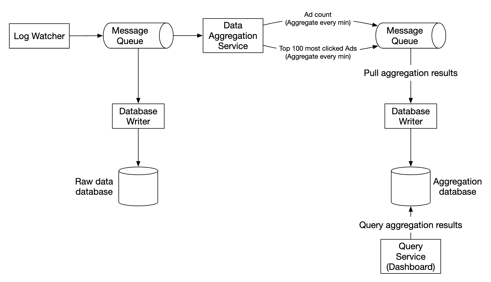
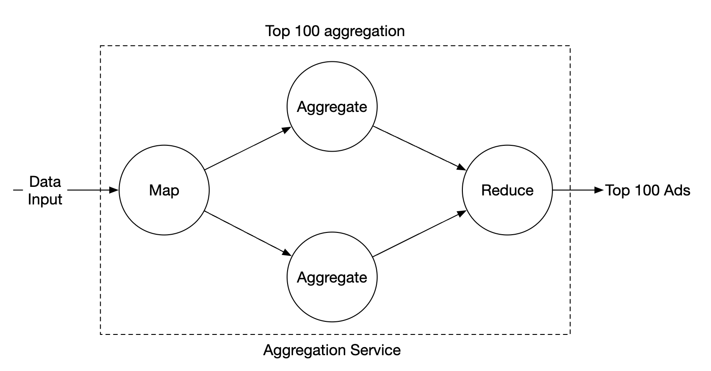
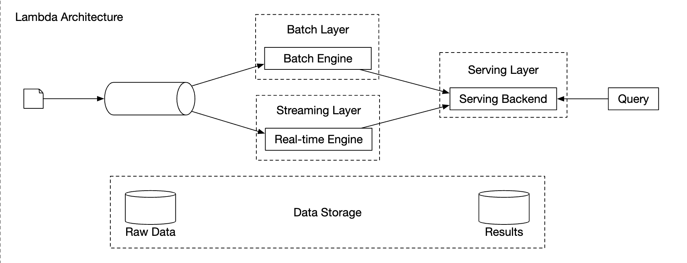
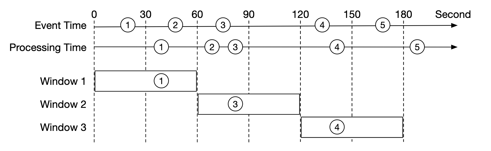
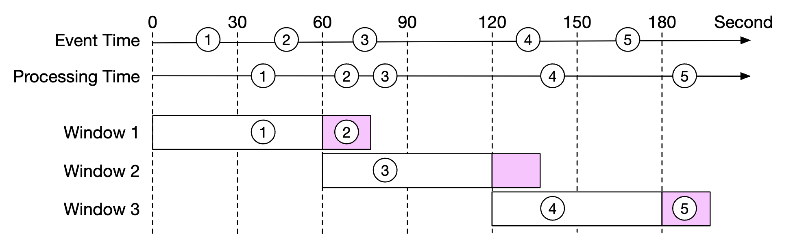
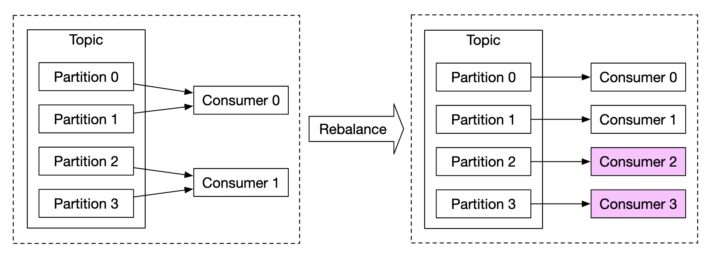
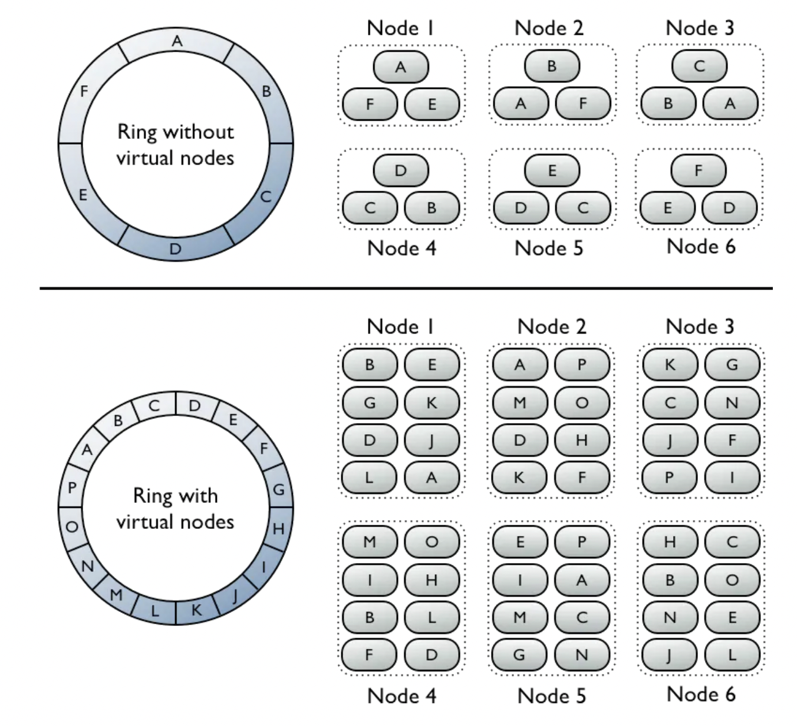
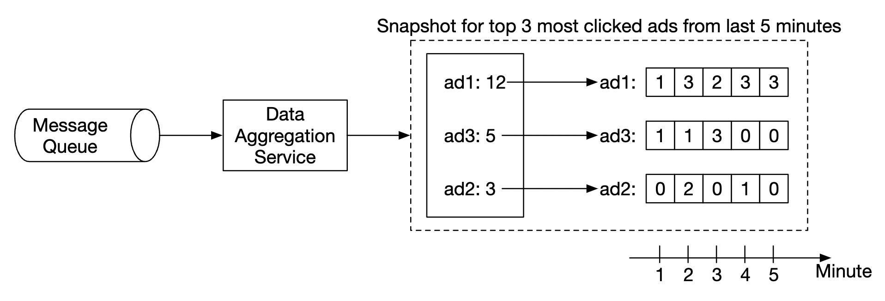
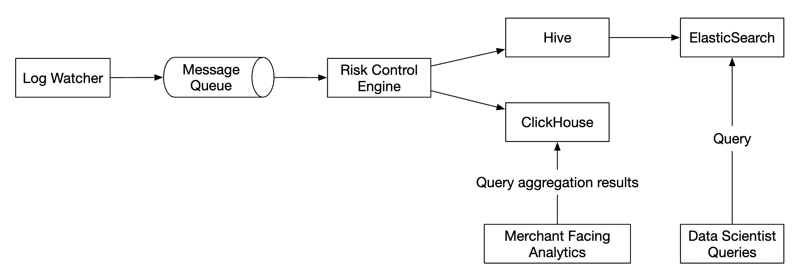

## CHAPTER 21 · 광고 클릭 이벤트 집계 설계

### 소개
**디지털 광고**는 Facebook, YouTube, TikTok 등의 부상과 함께 커진 거대 산업이다.

따라서 광고 클릭 이벤트 추적이 중요하다. 이 장에서는 Facebook/Google 규모의 **광고 클릭 이벤트 집계** 시스템을 어떻게 설계하는지 살펴본다.

디지털 광고에는 **실시간 입찰(real-time bidding, RTB)**이라 불리는 과정이 있으며, 이를 통해 디지털 광고 인벤토리가 매매된다:


RTB는 보통 1초 안에 일어나므로 속도가 중요하다.
데이터 정확도도 광고주가 지불하는 금액에 영향을 주므로 매우 중요하다.

광고 클릭 이벤트 집계를 바탕으로 광고주는 타깃 대상과 키워드 조정 같은 의사결정을 내릴 수 있다.

### 1단계: 문제 이해와 설계 범위 확정
 - C: 입력 데이터의 형식은 무엇인가?
 - I: 하루 1bil 건의 광고 클릭, 전체 2mil 개의 광고. 광고 클릭 이벤트 수는 매년 30%씩 증가한다.
 - C: 시스템이 지원해야 할 가장 중요한 쿼리는 무엇인가?
 - I: 고려해야 할 주요 쿼리:
   - 최근 Y분 동안 광고 X의 클릭 이벤트 수 반환
   - 지난 1분간 가장 많이 클릭된 상위 100개 광고 반환. 두 파라미터 모두 설정 가능해야 한다. 집계는 매분 일어난다.
   - 위 쿼리에 대해 `ip`, `user_id`, `country` 기반 데이터 필터링 지원
 - C: 엣지 케이스를 고려해야 하나? 내가 생각할 수 있는 것들은:
   - 예상보다 늦게 도착하는 이벤트가 있을 수 있다
   - 중복 이벤트가 있을 수 있다
   - 시스템의 일부가 다운될 수 있으므로 시스템 복구를 고려해야 한다
 - I: 좋은 목록이다. 그것들을 고려하라
 - C: 지연 시간 요구사항은?
 - I: 광고 클릭 집계는 수 분의 e2e 지연 시간. RTB의 경우 1초 미만이다. 광고 클릭 집계는 보통 청구와 리포팅에 쓰이므로 이 정도 지연 시간은 괜찮다.

#### **기능 요구사항**
 - 최근 Y분 동안 `ad_id`의 클릭 수 집계
 - 매분 가장 많이 클릭된 상위 100개 `ad_id` 반환
 - 다양한 속성 기반 집계 필터링 지원
 - 데이터셋 규모는 Facebook 또는 Google 수준

#### **비기능 요구사항**
 - RTB와 광고 청구에 사용되므로 집계 결과의 정확성이 중요하다
 - 지연되거나 중복된 이벤트를 적절히 처리
 - 견고성 - 시스템은 부분 장애에 회복력이 있어야 한다
 - 지연 시간 - 최대 수 분의 e2e 지연 시간

#### **개략적 규모 추정**
 - 1bil DAU
 - 사용자가 하루에 광고 1개를 클릭한다고 가정 -> 하루 1bil 건의 광고 클릭
 - 광고 클릭 QPS = 10,000
 - 최대 QPS는 그 수의 5배 = 50,000
 - 광고 클릭 하나는 0.1KB의 저장 공간을 차지한다. 일일 저장소 요구량은 100gb
 - 월간 저장소 = 3tb

### 2단계: 개략적 설계 안 제시와 동의 얻기
이 섹션에서는 쿼리 API 설계, 데이터 모델, 개략적 설계를 논의한다.

#### **쿼리 API 설계**
API는 클라이언트와 서버 사이의 계약이다. 우리 경우 클라이언트는 대시보드 사용자, 즉 데이터 과학자/애널리스트, 광고주 등이다.

기능 요구사항은 다음과 같다:
 - 최근 Y분 동안 `ad_id`의 클릭 수 집계
 - 최근 M분 동안 가장 많이 클릭된 상위 N개 `ad_id` 반환
 - 다양한 속성 기반 집계 필터링 지원

이 요구사항을 달성하려면 두 개의 엔드포인트가 필요하다. 필터링은 그중 하나에서 쿼리 파라미터로 처리할 수 있다.

**최근 M분 동안 ad_id의 집계 클릭 수**:

```
GET /v1/ads/{:ad_id}/aggregated_count
```

쿼리 파라미터:
 - from - 시작 분. 기본값은 현재 - 1분
 - to - 종료 분. 기본값은 현재
 - filter - 서로 다른 필터링 전략의 식별자. 예를 들어 001은 "미국 외 클릭"을 의미한다.

응답:
 - ad_id - 광고 식별자
 - count - 시작 분과 종료 분 사이의 집계 수

**최근 M분 동안 가장 많이 클릭된 상위 N개 ad_id 반환**

```
GET /v1/ads/popular_ads
```

쿼리 파라미터:
 - count - 가장 많이 클릭된 상위 N개 광고
 - window - 분 단위의 집계 윈도우 크기
 - filter - 서로 다른 필터링 전략의 식별자

응답:
 - ad_id 목록

#### **데이터 모델**
시스템에는 원본 데이터와 집계 데이터가 있다.

원본 데이터는 다음과 같은 모습이다:

```
[AdClickEvent] ad001, 2021-01-01 00:00:01, user 1, 207.148.22.22, USA
```

구조화된 형식의 예는 다음과 같다:
| ad_id | click_timestamp     | user  | ip            | country |
|-------|---------------------|-------|---------------|---------|
| ad001 | 2021-01-01 00:00:01 | user1 | 207.148.22.22 | USA     |
| ad001 | 2021-01-01 00:00:02 | user1 | 207.148.22.22 | USA     |
| ad002 | 2021-01-01 00:00:02 | user2 | 209.153.56.11 | USA     |

집계된 버전은 다음과 같다:
| ad_id | click_minute | filter_id | count |
|-------|--------------|-----------|-------|
| ad001 | 202101010000 | 0012      | 2     |
| ad001 | 202101010000 | 0023      | 3     |
| ad001 | 202101010001 | 0012      | 1     |
| ad001 | 202101010001 | 0023      | 6     |

`filter_id`는 필터링 요구사항을 달성하는 데 도움을 준다.
| filter_id | region | IP        | user_id |
|-----------|--------|-----------|---------|
| 0012      | US     | *         | *       |
| 0013      | *      | 123.1.2.3 | *       |

최근 M분 동안 가장 많이 클릭된 상위 N개 광고를 빠르게 반환하기 위해 다음 구조도 유지한다:
| most_clicked_ads   |           |                                       |
|--------------------|-----------|---------------------------------------|
| window_size        | integer   | 집계 윈도우 크기(M, 분 단위)          |
| update_time_minute | timestamp | 마지막 갱신 타임스탬프(1분 단위)      |
| most_clicked_ads   | array     | JSON 형식의 광고 ID 목록.             |

원본 데이터를 저장하는 것과 집계 데이터를 저장하는 것의 장단점은 무엇인가?
 - 원본 데이터는 전체 데이터셋 사용을 가능하게 하며 데이터 필터링과 재계산을 지원한다
 - 반면 집계 데이터는 더 작은 데이터셋과 더 빠른 쿼리를 가능하게 한다
 - 원본 데이터는 더 큰 데이터 저장소와 더 느린 쿼리를 의미한다
 - 집계 데이터는 파생 데이터이므로 일부 데이터 손실이 있다.

설계에서는 두 접근 방식을 함께 사용한다:
 - 디버깅을 위해 원본 데이터를 남겨두는 것이 좋다. 집계에 버그가 있으면 버그를 발견하고 백필할 수 있다.
 - 더 빠른 쿼리 성능을 위해 집계 데이터도 저장해야 한다.
 - 추가 저장 비용을 피하기 위해 원본 데이터는 콜드 스토리지에 보관할 수 있다.

데이터베이스와 관련해서는 고려할 요소가 여럿 있다:
 - 데이터는 어떤 모습인가? 관계형인가, 문서형인가, 블롭인가?
 - 워크로드는 읽기 중심인가, 쓰기 중심인가, 둘 다인가?
 - 트랜잭션이 필요한가?
 - 쿼리가 SUM, COUNT 같은 OLAP 함수에 의존하는가?

원본 데이터의 경우 평균 QPS는 10k, 최대 QPS는 50k이므로 시스템은 쓰기 중심이다.
반면 원본 데이터는 주로 문제가 생겼을 때를 대비한 백업용이므로 읽기 트래픽은 낮다.

관계형 데이터베이스도 역할을 할 수 있지만 쓰기를 확장하기가 어려울 수 있다.
대안으로 무거운 쓰기 부하에 더 나은 네이티브 지원을 제공하는 Cassandra나 InfluxDB를 사용할 수 있다.

또 다른 선택은 ORC, Parquet, AVRO 같은 컬럼형 데이터 형식과 함께 Amazon S3를 사용하는 것이다. 이 설정은 낯설므로 Cassandra를 쓰기로 하자.

집계 데이터의 워크로드는 읽기와 쓰기 모두 무겁다. 집계 데이터는 대시보드와 경고를 위해 끊임없이 조회되기 때문이다.
집계 서비스가 매분 데이터를 집계해 쓰기 때문에 쓰기 또한 많다.
따라서 여기에도 같은 데이터 저장소(Cassandra)를 사용한다.

#### **개략적 설계**
시스템은 다음과 같은 모습이다:


데이터는 입력과 출력 양쪽에서 무한(unbounded) 데이터 스트림으로 흐른다.

컨슈머의 크래시가 전체 시스템 정지로 이어질 수 있는 동기식 싱크를 피하기 위해,
메시지 큐(Kafka)를 활용한 비동기 처리로 컨슈머와 프로듀서를 분리한다.



첫 번째 메시지 큐는 광고 클릭 이벤트 데이터를 저장한다:
| ad_id | click_timestamp | user_id | ip | country |
|-------|-----------------|---------|----|---------|

두 번째 메시지 큐는 분 단위로 집계된 광고 클릭 수를 담는다:
| ad_id | click_minute | count |
|-------|--------------|-------|

뿐만 아니라 분 단위로 집계된 상위 N개 클릭 광고도 담는다:
| update_time_minute | most_clicked_ads |
|--------------------|------------------|

두 번째 메시지 큐는 종단 간 exactly-once 원자적 커밋(atomic commit) 의미론을 달성하기 위해 존재한다:


집계 서비스에는 MapReduce 프레임워크를 사용하는 것이 좋은 선택이다:




각 노드는 하나의 작업만 담당하며 처리 결과를 다운스트림 노드로 보낸다.

맵 노드는 데이터 소스에서 읽어와 데이터를 필터링하고 변환하는 역할을 한다.

예를 들어 맵 노드는 `ad_id`를 기준으로 서로 다른 집계 노드에 데이터를 배분할 수 있다:


대안으로 Kafka 파티션에 광고를 분산하고 집계 노드가 컨슈머 그룹 안에서 직접 구독하게 할 수도 있다.
하지만 맵 노드가 있으면 후속 처리 전에 데이터를 정제하거나 변환할 수 있다.

또 다른 이유는 데이터가 어떻게 생산되는지를 우리가 통제할 수 없어서,
같은 `ad_id`와 관련된 이벤트가 서로 다른 파티션에 들어갈 수 있기 때문이다.

집계(aggregate) 노드는 매분 `ad_id`별로 광고 클릭 이벤트를 메모리에서 센다.

리듀스(reduce) 노드는 집계 노드에서 집계 결과를 모아 최종 결과를 생산한다:


이 DAG 모델은 MapReduce 패러다임을 사용한다. 빅데이터를 가져와 병렬 분산 컴퓨팅을 활용해 규모가 작은 데이터로 바꾼다.

DAG 모델에서 중간 데이터는 메모리에 저장되며 서로 다른 노드는 TCP나 공유 메모리로 서로 통신한다.

이 모델이 다양한 유스케이스를 어떻게 달성하는지 살펴보자.

**유스케이스 1 - 클릭 수 집계**:


 - 광고는 `ad_id % 3`으로 파티션된다

**유스케이스 2 - 가장 많이 클릭된 상위 N개 광고 반환**:


 - 이 예에서는 상위 3개 광고를 집계하지만 상위 N개 광고로 쉽게 확장할 수 있다
 - 각 노드는 상위 N개 광고의 빠른 조회를 위해 힙(heap) 자료구조를 유지한다

**유스케이스 3 - 데이터 필터링**:
빠른 데이터 필터링을 지원하려면 필터 기준을 미리 정의하고 이를 기반으로 사전 집계할 수 있다:
| ad_id | click_minute | country | count |
|-------|--------------|---------|-------|
| ad001 | 202101010001 | USA     | 100   |
| ad001 | 202101010001 | GPB     | 200   |
| ad001 | 202101010001 | others  | 3000  |
| ad002 | 202101010001 | USA     | 10    |
| ad002 | 202101010001 | GPB     | 25    |
| ad002 | 202101010001 | others  | 12    |

이 기법은 **스타 스키마(star schema)**라 불리며 데이터 웨어하우스에서 널리 쓰인다.
필터링 필드는 **차원(dimensions)**이라고 불린다.

이 접근 방식의 이점은 다음과 같다:
 - 이해하고 구축하기 간단하다
 - 현재 집계 서비스를 재사용해 스타 스키마에 더 많은 차원을 만들 수 있다
 - 결과가 미리 계산되어 있어 필터 기준으로 데이터에 접근하는 것이 빠르다

이 접근 방식의 한계는, 특히 필터 기준이 많을 때 버킷과 레코드가 훨씬 많아진다는 것이다.

### 3단계: 상세 설계
더 흥미로운 주제 몇 가지를 깊이 파고들자.

#### **스트리밍 대 배치**
제시한 개략적 아키텍처는 스트림 처리 시스템의 한 유형이다.
세 가지 유형의 시스템을 비교하면 다음과 같다:
|                         | 서비스 (온라인 시스템) | 배치 시스템 (오프라인 시스템)                | 스트리밍 시스템 (준실시간 시스템) |
|-------------------------|-------------------------------|--------------------------------------------------------|----------------------------------------------|
| 응답성                  | 클라이언트에 빠르게 응답      | 클라이언트 응답 불필요                                  | 클라이언트 응답 불필요                        |
| 입력                    | 사용자 요청                   | 크기가 유한한 경계 입력. 대량의 데이터                  | 입력에 경계가 없음 (무한 스트림)               |
| 출력                    | 클라이언트 응답               | 구체화된 뷰, 집계 지표 등                               | 구체화된 뷰, 집계 지표 등                      |
| 성능 측정               | 가용성, 지연 시간             | 처리량                                                  | 처리량, 지연 시간                              |
| 예시                    | 온라인 쇼핑                  | MapReduce                                              | Flink [13]                                   |

설계에서는 배치와 스트리밍을 섞어 사용했다.

데이터가 도착하는 대로 처리해 준실시간으로 집계 결과를 만들어 내는 데 스트리밍을 사용했다.
반면 역사적 데이터 백업에는 배치를 사용했다.

배치와 스트리밍, 두 처리 경로를 동시에 포함하는 시스템의 아키텍처를 람다(lambda)라 부른다.
단점은 유지보수해야 하는 서로 다른 코드베이스를 가진 두 처리 경로가 생긴다는 것이다.

카파(Kappa)는 배치와 스트림 처리를 하나의 처리 경로로 결합한 대안 아키텍처이다.
핵심 아이디어는 단일 스트림 처리 엔진을 사용하는 것이다.

람다 아키텍처:



카파 아키텍처:


우리의 개략적 설계는 역사적 데이터의 재처리 역시 집계 서비스를 통과하므로 카파 아키텍처를 사용한다.

예컨대 집계 로직의 큰 버그 때문에 집계 데이터를 다시 계산해야 할 때는, 저장해 둔 원본 데이터로 집계를 재계산할 수 있다.
 - 재계산 서비스가 원본 저장소에서 데이터를 가져온다. 배치 작업이다.
 - 가져온 데이터는 전용 집계 서비스로 보내져 실시간 처리 집계 서비스는 영향을 받지 않는다.
 - 집계 결과는 두 번째 메시지 큐로 보내지고, 이후 집계 데이터베이스의 결과를 갱신한다.


#### **시간**
집계를 수행하려면 타임스탬프가 필요하다. 타임스탬프는 두 곳에서 생성될 수 있다:
 - 이벤트 시간(event time) - 광고 클릭이 일어난 시점
 - 처리 시간(processing time) - 서버가 이벤트를 처리하는 시스템 시간

비동기 처리(메시지 큐)와 네트워크 지연 때문에 이벤트 시간과 처리 시간 사이에는 상당한 차이가 있을 수 있다.
 - 처리 시간을 사용하면 집계 결과가 부정확해질 수 있다
 - 이벤트 시간을 사용하면 지연 이벤트를 다뤄야 한다

완벽한 해법은 없으며 트레이드오프를 고려해야 한다:
|                 | 장점                          | 단점                                                                                 |
|-----------------|---------------------------------------|--------------------------------------------------------------------------------------|
| 이벤트 시간      | 집계 결과가 더 정확하다        | 클라이언트의 시간이 잘못되었거나 타임스탬프가 악의적인 사용자에 의해 만들어질 수 있다 |
| 처리 시간        | 서버 타임스탬프가 더 신뢰할 수 있다 | 이벤트가 늦게 도착하면 타임스탬프가 정확하지 않다                                     |

데이터 정확도가 중요하므로 집계에는 이벤트 시간을 사용한다.

지연 이벤트 문제를 완화하기 위해 "워터마크(watermark)"라 불리는 기법을 활용할 수 있다.

아래 예에서 이벤트 2는 자신이 집계되어야 할 윈도우를 놓친다:



하지만 집계 윈도우를 의도적으로 늘리면 놓친 이벤트의 가능성을 줄일 수 있다.
윈도우에서 늘어난 부분을 "워터마크"라 부른다:



 - 짧은 워터마크는 놓친 이벤트의 가능성을 높이지만 지연 시간을 줄인다
 - 긴 워터마크는 놓친 이벤트의 가능성을 줄이지만 지연 시간을 늘린다

워터마크 크기와 무관하게 놓친 이벤트의 가능성은 항상 존재한다. 하지만 이런 저확률 이벤트에 맞춰 최적화하는 것은 소용없다.

대신 하루가 끝날 때의 정산(reconciliation)으로 이런 불일치를 해결할 수 있다.

#### **집계 윈도우**
윈도우 함수에는 네 가지 유형이 있다:
 - 텀블링(고정) 윈도우
 - 호핑 윈도우
 - 슬라이딩 윈도우
 - 세션 윈도우

설계에서는 광고 클릭 집계에 텀블링 윈도우를 활용한다:


또한 M분 동안 가장 많이 클릭된 상위 N개 광고 집계에는 슬라이딩 윈도우를 활용한다:


#### **전달 보장**
집계하는 데이터는 청구에 사용되므로 데이터 정확도가 최우선이다.

따라서 다음을 논의해야 한다:
 - 중복 이벤트 처리를 피하는 방법
 - 모든 이벤트가 처리되도록 보장하는 방법

사용할 수 있는 전달 보장은 세 가지다 - 최대 한 번(at-most-once), 최소 한 번(at-least-once), 정확히 한 번(exactly-once).

대부분의 상황에서 소량의 중복이 허용될 때는 at-least-once로 충분하다.
하지만 우리 시스템은 그렇지 않다. 몇 퍼센트의 차이가 수백만 달러의 불일치로 이어질 수 있기 때문이다.
따라서 exactly-once 전달 의미론을 사용해야 한다.

#### **데이터 중복 제거**
가장 흔한 데이터 품질 문제 중 하나는 중복 데이터다.

중복은 다양한 출처에서 올 수 있다:
 - 클라이언트 측 - 클라이언트가 같은 이벤트를 여러 번 다시 보낼 수 있다. 악의적 의도로 보내진 중복 이벤트는 리스크 엔진이 처리하는 것이 가장 좋다.
 - 서버 장애 - 집계 서비스 노드가 집계 도중에 다운되고 업스트림 서비스가 확인 응답(acknowledgment)을 받지 못해 이벤트가 다시 전송된다.

마지막 홉에서 이벤트 확인에 실패해 데이터 중복이 발생하는 예는 다음과 같다:


이 예에서 오프셋 100은 여러 번 처리되어 다운스트림으로 여러 번 전달된다.

이를 완화하려는 방법 하나는 마지막으로 관측된 오프셋을 HDFS/S3에 저장하는 것이지만, 결과가 다운스트림에 절대 도달하지 않을 위험이 있다:


마지막으로, 다운스트림과 상호작용하면서 오프셋을 원자적으로 저장할 수 있다. 이를 위해 분산 트랜잭션을 구현해야 한다:


**개인적인 사족**: 대안으로, 다운스트림 시스템이 집계 결과를 멱등적으로(idempotently) 처리한다면 분산 트랜잭션은 필요 없다.

#### **시스템 확장**
시스템이 커짐에 따라 어떻게 확장하는지 논의해 보자.

세 개의 독립 컴포넌트 - 메시지 큐, 집계 서비스, 데이터베이스가 있다.
서로 분리되어 있으므로 각각을 독립적으로 확장할 수 있다.

메시지 큐 확장 방법:
 - 프로듀서에는 제한을 두지 않으므로 쉽게 확장할 수 있다
 - 컨슈머는 컨슈머 그룹에 할당하고 컨슈머 수를 늘려 확장할 수 있다.
 - 이것이 동작하려면 충분한 파티션이 선제적으로 생성되어 있는지도 확인해야 한다
 - 또한 컨슈머가 수천 개일 때 컨슈머 리밸런싱(rebalancing)은 시간이 걸릴 수 있으므로 비혼잡 시간대에 수행하는 것이 권장된다
 - 지역별로 토픽을 파티셔닝하는 것도 고려할 수 있다. 예: `topic_na`, `topic_eu` 등



집계 서비스 확장 방법:


 - 맵-리듀스 노드는 노드를 추가하는 것만으로 쉽게 확장할 수 있다
 - 집계 서비스의 처리량은 멀티스레딩을 활용해 확장할 수 있다
 - 대안으로 Apache YARN 같은 리소스 제공자를 활용해 멀티프로세싱을 이용할 수 있다
 - 옵션 1이 더 쉽지만 옵션 2는 더 확장성이 높아 실무에서 더 널리 쓰인다
 - 멀티스레딩 예시는 다음과 같다:


데이터베이스 확장 방법:
 - Cassandra를 사용하면 일관성 해싱을 활용한 수평 확장을 기본 지원한다
 - 클러스터에 새 노드가 추가되면 모든 (가상) 노드에 걸쳐 데이터가 자동으로 리밸런싱된다
 - 이 접근 방식에서는 수동 (재)샤딩이 필요 없다



고려해야 할 또 다른 확장성 문제는 핫스팟 문제다 - 광고 하나가 다른 광고들보다 인기가 더 많아 더 많은 관심을 받으면 어떻게 되는가?


 - 위 예에서 집계 서비스 노드는 리소스 관리자에게 추가 리소스를 요청할 수 있다
 - 리소스 관리자가 더 많은 리소스를 할당하므로 원래 노드는 과부하되지 않는다
 - 원래 노드는 이벤트를 3개 그룹으로 나누고 각 집계 노드가 100개의 이벤트를 처리한다
 - 결과는 원래 집계 노드에 다시 기록된다

핫스팟 문제를 다루는 더 정교한 대안:
 - Global-Local Aggregation
 - Split Distinct Aggregation

#### **장애 허용**
집계 노드 내부에서는 메모리에서 데이터를 처리한다. 노드가 다운되면 처리된 데이터가 손실된다.

Kafka의 컨슈머 오프셋을 활용해 다른 노드가 역할을 넘겨받을 때 중단한 지점부터 계속할 수 있다.
하지만 M분 동안 상위 N개 광고를 집계하고 있으므로 유지해야 할 추가 중간 상태가 있다.

진행 중인 집계에 대해 특정 분마다 스냅샷을 만들 수 있다:



노드가 다운되면 새 노드가 마지막으로 커밋된 컨슈머 오프셋과 최신 스냅샷을 읽어 작업을 계속할 수 있다:


#### **데이터 모니터링과 정확성**
집계하는 데이터는 청구에 사용되므로 매우 중요하며, 정확성을 보장하기 위해 엄격한 모니터링을 갖추는 것이 매우 중요하다.

모니터링할 만한 지표:
 - **지연 시간**: 시스템의 e2e 지연 시간을 이해하기 위해 서로 다른 이벤트의 타임스탬프를 추적할 수 있다
 - **메시지 큐 크기**: 큐 크기가 갑자기 늘어나면 집계 노드를 더 추가해야 한다. Kafka는 분산 커밋 로그로 구현되어 있으므로 대신 records-lag 지표를 추적해야 한다.
 - **집계 노드의 시스템 리소스**: CPU, 디스크, JVM 등

또한 하루가 끝날 때 실행되는 배치 작업인 정산(reconciliation) 흐름을 구현해야 한다.
원본 데이터로 집계 결과를 계산해 집계 데이터베이스에 저장된 실제 데이터와 비교한다:


#### **대안 설계**
일반적인 시스템 디자인 면접에서는 빅데이터 처리에 쓰이는 전문 소프트웨어의 내부까지 알 것으로 기대하지 않는다.

사고 과정을 설명하고 트레이드오프를 논하는 것이 특정 도구를 아는 것보다 더 중요하며, 그래서 이 장은 범용적인 해법을 다룬다.

기성 도구를 활용하는 대안 설계는 광고 클릭 데이터를 Hive에 저장하고, 더 빠른 쿼리를 위해 그 위에 ElasticSearch 계층을 구축하는 것이다.

집계는 보통 ClickHouse나 Druid 같은 OLAP 데이터베이스에서 수행된다.



### 4단계: 마무리
다룬 내용:
 - 데이터 모델과 API 설계
 - MapReduce를 활용한 광고 클릭 이벤트 집계
 - 메시지 큐, 집계 서비스, 데이터베이스의 확장
 - 핫스팟 문제 완화
 - 시스템 지속 모니터링
 - 정산을 통한 정확성 보장
 - 장애 허용

광고 클릭 이벤트 집계는 전형적인 빅데이터 처리 시스템이다.

관련 기술에 대한 사전 지식이 있다면 이해하고 설계하기가 더 쉬울 것이다:
 - Apache Kafka
 - Apache Spark
 - Apache Flink
