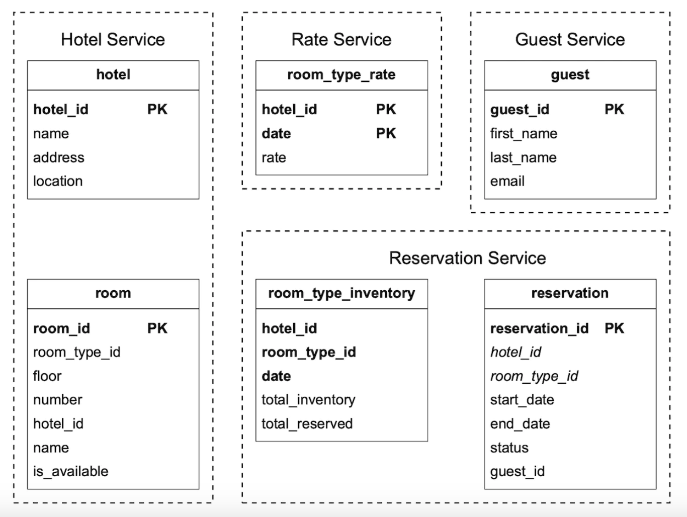

## CHAPTER 22 · 호텔 예약 시스템 설계

### 소개
이 장에서는 Marriott International과 비슷한 **호텔 예약 시스템**을 설계한다.

다른 유형의 시스템에도 적용 가능하다 - Airbnb, 항공권 예약, 영화표 예매 등.

### 1단계: 문제 이해와 설계 범위 확정
시스템 설계에 들어가기 전에 면접관에게 질문하여 범위를 명확히 해야 한다:
 - C: 시스템의 규모는 어느 정도인가?
 - I: 5000개 호텔과 1mil 개 객실을 가진 호텔 체인을 위한 웹사이트를 만든다
 - C: 고객은 예약할 때 지불하는가, 호텔에 도착했을 때 지불하는가?
 - I: 예약할 때 전액을 지불한다.
 - C: 고객은 웹사이트를 통해서만 객실을 예약하는가? 전화 같은 다른 예약 수단도 지원해야 하는가?
 - I: 웹사이트나 앱을 통해서만 예약한다.
 - C: 고객이 예약을 취소할 수 있는가?
 - I: 그렇다
 - C: 고려할 다른 사항은?
 - I: 그렇다, 10%의 초과 예약(overbooking)을 허용한다. 호텔은 실제 있는 객실 수보다 더 많은 객실을 판다. 고객이 예약을 취소할 것을 예상하여 호텔이 이렇게 한다.
 - C: 시간이 많지 않으니 다음에 집중하자 - 호텔 관련 페이지, 객실 상세 페이지, 객실 예약, 관리자 패널, 초과 예약 지원.
 - I: 좋다.
 - I: 한 가지 더 - 호텔 가격은 계속 변한다. 객실 가격이 매일 바뀐다고 가정하라.
 - C: 알겠다.

#### **비기능 요구사항**
 - 높은 동시성 지원 - 성수기에는 같은 호텔을 예약하려는 고객이 아주 많을 수 있다.
 - 적당한 지연 시간 - 사용자가 예약할 때 지연 시간이 낮으면 이상적이지만, 시스템이 처리하는 데 몇 초 걸리는 것은 받아들일 수 있다.

#### **개략적 규모 추정**
 - 전체 5000개 호텔과 1mil 개 객실
 - 객실의 70%가 사용 중이고 평균 숙박 기간은 3일이라고 가정
 - 일일 예약 추정 - 1mil * 0.7 / 3 = 하루 약 240k 건의 예약
 - 초당 예약 - 240k / 하루 10^5 초 = 약 3건. 평균 예약 TPS는 낮다.

QPS를 추정해 보자. 예약 페이지에 도달하기까지 세 단계가 있고 페이지당 전환율이 10%라고 가정하면,
예약이 3건 있으려면 예약 페이지 조회는 30회, 객실 상세 페이지 조회는 300회 있어야 한다고 추정할 수 있다.


### 2단계: 개략적 설계 안 제시와 동의 얻기
API 설계, 데이터 모델, 개략적 설계를 살펴본다.

#### **API 설계**
이 API 설계는 호텔 예약 시스템을 지원하기 위해 필요한 핵심 엔드포인트(RESTful 관행 사용)에 집중한다.

완전한 시스템이라면 다양한 기준으로 객실을 검색하는 등 더 광범위한 API가 필요하겠지만, 이 섹션에서는 다루지 않는다.
이유는 기술적으로 어렵지 않기 때문에 범위 밖으로 두었기 때문이다.

**호텔 관련 API**
 - `GET /v1/hotels/{id}` - 호텔 상세 정보 조회
 - `POST /v1/hotels` - 새 호텔 추가. 운영자만 사용 가능
 - `PUT /v1/hotels/{id}` - 호텔 정보 갱신. 운영자만 사용 가능
 - `DELETE /v1/hotels/{id}` - 호텔 삭제. 운영자만 사용 가능한 API

**객실 관련 API**
 - `GET /v1/hotels/{id}/rooms/{id}` - 객실 상세 정보 조회
 - `POST /v1/hotels/{id}/rooms` - 객실 추가. 운영자만 사용 가능
 - `PUT /v1/hotels/{id}/rooms/{id}` - 객실 정보 갱신. 운영자만 사용 가능
 - `DELETE /v1/hotels/{id}/rooms/{id}` - 객실 삭제. 운영자만 사용 가능

**예약 관련 API**
 - `GET /v1/reservations` - 현재 사용자의 예약 이력 조회
 - `GET /v1/reservations/{id}` - 예약 상세 정보 조회
 - `POST /v1/reservations` - 새 예약 생성
 - `DELETE /v1/reservations/{id}` - 예약 취소

예약 요청의 예는 다음과 같다:

```
{
  "startDate":"2021-04-28",
  "endDate":"2021-04-30",
  "hotelID":"245",
  "roomID":"U12354673389",
  "reservationID":"13422445"
}
```

`reservationID`는 이중 예약을 피하기 위한 멱등성 키(idempotency key)라는 점에 유의하라. 자세한 내용은 [동시성 섹션](#concurrency-issues)에서 설명한다

#### **데이터 모델**
어떤 데이터베이스를 사용할지 정하기 전에 접근 패턴을 고려해 보자.

다음 쿼리를 지원해야 한다:
 - 호텔 상세 정보 보기
 - 날짜 범위가 주어졌을 때 예약 가능한 객실 유형 찾기
 - 예약 기록하기
 - 예약 조회 또는 과거 예약 이력 조회

추정에서 알 수 있듯 시스템 규모는 크지 않지만, 트래픽 급증에 대비해야 한다.

이러한 지식을 바탕으로 관계형 데이터베이스를 선택한다. 이유는 다음과 같다:
 - 관계형 DB는 읽기 중심이고 쓰기가 덜한 시스템에 잘 맞는다.
 - NoSQL 데이터베이스는 보통 쓰기에 최적화되어 있지만, 사이트를 방문한 사용자 중 일부만 예약하므로 쓰기가 많지 않다는 것을 알고 있다.
 - 관계형 DB는 ACID 보장을 제공한다. 이런 보장이 없으면 음수 잔액, 이중 청구 같은 문제를 막을 수 없으므로 이 시스템에는 중요하다.
 - 관계형 DB는 구조가 매우 명확하므로 데이터를 쉽게 모델링할 수 있다.

스키마 설계는 다음과 같다:


대부분 필드는 설명이 필요 없다. 언급할 가치가 있는 유일한 필드는 객실의 상태 머신(state machine)을 나타내는 `status` 필드다:


이 데이터 모델은 Airbnb 같은 시스템에는 잘 맞지만, 사용자가 특정 객실이 아니라 객실 유형을 예약하는 호텔에는 맞지 않는다.
호텔에서는 객실 유형을 예약하고 객실 번호는 예약 시점에 정해진다.

이런 단점은 [개선된 데이터 모델](#improved-data-model) 섹션에서 다룬다.

#### **개략적 설계**
이 설계에는 마이크로서비스 아키텍처를 선택했다. 최근 몇 년 사이 큰 인기를 얻은 아키텍처이다:


 - **사용자(Users)**: 전화나 컴퓨터로 호텔 객실을 예약한다
 - **관리자(Admin)**: 결제 환불/취소 같은 관리 기능을 수행한다
 - **CDN**: JS 번들, 이미지, 비디오 같은 정적 리소스를 캐시한다
 - **공개 API 게이트웨이(Public API Gateway)**: 속도 제한, 인증 등을 지원하는 완전 관리형 서비스
 - **내부 API(Internal APIs)**: 권한을 가진 사람만 볼 수 있다. 보통 VPN으로 보호된다.
 - **호텔 서비스(Hotel service)**: 호텔과 객실에 대한 상세 정보를 제공한다. 호텔과 객실 데이터는 정적이므로 공격적으로 캐시할 수 있다.
 - **요금 서비스(Rate service)**: 미래의 여러 날짜에 대한 객실 요금을 제공한다. 이 도메인의 흥미로운 점은 가격이 특정 날짜의 호텔 만실 정도에 따라 달라진다는 것이다.
 - **예약 서비스(Reservation service)**: 예약 요청을 받아 객실을 예약한다. 예약이 만들어지거나 취소될 때 객실 인벤토리도 추적한다.
 - **결제 서비스(Payment service)**: 결제를 처리하고 성공 시 예약 상태를 갱신한다.
 - **호텔 관리 서비스(Hotel management service)**: 권한을 가진 사람만 사용할 수 있다. 예약, 호텔 등을 관리하고 조회하는 특정 관리 기능을 제공한다.

서비스 간 통신은 gRPC 같은 RPC 프레임워크로 촉진할 수 있다.

### 3단계: 상세 설계
다음을 더 깊이 파고들자:
 - 개선된 데이터 모델
 - 동시성 문제
 - 확장성
 - 마이크로서비스에서 데이터 불일치 해결

#### **개선된 데이터 모델**
이전 섹션에서 언급했듯이, 특정 객실이 아니라 객실 유형을 예약할 수 있도록 API와 스키마를 수정해야 한다.

예약 API에서는 더 이상 `roomID`를 예약하지 않고 `roomTypeID`를 예약한다:

```
POST /v1/reservations
{
  "startDate":"2021-04-28",
  "endDate":"2021-04-30",
  "hotelID":"245",
  "roomTypeID":"12354673389",
  "roomCount":"3",
  "reservationID":"13422445"
}
```

갱신된 스키마는 다음과 같다:



 - **room**: 객실에 대한 정보를 담는다
 - **room_type_rate**: 객실 유형별 가격 정보를 담는다
 - **reservation**: 투숙객 예약 데이터를 기록한다
 - **room_type_inventory**: 호텔 객실에 대한 인벤토리 데이터를 저장한다.

`room_type_inventory` 테이블이 더 흥미로우니 그 칼럼들을 살펴보자:
 - **hotel_id**: 호텔의 id
 - **room_type_id**: 객실 유형의 id
 - **date**: 단일 날짜
 - **total_inventory**: 총 객실 수에서 일시적으로 인벤토리에서 제외된 객실을 뺀 수.
 - **total_reserved**: 주어진 (hotel_id, room_type_id, date)에 대해 예약된 총 객실 수

이 테이블을 설계하는 다른 방법도 있지만, (hotel_id, room_type_id, date)마다 객실 하나를 두는 방식은 쉬운 예약 관리와 더 쉬운 쿼리를 가능하게 한다.

테이블의 행은 일일 CRON 작업으로 미리 채워진다.

샘플 데이터:
| hotel_id | room_type_id | date       | total_inventory | total_reserved |
|----------|--------------|------------|-----------------|----------------|
| 211      | 1001         | 2021-06-01 | 100             | 80             |
| 211      | 1001         | 2021-06-02 | 100             | 82             |
| 211      | 1001         | 2021-06-03 | 100             | 86             |
| 211      | 1001         | ...        | ...             |                |
| 211      | 1001         | 2023-05-31 | 100             | 0              |
| 211      | 1002         | 2021-06-01 | 200             | 16             |
| 2210     | 101          | 2021-06-01 | 30              | 23             |
| 2210     | 101          | 2021-06-02 | 30              | 25             |

객실 유형의 가용성을 확인하는 샘플 SQL 쿼리:

```
SELECT date, total_inventory, total_reserved
FROM room_type_inventory
WHERE room_type_id = ${roomTypeId} AND hotel_id = ${hotelId}
AND date between ${startDate} and ${endDate}
```

이 데이터로 지정한 수의 객실 가용성을 확인하는 방법 (초과 예약을 지원한다는 점에 유의):

```
if (total_reserved + ${numberOfRoomsToReserve}) <= 110% * total_inventory
```

이제 저장 용량을 추정해 보자.
 - 호텔은 5000개다.
 - 각 호텔에는 20가지 객실 유형이 있다.
 - 5000 * 20 * 2 (년) * 365 (일) = 73mil 행

7300만 행은 많은 데이터가 아니며 단일 데이터베이스 서버로 처리할 수 있다.
하지만 고가용성을 위해 (가능하면 서로 다른 존에 걸친) 읽기 복제를 설정하는 것이 합리적이다.

후속 질문 - 예약 데이터가 단일 데이터베이스에 담기엔 너무 크다면 어떻게 하겠는가?
 - 현재와 미래의 예약 데이터만 저장한다. 예약 이력은 콜드 스토리지로 옮길 수 있다.
 - 데이터베이스 샤딩 - 쿼리에서 항상 `hotel_id`를 선택하므로 `hash(hotel_id) % servers_cnt`로 데이터를 샤딩할 수 있다.

#### **동시성 문제**
해결해야 할 또 다른 중요한 문제는 이중 예약(double booking)이다.

다뤄야 할 두 가지 문제가 있다:
 - 같은 사용자가 "예약" 버튼을 두 번 클릭
 - 여러 사용자가 동시에 같은 객실을 예약하려 시도

첫 번째 문제를 시각화하면 다음과 같다:


이 문제를 푸는 데는 두 가지 접근이 있다:
 - 클라이언트 측 처리 - 프런트엔드에서 클릭 후 예약 버튼을 비활성화할 수 있다. 하지만 사용자가 자바스크립트를 비활성화했다면 버튼이 회색으로 변하는 것을 보지 못한다.
 - 멱등성 API - API에 멱등성 키를 추가해 엔드포인트가 몇 번 호출되든 사용자가 작업을 한 번만 수행하게 한다:


이 흐름의 동작 방식은 다음과 같다:
 - 상세 정보를 입력하고 예약을 진행하는 시점에 예약 주문이 생성된다. 예약 주문은 전역 고유 식별자로 생성된다.
 - 이전 단계에서 생성한 `reservation_id`로 예약 1을 제출한다.
 - "예약 완료"가 두 번째 클릭되면 같은 `reservation_id`가 전송되고 백엔드는 이것이 중복 예약임을 감지한다.
 - `reservation_id` 칼럼에 고유 제약(unique constraint)을 걸어 해당 id를 가진 레코드 여러 개가 DB에 저장되는 것을 막음으로써 중복을 피한다.


여러 사용자가 같은 예약을 만들면 어떻게 되는가?


 - 트랜잭션 격리 수준이 직렬화 가능(serializable)이 아니라고 가정하자
 - 사용자 1과 2가 동시에 같은 객실을 예약하려 시도한다.
 - 트랜잭션 1이 객실이 충분한지 확인한다 - 충분하다
 - 트랜잭션 2가 객실이 충분한지 확인한다 - 충분하다
 - 트랜잭션 2가 객실을 예약하고 인벤토리를 갱신한다
 - 트랜잭션 1도 100개 중 여전히 99개의 `total_reserved` 객실이 보이므로 객실을 예약한다.
 - 두 트랜잭션이 모두 변경을 성공적으로 커밋한다

이 문제는 어떤 형태의 락킹 메커니즘으로 해결할 수 있다:
 - 비관적 락(pessimistic locking)
 - 낙관적 락(optimistic locking)
 - 데이터베이스 제약

객실을 예약할 때 사용하는 SQL은 다음과 같다:

```sql
# step 1: check room inventory
SELECT date, total_inventory, total_reserved
FROM room_type_inventory
WHERE room_type_id = ${roomTypeId} AND hotel_id = ${hotelId}
AND date between ${startDate} and ${endDate}

# For every entry returned from step 1
if((total_reserved + ${numberOfRoomsToReserve}) > 110% * total_inventory) {
  Rollback
}

# step 2: reserve rooms
UPDATE room_type_inventory
SET total_reserved = total_reserved + ${numberOfRoomsToReserve}
WHERE room_type_id = ${roomTypeId}
AND date between ${startDate} and ${endDate}

Commit
```

#### 옵션 1: 비관적 락(pessimistic locking)
비관적 락은 레코드가 갱신되는 동안 락을 걸어 동시 갱신을 막는다.

MySQL에서는 `SELECT... FOR UPDATE` 쿼리로 할 수 있으며, 이 쿼리는 트랜잭션이 커밋될 때까지 쿼리가 선택한 행을 잠근다.


장점:
 - 변경 중인 데이터를 애플리케이션이 갱신하는 것을 막는다
 - 구현이 쉽고 갱신을 직렬화해 충돌을 피한다. 데이터 경합이 심할 때 유용하다.

단점:
 - 여러 리소스가 잠기면 교착 상태(deadlock)가 발생할 수 있다.
 - 이 접근 방식은 확장성이 없다 - 트랜잭션이 너무 오래 잠기면 해당 리소스에 접근하려는 다른 모든 트랜잭션에 영향을 준다.
 - 쿼리가 많은 리소스를 선택하고 트랜잭션이 오래 지속될 때 영향이 크다.

저자는 확장성 문제 때문에 이 접근 방식을 추천하지 않는다.

#### 옵션 2: 낙관적 락(optimistic locking)
낙관적 락은 여러 사용자가 동시에 같은 레코드 갱신을 시도하는 것을 허용한다.

구현 방법은 크게 두 가지다 - 버전 번호와 타임스탬프. 서버 시계가 부정확할 수 있으므로 버전 번호가 권장된다.


 - 데이터베이스 테이블에 새 `version` 칼럼을 추가한다
 - 사용자가 데이터베이스 행을 수정하기 전에 버전 번호를 읽는다
 - 사용자가 행을 갱신할 때 버전 번호를 1 늘려 데이터베이스에 다시 쓴다
 - 데이터베이스 검증은 새 버전 번호가 이전 버전을 넘지 않으면 삽입을 막는다

낙관적 락은 데이터베이스를 잠그지 않으므로 보통 비관적 락보다 빠르다.
하지만 동시성이 높으면 성능이 저하되는 경향이 있다. 수많은 롤백이 일어나기 때문이다.

장점:
 - 애플리케이션이 오래된 데이터를 편집하는 것을 막는다
 - 데이터베이스에서 락을 획득할 필요가 없다
 - 데이터 경합이 낮을 때, 즉 갱신 충돌이 드물 때 선호되는 선택지다

단점:
 - 데이터 경합이 높을 때 성능이 나쁘다

예약 QPS가 극단적으로 높지 않으므로 낙관적 락은 우리 시스템에 좋은 선택지다.

#### 옵션 3: 데이터베이스 제약
이 접근 방식은 낙관적 락과 매우 비슷하지만, 가드레일을 데이터베이스 제약으로 구현한다:

```
CONSTRAINT `check_room_count` CHECK((`total_inventory - total_reserved` >= 0))
```


장점:
 - 구현이 쉽다
 - 데이터 경합이 작을 때 잘 동작한다

단점:
 - 낙관적 락과 비슷하게 데이터 경합이 높을 때 성능이 나쁘다
 - 데이터베이스 제약은 애플리케이션 코드처럼 쉽게 버전 관리할 수 없다
 - 모든 데이터베이스가 제약을 지원하지는 않는다

구현이 쉽기 때문에 호텔 예약 시스템에는 또 하나의 좋은 선택지다.

#### **확장성**
보통 호텔 예약 시스템의 부하는 높지 않다.

하지만 면접관은 이 시스템이 booking.com 같은 더 크고 인기 있는 여행 사이트에 채택된다면 어떻게 다룰지 물을 수 있다.
그 경우 QPS는 1000배 커질 수 있다.

이런 상황에서는 병목이 어디인지 이해하는 것이 중요하다. 모든 서비스는 무상태(stateless)이므로 복제로 쉽게 확장할 수 있다.

하지만 데이터베이스는 상태를 가지며(stateful) 확장 방법이 그리 명확하지 않다.

확장 방법 하나는 데이터베이스 샤딩이다 - 데이터를 여러 데이터베이스로 나누어 각각이 데이터 일부를 담게 할 수 있다.

모든 쿼리가 `hotel_id`를 기준으로 필터링하므로 `hotel_id`를 기준으로 샤딩할 수 있다.
QPS가 30,000이라고 가정하면, 데이터베이스를 16개 샤드로 나눈 뒤 각 샤드는 1875 QPS를 처리하며, 이는 단일 MySQL 클러스터의 부하 용량 안에 든다.


또한 Redis를 통해 객실 인벤토리와 예약에 캐싱을 활용할 수 있다. TTL을 설정해 지나간 날짜의 오래된 데이터가 만료되게 할 수 있다.


인벤토리를 저장하는 방식은 `hotel_id`, `room_type_id`, `date`를 기반으로 한다:

```
key: hotelID_roomTypeID_{date}
value: the number of available rooms for the given hotel ID, room type ID and date.
```

데이터 일관성은 비동기로 이루어지며 CDC 스트리밍 메커니즘으로 관리된다 - 데이터베이스 변경을 읽어 별도 시스템에 적용한다.
Debezium이 데이터베이스 변경을 Redis와 동기화하는 데 널리 쓰이는 선택지다.

이런 메커니즘을 사용하면 캐시와 데이터베이스가 일시적으로 불일치할 가능성이 있다.
데이터베이스가 잘못된 예약을 막아 주므로 우리 경우에는 괜찮다.

사용자가 "남은 객실이 없다"는 것을 보려면 페이지를 새로 고쳐야 하므로 UI에서 약간의 문제가 생기지만,
이것은 예를 들어 어떤 사람이 예약을 망설이는 경우처럼 이 문제와 무관하게도 일어날 수 있는 일이다.

캐싱 장점:
 - 데이터베이스 부하 감소
 - Redis가 메모리에서 데이터를 관리하므로 높은 성능

캐싱 단점:
 - 캐시와 DB 사이의 데이터 일관성을 유지하기 어렵다. 불일치가 사용자 경험에 어떤 영향을 주는지 고려해야 한다.

#### **서비스 간 데이터 일관성**
모놀리식 애플리케이션에서는 데이터 일관성을 보장하기 위해 공유 관계형 데이터베이스를 사용할 수 있다.

우리의 마이크로서비스 설계에서는 하이브리드 접근을 택해 일부 서비스는 분리하되,
예약과 인벤토리 API는 같은 서비스가 처리한다.

이렇게 한 것은 일관성을 보장하기 위해 관계형 데이터베이스의 ACID 보장을 활용하고 싶기 때문이다.

하지만 면접관은 각 서비스가 전용 데이터베이스를 갖는 순수한 마이크로서비스 아키텍처가 아니라는 이유로 이 접근에 이의를 제기할 수 있다:


이는 일관성 문제로 이어질 수 있다. 모놀리식 서버에서는 관계형 DB의 트랜잭션 기능을 활용해 원자적 연산을 구현할 수 있다:


하지만 연산이 여러 서비스에 걸칠 때 이 원자성을 보장하는 것은 더 어렵다:


이런 데이터 불일치를 다루는 잘 알려진 기법이 몇 가지 있다:
 - **2단계 커밋(two-phase commit)**: 여러 노드에 걸쳐 원자적 트랜잭션 커밋을 보장하는 데이터베이스 프로토콜.
   하지만 성능이 좋지 않다. 단일 노드 지연만으로도 모든 노드가 연산을 블로킹하기 때문이다.
 - **사가(Saga)**: 로컬 트랜잭션의 연속이며, 워크플로의 어떤 단계가 실패하면 보상 트랜잭션이 트리거된다. 결과적 일관성 접근이다.

마이크로서비스에 걸친 데이터 불일치를 다루는 것은 시스템 복잡도를 높이는 어려운 문제라는 점을 짚어 둔다.
의존적인 연산을 같은 관계형 데이터베이스 안에 두는 우리의 더 실용적인 접근을 고려할 때, 그 비용이 가치 있는지 생각해 보는 것이 좋다.

### 4단계: 마무리
호텔 예약 시스템의 설계를 제시했다.

거쳐 간 단계들은 다음과 같다:
 - 요구사항 수집과 개략적 계산으로 시스템 규모 이해
 - 개략적 설계에서 API 설계, 데이터 모델, 시스템 아키텍처 제시
 - 상세 설계에서 요구사항이 바뀐 경우의 대안 데이터베이스 스키마 설계 탐색
 - 경쟁 상태(race condition) 논의와 해법 제시 - 비관적/낙관적 락, 데이터베이스 제약
 - 데이터베이스 샤딩과 캐싱을 통한 시스템 확장 방법
 - 마지막으로 여러 마이크로서비스에 걸친 데이터 일관성 문제 다루기
