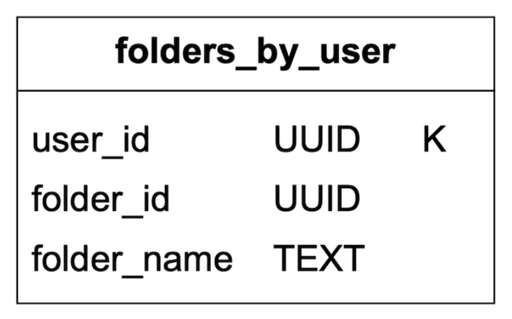

## CHAPTER 23 · 분산 이메일 서비스 설계

### 소개

이 장에서는 **Gmail**과 비슷한 **분산 이메일 서비스**를 설계한다.

2020년 **Gmail**은 1.8bil 명의 활성 사용자를, **Outlook**은 전 세계 400mil 명의 사용자를 가지고 있었다.

### 1단계: 문제 이해와 설계 범위 확정

- C: 시스템을 사용하는 사용자는 몇 명인가?
- I: 1bil 명의 사용자
- C: 다음 기능이 중요하다고 생각한다 - 인증, 이메일 보내기/받기, 이메일 조회, 이메일 필터링, 이메일 검색, 스팸 방지 보호.
- I: 좋은 목록이다. 인증은 당장 신경 쓰지 마라.
- C: 사용자는 이메일 서버에 어떻게 연결되는가?
- I: 보통 이메일 클라이언트는 SMTP, POP, IMAP으로 연결하지만, 이 문제에서는 HTTP를 사용한다.
- C: 이메일에 첨부파일이 있을 수 있는가?
- I: 그렇다

#### **비기능 요구사항**

- **신뢰성** - 데이터를 잃지 않아야 한다
- **가용성** - 단일 장애 지점을 막기 위해 복제를 사용해야 한다. 또한 시스템의 부분 장애를 견뎌야 한다.
- **확장성** - 사용자층이 커짐에 따라 시스템이 이들을 처리할 수 있어야 한다.
- **유연성과 확장 가능성** - 시스템은 유연해야 하며 새 기능으로 쉽게 확장 가능해야 한다. SMTP/다른 메일 프로토콜 대신 HTTP를 선택한 이유 중 하나다.

#### **개략적 규모 추정**

- **1bil 사용자**
- 한 사람이 하루에 이메일 10통을 보낸다고 가정 -> **초당 100k 통의 이메일**.
- 한 사람이 하루에 이메일 40통을 받고 각 이메일이 평균 50kb의 메타데이터를 가진다고 가정 -> **연간 730pb 저장소**.
- 이메일의 20%가 첨부파일을 저장하고 평균 크기가 500kb라고 가정 -> **연간 1,460pb**.

### 2단계: 개략적 설계 안 제시와 동의 얻기

#### **이메일 기초 지식**

이메일을 보내고 받는 데는 다양한 프로토콜이 쓰인다:
- **SMTP** - 한 서버에서 다른 서버로 이메일을 보내는 표준 프로토콜.
- **POP** - 원격 메일 서버에서 로컬 클라이언트로 이메일을 받아 오고 내려받는 표준 프로토콜. 일단 가져오면 이메일은 원격 서버에서 삭제된다.
- **IMAP** - POP와 비슷하게 원격 서버에서 이메일을 받아 오고 내려받는 데 쓰이지만, 이메일을 서버 쪽에 유지한다.
- **HTTPS** - 엄밀히 이메일 프로토콜은 아니지만 웹 기반 이메일 클라이언트에 사용할 수 있다.

메일 프로토콜과 별개로, 이메일 서버를 위해 설정해야 하는 DNS 레코드가 있다 - MX 레코드다:


이메일 첨부파일은 base64로 인코딩되어 전송되며, 대부분의 메일 서비스에서 보통 25mb 크기 제한이 있다.
이는 설정 가능하며 개인 계정과 기업 계정마다 다르다.

#### **전통적인 메일 서버**

전통적인 메일 서버는 사용자 수가 제한적이고 단일 서버에 연결된 경우 잘 동작한다.


- Alice가 자신의 Outlook 이메일에 로그인하고 "보내기"를 누른다. 이메일은 Outlook 메일 서버로 전송된다. 통신은 SMTP를 사용한다.
- Outlook 서버가 DNS에 질의해 gmail.com의 MX 레코드를 찾고 이메일을 해당 서버로 전송한다. 통신은 SMTP를 사용한다.
- Bob이 IMAP/POP으로 자신의 gmail 서버에서 이메일을 가져온다.

전통적인 메일 서버에서 이메일은 로컬 파일 시스템에 저장되었다. 모든 이메일은 별도의 파일이었다.


규모가 커지면서 디스크 I/O가 병목이 되었다. 또한 높은 가용성과 신뢰성 요구사항을 만족하지도 못한다.
디스크는 손상될 수 있고 서버는 다운될 수 있다.

#### **분산 메일 서버**

분산 메일 서버는 현대적인 유스케이스를 지원하고 현대적인 확장성 문제를 해결하도록 설계되었다.

이 서버들은 네이티브 이메일 클라이언트를 위한 IMAP/POP와 서버 간 메일 교환을 위한 SMTP를 여전히 지원할 수 있다.

하지만 풍부한 웹 기반 메일 클라이언트를 위해서는 보통 HTTP 위의 RESTful API가 쓰인다.

예시 API:
- `POST /v1/messages` - To, Cc, Bcc 헤더의 수신자에게 메시지를 보낸다.
- `GET /v1/folders` - 이메일 계정의 모든 폴더를 반환한다

예시 응답:

```
[{id: string        Unique folder identifier.
  name: string      Name of the folder.
                    According to RFC6154 [9], the default folders can be one of
                    the following: All, Archive, Drafts, Flagged, Junk, Sent,
                    and Trash.
  user_id: string   Reference to the account owner
}]
```

- `GET /v1/folders/{:folder_id}/messages` - 폴더 아래의 모든 메시지를 페이지네이션과 함께 반환
- `GET /v1/messages/{:message_id}` - 특정 메시지의 모든 정보 조회

예시 응답:

```
{
  user_id: string                      // Reference to the account owner.
  from: {name: string, email: string}  // <name, email> pair of the sender.
  to: [{name: string, email: string}]  // A list of <name, email> paris
  subject: string                      // Subject of an email
  body: string                         //  Message body
  is_read: boolean                     //  Indicate if a message is read or not.
}
```

분산 메일 서버의 개략적 설계는 다음과 같다:


- **웹메일(Webmail)** - 사용자가 웹 브라우저로 이메일을 보내고 받는다
- **웹 서버** - 로그인, 회원가입, 사용자 프로필 등을 관리하는 공개 요청/응답 서비스
- **실시간 서버** - 클라이언트에 새 이메일 업데이트를 실시간으로 푸시하는 데 쓰인다. 실시간 통신에는 웹소켓을 사용하지만, 이를 지원하지 않는 오래된 브라우저에서는 롱 폴링으로 폴백한다.
- **메타데이터 db** - 제목, 본문, 보낸 사람, 받는 사람 같은 이메일 메타데이터를 저장한다.
- **첨부파일 저장소** - 객체 저장소(object store, 예: Amazon S3). 큰 파일 저장에 적합하다.
- **분산 캐시** - UX를 개선하기 위해 최근 이메일을 Redis에 캐시할 수 있다.
- **검색 저장소** - 전문 검색(full-text search)을 지원하는 데 쓰이는 분산 문서 저장소.

이메일 전송 흐름은 다음과 같다:


- 사용자가 이메일을 쓰고 "보내기"를 누른다. 이메일은 로드밸런서로 전송된다.
- 로드밸런서가 과도한 메일 전송에 속도 제한을 걸고 웹 서버 중 하나로 라우팅한다.
- 웹 서버는 기본 이메일 검증(예: 이메일 크기)을 하고, 도메인이 보낸 사람과 같으면 아웃바운드 흐름을 건너뛴다. 다만 스팸 검사를 먼저 한다.
- 기본 검증을 통과하면 이메일은 메시지 큐로 전송된다 (첨부파일은 객체 저장소에서 참조된다)
- 기본 검증에 실패하면 이메일은 에러 큐로 전송된다
- SMTP 발신 워커가 발신 큐에서 메시지를 꺼내 스팸/바이러스 검사를 하고 목적지 메일 서버로 라우팅한다.
- 이메일은 "보낸 이메일" 폴더에 저장된다

발신 메시지 큐의 크기도 모니터링해야 한다. 너무 커지면 문제를 나타낼 수 있다:
- 받는 사람의 메일 서버를 사용할 수 없다. 지수 백오프(exponential backoff)를 사용해 나중에 이메일 전송을 재시도할 수 있다.
- 부하를 처리할 컨슈머가 부족하다. 컨슈머를 확장해야 할 수 있다.

이메일 수신 흐름은 다음과 같다:


- 수신 이메일은 SMTP 로드밸런서에 도착한다. 메일은 SMTP 서버로 분산되며, 여기서 메일 수락 정책이 수행된다 (예: 잘못된 이메일은 바로 폐기된다).
- 이메일의 첨부파일이 너무 크면 객체 저장소(s3)에 넣을 수 있다.
- 메일 처리 워커가 예비 검사를 하고, 그다음 메일은 저장소, 캐시, 객체 저장소, 실시간 서버로 전달된다.
- 오프라인 사용자는 다시 온라인이 되면 HTTP API를 통해 새 이메일을 받는다.

### 3단계: 상세 설계

이제 몇몇 컴포넌트를 더 깊이 들어가 보자.

#### **메타데이터 데이터베이스**

이메일 메타데이터의 특징은 다음과 같다:
- 헤더는 보통 작고 자주 접근된다
- 본문 크기는 작은 것부터 큰 것까지 다양하지만, 보통 한 번만 읽힌다
- 대부분의 메일 연산은 단일 사용자에게 국한된다 - 예: 이메일 가져오기, 읽음 표시, 검색.
- 데이터의 최신성이 데이터 사용에 영향을 준다. 사용자는 보통 최근 이메일만 읽는다
- 데이터는 높은 신뢰성 요구사항을 가진다. 데이터 손실은 용납되지 않는다.

gmail/outlook 규모에서는 초당 입출력 연산 수(input/output operations per second, IOPS)를 줄이기 위해 데이터베이스를 보통 직접 만든다.

어떤 데이터베이스 선택지가 있는지 고려해 보자:
- **관계형 데이터베이스** - 헤더와 본문에 인덱스를 만들 수 있지만, 이 DB들은 보통 작은 데이터 덩어리에 최적화되어 있다.
- **분산 객체 저장소** - 백업 저장소로는 좋은 선택일 수 있지만, 검색/읽음 표시 등을 효율적으로 지원할 수 없다.
- **NoSQL** - Google BigTable이 gmail에서 쓰이지만 오픈소스가 아니다.

위 분석을 바탕으로 하면, 기존 솔루션 중 우리 필요에 완벽히 맞는 것은 거의 없어 보인다.
면접 상황에서 새로운 분산 데이터베이스 해법을 설계하는 것은 현실적으로 불가능하지만, 특징을 언급하는 것은 중요하다:
- 단일 칼럼이 한 자릿수 MB가 될 수 있다
- 강한 데이터 일관성
- 디스크 I/O를 줄이도록 설계
- 높은 가용성과 장애 허용
- 증분 백업을 만들기 쉬워야 한다

데이터를 파티션하려면 `user_id`를 파티션 키로 사용해 한 사용자의 데이터가 단일 샤드에 저장되게 할 수 있다.
이것은 한 이메일을 여러 사용자와 공유하는 것을 막지만, 이번 면접에서는 요구사항이 아니다.

테이블을 정의해 보자:
- 기본 키는 파티션 키(데이터 분산)와 클러스터링 키(데이터 정렬)로 구성된다
- 지원해야 하는 쿼리 - 사용자의 모든 폴더 조회, 폴더의 모든 이메일 표시, 이메일 생성/조회/삭제, 읽은/읽지 않은 이메일 조회, 대화 스레드 조회(보너스)

이어지는 표의 범례:


folders 테이블은 다음과 같다:



emails 테이블:


- email_id는 timeuuid로, 이메일이 생성된 타임스탬프 기준 정렬을 가능하게 한다

첨부파일은 파일명으로 식별되는 별도 테이블에 저장된다:


읽은/읽지 않은 이메일 조회 지원은 전통적인 관계형 데이터베이스에서는 쉽지만, 파티션/클러스터링 키가 아닌 키로의 필터링이 금지되는 Cassandra에서는 그렇지 않다.
한 가지 차선책은 폴더의 모든 이메일을 가져와 메모리에서 필터링하는 것이지만, 충분히 큰 애플리케이션에서는 잘 동작하지 않는다.

대신 할 수 있는 일은 emails 테이블을 읽은/읽지 않은 이메일 테이블로 비정규화하는 것이다:


대화 스레드를 지원하려면, 메일 클라이언트가 해석해 대화 스레드를 재구성하는 데 사용하는 헤더 몇 개를 포함하면 된다:

```
{
  "headers" {
     "Message-Id": "<7BA04B2A-430C-4D12-8B57-862103C34501@gmail.com>",
     "In-Reply-To": "<CAEWTXuPfN=LzECjDJtgY9Vu03kgFvJnJUSHTt6TW@gmail.com>",
     "References": ["<7BA04B2A-430C-4D12-8B57-862103C34501@gmail.com>"]
  }
}
```

마지막으로, 이 문제의 강한 요구사항이므로 분산 데이터베이스에서는 가용성 대신 일관성을 택할 것이다.

따라서 장애 조치(failover)나 네트워크 파티션 발생 시, 영향받은 사용자에게는 동기/갱신 작업이 잠시 불가능해진다.

#### **이메일 도달률(deliverability)**

이메일을 보내는 서버를 세팅하는 것은 쉽지만, 스팸 방지 알고리즘 때문에 이메일이 받는 사람의 받은 편지함에 도달하게 하는 것은 어렵다.

새 메일 서버를 세팅하고 그냥 메일을 보내기 시작하면, 우리 이메일은 아마 스팸 폴더에 들어갈 것이다.

이를 막기 위해 할 수 있는 일:
- **전용 IP** - 이메일을 보내는 데 전용 IP를 사용하라. 그렇지 않으면 받는 사람 서버가 우리를 신뢰하지 않는다.
- **이메일 분류** - 더 중요한 이메일이 스팸으로 분류되는 것을 막으려면 같은 서버에서 마케팅 이메일을 보내지 마라
- **IP 주석 올리기(warm up)** - 대형 이메일 제공자와 좋은 평판을 쌓기 위해 천천히 진행하라. 새 IP를 워밍업하는 데는 2~6주가 걸린다
- **스팸 발송자 차단** - 평판이 나빠지지 않도록 빠르게 차단하라
- **피드백 처리** - ISP와 피드백 루프를 설정해 불만률을 추적하고 스팸 계정을 빠르게 차단하라.
- **이메일 인증** - 발신자 정책 프레임워크(Sender Policy Framework), 도메인키 식별 메일(DomainKeys Identified Mail) 등 피싱 대응의 일반적 기법을 사용하라.

이 모든 것을 기억할 필요는 없다. 좋은 메일 서버를 만드는 데 많은 도메인 지식이 필요하다는 것만 알아두면 된다.

#### **검색**

검색에는 이메일 내용 기반의 전문 검색과 from, to, subject, unread 등 필터 기반의 더 고급 쿼리가 포함된다.

이메일 검색의 특징 하나는 사용자에게 국한된다는 것이고, 읽기보다 쓰기가 더 많다는 것이다. 매 연산마다 재인덱싱해야 하지만 사용자는 검색 탭을 거의 쓰지 않기 때문이다.

구글 검색과 이메일 검색을 비교해 보자:

|               | 범위                | 정렬                               | 정확도                                          |
|---------------|----------------------|---------------------------------------|---------------------------------------------------|
| 구글 검색 | 인터넷 전체   | 관련성 기준 정렬                     | 인덱싱에 시간이 걸려 결과가 즉시 나오지 않는다. |
| 이메일 검색  | 사용자 자신의 메일함 | 시간, 날짜 등 속성 기준 정렬 | 인덱싱이 빨라야 하고 결과가 정확해야 한다.    |

이 검색 기능을 달성하는 한 가지 선택지는 Elasticsearch 클러스터를 사용하는 것이다. `user_id`를 파티션 키로 사용해 같은 노드 아래에 데이터를 묶을 수 있다:


변경 연산은 서비스를 재인덱싱 흐름에서 분리하기 위해 Kafka를 통해 비동기로 이루어진다.
실제 데이터 검색은 동기적으로 일어난다.

Elasticsearch는 가장 인기 있는 검색 엔진 데이터베이스 중 하나로, 이메일 전문 검색을 아주 잘 지원한다.

대안으로, 우리의 특정 요구사항에 맞춘 자체 검색 솔루션을 직접 개발을 시도할 수 있다.

그런 시스템 설계는 범위 밖이다. 만들 때의 핵심 과제 하나는 쓰기 중심 워크로드에 맞게 최적화하는 것이다.

이를 달성하려면 LSM 트리(Log-Structured Merge-Trees)를 사용해 디스크의 인덱스 데이터를 구조화할 수 있다. 쓰기 경로는 순차 쓰기만 하도록 최적화된다.
이 기법은 Cassandra, BigTable, RocksDB에서 쓰인다.

핵심 아이디어는 미리 정의된 임계값에 도달할 때까지 데이터를 메모리에 저장하고, 도달하면 다음 계층(디스크)으로 병합하는 것이다:


두 접근 방식의 주요 트레이드오프:
- Elasticsearch는 어느 정도까지 확장되는 반면, 사용자 정의 검색 엔진은 이메일 유스케이스에 맞게 조정되어 더 멀리 확장할 수 있다.
- Elasticsearch는 메타데이터 저장소와 함께 유지보수해야 하는 별도 서비스다. 사용자 정의 솔루션은 그 자체가 데이터 저장소가 될 수 있다.
- Elasticsearch는 기성 솔루션인 반면, 사용자 정의 검색 엔진은 만드는 데 상당한 엔지니어링 노력이 필요하다.

#### **확장성과 가용성**

개별 사용자 연산이 다른 사용자와 충돌하지 않으므로, 대부분의 컴포넌트는 독립적으로 확장할 수 있다.

높은 가용성을 보장하려면 장애 시 리더-팔로워(leader-follower) 장애 조치를 갖춘 멀티 DC 구성을 사용할 수도 있다:


### 4단계: 마무리

추가로 이야기할 거리:
- **장애 허용** - 시스템의 많은 부분이 실패할 수 있다. 노드 장애를 어떻게 다룰지 이야기할 가치가 있다.
- **컴플라이언스** - 유럽의 GDPR 법을 고려할 때 PII는 합리적인 방식으로 저장되어야 한다.
- **보안** - 이메일 암호화, 피싱 방지, 안전한 브라우징 등.
- **최적화** - 예: 서로 다른 사용자가 여러 번 보낸 같은 첨부파일의 중복 방지.
