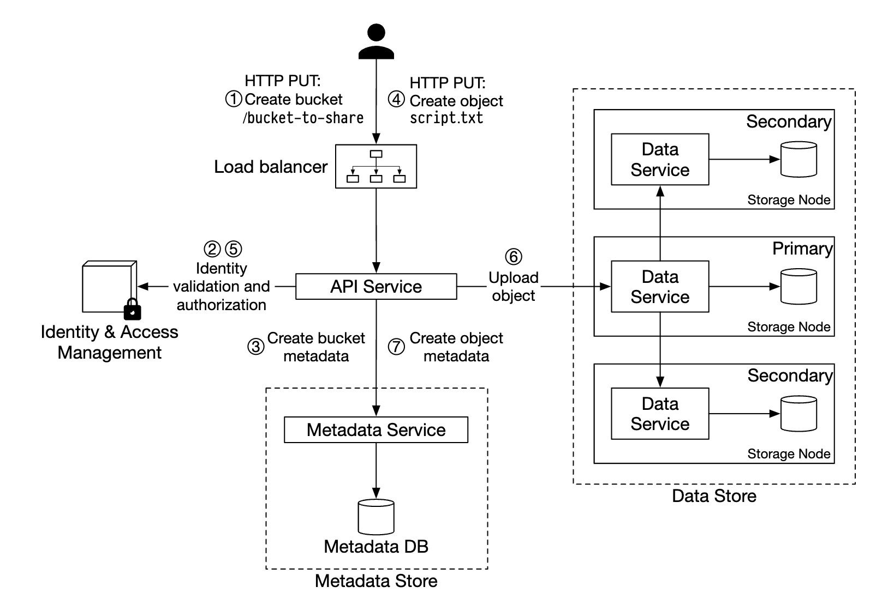
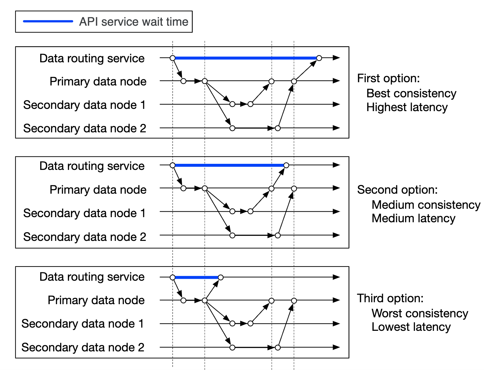
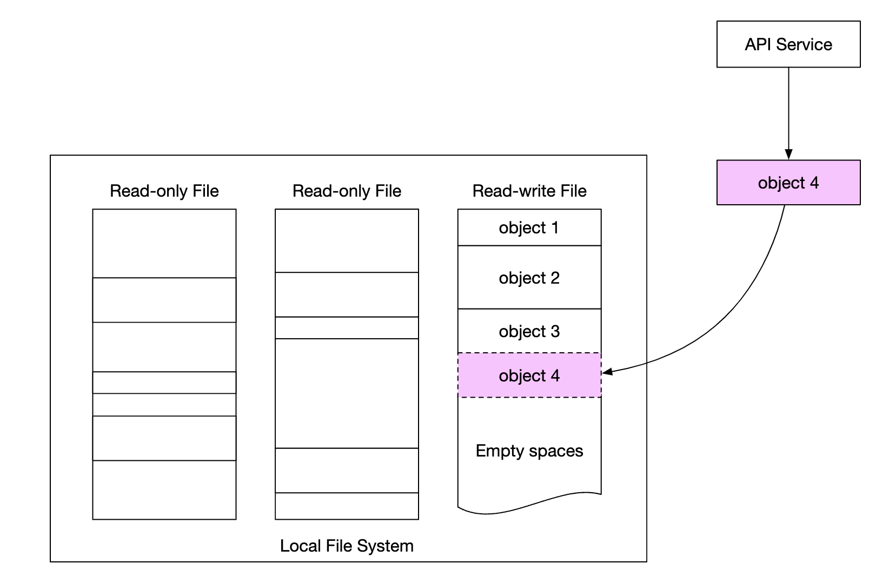
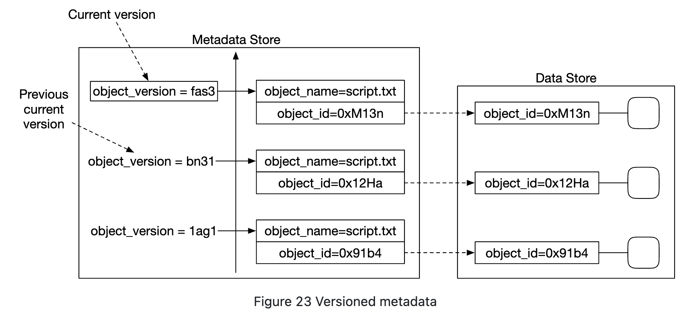
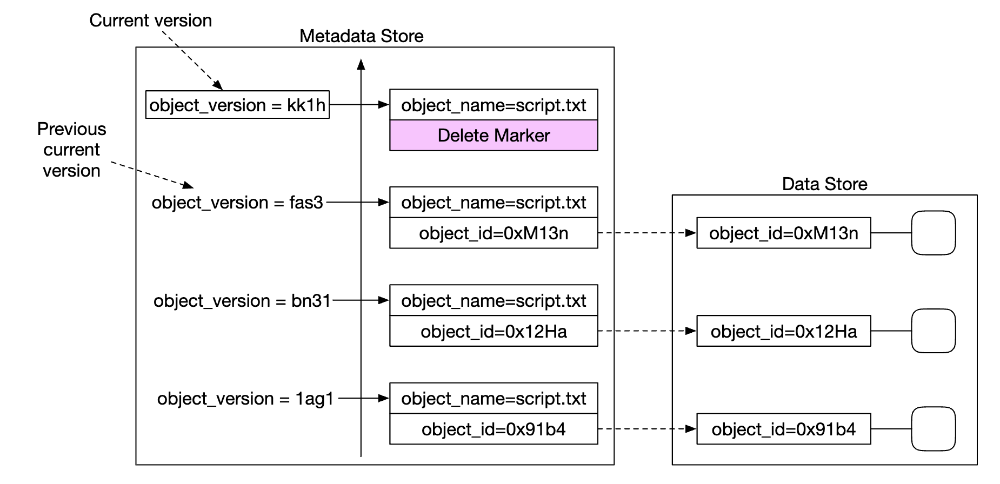
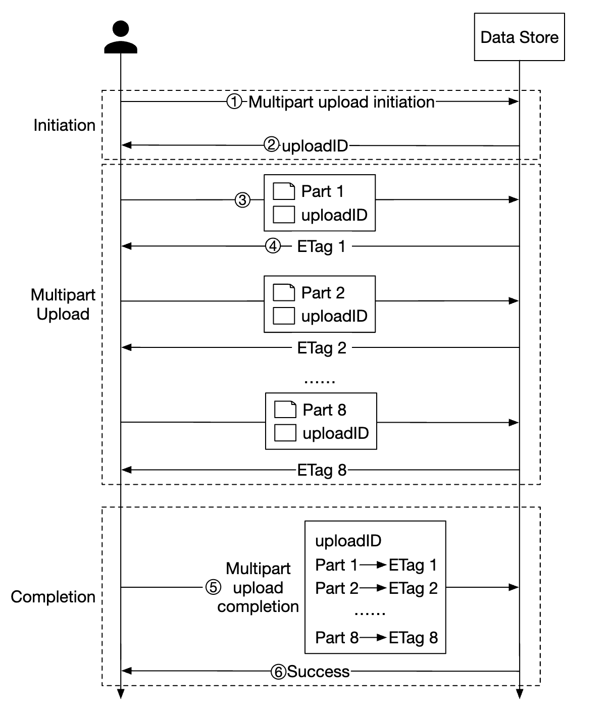

## CHAPTER 24 · S3 스타일 객체 저장소 설계

### 소개

이 장에서는 **Amazon S3**와 비슷한 **객체 저장소(object storage)** 서비스를 설계한다.

저장소 시스템은 크게 세 범주로 나뉜다:
- **블록 저장소**
- **파일 저장소**
- **객체 저장소**

**블록 저장소**는 1960년대에 나온 장치다. HDD와 SSD가 그 예다.
이 장치들은 보통 서버에 물리적으로 연결되지만, 고속 네트워크 프로토콜을 통해 네트워크로 연결될 수도 있다.
서버는 원시 블록을 포맷해 파일 시스템으로 사용하거나 그 제어를 서버에 직접 넘길 수 있다.

**파일 저장소**는 블록 저장소 위에 만들어진다. 더 높은 수준의 추상화를 제공해 폴더와 파일을 더 쉽게 관리하게 해 준다.

**객체 저장소**는 높은 내구성, 방대한 규모, 낮은 비용을 위해 성능을 희생한다.
"콜드" 데이터를 대상으로 하며 주로 아카이빙과 백업에 쓰인다.
계층형 디렉터리 구조가 없으며, 모든 데이터는 평면 구조의 객체로 저장된다.
다른 저장소 유형에 비해 상대적으로 느리다. 대부분의 클라우드 제공자가 객체 저장소 상품을 갖추고 있다 - Amazon S3, Google GCS 등.


|                 | 블록 저장소                    | 파일 저장소                            | 객체 저장소                 |
|-----------------|----------------------------------|-----------------------------------------|--------------------------------|
| 변경 가능한 콘텐츠 | Y                                | Y                                       | N (객체 버전 관리 있음）     |
| 비용            | 높음                             | 중간~높음                          | 낮음                            |
| 성능     | 중간~높음, 매우 높음        | 중간~높음                          | 낮음~중간                  |
| 일관성     | 강한 일관성               | 강한 일관성                      | 강한 일관성 [5]         |
| 데이터 접근     | SAS/iSCSI/FC                     | 표준 파일 접근, CIFS/SMB, NFS | RESTful API                    |
| 확장성     | 중간 확장성               | 높은 확장성                        | 방대한 확장성               |
| 적합 용도        | 가상 머신(VM), 데이터베이스 | 범용 파일 시스템 접근      | 바이너리 데이터, 비정형 데이터 |

객체 저장소와 관련된 용어 몇 가지:
- **버킷(bucket)** - 객체를 위한 논리 컨테이너. 이름은 전역적으로 고유하다.
- **객체(Object)** - 버킷에 저장되는 개별 데이터 조각. 객체 데이터와 메타데이터를 담는다.
- **버전 관리(Versioning)** - 같은 버킷에 객체의 여러 변형을 보관하는 기능.
- **통합 자원 식별자(Uniform Resource Identifier, URI)** - 각 자원은 URI로 고유하게 식별된다.
- **서비스 수준 협약(Service-level Agreement, SLA)** - 서비스 제공자와 고객 사이의 계약.

Amazon S3 Standard-Infrequent Access 저장소 등급 SLA:
- 여러 가용성 영역에 걸친 99.999999999% 내구성
- 가용성 영역 전체가 파괴되는 사건에도 데이터가 견딘다
- 99.9% 가용성으로 설계됨

### 1단계: 문제 이해와 설계 범위 확정

- C: 어떤 기능을 포함해야 하는가?
- I: 버킷 생성, 객체 업로드/다운로드, 버전 관리, 버킷 내 객체 나열
- C: 일반적인 데이터 크기는?
- I: 거대한 객체와 작은 객체 모두 효율적으로 저장해야 한다
- C: 1년에 얼마나 많은 데이터를 저장하는가?
- I: 100 페타바이트
- C: 데이터 내구성은 여섯 개의 9(99.9999%), 서비스 가용성은 네 개의 9(99.99%)로 가정해도 되는가?
- I: 그렇다, 합리적으로 들린다

#### **비기능 요구사항**

- **100 PB 데이터**
- **여섯 개의 9 데이터 내구성**
- **네 개의 9 서비스 가용성**
- 저장소 효율성. 높은 신뢰성과 성능을 유지하면서 저장 비용을 줄인다

#### **개략적 규모 추정**

객체 저장소는 디스크 용량이나 초당 IO(IOPS)에서 병목이 생기기 쉽다.

가정:
- 20%는 작은 객체(1mb 미만), 60%는 중간 크기 객체(1-64mb), 20%는 큰 객체(64mb 초과),
- 하드디스크 하나(SATA, 7200rpm)는 초당 100-150회의 랜덤 시크가 가능하다 (100-150 IOPS)

이 가정을 바탕으로 시스템이 저장할 수 있는 총 객체 수를 추정할 수 있다.
- 계산을 단순화하기 위해 객체 유형별 중간 크기를 쓰자 - 작은 객체 0.5mb, 중간 32mb, 큰 객체 200mb.
- 저장소 100PB(10^11 MB)에 저장소 사용률 40%를 적용하면 0.68bil 개의 객체가 나온다
- 메타데이터가 1kb라고 가정하면, 메타데이터 정보를 저장하는 데 0.68tb 공간이 필요하다

### 2단계: 개략적 설계 안 제시와 동의 얻기

설계에 들어가기 전에 객체 저장소의 흥미로운 성질 몇 가지를 살펴보자:
- **객체 불변성** - 객체 저장소의 객체는 불변이다 (다른 저장소 시스템에서는 그렇지 않다). 삭제하거나 교체할 수는 있지만 갱신은 없다.
- **키-값 저장소** - 객체 URI가 키이며 HTTP 호출로 내용을 가져올 수 있다
- **한 번 쓰고 여러 번 읽기** - 데이터 접근 패턴은 한 번 쓰고 여러 번 읽는 것이다. 어떤 LinkedIn 연구에 따르면 연산의 95%가 읽기다
- 작은 객체와 큰 객체 모두 지원

객체 저장소의 설계 철학은 UNIX와 비슷하다 - 파일을 저장하면 inode라 불리는 데이터 구조에 파일명을 만들고 파일 데이터는 서로 다른 디스크 위치에 저장된다.
inode는 파일 블록 포인터 목록을 담으며, 이 포인터들은 디스크의 서로 다른 위치를 가리킨다.

파일에 접근할 때는 파일 내용을 가져오기 전에 먼저 inode에서 메타데이터를 가져온다.

객체 저장소도 비슷하게 동작한다 - 파일 정보에는 메타데이터 저장소를 쓰지만, 내용은 디스크에 저장된다:


메타데이터를 파일 내용에서 분리하면 서로 다른 저장소를 독립적으로 확장할 수 있다:


#### **개략적 설계**


- **로드밸런서** - API 요청을 서비스 복제본들에 분산한다
- **API 서비스** - 무상태 서버. 메타데이터 저장소와 객체 저장소, IAM 서비스에 대한 호출을 조율한다.
- **신원 및 접근 관리(IAM)** - 인증, 인가, 접근 제어의 중심지.
- **데이터 저장소** - 실제 데이터를 저장하고 조회한다. 연산은 객체 ID(UUID)를 기반으로 한다.
- **메타데이터 저장소** - 객체 메타데이터를 저장한다

#### **객체 업로드**



- HTTP PUT 요청으로 "bucket-to-share"라는 이름의 버킷을 만든다
- API 서비스가 IAM을 호출해 사용자가 인가되었고 쓰기 권한이 있는지 확인한다
- API 서비스가 메타데이터 저장소를 호출해 버킷 항목을 만든다. 만들어지면 성공 응답이 반환된다.
- 버킷이 만들어진 뒤, HTTP PUT으로 "script.txt"라는 이름의 객체를 만든다
- API 서비스가 사용자 신원을 검증하고 쓰기 권한이 있는지 확인한다
- 검증을 통과하면 객체 페이로드가 HTTP PUT으로 데이터 저장소에 전송된다. 데이터 저장소는 이를 저장하고 UUID를 반환한다.
- API 서비스가 메타데이터 저장소를 호출해 object_id, bucket_id, bucket_name 등의 메타데이터로 새 항목을 만든다.

객체 업로드 요청 예시:

```
PUT /bucket-to-share/script.txt HTTP/1.1
Host: foo.s3example.org
Date: Sun, 12 Sept 2021 17:51:00 GMT
Authorization: authorization string
Content-Type: text/plain
Content-Length: 4567
x-amz-meta-author: Alex

[4567 bytes of object data]
```

#### **객체 다운로드**

버킷에는 디렉터리 계층이 없지만, 버킷 이름과 객체 이름을 이어 붙여 논리적 계층을 만들어 폴더 구조를 흉내 낼 수 있다.

객체를 가져오는 GET 요청 예시:

```
GET /bucket-to-share/script.txt HTTP/1.1
Host: foo.s3example.org
Date: Sun, 12 Sept 2021 18:30:01 GMT
Authorization: authorization string
```


- 클라이언트가 로드밸런서로 HTTP GET 요청을 보낸다. 예: `GET /bucket-to-share/script.txt`
- API 서비스가 IAM에 질의해 사용자가 버킷을 읽을 올바른 권한을 가졌는지 검증한다
- 검증되면 객체의 UUID를 메타데이터 저장소에서 가져온다
- 객체 페이로드를 UUID 기준으로 데이터 저장소에서 가져와 클라이언트에 반환한다

// sprint 1

### 3단계: 상세 설계

#### **데이터 저장소**

API 서비스와 데이터 저장소의 상호작용은 다음과 같다:


데이터 저장소의 주요 컴포넌트:


데이터 라우팅 서비스는 데이터 노드 클러스터에 접근하는 RESTful 또는 gRPC API를 제공한다.
무상태 서비스로, 서버를 추가해 확장한다.

주요 책임은 다음과 같다:
- 데이터를 저장할 최선의 데이터 노드를 알기 위해 배치 서비스에 질의
- 데이터 노드에서 데이터를 읽어 API 서비스에 반환
- 데이터 노드에 데이터 쓰기

배치 서비스는 어떤 데이터 노드가 객체를 저장할지 정한다.
클러스터의 물리적 토폴로지를 결정하는 가상 클러스터 맵을 유지한다.


이 서비스는 또한 모든 데이터 노드에 하트비트를 보내 가상 클러스터에서 제거해야 할지 결정한다.

중요 서비스이므로 Paxos나 Raft 합의 알고리즘으로 동기화한 5 또는 7 복제본 클러스터를 유지하는 것이 권장된다.
예를 들어 7노드 클러스터는 3노드의 장애를 견딜 수 있다.

데이터 노드는 실제 객체 데이터를 저장한다.
신뢰성과 내구성은 데이터를 여러 데이터 노드로 복제해 보장한다.

각 데이터 노드에는 데몬이 실행되며, 배치 서비스에 하트비트를 보낸다.

하트비트에는 다음이 포함된다:
- 데이터 노드는 몇 개의 디스크 드라이브(HDD 또는 SSD)를 관리하는가?
- 각 드라이브에는 얼마나 많은 데이터가 저장되어 있는가?

#### 데이터 지속성 흐름


- API 서비스가 객체 데이터를 데이터 저장소로 전달한다
- 데이터 라우팅 서비스가 데이터를 프라이머리 데이터 노드로 보낸다
- 프라이머리 데이터 노드는 데이터를 로컬에 저장하고 두 개의 세컨더리 데이터 노드로 복제한다. 복제가 성공한 뒤 응답이 전송된다.
- 객체의 UUID가 API 서비스로 반환된다.

유의 사항:
- 객체 UUID가 주어지면, 복제 그룹은 일관성 해싱으로 결정적으로 선택된다
- 4단계에서 프라이머리 데이터 노드는 응답을 반환하기 전에 객체 데이터를 복제한다. 더 높은 지연 시간보다 강한 일관성을 택한 것이다.



#### 데이터 구성 방식

데이터를 관리하는 단순한 접근 하나는 각 객체를 별도의 파일에 저장하는 것이다.

이 방식은 동작하지만, 파일 시스템에 작은 파일이 많으면 성능이 나오지 않는다:
- 모든 파일이 블록 크기 전체를 사용하므로 HDD의 데이터 블록이 낭비된다. 일반적인 블록 크기는 4kb다.
- 파일이 많다는 것은 inode도 많다는 뜻이다. 운영체제는 inode가 너무 많으면 잘 다루지 못하며 최대 inode 제한도 있다.

이 문제들은 쓰기 로그(write-ahead log, WAL)로 작은 파일 여러 개를 더 큰 파일로 병합해 해결할 수 있다. 파일이 용량(보통 몇 GB)에 도달하면 새 파일이 만들어진다:



이 접근의 단점은 파일에 대한 쓰기 접근이 직렬화되어야 한다는 것이다. 같은 파일에 접근하는 여러 코어는 서로를 기다려야 한다.
이를 고치려면 파일을 특정 코어에 한정해 락 경합을 피할 수 있다.

#### 객체 조회

같은 파일에 여러 객체를 저장하는 것을 지원하려면, 데이터 노드에게 다음을 알려 주는 테이블을 유지해야 한다:
- `object_id`
- 객체가 저장된 `filename`
- 객체가 시작하는 `file_offset`
- `object_size`

이 테이블은 RocksDB 같은 파일 기반 db나 전통적인 관계형 데이터베이스로 배치할 수 있다.
접근 패턴이 쓰기가 적고 읽기가 많으므로 관계형 데이터베이스가 더 잘 맞는다.

어떻게 배치해야 할까?
데이터베이스를 별도 클러스터에 두고 확장하며, 모든 데이터 노드가 접근하게 할 수 있다.

단점:
- 모든 요청을 처리하려면 클러스터를 공격적으로 확장해야 한다
- 데이터 노드와 db 클러스터 사이에 추가 네트워크 지연이 있다

대안은 데이터 노드가 자신과 관련된 데이터에만 관심을 가진다는 사실을 활용해,
관계형 db를 데이터 노드 자체 안에 배치하는 것이다.

SQLite는 가벼운 파일 기반 관계형 데이터베이스이므로 좋은 선택지다.

#### 갱신된 데이터 지속성 흐름


- API 서비스가 새 객체를 저장하는 요청을 보낸다
- 데이터 노드 서비스가 새 객체를 "/data/c"라는 이름의 파일 끝에 추가한다
- 객체에 대한 새 레코드가 객체 매핑 테이블에 삽입된다

#### 내구성

데이터 내구성은 설계의 중요한 요구사항이다. 여섯 개의 9 내구성을 달성하려면 모든 장애 경우를 적절히 검토해야 한다.

먼저 다뤄야 할 문제는 하드웨어 장애다. 장애 확률을 최소화하기 위해 데이터 노드를 복제함으로써 달성할 수 있다.
하지만 그에 더해 서로 다른 장애 도메인에 걸쳐 복제해야 한다 (랙 간, DC 간, 별도 네트워크 등).
치명적 사건 하나가 같은 도메인 안에서 여러 하드웨어 장애를 일으킬 수 있다:


일반적인 HDD의 연간 고장률이 0.81%라고 가정하면, 세 개의 복사본으로 여섯 개의 9 내구성을 얻는다.

이렇게 데이터 노드를 복제하면 원하는 내구성을 얻지만, 저장 비용을 줄이기 위해 데이터 소거(data erasure) 코딩을 활용할 수도 있다.

데이터 소거 코딩은 패리티 비트를 사용하게 해 주며, 패리티 비트로 장애 시 잃어진 비트를 재구성할 수 있다:


이 비트들이 데이터 노드라고 상상해 보자. 둘이 다운되더라도 남은 넷으로 복구할 수 있다.

데이터 소거 코딩에는 여러 방식이 있다. 우리 경우 신뢰성을 최대화하기 위해 서로 다른 장애 도메인에 걸쳐 나눈 8+4 데이터 소거 코딩을 쓸 수 있다:


데이터 소거 코딩은 데이터 라우팅 서비스가 여러 위치에서 데이터를 모아야 하므로 접근 속도를 희생하는 대신 훨씬 낮은 저장 비용(50% 개선)을 가능하게 한다:


기타 유의 사항:
- 복제는 200%의 저장 오버헤드가 필요하고(복제본 3개 기준) 데이터 소거 코딩은 50%다
- 데이터 소거 코딩은 [11개의 9 내구성](https://github.com/Backblaze/erasure-coding-durability)을 주고 복제는 6개의 9다
- 데이터 소거 코딩은 패리티를 계산하고 저장하는 데 더 많은 연산이 필요하다

요약하면, 복제는 지연 시간에 민감한 애플리케이션에 더 유용하고, 데이터 소거 코딩은 저장 비용 효율과 내구성 면에서 매력적이다.
데이터 소거 코딩은 구현도 훨씬 어렵다.

#### 정합성 검증

디스크 전체가 실패하면 실패를 감지하기 쉽다. 디스크 메모리의 일부가 손상된 경우에는 그렇게 간단하지 않다.

이를 감지하기 위해 체크섬을 사용할 수 있다 - 파일 내용의 해시로, 파일의 무결성을 검증하는 데 쓸 수 있다.

우리 경우 각 파일과 각 객체의 체크섬을 저장한다:


데이터 소거 코딩(8+4)의 경우 8개 데이터 조각을 각각 따로 가져와 각각의 체크섬을 검증해야 한다.

// sprint 2

#### **메타데이터 데이터 모델**

테이블 스키마:


지원해야 하는 쿼리:
- 이름으로 객체 ID 찾기
- 이름 기준으로 객체 삽입/삭제
- 같은 접두어를 공유하는 버킷 내 객체 나열

사용자가 만들 수 있는 버킷 수에는 보통 제한이 있으므로 buckets 테이블의 크기는 작아 단일 db 서버에 들어간다.
하지만 읽기 처리량을 위해 여전히 서버를 확장해야 한다.

반면 object 테이블은 단일 데이터베이스 서버에 들어가지 않을 것이다. 따라서 샤딩으로 테이블을 확장할 수 있다:
- bucket_id로 샤딩하면 버킷 하나가 수십억 개의 객체를 가질 수 있어 핫스팟 문제가 생긴다
- bucket_id로 샤딩하면 부하가 더 고르게 분산되지만 쿼리가 느려진다
- 대부분의 쿼리가 객체/버킷 이름 기반이므로 `hash(bucket_name, object_name)` 샤딩을 선택한다.

하지만 이 샤딩 방식에서도 버킷 내 객체 나열은 느릴 것이다.

#### **버킷 내 객체 나열**

단일 데이터베이스에서 접두어(디렉터리처럼 보이는) 기반으로 객체를 나열하는 것은 이렇게 동작한다:

```
SELECT * FROM object WHERE bucket_id = "123" AND object_name LIKE `abc/%`
```

데이터베이스가 샤딩되면 이를 충족하기 어렵다. 달성하려면 모든 샤드에서 쿼리를 실행하고 결과를 메모리에서 집계할 수 있다.
하지만 이러면 페이지네이션이 어려워진다. 샤드마다 결과 크기가 다르고 각각에 대해 별도의 limit/offset을 유지해야 하기 때문이다.

객체 저장소가 보통 객체 나열에 최적화되어 있지 않다는 사실을 활용해 나열 성능을 희생할 수 있다.
나열을 위한 비정규화 테이블을 버킷 ID로 샤딩해 만들 수도 있다.
그러면 나열 쿼리가 단일 데이터베이스 인스턴스로 한정되므로 충분히 빨라진다.

#### **객체 버전 관리**

버전 관리는 TIMEUUID 타입의 `object_version` 칼럼을 추가해 동작하며, 이 칼럼으로 레코드를 정렬할 수 있다.

새 버전마다 새 `object_id`가 만들어진다:



객체를 삭제하면 객체가 삭제되었음을 나타내는 특별한 `object_id`를 가진 새 버전이 만들어진다. 이에 대한 쿼리는 404를 반환한다:



#### **대용량 파일 업로드 최적화**

큰 파일 업로드는 멀티파트 업로드로 최적화할 수 있다 - 큰 파일을 여러 청크로 나누어 독립적으로 업로드한다:



- 클라이언트가 멀티파트 업로드를 시작하라고 서비스를 호출한다
- 데이터 저장소가 업로드를 고유하게 식별하는 업로드 ID를 반환한다
- 클라이언트가 큰 파일을 여러 청크로 나눠 업로드 ID를 사용해 독립적으로 업로드한다
- 청크가 업로드되면 데이터 저장소가 etag를 반환하며, etag는 해당 업로드 청크를 식별하는 md5 체크섬이다
- 모든 파트가 업로드되면 클라이언트가 upload_id, 파트 번호, 모든 etag를 담은 멀티파트 업로드 완료 요청을 보낸다
- 데이터 저장소가 파트들에서 객체를 다시 조립한다. 이 과정은 몇 분 걸릴 수 있다. 그 후 성공 응답이 클라이언트로 반환된다.

더 이상 쓸모 없는 오래된 파트는 이 시점에 제거할 수 있다. 이를 다루는 가비지 컬렉터를 도입할 수 있다.

#### **가비지 컬렉션**

가비지 컬렉션은 더 이상 사용되지 않는 저장 공간을 회수하는 과정이다. 데이터가 가비지가 되는 경로는 몇 가지 있다:
- **지연 객체 삭제(lazy object deletion)** - 객체가 실제로 삭제되지 않고 삭제된 것으로 표시된다
- **고아 데이터(orphan data)** - 예를 들어 업로드가 도중에 실패해 오래된 파트를 삭제해야 한다
- **손상된 데이터** - 체크섬 검증에 실패한 데이터

가비지 컬렉터는 복제본의 미사용 공간 회수도 담당한다.
복제에서는 프라이머리와 복제본 모두에서 데이터가 삭제된다. 데이터 소거 코딩(8+4)에서는 12개 노드 모두에서 삭제된다.

삭제를 돕기 위해 컴팩션(compaction)이라 불리는 과정을 사용한다:
- 가비지 컬렉터가 삭제되지 않은 객체를 "data/b"에서 "data/d"로 복사한다
- 복사가 완료되면 데이터베이스 트랜잭션으로 `object_mapping` 테이블을 갱신한다
- 너무 많은 작은 파일이 생기지 않도록, 컴팩션은 일정 임계값을 넘어 자란 파일에 대해 수행한다


### 4단계: 마무리

다룬 내용:
- S3 스타일 객체 저장소 설계
- 객체, 블록, 파일 저장소의 차이 비교
- 버킷 내 객체의 업로드, 다운로드, 나열, 버전 관리 다루기
- 상세 설계 - 데이터 저장소와 메타데이터 저장소, 복제와 데이터 소거 코딩, 멀티파트 업로드, 샤딩
