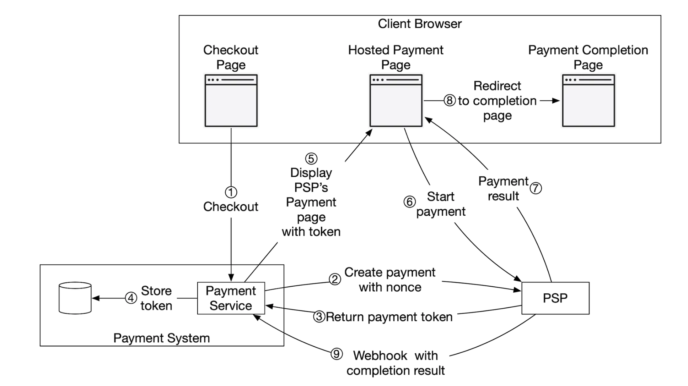
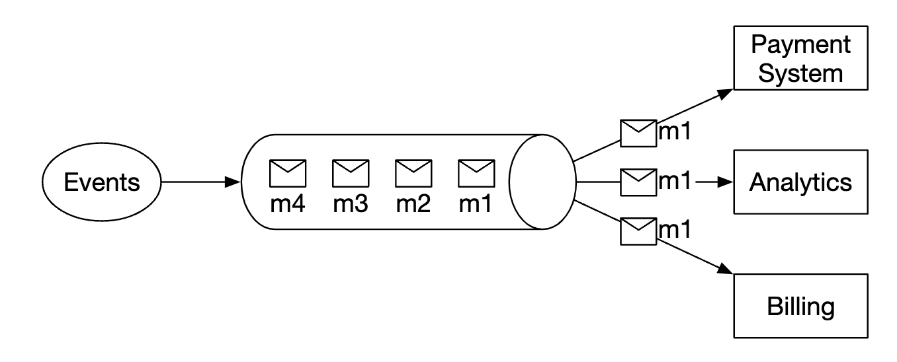

## CHAPTER 26 · 결제 시스템 설계

### 소개
이 장에서는 모든 현대 **전자상거래(e-commerce)**의 기반인 **결제 시스템(payment system)**을 설계한다.

**결제 시스템**은 금융 거래를 정리(settle)하고 화폐 가치를 이체하는 데 사용한다.

### 1단계: 문제 이해와 설계 범위 확정
 * 지원자: 어떤 종류의 결제 시스템을 만드나요?
 * 면접관: Amazon.com 같은 전자상거래 시스템의 결제 백엔드입니다. 돈의 이동과 관련된 모든 일을 처리합니다.
 * 지원자: 어떤 결제 수단을 지원하나요 - 신용카드, PayPal, 직불카드 등?
 * 면접관: 실제로는 이 모든 수단을 지원해야 합니다. 면접 목적상 신용카드 결제를 다룹시다.
 * 지원자: 신용카드 처리를 직접 하나요?
 * 면접관: 아니요, Stripe, Braintree, Square 같은 서드파티 제공자를 씁니다.
 * 지원자: 신용카드 데이터를 시스템에 저장하나요?
 * 면접관: 컴플라이언스 때문에 신용카드 데이터를 우리 시스템에 직접 저장하지 않습니다. 서드파티 결제 처리사에 의존합니다.
 * 지원자: 애플리케이션은 글로벌인가요? 여러 통화와 국제 결제를 지원해야 하나요?
 * 면접관: 글로벌이지만, 면접 목적상 한 가지 통화만 쓴다고 가정합니다.
 * 지원자: 하루에 몇 건의 결제 트랜잭션을 지원하나요?
 * 면접관: 하루 100만 건입니다.
 * 지원자: 예컨대 매월 판매자에게 지급하는 페이아웃 흐름도 지원해야 하나요?
 * 면접관: 네, 지원해야 합니다.
 * 지원자: 그 밖에 주의할 점이 있을까요?
 * 면접관: 내외부 시스템과의 통신에서 생기는 불일치를 바로잡는 대사(reconciliation)를 지원해야 합니다.

#### **기능 요구사항**
 * 페이인(pay-in) 흐름 - 결제 시스템이 판매자를 대신해 고객에게서 돈을 받는다.
 * 페이아웃(pay-out) 흐름 - 결제 시스템이 전 세계 판매자에게 돈을 보낸다.

#### **비기능 요구사항**
 * 신뢰성과 장애 내성. 실패한 결제는 신중하게 처리해야 한다.
 * 내부 시스템과 외부 시스템 사이의 대사를 갖춰야 한다.

#### **개략적 규모 추정**
이 시스템은 하루 100만 건, 즉 초당 10건의 트랜잭션을 처리해야 한다.

어떤 데이터베이스 시스템에도 높은 처리량이 아니므로 이 면접의 초점은 아니다.

### 2단계: 개략적 설계안 제시 및 동의 얻기
개괄적으로 돈의 이동에는 세 주체가 참여한다:


#### **페이인 흐름**
페이인 흐름의 개괄적인 모습이다:


 * 결제 서비스 - 결제 이벤트를 받아 결제 과정을 조율한다. 보통 서드파티 제공자를 통해 자금세탁(AML) 위반이나 범죄 활동 위험 검사도 수행한다.
 * 결제 실행기 - 결제 서비스 제공자(PSP)를 통해 개별 결제 주문을 실행한다. 결제 이벤트에는 여러 결제 주문이 담길 수 있다.
 * 결제 서비스 제공자(PSP) - 한 계좌에서 다른 계좌로 돈을 옮긴다. 예컨대 구매자의 신용카드 계좌에서 전자상거래 사이트의 은행 계좌로.
 * 카드 네트워크(card scheme) - 신용카드 작업을 처리하는 조직. 예컨대 Visa, MasterCard 등.
 * 원장(ledger) - 모든 결제 트랜잭션의 금융 기록을 보관한다.
 * 지갑(wallet) - 모든 판매자의 계좌 잔액을 보관한다.

페이인 흐름 예시다:
 * 사용자가 "주문하기"를 클릭하면 결제 이벤트가 결제 서비스로 전송된다.
 * 결제 서비스는 이벤트를 자기 데이터베이스에 저장한다.
 * 결제 서비스는 그 결제 이벤트에 포함된 모든 결제 주문에 대해 결제 실행기를 호출한다.
 * 결제 실행기는 결제 주문을 자기 데이터베이스에 저장한다.
 * 결제 실행기는 외부 PSP를 호출해 신용카드 결제를 처리한다.
 * 결제 실행기가 결제를 처리한 뒤, 결제 서비스는 판매자가 보유한 금액을 기록하도록 지갑을 갱신한다.
 * 지갑 서비스는 갱신된 잔액 정보를 자기 데이터베이스에 저장한다.
 * 결제 서비스는 모든 자금 이동을 기록하도록 원장을 호출한다.

#### **결제 서비스 API**
```
POST /v1/payments
{
  "buyer_info": {...},
  "checkout_id": "some_id",
  "credit_card_info": {...},
  "payment_orders": [{...}, {...}, {...}]
}
```

`payment_order` 예시:
```
{
  "seller_account": "SELLER_IBAN",
  "amount": "3.15",
  "currency": "USD",
  "payment_order_id": "globally_unique_payment_id"
}
```

유의점:
 * `payment_order_id`는 결제 중복 제거를 위해 PSP로 전달된다. 즉 멱등성 키(idempotency key)다.
 * amount 필드는 `string`이다. `double`은 금전 가치를 표현하기에 적합하지 않다.

```
GET /v1/payments/{:id}
```

이 엔드포인트는 `payment_order_id`를 기준으로 개별 결제의 실행 상태를 반환한다.

#### **결제 서비스 데이터 모델**
두 테이블을 유지해야 한다 - `payment_events`와 `payment_orders`.

결제에서 성능은 보통 중요한 요소가 아니다. 대신 강한 일관성이 중요하다.

데이터베이스 선택 시 그 밖의 고려사항:
 * 데이터베이스를 관리할 DBA를 채용할 수 있는 충분한 인력 시장
 * 다른 대형 금융기관이 사용해 온 검증된 이력
 * 풍부한 지원 도구
 * ACID 보장 때문에 NoSQL/NewSQL보다 전통적인 SQL

`payment_events` 테이블의 내용:
 * `checkout_id` - string, 기본 키
 * `buyer_info` - string (개인적 소감 - 아마 다른 테이블을 가리키는 외래 키가 더 적합할 것이다)
 * `seller_info` - string (개인적 소감 - 위와 같은 지적)
 * `credit_card_info` - 카드 제공자에 따라 다름
 * `is_payment_done` - boolean

`payment_orders` 테이블의 내용:
 * `payment_order_id` - string, 기본 키
 * `buyer_account` - string
 * `amount` - string
 * `currency` - string
 * `checkout_id` - string, 외래 키
 * `payment_order_status` - enum (`NOT_STARTED`, `EXECUTING`, `SUCCESS`, `FAILED`)
 * `ledger_updated` - boolean
 * `wallet_updated` - boolean

유의점:
 * 하나의 결제 이벤트에 여러 결제 주문이 연결된다.
 * 페이인 흐름에는 `seller_info`가 필요 없다. 페이아웃에만 필요하다.
 * `ledger_updated`와 `wallet_updated`는 결제 결과를 기록하도록 해당 서비스를 호출할 때 갱신된다.
 * 결제 상태 전이는 백그라운드 작업이 관리한다. 진행 중인 결제의 갱신을 확인하고, 합리적인 시간 안에 처리되지 않으면 경고를 촉발한다.

#### **복식부기 원장 시스템**
복식부기(double-entry bookkeeping) 메커니즘은 모든 결제 시스템의 핵심이다. 모든 금전 연산을 항상 두 계좌에 적용해 자금 이동을 추적하는 메커니즘이다. 한쪽 계좌 잔액은 늘어나고(대변, credit) 다른 쪽은 줄어든다(차변, debit):

| 계좌 | 차변(debit) | 대변(credit) |
|------|--------|--------|
| 구매자   | $1    |        |
| 판매자  |       | $1     |

모든 트랜잭션 엔트리의 합은 항상 0이다. 이 메커니즘은 시스템 안 모든 자금 이동의 종단간 추적성을 제공한다.

#### **호스팅 결제 페이지**
신용카드 정보를 저장하고 각종 무거운 규제를 준수해야 하는 부담을 피하려고, 대부분 회사는 PSP가 제공하는 위젯을 활용한다. PSP가 신용카드 결제를 저장·처리해 준다:


#### **페이아웃 흐름**
페이아웃 흐름의 컴포넌트는 페이인 흐름과 매우 비슷하다.

주요 차이:
 * 돈이 전자상거래 사이트의 은행 계좌에서 판매자의 은행 계좌로 이동한다.
 * Tipalti 같은 서드파티 미지급금 제공자를 활용할 수 있다.
 * 페이아웃에도 처리해야 할 부기와 규제 요구사항이 많다.

### 3단계: 상세 설계
이 섹션은 시스템을 더 빠르고 견고하고 안전하게 만드는 데 집중한다.

#### **PSP 연동**
우리 시스템이 은행이나 카드 네트워크에 직접 연결할 수 있다면 PSP 없이 결제할 수 있다.
이런 연결은 매우 드물고 보통 투자를 정당화할 수 있는 대기업에서만 이뤄진다.

전통적인 길을 간다면 PSP는 두 방법 중 하나로 연동한다:
 * API를 통해서 - 우리 결제 시스템이 결제 정보를 수집할 수 있다면
 * 호스팅 결제 페이지를 통해서 - 결제 정보 규제를 다루는 부담을 피하려면

호스팅 결제 페이지 작업 흐름은 다음과 같이 동작한다:



 * 사용자가 브라우저에서 "결제" 버튼을 클릭한다.
 * 클라이언트가 결제 주문 정보를 담아 결제 서비스를 호출한다.
 * 결제 주문 정보를 받은 결제 서비스는 PSP로 결제 등록 요청을 보낸다.
 * PSP는 통화, 금액, 만료일 같은 결제 정보와, 멱등성 목적의 UUID를 받는다. 보통 결제 주문의 UUID다.
 * PSP는 결제 등록을 유일하게 식별하는 토큰을 돌려준다. 토큰은 결제 서비스 데이터베이스에 저장된다.
 * 토큰이 저장되면 사용자에게 PSP가 호스팅하는 결제 페이지가 제공된다. 토큰과 성공/실패용 리다이렉트 URL로 초기화된다.
 * 사용자가 PSP 페이지에서 결제 정보를 입력하면, PSP가 결제를 처리하고 결제 상태를 반환한다.
 * 사용자는 이제 redirectURL로 되돌아간다. 리다이렉트 URL 예시 - `https://your-company.com/?tokenID=JIOUIQ123NSF&payResult=X324FSa`
 * 비동기적으로, PSP는 웹훅으로 우리 결제 서비스를 호출해 백엔드에 결제 결과를 알린다.
 * 결제 서비스는 받은 웹훅을 근거로 결제 결과를 기록한다.

#### **대사(reconciliation)**
앞 절은 결제의 해피 패스를 설명했다. 불행한 경로는 백그라운드 대사 프로세스로 탐지하고 조정한다.

PSP는 매일 밤 정산 파일을 보내고, 우리 시스템은 이를 이용해 외부 시스템 상태와 내부 시스템 상태를 비교한다.


이 프로세스는 예컨대 원장과 지갑 서비스 사이의 내부 불일치를 탐지하는 데도 쓸 수 있다.

불일치는 재무 팀이 수동으로 처리한다. 불일치는 다음과 같이 다룬다:
 * 분류 가능 - 표준 절차로 조정할 수 있는 알려진 불일치다.
 * 분류 가능하지만 자동화할 수 없음 - 재무 팀이 수동으로 조정한다.
 * 분류 불가 - 재무 팀이 수동으로 조사하고 조정한다.

#### **결제 처리 지연 대응**
결제는 보통 수 초 걸리지만, 완료까지 몇 시간 걸리는 경우도 있다.

이는 다음 때문에 발생할 수 있다:
 * 결제가 고위험으로 표시되어 누군가 수동 검토해야 하는 경우
 * 신용카드가 추가 보호를 요구하는 경우. 예컨대 3D Secure 인증은 완료를 위해 카드 소유자의 추가 정보가 필요하다.

이런 상황은 다음과 같이 대응한다:
 * 결제가 완료되면 PSP가 웹훅을 보내주기를 기다리거나, PSP가 웹훅을 제공하지 않으면 API를 폴링한다.
 * 사용자에게 "보류 중" 상태를 보여 주고 결제 갱신을 확인할 수 있는 페이지를 준다. 결제가 완료되면 이메일을 보낼 수도 있다.

#### **내부 서비스 간 통신**
서비스가 서로 통신하는 패턴은 두 종류다 - 동기와 비동기.

동기 통신(즉 HTTP)은 소규모 시스템에서는 잘 동작하지만, 규모가 커지면 나빠진다:
 * 낮은 성능 - 호출 사슬에 더 많은 서비스가 끼면서 요청-응답 주기가 길어진다.
 * 나쁜 장애 격리 - PSP나 다른 서비스가 실패하면 사용자가 응답을 받지 못한다.
 * 강한 결합 - 송신자가 수신자를 알아야 한다.
 * 확장 어려움 - 버퍼가 없어 트래픽 급증을 감당하기 쉽지 않다.

비동기 통신은 두 범주로 나뉜다.

단일 수신자 - 여러 수신자가 같은 토픽을 구독하지만 메시지는 한 번만 처리된다:


다중 수신자 - 여러 수신자가 같은 토픽을 구독하고 메시지가 모두에게 전달된다:



후자 모델은 결제 하나가 서로 다른 서비스가 처리하는 여러 부수 효과를 촉발할 수 있어 우리 결제 시스템에 잘 맞는다.

요약하면, 동기 통신은 더 단순하지만 서비스의 자율성을 허용하지 않는다.
비동기 통신은 단순성과 일관성을 맞바꾸어 확장성과 회복력을 얻는다.

#### **실패한 결제 처리**
모든 결제 시스템은 실패한 결제를 다뤄야 한다. 이를 위한 메커니즘 몇 가지:
 * 결제 상태 추적 - 결제가 실패하면 결제 상태를 근거로 재시도/환불 여부를 정할 수 있다.
 * 재시도 큐 - 재시도할 결제는 재시도 큐로 발행된다.
 * dead-letter 큐 - 최종적으로 실패한 결제는 dead-letter 큐로 밀어넣어, 실패한 결제를 디버깅·조사할 수 있다.


#### **정확히 한 번 전달**
고객에게 이중 청구가 일어나지 않도록, 결제가 정확히 한 번 처리되도록 보장해야 한다.

연산이 최소 한 번과 최대 한 번으로 동시에 실행될 때 정확히 한 번 실행된다고 말한다.

최소 한 번 보장을 달성하려면 재시도 메커니즘을 쓴다:


재시도 간격을 정하는 흔한 전략:
 * 즉시 재시도 - 실패 직후 클라이언트가 곧바로 다시 요청을 보낸다.
 * 고정 간격 - 결제를 재시도하기 전 정해진 시간만큼 기다린다.
 * 점증 간격 - 재시도마다 간격을 점점 늘린다.
 * 지수 백오프 - 이어지는 재시도마다 간격을 두 배로 늘린다.
 * 취소 - 클라이언트가 요청을 취소한다. 에러가 치명적이거나 재시도 한계에 도달했을 때 일어난다.

경험칙으로 지수 백오프 재시도 전략을 기본으로 하라. 서버가 `Retry-After` 헤더로 재시도 간격을 지정하는 것이 좋은 관행이다.

재시도의 문제는 서버가 결제를 두 번 처리할 수도 있다는 점이다:
 * 클라이언트가 "결제 버튼"을 두 번 클릭해 두 번 청구된다.
 * 결제는 PSP에서 성공적으로 처리됐지만 다운스트림 서비스(원장, 지갑)에서는 처리되지 않았다. 재시도로 PSP가 결제를 다시 처리한다.

이중 결제 문제를 다루려면 멱등성 메커니즘을 써야 한다 - 연산을 여러 번 적용해도 한 번만 처리되는 성질이다.

API 관점에서, 클라이언트는 같은 결과를 내는 호출을 여러 번 만들 수 있다.
멱등성은 요청의 특수 헤더(예: `idempotency-key`)로 관리되며, 보통 UUID다.


멱등성은 데이터베이스의 유일 키 제약 추가 메커니즘으로 달성할 수 있다:
 * 서버는 데이터베이스에 새 행 삽입을 시도한다.
 * 유일 키 제약 위반으로 삽입이 실패한다.
 * 서버는 그 에러를 감지하고 대신 기존 객체를 클라이언트에 반환한다.

멱등성은 앞서 설명한 논스(nonce)를 통해 PSP 쪽에도 적용된다. PSP는 같은 논스의 결제를 두 번 처리하지 않도록 주의한다.

#### **일관성**
결제 수명 주기 동안 여러 상태 유지 서비스가 호출된다 - PSP, 원장, 지갑, 결제 서비스.

두 서비스 사이의 통신은 언제든 실패할 수 있다.
정확히 한 번 처리와 대사를 구현해 모든 서비스 사이의 결과적 일관성을 보장할 수 있다.

복제를 쓰면 복제 지연을 다뤄야 하고, 사용자가 주 데이터베이스와 복제본 데이터베이스 사이의 불일치하는 데이터를 관찰할 수 있다.

완화하려면 모든 읽기와 쓰기를 주 데이터베이스에서 처리하고, 복제본은 중복성과 장애 조치에만 쓸 수 있다.
대안으로 Paxos나 Raft 같은 합의 알고리즘을 활용해 복제본이 항상 동기화되도록 보장할 수 있다.
YugabyteDB나 CockroachDB 같은 합의 기반 분산 데이터베이스를 쓸 수도 있다.

#### **결제 보안**
결제 보안을 보장하는 메커니즘:
 * 요청/응답 도청 - HTTPS로 모든 통신을 보호할 수 있다.
 * 데이터 변조 - 암호화와 무결성 모니터링을 강제한다.
 * 중간자 공격 - 인증서 피닝(pinning)을 곁들인 SSL을 쓴다.
 * 데이터 유실 - 여러 리전에 데이터를 복제하고 데이터 스냅샷을 뜬다.
 * DDoS 공격 - 처리율 제한과 방화벽을 구현한다.
 * 카드 도난 - 실제 카드 정보를 시스템에 저장하는 대신 토큰을 쓴다.
 * PCI 컴플라이언스 - 브랜드 신용카드를 다루는 조직을 위한 보안 표준.
 * 사기 - 주소 검증, 카드 검증 값(CVV), 사용자 행동 분석 등.

### 4단계: 마무리
그 밖의 논의 주제:
 * 모니터링과 경고.
 * 디버깅 도구 - 결제가 왜 실패했는지 쉽게 이해할 수 있는 도구가 필요하다.
 * 환전 - 국제용 결제 시스템을 설계할 때 중요하다.
 * 지리 - 지역마다 결제 수단이 다를 수 있다.
 * 현금 결제 - 인도나 브라질 같은 곳에서 매우 흔하다.
 * Google/Apple Pay 연동.
