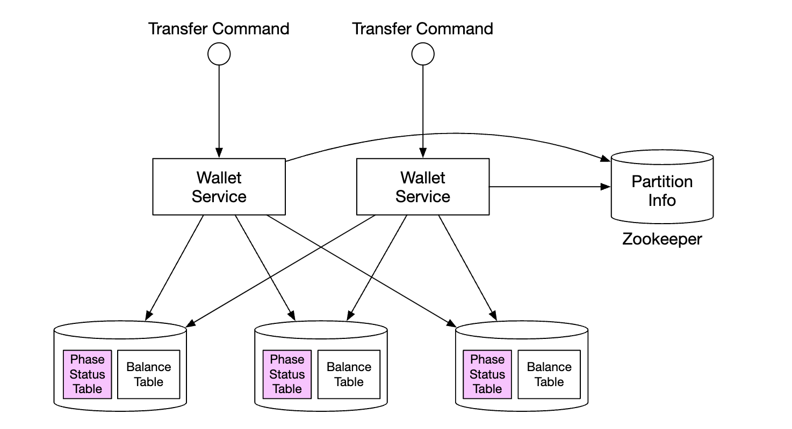
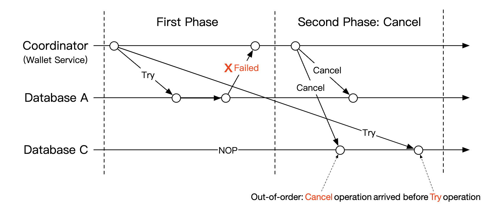
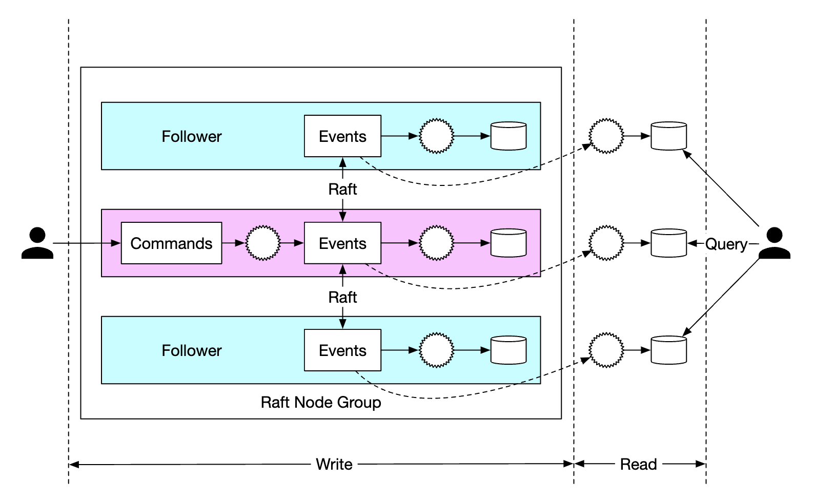

## CHAPTER 27 · 디지털 지갑 설계

### 소개
**결제 플랫폼(payment platform)**은 보통 **지갑 서비스(wallet service)**를 갖추고, 클라이언트가 애플리케이션 안에 자금을 보관했다가 나중에 인출할 수 있게 한다.

이것으로 재화와 서비스 대금을 지불하거나, **디지털 지갑(digital wallet)** 서비스를 사용하는 다른 사용자에게 송금할 수도 있다. 일반적인 결제 레일(payment rail)로 처리하는 것보다 빠르고 저렴할 수 있다.


### 1단계: 문제 이해와 설계 범위 확정
 * 지원자: 디지털 지갑 사이의 이체에만 집중해야 하나요? 다른 연산도 지원해야 하나요?
 * 면접관: 지금은 디지털 지갑 사이의 이체에 집중합시다.
 * 지원자: 시스템은 초당 몇 트랜잭션을 지원해야 하나요?
 * 면접관: 1mil TPS로 가정합시다.
 * 지원자: 디지털 지갑은 엄격한 정확성 요구가 있습니다. 트랜잭션 보장으로 충분하다고 가정해도 되나요?
 * 면접관: 좋습니다.
 * 지원자: 정확성을 증명해야 하나요?
 * 면접관: 대사로 가능하지만, 대사는 불일치를 감지할 뿐 근본 원인을 보여 주지는 않습니다. 대신 처음부터 데이터를 재생(replay)해 이력을 재구성할 수 있기를 원합니다.
 * 지원자: 가용성 요구는 99.99%로 가정해도 되나요?
 * 면접관: 네.
 * 지원자: 환전을 고려해야 하나요?
 * 면접관: 아니요, 범위 밖입니다.

요약하면 지원해야 할 것:
 * 두 계좌 사이의 잔액 이체 지원
 * 1mil TPS 지원
 * 신뢰성 99.99%
 * 트랜잭션 지원
 * 재현성(reproducibility) 지원

#### **개략적 규모 추정**
클라우드에 프로비저닝한 전통적인 관계형 데이터베이스는 약 1000 TPS를 지원한다.

1mil TPS에 도달하려면 데이터베이스 노드 1000대가 필요하다. 하지만 이체 하나에 두 다리(leg)가 있으므로, 실제로는 2mil TPS를 지원해야 한다.

설계 목표 하나는 단일 노드가 감당하는 TPS를 높여 데이터베이스 노드 수를 줄이는 것이다.

| 노드당 TPS | 노드 수 |
|--------------|-------------|
| 100          | 20,000      |
| 1,000        | 2,000       |
| 10,000       | 200         |

### 2단계: 개략적 설계안 제시 및 동의 얻기

#### **API 설계**
이 면접에서 지원할 엔드포인트는 하나뿐이다:
```
POST /v1/wallet/balance_transfer - transfers balance from one wallet to another
```

요청 파라미터 - from_account, to_account, amount(정밀도를 잃지 않으려고 string), currency, transaction_id(멱등성 키).

응답 예시:
```
{
    "status": "success"
    "transaction_id": "01589980-2664-11ec-9621-0242ac130002"
}
```

#### **인메모리 샤딩 해법**
우리 지갑 애플리케이션은 모든 사용자 계좌의 잔액을 유지한다.

이를 표현하기 좋은 자료 구조 하나는 `map<user_id, balance>`로, 인메모리 Redis 저장소로 구현할 수 있다.

Redis 노드 하나는 1mil TPS를 감당할 수 없으므로, Redis 클러스터를 여러 노드로 분할해야 한다.

분할 알고리즘 예시:
```
String accountID = "A";
Int partitionNumber = 7;
Int myPartition = accountID.hashCode() % partitionNumber;
```

Zookeeper는 고가용 설정 저장소이므로, 파티션 수와 Redis 노드 주소를 저장하는 데 쓸 수 있다.

마지막으로 지갑 서비스는 이체 연산을 수행하는 상태 비저장 서비스다. 수평적으로 쉽게 확장할 수 있다:


이 해법은 확장성 문제를 다루지만, 잔액 이체를 원자적으로 실행할 수는 없다.

#### **분산 트랜잭션**
트랜잭션을 다루는 한 가지 접근은 표준적인 샤딩된 관계형 데이터베이스 위에 2단계 커밋(two-phase commit) 프로토콜을 쓰는 것이다:


2단계 커밋(2PC) 프로토콜은 다음과 같이 동작한다:


 * 코디네이터(지갑 서비스)는 여러 데이터베이스에서 평소처럼 읽기·쓰기 연산을 수행한다.
 * 애플리케이션이 트랜잭션을 커밋할 준비가 되면, 코디네이터는 모든 데이터베이스에 준비를 요청한다.
 * 모든 데이터베이스가 "예"로 응답하면, 코디네이터는 데이터베이스에 트랜잭션 커밋을 요청한다.
 * 그렇지 않으면 모든 데이터베이스에 트랜잭션 중단을 요청한다

2PC 접근의 단점:
 * 잠금 경합 때문에 성능이 좋지 않다.
 * 코디네이터가 단일 장애 지점이다.

#### **Try-Confirm/Cancel(TC/C)을 사용한 분산 트랜잭션**
TC/C는 2PC 프로토콜의 변형으로, 보상 트랜잭션(compensating transaction)과 함께 동작한다:
 * 코디네이터는 모든 데이터베이스에 트랜잭션 자원을 예약하라고 요청한다.
 * 코디네이터는 DB의 응답을 모은다 - 예이면 DB에 try-confirm을, 아니오이면 try-cancel을 요청한다.

TC/C와 2PC의 중요한 차이는, 2PC는 트랜잭션 하나를 수행하지만 TC/C에는 독립적인 트랜잭션 두 개가 있다는 점이다.

단계별 TC/C 동작:

| 단계 | 연산 | A                   | C                   |
|-------|-----------|---------------------|---------------------|
| 1     | Try       | 잔액 변화: -$1 | 아무것도 하지 않는다          |
| 2     | Confirm   | 아무것도 하지 않는다 | 잔액 변화: +$1 |
|       | Cancel    | 잔액 변화: +$1 | 아무것도 하지 않는다          |

1단계 - try:


 * 코디네이터는 A의 DB에서 로컬 트랜잭션을 시작해 A의 잔액을 1$ 줄인다.
 * C의 DB에는 아무것도 하지 않는 NOP 명령이 주어진다

2a단계 - confirm:


 * 두 DB 모두 "예"로 응답하면 confirm 단계가 시작된다.
 * A의 DB는 NOP을 받고, C의 DB는 C의 잔액을 1$ 늘이라는 지시를 받는다(로컬 트랜잭션)

2b단계 - cancel:


 * 1단계 연산 중 하나라도 실패하면 cancel 단계가 시작된다.
 * A의 DB는 A의 잔액을 1$ 늘이라는 지시를 받고, C의 DB는 NOP을 받는다

2PC와 TC/C의 비교:

|      | 첫 번째 단계                                            | 두 번째 단계: 성공              | 두 번째 단계: 실패                        |
|------|--------------------------------------------------------|------------------------------------|-------------------------------------------|
| 2PC  | 트랜잭션이 아직 완료되지 않음                          | 모든 트랜잭션 커밋/취소     | 모든 트랜잭션 취소                   |
| TC/C | 모든 트랜잭션 완료 - 커밋되거나 취소됨 | 필요하면 새 트랜잭션 실행 | 이미 커밋된 트랜잭션 되돌리기 |

TC/C는 보상에 의한 분산 트랜잭션이라고도 불린다. 상위 수준 연산은 비즈니스 로직에서 처리된다.

TC/C의 다른 성질:
 * 데이터베이스가 트랜잭션을 지원하기만 하면 데이터베이스와 무관하게 쓸 수 있다.
 * 분산 트랜잭션의 세부사항과 복잡성은 비즈니스 로직에서 처리해야 한다.

#### **TC/C 실패 모드**
코디네이터가 진행 중에 죽으면, 중간 상태를 복구해야 한다.
이는 단계 상태 테이블(phase status table)을 데이터베이스 샤드 안에서 원자적으로 갱신하며 유지하는 것으로 할 수 있다:



그 테이블에 담기는 내용:
 * 분산 트랜잭션의 ID와 내용
 * try 단계 상태 - 미전송, 전송됨, 응답 수신
 * 두 번째 단계 이름 - confirm 또는 cancel
 * 두 번째 단계 상태
 * out-of-order 플래그 (뒤에서 설명)

TC/C를 쓸 때의 유의점 하나는, 분산 트랜잭션이 진행 중인 동안 계좌 상태가 서로 불일치하는 짧은 순간이 있다는 것이다:


이 상태에서 항상 복구되고, 사용자가 예컨대 그 중간 상태를 써버릴 수만 없다면 괜찮다.
이는 추가 전에 항상 차감을 실행하는 것으로 보장된다.

| Try 단계 선택  | 계좌 A | 계좌 C |
|--------------------|-----------|-----------|
| 선택 1           | -$1       | NOP       |
| 선택 2 (무효) | NOP       | +$1       |
| 선택 3 (무효) | -$1       | +$1       |

위 표의 선택 3이 무효인 이유는, 2PC에 의존하지 않고서는 서로 다른 데이터베이스에 걸친 트랜잭션의 원자적 실행을 보장할 수 없기 때문이다.

다뤄야 할 엣지 케이스 하나는 순서가 뒤바뀐 실행이다:



데이터베이스가 try를 받기 전에 cancel 연산을 받을 수 있다. 이 엣지 케이스는 단계 상태 테이블에 out-of-order 플래그를 추가해 처리할 수 있다.
try 연산을 받으면 먼저 out-of-order 플래그가 설정되어 있는지 확인하고, 설정되어 있으면 실패를 반환한다.

#### **세이가(Saga)를 사용한 분산 트랜잭션**
또 다른 인기 접근은 세이가를 쓰는 것이다 - 마이크로서비스 아키텍처에서 분산 트랜잭션을 구현하는 표준이다.

동작 방식:
 * 모든 연산을 순서대로 늘어놓는다. 모든 연산은 자기 데이터베이스 안에서 독립적이다.
 * 연산은 처음부터 끝까지 실행된다.
 * 연산이 실패하면 전체 과정이 보상 연산으로 처음까지 되감긴다.


작업 흐름은 어떻게 조율하나? 두 가지 접근이 있다:
 * 안무(choreography) - 세이가에 관련된 모든 서비스가 관련 이벤트를 구독하고 세이가에서 자기 몫을 수행한다.
 * 오케스트레이션(orchestration) - 단일 코디네이터가 모든 서비스에게 올바른 순서로 일하라고 지시한다.

안무의 어려움은 비즈니스 로직이 비동기적으로 통신하는 여러 서비스에 흩어진다는 점이다.
오케스트레이션 접근은 복잡성을 잘 다루므로, 디지털 지갑 시스템에서는 보통 선호하는 접근이다.

TC/C와 세이가의 비교:

|                                           | TC/C            | 세이가                     |
|-------------------------------------------|-----------------|--------------------------|
| 보상 동작                       | Cancel 단계에서 | 롤백 단계에서        |
| 중앙 조율                      | 있음             | 있음 (오케스트레이션 모드) |
| 연산 실행 순서                 | 제각각             | 선형                   |
| 병렬 실행 가능성            | 있음             | 없음 (선형 실행)    |
| 부분 불일치 상태 관찰 가능 | 있음             | 있음                      |
| 애플리케이션 또는 데이터베이스 로직                             | 애플리케이션            | 애플리케이션                      |

주요 차이는 TC/C는 병렬화 가능하다는 점이고, 우리 결정은 지연 요구에 달려 있다 - 낮은 지연을 달성해야 한다면 TC/C 접근을 택해야 한다.

어떤 접근을 택하든, 실패 상태에서 복구하려면 감사(audit)와 이력 재생(replay)을 지원해야 한다.

#### **이벤트 소싱(event sourcing)**
실제 상황에서 디지털 지갑 애플리케이션은 감사를 받을 수 있고, 우리는 특정 질문에 답해야 한다:
 * 임의의 시점의 계좌 잔액을 알 수 있는가?
 * 과거 잔액과 현재 잔액이 올바르다는 것을 어떻게 아는가?
 * 코드 변경 후에도 시스템 로직이 올바르다는 것을 어떻게 증명하는가?

이벤트 소싱은 이 질문에 답하도록 돕는 기법이다.

네 가지 개념으로 이루어진다:
 * 커맨드(command) - 실세계에서 의도한 행위. 예컨대 계좌 A에서 B로 1$ 이체. 전역 순서가 필요해 FIFO 큐에 담긴다.
   * 커맨드는 이벤트와 달리 실패할 수 있고, 예컨대 IO나 무효 상태 때문에 어느 정도 무작위성을 지닌다.
   * 커맨드는 0개 이상의 이벤트를 만들 수 있다.
   * 이벤트 생성은 외부 IO 같은 무작위성을 포함할 수 있다. 뒤에서 다시 다룬다.
 * 이벤트(event) - 시스템에서 일어난 일에 대한 과거 사실. 예컨대 "A에서 B로 1$ 이체됨".
   * 이벤트는 커맨드와 달리 우리 시스템 안에서 이미 일어난 사실이다.
   * 커맨드와 마찬가지로 순서가 필요해 FIFO 큐에 담긴다.
 * 상태(state) - 이벤트의 결과로 무엇이 바뀌었는가. 예컨대 계좌와 잔액 사이의 키-값 저장소.
 * 상태 기계(state machine) - 이벤트 소싱 과정을 주도한다. 주로 커맨드를 검증하고 이벤트를 적용해 시스템 상태를 갱신한다.
   * 상태 기계는 결정적(deterministic)이어야 하므로, 외부 IO를 읽거나 무작위성에 의존해서는 안 된다.


이벤트 소싱의 동적 관점이다:


우리 지갑 서비스에서 커맨드는 잔액 이체 요청이다. Kafka 같은 FIFO 큐에 담을 수 있다:


전체 그림이다:


 * 상태 기계는 커맨드 큐에서 커맨드를 읽는다.
 * 잔액 상태는 데이터베이스에서 읽는다.
 * 커맨드를 검증한다. 유효하면 두 계좌에 대한 두 이벤트가 만들어진다.
 * 다음 이벤트를 읽고 데이터베이스의 잔액(상태)을 갱신해 적용한다.

이벤트 소싱의 주된 장점은 재현성이다. 이 설계에서 모든 상태 갱신 연산은 모든 잔액 변화의 불변 이력으로 저장된다.

과거 잔액은 언제나 처음부터 이벤트를 재생해 재구성할 수 있다.
이벤트 목록이 불변이고 상태 기계가 결정적이므로, 어떤 중간 상태든 재생에 성공함이 보장된다.


이 절 초반에 던진 감사 관련 질문은 모두 이벤트 소싱에 의지해 해결할 수 있다:
 * 임의의 시점의 계좌 잔액을 알 수 있는가? - 이벤트를 처음부터 관심 시점까지 재생하면 된다.
 * 과거와 현재 잔액이 올바른지 어떻게 아는가? - 모든 이벤트를 처음부터 다시 계산해 정확성을 검증한다.
 * 코드 변경 후 시스템 로직이 올바르다는 것을 어떻게 증명하는가? - 여러 버전의 코드를 이벤트에 실행해 결과가 같은지 확인한다.

잔액에 관한 클라이언트 질의는 CQRS 아키텍처로 해결할 수 있다 - 불변 이벤트 목록을 기반으로 과거 상태를 질의하는 읽기 전용 상태 기계를 여러 개 둘 수 있다:


### 3단계: 상세 설계
이 섹션에서는 1mil TPS로 확장해야 하므로 성능 최적화 몇 가지를 살펴본다.

#### **고성능 이벤트 소싱**
살펴볼 첫 최적화는, 커맨드와 이벤트를 Kafka 같은 외부 저장소 대신 로컬 디스크 저장소에 저장하는 것이다.

이는 네트워크 지연을 피하고, 추가(append)만 하므로 HDD에서도 보통 빠르다.

다음 최적화는 최근 커맨드와 이벤트를 메모리에 캐시해, 디스크에서 다시 불러오는 시간을 아끼는 것이다.

저수준에서는 mmap이라는 명령을 활용해 앞서 말한 최적화를 달성할 수 있다. mmap은 데이터를 로컬 디스크에 저장하는 동시에 메모리에 캐시한다:


그다음 최적화는 상태도 SQLite라는 파일 기반 로컬 관계형 데이터베이스를 써 로컬 파일 시스템에 저장하는 것이다. RocksDB도 좋은 대안이다.

우리 목적에는 RocksDB를 선택한다. 쓰기 연산에 최적화된 LSM(log-structured merge-tree)을 쓰기 때문이다.
읽기 성능은 캐싱으로 최적화된다.


재현성을 최적화하려면, 매번 아주 처음부터 주어진 상태를 재현하지 않아도 되도록 스냅샷을 주기적으로 디스크에 저장할 수 있다. 스냅샷은 예컨대 HDFS 같은 분산 파일 저장소에 큰 이진 파일로 둘 수 있다:


#### **신뢰할 수 있는 고성능 이벤트 소싱**
지금까지의 최적화는 훌륭하지만, 서비스를 상태 유지로 만든다. 신뢰성을 위해 어떤 형태의 복제를 도입해야 한다.

그 전에, 시스템에서 어떤 데이터가 높은 신뢰성을 필요로 하는지 분석해야 한다:
 * 상태와 스냅샷은 언제나 이벤트 목록에서 다시 만들 수 있다. 따라서 이벤트 목록의 신뢰성만 보장하면 된다.
 * 커맨드 목록에서 이벤트 목록을 언제나 다시 만들 수 있다고 생각할 수 있지만, 커맨드는 비결정적이므로 그렇지 않다.
 * 결론은 이벤트 목록에만 높은 신뢰성을 보장하면 된다는 것이다.

이벤트에 높은 신뢰성을 달성하려면, 목록을 여러 노드에 복제해야 한다. 보장해야 할 것:
 * 데이터 유실이 없을 것
 * 로그 파일 안 데이터의 상대 순서가 복제본 사이에서 유지될 것

이를 달성하려면 Raft 같은 합의 알고리즘을 쓸 수 있다.

Raft에는 활동하는 리더 하나와 수동적인 팔로워들이 있다. 리더가 죽으면 팔로워 중 하나가 이어받는다.
절반 이상의 노드가 살아 있는 한 시스템은 계속 동작한다.



이 접근에서 모든 노드는 이벤트 목록을 기반으로 상태를 갱신한다. Raft가 리더와 팔로워의 이벤트 목록이 같음을 보장한다.

#### **분산 이벤트 소싱**
지금까지 단일 노드 성능이 높고 신뢰할 수 있는 시스템을 설계했다.

다뤄야 할 한계:
 * 단일 Raft 그룹의 용량은 제한적이다. 언젠가는 데이터를 샤딩하고 분산 트랜잭션을 구현해야 한다.
 * CQRS 아키텍처에서 요청/응답 흐름은 느리다. 클라이언트는 지갑이 갱신되었는지 알려면 시스템을 주기적으로 폴링해야 한다.

폴링은 실시간이 아니어서, 사용자가 잔액 갱신을 알게 되기까지 시간이 걸릴 수 있다. 또 폴링 빈도가 높으면 질의 서비스에 과부하가 걸릴 수 있다:


시스템 부하를 줄이려면, 사용자를 대신해 커맨드를 보내고 응답을 폴링하는 리버스 프록시를 도입할 수 있다:


이는 하나의 요청으로 여러 사용자의 데이터를 가져올 수 있어 시스템 부하를 덜지만, 실시간 영수증 요구는 여전히 해결하지 못한다.

마지막으로 할 수 있는 변경 하나는, 읽기 전용 상태 기계가 응답이 준비되면 리버스 프록시로 되밀어 보내는 것이다. 갱신이 실시간으로 일어나는 느낌을 줄 수 있다:


마지막으로 시스템을 더 확장하려면, 여러 Raft 그룹으로 샤딩하고 그 위에 TC/C나 세이가의 오케스트레이터로 분산 트랜잭션을 구현할 수 있다:


최종 시스템에서 잔액 이체 요청의 수명 주기 예시다:
 * 사용자 A가 두 연산 - `A-1`과 `C+1` - 을 담은 분산 트랜잭션을 세이가 코디네이터로 보낸다.
 * 세이가 코디네이터는 트랜잭션 상태를 추적하려고 단계 상태 테이블에 기록을 만든다.
 * 코디네이터는 커맨드를 보내야 할 파티션을 결정한다.
 * 파티션 1의 Raft 리더가 `A-1` 커맨드를 받아 검증하고, 이벤트로 변환해 Raft 그룹의 다른 노드에 복제한다.
 * 이벤트 결과는 읽기 상태 기계로 동기화되고, 읽기 상태 기계는 응답을 코디네이터로 되밀어 보낸다.
 * 코디네이터는 연산이 성공했음을 나타내는 기록을 만들고 다음 연산 - `C+1` - 을 진행한다.
 * 다음 연산은 첫 연산과 비슷하게 실행된다 - 파티션을 정하고, 커맨드를 보내고, 실행하고, 읽기 상태 기계가 응답을 되밀어 보낸다.
 * 코디네이터는 연산 2도 성공했음을 나타내는 기록을 만들고 마지막으로 클라이언트에게 결과를 알린다.

### 4단계: 마무리
설계의 진화 과정이다:
 * 인메모리 Redis를 쓰는 해법에서 시작했다. 이 접근의 문제는 영속적 저장소가 아니라는 점이다.
 * 관계형 데이터베이스를 쓰는 단계로 나아갔고, 그 위에서 2PC, TC/C 또는 분산 세이가로 분산 트랜잭션을 실행한다.
 * 다음으로, 모든 연산을 감사 가능하게 만들려고 이벤트 소싱을 도입했다.
 * 처음에는 외부 데이터베이스와 큐를 써 데이터를 외부 저장소에 두었지만, 성능이 좋지 않았다.
 * 로컬 파일 저장소에 데이터를 저장하는 방향으로 나아가, 추가 전용(append-only) 연산의 성능을 활용했다. 읽기 경로 최적화에는 캐싱도 썼다.
 * 이전 접근은 성능이 좋지만 영속적이지 않았다. 그래서 단일 장애 지점을 피하려고 복제를 곁들인 Raft 합의를 도입했다.
 * 사용자를 대신해 트랜잭션 수명 주기를 관리하려고 리버스 프록시를 곁들인 CQRS도 채택했다.
 * 마지막으로, 데이터를 여러 Raft 그룹에 분할했고, 그룹들은 분산 트랜잭션 메커니즘 - TC/C 또는 분산 세이가 - 으로 오케스트레이션된다.
