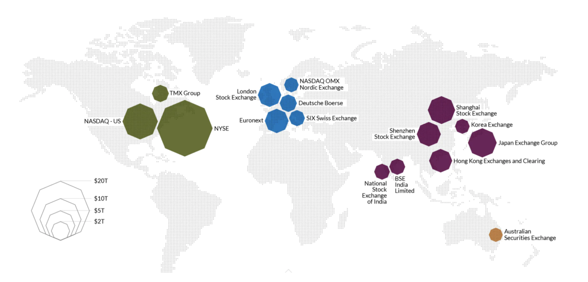
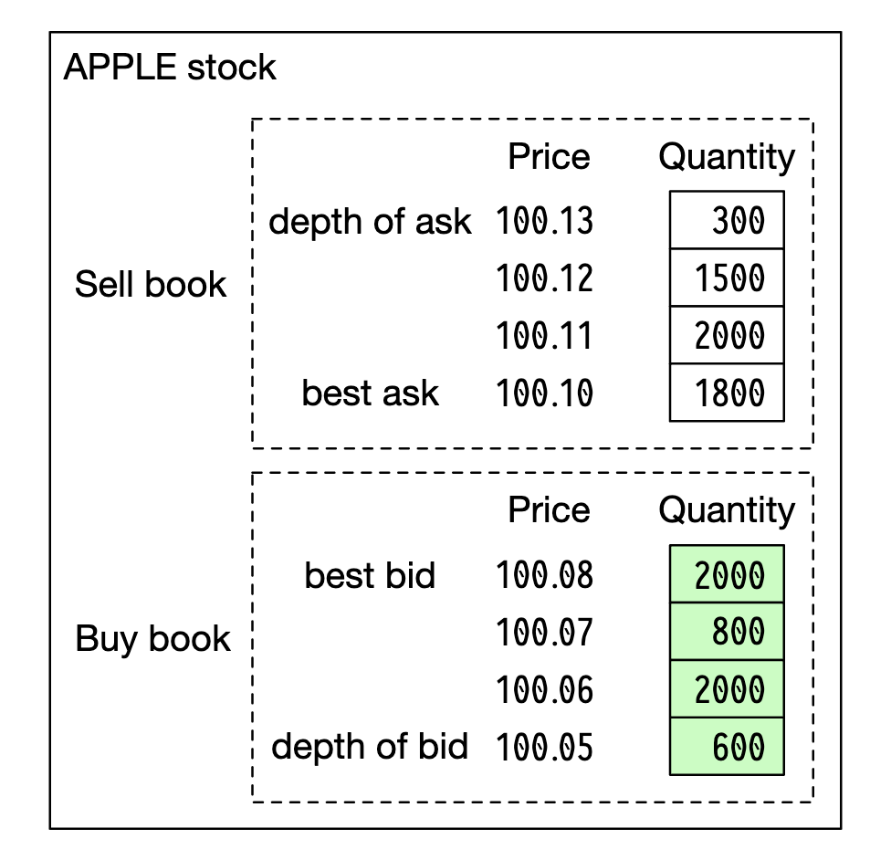
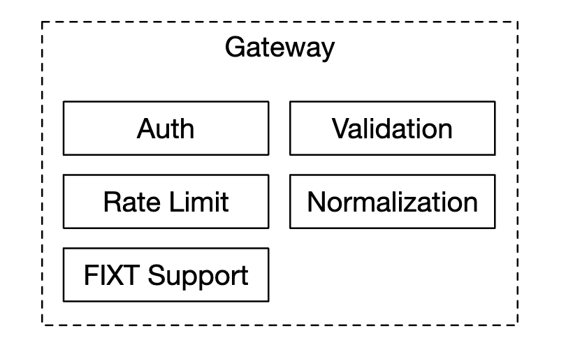

## CHAPTER 28 · 주식 거래소 설계

### 소개
이 장에서는 **전자 주식 거래소(electronic stock exchange)**를 설계한다.

기본 기능은 구매자와 판매자를 효율적으로 매칭하는 것이다.

주요 주식 거래소로는 **NYSE**, **NASDAQ** 등이 있다.



### 1단계: 문제 이해와 설계 범위 확정
 * 지원자: 어떤 증권을 거래하나요? 주식, 옵션, 선물?
 * 면접관: 단순화를 위해 주식만 합니다.
 * 지원자: 어떤 주문 유형을 지원하나요 - 주문, 취소, 정정? 지정가, 시장가, 조건부 주문은요?
 * 면접관: 주문 제출과 취소를 지원해야 합니다. 주문 유형은 지정가 주문만 고려합니다.
 * 지원자: 장외 시간 거래를 지원해야 하나요?
 * 면접관: 아니요, 정규 장 시간만 합니다.
 * 지원자: 거래소의 기본 기능을 설명해 주시겠어요?
 * 면접관: 클라이언트가 지정가 주문을 제출·취소하고 체결 결과를 실시간으로 받습니다. 주문장을 실시간으로 볼 수 있어야 합니다.
 * 지원자: 거래소의 규모는 어느 정도인가요?
 * 면접관: 동시에 거래하는 사용자 수만 명과 약 100개 종목입니다. 하루 주문 수는 수십억 건입니다. 컴플라이언스를 위한 위험 검사도 지원해야 합니다.
 * 지원자: 어떤 위험 검사인가요?
 * 면접관: 간단한 위험 검사를 합시다 - 예컨대 사용자가 하루에 애플 주식 100만 주까지만 거래하도록 제한합니다.
 * 지원자: 사용자 지갑 연동은 어떤가요?
 * 면접관: 클라이언트가 주문을 내기 전에 충분한 자금이 있는지 확인해야 합니다. 대기 중인 주문에 배정된 자금은 주문이 최종 확정될 때까지 묶어 두어야 합니다.

#### **비기능 요구사항**
면접관이 말한 규모는 우리가 소규모~중규모 거래소를 설계해야 함을 암시한다.
미래에 더 많은 종목과 사용자를 지원할 수 있는 유연성도 확보해야 한다.

그 밖의 비기능 요구사항:
 * 가용성 - 최소 99.99%. 다운타임은 평판을 해칠 수 있다.
 * 장애 내성 - 운영 사고의 영향을 제한하려면 장애 내성과 빠른 복구 메커니즘이 필요하다.
 * 지연 - 왕복 지연은 밀리초 수준이어야 하며 99 퍼센타일에 집중한다. 99p 지연이 지속적으로 높으면 일부 사용자에게 나쁜 경험을 준다.
 * 보안 - 계정 관리 시스템이 있어야 한다. 법적 컴플라이언스를 위해 사용자 신원을 검증하는 KYC를 지원해야 한다. 공개 리소스에 대한 DDoS도 방어해야 한다.

#### **개략적 규모 추정**
 * 종목 100개, 하루 10억 주문
 * 정규 장 시간은 09:30~16:00 (6.5시간)이다.
 * QPS = 1bil / 6.5 / 3600 = 43000
 * 최대 QPS = 5*QPS = 215000
 * 장 시작 때 거래량이 눈에 띄게 많다.

### 2단계: 개략적 설계안 제시 및 동의 얻기

#### **비즈니스 지식 기초**
거래소와 관련된 기본 개념 몇 가지를 논의해 보자.

브로커(broker)는 거래소와 최종 사용자 사이를 중개한다 - Robinhood, Fidelity 등.

기관 고객은 전문 거래 소프트웨어로 대량 거래를 한다. 특별한 대우가 필요하다.
예컨대 시장에 영향을 주지 않으려고 대량 거래 시 주문을 분할한다.

주문 유형:
 * 지정가(limit) - 고정 가격에 사거나 판다. 즉시 매칭되지 않거나 일부만 체결될 수 있다.
 * 시장가(market) - 가격을 지정하지 않는다. 현재 시장 가격으로 즉시 체결된다.

가격:
 * 입찰가(bid) - 구매자가 주식을 사려는 최고 가격
 * 매도가(ask) - 판매자가 주식을 팔려는 최저 가격

미국 시장에는 L1, L2, L3 세 단계의 호가가 있다.

L1 시세 데이터는 최우선 입찰가/매도가 가격과 수량을 담는다:


L2는 더 많은 가격 단계를 포함한다:



L3는 각 단계의 대기 수량까지 보여 준다:


캔들스틱은 시장의 시가·종가와 해당 구간의 최고·최저 가격을 보여 준다:


FIX는 대부분 업체가 사용하는 증권 거래 정보 교환 프로토콜이다. 증권 거래 예시:
```
8=FIX.4.2 | 9=176 | 35=8 | 49=PHLX | 56=PERS | 52=20071123-05:30:00.000 | 11=ATOMNOCCC9990900 | 20=3 | 150=E | 39=E | 55=MSFT | 167=CS | 54=1 | 38=15 | 40=2 | 44=15 | 58=PHLX EQUITY TESTING | 59=0 | 47=C | 32=0 | 31=0 | 151=15 | 14=0 | 6=0 | 10=128 |
```

#### **개략적 설계**


거래 흐름:
 * 클라이언트가 거래 인터페이스로 주문을 낸다.
 * 브로커가 주문을 거래소로 보낸다.
 * 주문은 클라이언트 게이트웨이를 통해 거래소에 들어간다. 게이트웨이는 검증, 처리율 제한, 인증 등을 수행한다. 주문은 주문 관리자로 전달된다.
 * 주문 관리자는 위험 관리자가 설정한 규칙에 따라 위험 검사를 수행한다.
 * 위험 검사를 통과하면, 주문 관리자는 지갑에 주문을 감당할 충분한 자금이 있는지 확인한다.
 * 주문은 매칭 엔진으로 보내진다. 매칭을 찾으면 매칭 엔진은 매수·매도에 대해 두 개의 체결(execution, fill이라고도 부름)을 내보낸다. 두 주문 모두 결정적이 되도록 시퀀싱된다.
 * 체결은 클라이언트로 반환된다.

시세 데이터 흐름(M1-M3):
 * 매칭 엔진이 체결 스트림을 만들어 시세 데이터 퍼블리셔로 보낸다.
 * 시세 데이터 퍼블리셔는 캔들스틱 차트를 구성해 데이터 서비스로 보낸다.
 * 시세 데이터는 실시간 분석을 위한 전용 저장소에 저장된다. 브로커는 시의적절한 시세를 얻으려고 데이터 서비스에 접속한다.

리포팅 흐름(R1-R2):
 * 리포터는 주문과 체결에서 필요한 보고 필드를 모아 DB에 기록한다.
 * 보고 필드 - client_id, price, quantity, order_type, filled_quantity, remaining_quantity

거래 흐름은 임계 경로(critical path)에 있고 나머지 흐름은 아니므로, 지연 요구가 서로 다르다.

#### 거래 흐름
거래 흐름은 임계 경로에 있으므로 낮은 지연에 맞게 크게 최적화해야 한다.

매칭 엔진이 그 심장이며, 크로스 엔진(cross engine)이라고도 부른다. 주요 책임:
 * 각 종목의 주문장을 유지한다 - 종목 하나의 매수/매도 주문 목록.
 * 매수 주문과 매도 주문을 매칭한다 - 매칭 하나는 매수·매도 양쪽에 하나씩 두 개의 체결을 만든다. 이 기능은 빠르고 정확해야 한다.
 * 체결 스트림을 시세 데이터로 배포한다.
 * 매칭은 결정적인 순서로 만들어져야 한다. 고가용성의 기초다.

다음은 시퀀서(sequencer)다 - 들어오는 주문과 나가는 체결에 시퀀스 ID를 찍어 매칭 엔진을 결정적으로 만드는 핵심 컴포넌트다.


들어오는 주문과 나가는 체결에 시퀀스를 찍는 이유:
 * 적시성과 공정성
 * 빠른 복구/재생
 * 정확히 한 번 보장

개념적으로는 Kafka를 시퀀서로 쓸 수 있다. 사실상 입출력 메시지 큐이기 때문이다. 하지만 더 낮은 지연을 달성하려고 직접 구현한다.

주문 관리자는 주문 상태를 관리한다. 매칭 엔진과도 상호작용한다 - 주문을 보내고 체결을 받는다.

주문 관리자의 책임:
 * 주문을 위험 검사로 보낸다 - 예컨대 사용자 거래량이 100만 미만인지 검증한다.
 * 주문을 사용자 지갑과 대조해 실행할 충분한 자금이 있는지 확인한다.
 * 주문을 시퀀서로, 이어 매칭 엔진으로 보낸다. 대역폭을 줄이려고 필요한 주문 정보만 매칭 엔진에 전달한다.
 * 체결은 시퀀서에서 되돌려받아 클라이언트 게이트웨이를 통해 브로커로 보내진다.

주문 관리자 구현의 주된 난제는 상태 전이 관리다. 이벤트 소싱이 가능한 해법 하나다(상세 설계에서 다룬다).

마지막으로, 클라이언트 게이트웨이는 사용자에게서 주문을 받아 주문 관리자로 보낸다. 책임은 다음과 같다:



클라이언트 게이트웨이는 임계 경로에 있으므로 가볍게 유지해야 한다.

클라이언트별로 클라이언트 게이트웨이를 여러 개 둘 수 있다. 예컨대 콜로 엔진은 브로커가 거래소 데이터 센터에서 빌려 쓰는 거래 엔진 서버다:


#### 시세 데이터 흐름
시세 데이터 퍼블리셔는 매칭 엔진에서 체결을 받아 체결 스트림으로 주문장/캔들스틱 차트를 만든다.

이 데이터는 데이터 서비스로 보내지며, 데이터 서비스는 집계 데이터를 구독자에게 보여 주는 역할을 한다:


#### 리포팅 흐름
리포터는 임계 경로에 있지 않지만, 여전히 중요한 컴포넌트다.


거래 이력, 세금 보고, 컴플라이언스 보고, 정산 등을 담당한다.
리포팅 흐름에는 지연이 결정적 요구사항이 아니다. 정확성과 컴플라이언스가 더 중요하다.

#### **API 설계**
클라이언트는 브로커를 통해 주식 거래소와 상호작용해 주문을 내고, 체결과 시세를 보고, 분석용 과거 데이터를 내려받는다.

클라이언트 게이트웨이와 브로커 사이에는 RESTful API를 쓴다.

기관 고객에게는 낮은 지연 요구를 만족하려고 독점 프로토콜을 쓴다.

주문 생성:
```
POST /v1/order
```

파라미터:
 * symbol - 주식 종목 코드. String
 * side - 매수 또는 매도. String
 * price - 지정가 주문 가격. Long
 * orderType - 지정가 또는 시장가 (이 설계에서는 지정가만 지원한다). String
 * quantity - 주문 수량. Long

응답:
 * id - 주문 ID. Long
 * creationTime - 주문의 시스템 생성 시각. Long
 * filledQuantity - 성공적으로 체결된 수량. Long
 * remainingQuantity - 아직 체결되지 않은 수량. Long
 * status - new/canceled/filled. String
 * 나머지 속성은 입력 파라미터와 같다.

체결 조회:
```
GET /execution?symbol={:symbol}&orderId={:orderId}&startTime={:startTime}&endTime={:endTime}
```

파라미터:
 * symbol - 주식 종목 코드. String
 * orderId - 주문 ID. 선택. String
 * startTime - 조회 시작 시각(epoch) \[11\]. Long
 * endTime - 조회 종료 시각(epoch). Long

응답:
 * executions - 범위 안 각 체결의 배열 (속성은 아래 참고). Array
 * id - 체결 ID. Long
 * orderId - 주문 ID. Long
 * symbol - 주식 종목 코드. String
 * side - 매수 또는 매도. String
 * price - 체결 가격. Long
 * orderType - 지정가 또는 시장가. String
 * quantity - 체결 수량. Long

주문장 조회:
```
GET /marketdata/orderBook/L2?symbol={:symbol}&depth={:depth}
```

파라미터:
 * symbol - 주식 종목 코드. String
 * depth - 주문장 깊이(호가 단계 수). Int

응답:
 * bids - 가격과 수량의 배열. Array
 * asks - 가격과 수량의 배열. Array

캔들스틱 조회:
```
GET /marketdata/candles?symbol={:symbol}&resolution={:resolution}&startTime={:startTime}&endTime={:endTime}
```

파라미터:
 * symbol - 주식 종목 코드. String
 * resolution - 캔들스틱 차트 창 길이(초). Long
 * startTime - 창 시작 시각(epoch). Long
 * endTime - 창 종료 시각(epoch). Long

응답:
 * candles - 각 캔들스틱 데이터의 배열 (속성은 아래). Array
 * open - 각 캔들스틱의 시가. Double
 * close - 각 캔들스틱의 종가. Double
 * high - 각 캔들스틱의 최고가. Double
 * low - 각 캔들스틱의 최저가. Double

#### **데이터 모델**
거래소에는 세 가지 주요 데이터 유형이 있다:
 * 상품, 주문, 체결
 * 주문장
 * 캔들스틱 차트

#### 상품, 주문, 체결
상품은 거래되는 종목의 속성을 기술한다 - 상품 유형, 거래 심볼, UI 표시 심볼 등.

이 데이터는 자주 바뀌지 않고 주로 UI 렌더링에 쓰인다.

주문은 매수/매도 주문에 대한 지시를 나타낸다. 체결은 매칭된 결과의 출력이다.

데이터 모델은 다음과 같다:


세 흐름 모두에서 주문과 체결을 만난다:
 * 임계 경로에서는 고성능을 위해 메모리에서 처리한다. 시퀀서에 저장되고 복구된다.
 * 리포터는 보고 사례를 위해 주문과 체결을 데이터베이스에 기록한다.
 * 체결은 주문장과 캔들스틱 차트를 재구성하려고 시세 데이터로 전달된다.

#### 주문장(order book)
주문장은 한 상품의 매수/매도 주문을 가격 단계별로 정리한 목록이다.

이 모델에 효율적인 자료 구조가 만족해야 할 것:
 * 상수 시간 조회 - 특정 가격 단계 또는 단계 사이의 거래량 조회
 * 빠른 추가/체결/취소 연산
 * 최우선 입찰가/매도가 조회
 * 가격 단계 순회

주문장 체결 예시:


이 큰 주문을 채운 뒤에는 입찰가/매도가 스프레드가 넓어지면서 가격이 오른다.

의사 코드로 본 주문장 구현 예시:
```
class PriceLevel{
    private Price limitPrice;
    private long totalVolume;
    private List<Order> orders;
}

class Book<Side> {
    private Side side;
    private Map<Price, PriceLevel> limitMap;
}

class OrderBook {
    private Book<Buy> buyBook;
    private Book<Sell> sellBook;
    private PriceLevel bestBid;
    private PriceLevel bestOffer;
    private Map<OrderID, Order> orderMap;
}
```

더 효율적인 구현을 위해 표준 리스트 대신 이중 연결 리스트를 쓸 수 있다:
 * 새 주문 제출은 O(1)이다. 리스트 꼬리에 주문을 추가하기 때문이다.
 * 주문 매칭은 O(1)이다. 리스트 머리에서 주문을 삭제하기 때문이다.
 * 주문 취소는 주문장에서 주문을 삭제하는 것이다. `orderMap`으로 O(1) 조회와 O(1) 삭제를 한다(`Order`가 리스트에서 이전 원소의 참조를 갖고 있기 때문).


이 자료 구조는 시세 데이터 서비스에서 주문장을 재구성할 때도 쓰인다.

#### 캔들스틱 차트
캔들스틱 데이터는 시세 데이터 서비스에서 시간 구간의 주문을 처리해 계산한다:
```
class Candlestick {
    private long openPrice;
    private long closePrice;
    private long highPrice;
    private long lowPrice;
    private long volume;
    private long timestamp;
    private int interval;
}

class CandlestickChart {
    private LinkedList<Candlestick> sticks;
}
```

메모리를 너무 많이 쓰지 않기 위한 최적화:
 * 막대를 담을 사전 할당된 링 버퍼를 써 할당 횟수를 줄인다.
 * 메모리의 막대 수를 제한하고 나머지는 디스크에 영속화한다.

실시간 분석에는 인메모리 컬럼형 데이터베이스(예: KDB)를 쓴다. 장 마감 후 데이터는 과거 데이터베이스에 영속화된다.

### 3단계: 상세 설계
현대 거래소에서 알아둘 만한 흥미로운 점 하나는, 다른 대부분 소프트웨어와 달리 보통 모든 것을 거대한 서버 한 대에서 돌린다는 것이다.

세부 사항을 살펴보자.

#### **성능**
거래소에서는 모든 퍼센타일의 전반적인 지연이 좋은 것이 매우 중요하다.

지연을 어떻게 줄일 수 있나?
 * 임계 경로의 작업 수를 줄인다.
 * 네트워크/디스크 사용을 줄이거나 작업 실행 시간을 줄여 각 작업에 드는 시간을 짧게 한다.

첫 번째 목표를 달성하려고 임계 경로에서 모든 부수적인 책임을 걷어냈다. 최적 지연을 위해 로깅까지 제거했다.

원래 설계를 따르면 병목이 몇 개 있다 - 서비스 사이의 네트워크 지연과 시퀀서의 디스크 사용이다.

이런 설계로는 종단 간 수십 밀리초 지연을 달성할 수 있다. 우리는 수십 마이크로초를 원한다.

그래서 모든 것을 서버 한 대에 두고, 프로세스는 mmap을 이벤트 저장소로 삼아 통신한다:


또 다른 최적화는 임무에 중요한 작업을 실행하는 애플리케이션 루프(while 루프)를 같은 CPU에 고정해 컨텍스트 스위칭을 피하는 것이다:


애플리케이션 루프를 쓰는 부수 효과 하나는 잠금 경합 - 여러 스레드가 같은 자원을 두고 다투는 것 - 이 없다는 점이다.

이제 mmap이 어떻게 동작하는지 살펴보자 - 디스크의 파일을 애플리케이션 메모리에 매핑하는 UNIX 시스콜이다.

쓸 수 있는 트릭 하나는 파일을 "shared memory"를 뜻하는 `/dev/shm`에 만드는 것이다. 그러면 디스크 접근이 아예 없다.

#### **이벤트 소싱**
이벤트 소싱은 [디지털 지갑 장](../chapter28)에서 깊이 다룬다. 자세한 내용은 그 장을 참고하라.

요약하면, 현재 상태를 저장하는 대신 불변의 상태 전이를 저장한다:


 * 왼쪽 - 전통적 스키마
 * 오른쪽 - 이벤트 소싱 스키마

지금까지의 설계는 다음과 같다:


 * 외부 도메인은 FIX 프로토콜로 우리 클라이언트 게이트웨이와 상호작용한다.
 * 주문 관리자는 새 주문 이벤트를 받아 검증하고 내부 상태에 추가한다. 주문은 매칭 코어로 보내진다.
 * 주문이 매칭되면 `OrderFilledEvent`가 만들어져 mmap으로 전송된다.
 * 다른 컴포넌트는 이벤트 저장소를 구독해 자기 몫의 처리를 한다.

추가 최적화 하나 - 모든 컴포넌트가 주문 관리자의 복사본을 갖는다. 주문 관리는 라이브러리로 포장해 추가 호출을 피한다.

이 설계에서 시퀀서는 이벤트 저장소가 아니라 단일 작성자로 바뀌어, 이벤트를 이벤트 저장소로 보내기 전에 시퀀싱한다:


#### **고가용성**
목표 가용성은 99.99%다 - 하루 다운타임이 8.64초뿐이다.

이를 달성하려면 거래소 아키텍처에서 단일 장애 지점을 찾아야 한다:
 * 중요 서비스(예: 매칭 엔진)의 대기 중인 백업 인스턴스를 둔다.
 * 장애 감지와 백업 인스턴스로의 장애 조치를 적극적으로 자동화한다.

클라이언트 게이트웨이 같은 상태 비저장 서비스는 서버를 추가해 쉽게 수평 확장할 수 있다.

상태 유지 컴포넌트는, 리더가 아니면 들어오는 이벤트는 처리하지만 나가는 이벤트는 발행하지 않게 할 수 있다:


주 복제본의 죽음을 감지하려면 하트비트를 보내 동작하지 않음을 알아낼 수 있다.

이 메커니즘은 단일 서버 경계 안에서만 동작한다.
확장하려면 서버 전체를 핫/웜 복제본으로 두고 장애 시 장애 조치할 수 있다.

복제본에 걸쳐 이벤트 저장소를 복제하려면, 더 빠른 통신을 위해 신뢰성 있는 UDP를 쓸 수 있다.

#### **장애 내성**
웜 인스턴스마저 죽으면 어떻게 될까? 확률이 낮은 사건이지만 준비해야 한다.

큰 테크 기업은 예컨대 자연재해를 완화하려고 핵심 데이터를 여러 도시의 데이터 센터에 복제한다.

고려할 질문:
 * 주 인스턴스가 죽으면 백업 인스턴스로 언제, 어떻게 장애 조치하는가?
 * 백업 인스턴스 중에서 리더를 어떻게 고르는가?
 * 필요한 복구 시간은 얼마인가 (RTO - recovery time objective)?
 * 어떤 기능을 복구해야 하는가? 시스템이 성능이 낮아진 조건에서 동작할 수 있는가?

대응 방법:
 * 버그로 (주 인스턴스와 복제본 모두에 영향을 줘) 시스템이 죽을 수 있다. 카오스 엔지니어링으로 이런 엣지 케이스와 재앙적 결과를 드러낼 수 있다.
 * 다만 처음에는 시스템의 장애 모드에 관한 지식을 충분히 쌓을 때까지 장애 조치를 수동으로 수행할 수 있다.
 * 리더 선출(예: Raft)을 써서 주 인스턴스가 죽었을 때 어느 복제본이 리더가 될지 정할 수 있다.

서버 간 복제 동작 예시:


리더 선출 임기(term) 예시:


Raft의 동작 자세한 내용은 [이 글](https://thesecretlivesofdata.com/raft/)을 참고하라.

마지막으로, 손실 허용량도 고려해야 한다 - 상황이 심각해지기 전에 얼마나 많은 데이터를 잃을 수 있는가?
이것이 데이터 백업 주기를 결정한다.

주식 거래소에서는 데이터 유실을 용납할 수 없으므로, 자주 백업하고 Raft 복제에 의지해 데이터 유실 확률을 낮춰야 한다.

#### **매칭 알고리즘**
매칭 동작을 의사 코드로 잠시 살펴보자:
```
Context handleOrder(OrderBook orderBook, OrderEvent orderEvent) {
    if (orderEvent.getSequenceId() != nextSequence) {
        return Error(OUT_OF_ORDER, nextSequence);
    }

    if (!validateOrder(symbol, price, quantity)) {
        return ERROR(INVALID_ORDER, orderEvent);
    }

    Order order = createOrderFromEvent(orderEvent);
    switch (msgType):
        case NEW:
            return handleNew(orderBook, order);
        case CANCEL:
            return handleCancel(orderBook, order);
        default:
            return ERROR(INVALID_MSG_TYPE, msgType);

}

Context handleNew(OrderBook orderBook, Order order) {
    if (BUY.equals(order.side)) {
        return match(orderBook.sellBook, order);
    } else {
        return match(orderBook.buyBook, order);
    }
}

Context handleCancel(OrderBook orderBook, Order order) {
    if (!orderBook.orderMap.contains(order.orderId)) {
        return ERROR(CANNOT_CANCEL_ALREADY_MATCHED, order);
    }

    removeOrder(order);
    setOrderStatus(order, CANCELED);
    return SUCCESS(CANCEL_SUCCESS, order);
}

Context match(OrderBook book, Order order) {
    Quantity leavesQuantity = order.quantity - order.matchedQuantity;
    Iterator<Order> limitIter = book.limitMap.get(order.price).orders;
    while (limitIter.hasNext() && leavesQuantity > 0) {
        Quantity matched = min(limitIter.next.quantity, order.quantity);
        order.matchedQuantity += matched;
        leavesQuantity = order.quantity - order.matchedQuantity;
        remove(limitIter.next);
        generateMatchedFill();
    }
    return SUCCESS(MATCH_SUCCESS, order);
}
```

이 매칭 알고리즘은 가격 단계에서 어느 주문을 매칭할지 정하는 데 FIFO 알고리즘을 쓴다.

#### **결정성**
기능적 결정성은 우리가 쓴 시퀀서 기법으로 보장된다.

이벤트가 일어난 실제 시각은 중요하지 않다:


지연 결정성은 추적해야 한다. 99 또는 99.99 퍼센타일 지연을 모니터링해 계산할 수 있다.

지연 급증을 일으킬 수 있는 것으로는 예컨대 Java의 가비지 컬렉터 이벤트가 있다.

#### **시세 데이터 퍼블리셔 최적화**
시세 데이터 퍼블리셔는 매칭 엔진에서 매칭 결과를 받아 그것으로 주문장과 캔들스틱 차트를 다시 만든다.

메모리가 무한하지 않으므로 캔들스틱의 일부만 유지한다. 클라이언트는 원하는 세분화 수준을 고를 수 있다. 더 세분화된 정보는 더 높은 가격일 수 있다:


링 버퍼(원형 버퍼)는 머리와 꼬리가 이어진 고정 크기 큐다. 할당을 피하려고 공간을 미리 할당한다. 이 자료 구조는 잠금도 없다.

링 버퍼를 최적화하는 또 다른 기법은 패딩이다. 시퀀스 번호가 다른 것과 같은 캐시 라인에 놓이지 않게 한다.

#### **시세 데이터 분배 공정성과 멀티캐스트**
구독자들이 같은 시각에 데이터를 받아야 한다. 한쪽이 먼저 받으면 결정적인 시세 통찰을 얻어 시장을 조작하는 데 쓸 수 있기 때문이다.

이를 달성하려면 구독자에게 데이터를 발행할 때 신뢰성 있는 UDP를 쓴 멀티캐스트를 쓸 수 있다.

데이터는 인터넷에서 세 방식으로 전송된다:
 * 유니캐스트 - 한 출처, 한 목적지
 * 브로드캐스트 - 한 출처에서 서브네트워크 전체로
 * 멀티캐스트 - 한 출처에서 서로 다른 서브네트워크의 호스트 집합으로

이론적으로 멀티캐스트를 쓰면 모든 구독자가 같은 시각에 데이터를 받는다.

하지만 UDP는 신뢰할 수 없어 모두에게 도달하지 않을 수 있다. 재전송으로 보강할 수 있다.

#### **코로케이션(colocation)**
거래소는 브로커에게 거래소와 같은 데이터 센터에 서버를 배치하는 콜로케이션을 제공한다.

이는 지연을 크게 줄여주며 VIP 서비스로 볼 수 있다.

#### **네트워크 보안**
인터넷에 노출된 서비스가 있어 DDoS는 거래소의 난제다. 선택지는 다음과 같다:
 * 공개 서비스와 데이터를 비공개 서비스에서 격리해, DDoS 공격이 가장 중요한 고객에게 영향을 주지 않게 한다.
 * 자주 갱신되지 않는 데이터를 저장하는 캐싱 계층을 쓴다.
 * DDoS에 강한 URL을 쓴다. 예컨대 `https://my.website.com/data?from=123&to=456`보다 `https://my.website.com/data/recent`를 선호한다. 후자가 더 캐시 가능하기 때문이다.
 * 효과적인 허용 목록/차단 목록 메커니즘이 필요하다.
 * 처리율 제한으로 DDoS를 완화할 수 있다.

### 4단계: 마무리
그 밖의 흥미로운 사항:
 * 모든 거래소가 모든 것을 큰 서버 한 대에 두는 것은 아니지만, 여전히 그런 곳도 있다.
 * 현대 거래소는 클라우드 인프라에 더 기대고, 주문장 유지를 피하려고 자동 마켓 메이커(AMM)에도 기댄다.
