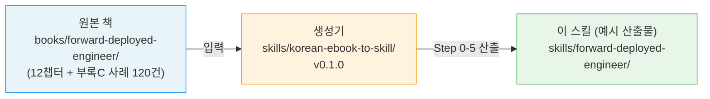

# 포워드 디플로이드 엔지니어 — 참조형 쿼리 스킬

> 이 스킬은 [`korean-ebook-to-skill`](../korean-ebook-to-skill/) 변환기(v0.1.0)로 생성된 **예시 산출물**이다.
> 원본 책 [`books/forward-deployed-engineer/`](../../books/forward-deployed-engineer/)를 변환 파이프라인(Step 0-5)에 통과시켜, AI가 가치 있다고 판단한 통찰 31개를 5카테고리로 정리한 참조형 지식층.

## 생성 연계도



## 메타

| 항목 | 값 |
|---|---|
| 생성일 | 2026-08-12 |
| 생성기 | `korean-ebook-to-skill@0.1.0` |
| 핵심 챕터 범위 | ch1(FDE 정의) · ch2(올바른 문제 풀기) · ch8(완결 사례집) · 후기 (Phase A) |
| 통찰 수 | 31개 (엄선 — 원 51후보 중 저가치 20개 제거) |
| 카테고리 분포 | 방법(methodology) 14 · 원리(principle) 9 · 연구(research) 4 · 안티패턴 2 · 해법(solution) 2 |
| 부록C 회상율 | **18.3% (22/120)** — Phase A 핵심 범위. ch3-7 확장(Phase B) 시 상승 예정 |
| 게이트 | 사람 승인 (저자가 31개 통찰 감탄 기준으로 엄선) |

## 구조

```
skills/forward-deployed-engineer/
├── SKILL.md              # ← 쿼리 진입점. 5카테고리별 통찰 31개 + 근거
├── chapters/             # 챕터별 헤딩 트리 (ch01-08 + 부록A)
├── appendix-c-map.md     # 부록C 120건 사례 회상 coverage + 누락 목록
└── extraction-report.md  # 판단 루브릭 점수 + 승인 이력
```

## 쿼리 사용법

이 스킬은 **참조형**이다 — 능동 발동 않는다. FDE 주제 질문을 받으면 `SKILL.md`의 카테고리별 항목이 응답하되, 각 항목은 단정 대신 **3종 근거**를 단다:

1. `support_chain` — 원문 핵심 문장의 비-verbatim 요약
2. `source_refs` — 원본 책 절 위치 (`chNN§N.M` 형식)
3. `appendix_c_refs` — 부록C 검증 사례 (`N장-M` 형식)

예시 질문 → 응답 방식:
- "FDE가 뭔가요?" → ch01-6(소거법) · ch01-7(배포 역량) 항목 + 부록C 사례
- "기업 AI가 왜 자꾸 망하죠?" → ch01-1(95% 실패) · ch02-1(POC 연옥 5원인) + MIT 보고서 사례
- "고객 현장에서 첫 주에 뭘 합니까?" → ch02-9(그림자 작업법) · ch02-12(MVD 군규) · ch08-15(N사 동행작업법)
- "어떤 고객은 받지 말아야 하나요?" → ch02-8(고위험신호 3종) · ch02-6(거절=수익)

## 한계 (정직 범위)

- **참조형이지 발동형 아님** — 능동 트리거 없음. 쿼리에만 응답.
- **회상율은 프록시** — 의미론적 정답 증명 아님. 사람 게이트가 최종 판정.
- **Phase A 한정** — ch3(고객 따내기)~ch7(규모화 복제)는 Phase B(후속)에서 fold-in 예정. 현재 통찰은 ch1/2/8/후기 범위.

## 링크

- 원본 책: [`books/forward-deployed-engineer/`](../../books/forward-deployed-engineer/) (저자 판빙, 무료 공개)
- 생성기: [`skills/korean-ebook-to-skill/`](../korean-ebook-to-skill/) (변환 파이프라인 스펙)
- 변환 설계: [`docs/superpowers/specs/2026-08-10-korean-ebook-to-skill-design.md`](../../docs/superpowers/specs/2026-08-10-korean-ebook-to-skill-design.md)
