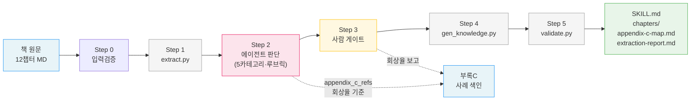

# korean-ebook-to-skill

## 정체성 (스펙 §3.1)

book-to-skill 베이스 + 한국어 챕터 + **AI 판단추출층**. 산출 = **참조형 쿼리 스킬 1개/책**. book-to-skill과의 차이 = AI가 가치내용을 미리 판단·추출하고 근거를 부록C·원문§로 연쇄한다는 점. 발동스킬이 아니므로 FDE 매체불일치(IDE vs 회의) 문제 소멸.

## 설치

```bash
bash scripts/install.sh   # → $CLAUDE_SKILLS_HOME/korean-ebook-to-skill (심볼릭링크)
```

## 테스트

```bash
cd skills/korean-ebook-to-skill && python3 -m pytest tests/ -v
```

## 예시 산출물

이 변환기의 첫 번째 전체 실행 결과 = **FDE(포워드 디플로이드 엔지니어)** 책에서 추출한 참조형 쿼리 스킬.

- 산출물: [`skills/forward-deployed-engineer/`](../forward-deployed-engineer/)
- 입력 책: [`books/forward-deployed-engineer/`](../../books/forward-deployed-engineer/) (12챕터 + 부록C 사례 120건)
- 실행: Phase A(ch1/2/8/후기) 우선 → 게이트 → Phase B(ch3-7) 확장 → 게이트 → 렌더 → 검증
- 결과: 75 후보 → 저자 엄선 55개 통찰(5카테고리) → SKILL.md 1개 + chapters/ + 회상 28.3%

## 파이프라인 연계도

책 1권이 Step 0-5를 거쳐 지식 스킬 1개로 변환되는 흐름. **Step 2(에이전트 판단)**만 비결정론, 나머지는 CLI 결정론. 부록C(INDEX)는 회상율 기준으로 작용.



- **Step 1·4·5** = 결정론 CLI (`extract.py` / `gen_knowledge.py` / `validate.py`)
- **Step 2** = 에이전트가 청크 순회하며 후보 식별·5카테고리 분류·루브릭 채점·근거 연쇄
- **Step 3** = 사람 게이트 (절대 자동화 금지). 후보집합 보고서 보고 승인·가감·거부
- **부록C** = INDEX 챕터에서 사례 추출 → 회상율(객관 품질 프록시) 산출
